# AAMP + Middleware — End-to-End Architecture & Workflows

## Table of Contents

- [1. System Overview](#1-system-overview)
- [2. Component Architecture](#2-component-architecture)
- [3. E2E Workflow: Live HLS Playback with DRM](#3-e2e-workflow-live-hls-playback-with-drm)
- [4. E2E Workflow: DASH VOD Playback](#4-e2e-workflow-dash-vod-playback)
- [5. E2E Workflow: Trick Play](#5-e2e-workflow-trick-play)
- [6. E2E Workflow: Time-Shift Buffer / DVR](#6-e2e-workflow-time-shift-buffer--dvr)
- [7. E2E Workflow: DRM License Acquisition](#7-e2e-workflow-drm-license-acquisition)
- [8. E2E Workflow: ABR Profile Switch](#8-e2e-workflow-abr-profile-switch)
- [9. E2E Workflow: Seek / Flush](#9-e2e-workflow-seek--flush)
- [10. GStreamer Pipeline Lifecycle via Middleware](#10-gstreamer-pipeline-lifecycle-via-middleware)
- [11. Threading Model](#11-threading-model)
- [12. Configuration Flow](#12-configuration-flow)
- [13. Error Recovery Workflows](#13-error-recovery-workflows)
- [14. Module Dependency Map](#14-module-dependency-map)
- [15. AAMP ↔ Middleware Interaction — Complete Interface Map (100% Verified)](#15-aamp-middleware-interaction---complete-interface-map-100-verified)
- [16. Middleware Internal Architecture (100% Verified)](#16-middleware-internal-architecture-100-verified)
- [17. Middleware Subsystem Architecture Diagrams](#17-middleware-subsystem-architecture-diagrams)

---

## 1. System Overview

```mermaid
graph TD
    subgraph ApplicationLayer ["Application Layer"]
        JSApp["JavaScript Application<br/>UVE API Consumer"]
        JSBindings["UVE JS Bindings<br/>jsbindings/jsmediaplayer.cpp<br/>WebKit InjectedBundle"]
    end

    subgraph AAMPCore ["AAMP Core - libaamp.so - C++17"]
        PlayerInstance["PlayerInstanceAAMP<br/>main_aamp.h<br/>Public API Class"]
        PrivAAMP["PrivateInstanceAAMP<br/>priv_aamp.h<br/>Core Orchestrator"]

        subgraph Collectors ["Protocol Collectors - StreamAbstractionAAMP.h"]
            HLS["StreamAbstractionAAMP_HLS<br/>fragmentcollector_hls.cpp"]
            MPD["StreamAbstractionAAMP_MPD<br/>fragmentcollector_mpd.cpp"]
            PROG["StreamAbstractionAAMP_PROGRESSIVE<br/>fragmentcollector_progressive.cpp"]
        end

        subgraph CoreServices ["Core Services"]
            EventMgr["AampEventManager<br/>AampEventManager.cpp"]
            Config["AampConfig<br/>AampConfig.cpp"]
            ABR["ABRManager<br/>abr/abr.cpp"]
            Profiler["AampProfiler<br/>AampProfiler.cpp"]
            Scheduler["AampScheduler<br/>AampScheduler.cpp"]
            CMCD["AampCMCDCollector<br/>AampCMCDCollector.cpp"]
            BufferCtrl["AampBufferControl<br/>AampBufferControl.cpp"]
        end

        subgraph DRMLayer ["DRM Layer"]
            DRMPreFetch["AampDRMLicPreFetcher<br/>AampDRMLicPreFetcher.cpp"]
            DRMInterface["DrmInterface<br/>drm/DrmInterface.cpp"]
        end

        subgraph TSBLayer ["TSB Layer"]
            TSBSessionMgr["AampTSBSessionManager<br/>AampTSBSessionManager.cpp"]
            TSBReader["AampTsbReader<br/>AampTsbReader.cpp"]
            TSBDataMgr["AampTsbDataManager<br/>AampTsbDataManager.cpp"]
        end

        subgraph Networking ["Networking"]
            CurlDown["AampCurlDownloader<br/>downloader/AampCurlDownloader.cpp"]
            CurlStore["AampCurlStore<br/>downloader/AampCurlStore.cpp"]
        end

        SinkMgr["AampStreamSinkManager<br/>AampStreamSinkManager.cpp"]
        GstPlayer["AAMPGstPlayer<br/>aampgstplayer.cpp"]
    end

    subgraph Middleware ["Middleware - middleware/"]
        IRDK["InterfacePlayerRDK<br/>InterfacePlayerRDK.cpp<br/>GStreamer Pipeline Control"]

        subgraph MWServices ["Middleware Services"]
            MWSched["PlayerScheduler<br/>PlayerScheduler.cpp"]
            MWGstUtils["GstUtils<br/>GstUtils.cpp"]
            MWSocUtils["SocUtils<br/>SocUtils.cpp"]
            MWHandlerCtrl["GstHandlerControl<br/>GstHandlerControl.h"]
        end

        subgraph MWVendor ["Vendor SoC - middleware/vendor/"]
            SocInterface["SocInterface<br/>Brcm/Realtek/MTK/Amlogic/Default"]
        end

        subgraph MWDRM ["DRM - middleware/drm/"]
            DrmSessionMgr["DrmSessionManager<br/>DrmSessionManager.cpp"]
            DrmSession["DrmSession<br/>DrmSession.cpp"]
            HlsOcdm["HlsOcdmBridge<br/>HlsOcdmBridge.cpp"]
            OCDM["opencdm/open_cdm.h<br/>OCDM Platform Interface"]
        end

        subgraph MWExternals ["Externals - middleware/externals/"]
            Thunder["PlayerThunderInterface<br/>PlayerThunderInterface.cpp"]
            RFC["RFCSettings<br/>PlayerRfc.cpp"]
        end
    end

    subgraph TSBLib ["TSB Library - tsb/"]
        TSBStore["TSB::Store<br/>tsb/api/TsbApi.h<br/>Filesystem Store"]
    end

    subgraph External ["External Services"]
        CDN["Content CDN<br/>HLS/DASH/MP4"]
        LicServer["License Servers<br/>PlayReady/Widevine"]
    end

    subgraph Platform ["Platform"]
        GStreamer["GStreamer 1.18+<br/>Pipeline"]
        HWDec["Hardware Decoders<br/>Video/Audio DSP"]
    end

    JSApp -->|"UVE JS API"| JSBindings
    JSBindings -->|"C++ bridge"| PlayerInstance
    PlayerInstance -->|"Tune/Play/Pause/Seek/Stop"| PrivAAMP
    PrivAAMP -->|"Protocol select"| Collectors
    PrivAAMP -->|"Events"| EventMgr
    PrivAAMP -->|"Config read"| Config
    PrivAAMP -->|"DRM prefetch"| DRMPreFetch
    PrivAAMP -->|"TSB operations"| TSBSessionMgr
    Collectors -->|"HTTP download"| CurlDown
    Collectors -->|"ABR decision"| ABR
    Collectors -->|"Fragment inject"| GstPlayer
    CurlDown -->|"HTTPS/HTTP"| CDN
    DRMPreFetch -->|"License acquire"| DRMInterface
    DRMInterface -->|"Session create"| DrmSessionMgr
    DrmSessionMgr -->|"OCDM calls"| OCDM
    DrmSessionMgr -->|"License HTTP"| LicServer
    TSBSessionMgr -->|"Store R/W"| TSBStore
    GstPlayer -->|"Pipeline control"| IRDK
    IRDK -->|"SoC abstraction"| SocInterface
    IRDK -->|"Async tasks"| MWSched
    IRDK -->|"Handler safety"| MWHandlerCtrl
    IRDK -->|"GStreamer API"| GStreamer
    GStreamer -->|"HW decode"| HWDec
    EventMgr -->|"JS callbacks"| JSBindings

    classDef app fill:#fff3e0,stroke:#ef6c00,stroke-width:2px
    classDef core fill:#e1f5fe,stroke:#0277bd,stroke-width:2px
    classDef mw fill:#fff2cc,stroke:#d6b656,stroke-width:2px
    classDef drm fill:#fce5cd,stroke:#e69138,stroke-width:2px
    classDef ext fill:#d9ead3,stroke:#6aa84f,stroke-width:2px
    classDef plat fill:#f3e5f5,stroke:#7b1fa2,stroke-width:2px

    class JSApp,JSBindings app
    class PlayerInstance,PrivAAMP,EventMgr,Config,ABR,Profiler,Scheduler,CMCD,BufferCtrl,SinkMgr,GstPlayer core
    class HLS,MPD,PROG core
    class CurlDown,CurlStore core
    class IRDK,MWSched,MWGstUtils,MWSocUtils,MWHandlerCtrl,SocInterface mw
    class DRMPreFetch,DRMInterface,DrmSessionMgr,DrmSession,HlsOcdm,OCDM drm
    class TSBSessionMgr,TSBReader,TSBDataMgr,TSBStore drm
    class Thunder,RFC mw
    class CDN,LicServer ext
    class GStreamer,HWDec plat
```

**Key Relationships (verified from source):**
- `PlayerInstanceAAMP` (main_aamp.h) owns `PrivateInstanceAAMP` via `shared_ptr`
- `PrivateInstanceAAMP` (priv_aamp.h) creates `StreamAbstractionAAMP` subclasses based on URL
- `AAMPGstPlayer` (aampgstplayer.h) wraps `InterfacePlayerRDK` (middleware)
- `InterfacePlayerRDK` manages the actual GStreamer pipeline via `GstPlayerPriv`
- `ABRManager` uses `BandwidthEstimatorBase` implementations (HarmonicEwma, RollingMedianOutlier)
- `AampTSBSessionManager` uses `TSB::Store` API for filesystem-based segment storage
- `DrmInterface` bridges AAMP core to middleware `DrmSessionManager`

---

## 2. Component Architecture

### AAMP Core Components (Verified File List)

| Component | File | Purpose |
|-----------|------|---------|
| Public API | `main_aamp.h` / `main_aamp.cpp` | `PlayerInstanceAAMP` - JS-facing API |
| Private Core | `priv_aamp.h` / `priv_aamp.cpp` | `PrivateInstanceAAMP` - orchestration |
| HLS Collector | `fragmentcollector_hls.h/.cpp` | M3U8 parsing, fragment download |
| DASH Collector | `fragmentcollector_mpd.h/.cpp` | MPD parsing, segment download |
| Progressive | `fragmentcollector_progressive.h/.cpp` | MP4 byte-range playback |
| GStreamer Player | `aampgstplayer.h/.cpp` | GStreamer abstraction layer |
| Stream Sink Mgr | `AampStreamSinkManager.h/.cpp` | Multi-pipeline management |
| Event Manager | `AampEventManager.h/.cpp` | Async/sync event dispatch |
| Config | `AampConfig.h/.cpp` | Layered configuration system |
| ABR | `abr/abr.h/.cpp` | Adaptive bitrate manager |
| Scheduler | `AampScheduler.h/.cpp` | Async task scheduling |
| Profiler | `AampProfiler.h/.cpp` | Tune time measurement |
| Buffer Control | `AampBufferControl.h/.cpp` | Time-based buffer management |
| CMCD | `AampCMCDCollector.h/.cpp` | Common Media Client Data |
| DRM Prefetcher | `AampDRMLicPreFetcher.h/.cpp` | Parallel license pre-acquisition |
| DRM Interface | `drm/DrmInterface.h/.cpp` | Bridge to middleware DRM |
| TSB Session | `AampTSBSessionManager.h/.cpp` | Time-shift buffer orchestration |
| TSB Reader | `AampTsbReader.h/.cpp` | Read from TSB store |
| TSB Data Mgr | `AampTsbDataManager.h/.cpp` | TSB segment metadata |
| Curl Downloader | `downloader/AampCurlDownloader.h/.cpp` | HTTP/HTTPS downloads |
| Curl Store | `downloader/AampCurlStore.h/.cpp` | Connection pooling |

### Middleware Components (Verified File List)

| Component | File | Purpose |
|-----------|------|---------|
| Player Interface | `InterfacePlayerRDK.h/.cpp` | GStreamer pipeline lifecycle |
| Player Priv | `InterfacePlayerPriv.h` | Private implementation data |
| Player Scheduler | `PlayerScheduler.h/.cpp` | Worker thread task queue |
| GstUtils | `GstUtils.h/.cpp` | Caps creation, buffer utilities |
| SocUtils | `SocUtils.h/.cpp` | SoC hardware abstraction queries |
| Handler Control | `GstHandlerControl.cpp/h` | RAII callback safety |
| Process Handler | `ProcessHandler.h/.cpp` | Process kill utilities |
| Player Metadata | `PlayerMetadata.hpp` | Player name tracking |
| MediaSample | `MediaSample.h` | Zero-copy media data transport |
| DRM Session Mgr | `drm/DrmSessionManager.h/.cpp` | OCDM session management |
| DRM Session | `drm/DrmSession.h/.cpp` | Individual DRM session |
| HLS OCDM Bridge | `drm/HlsOcdmBridge.h/.cpp` | HLS-specific DRM bridge |
| SoC Interface | `vendor/*/SocInterface*.cpp` | Platform-specific (Brcm/RTK/MTK/AML) |
| Thunder Interface | `externals/PlayerThunderInterface.cpp` | Thunder JSON-RPC communication |
| CC Manager | `closedcaptions/PlayerCCManager.cpp/h` | CC factory (Subtec/Rialto/Fake) |
| Subtec CC | `closedcaptions/subtec/PlayerSubtecCCManager.cpp/h` | Subtec inband CC path |
| Rialto CC | `closedcaptions/rialto/PlayerRialtoCCManager.cpp/h` | Rialto OOB CC path |
| Subtec | `subtec/subtecparser/` | Subtitle parsing |
| GStreamer Plugins | `gst-plugins/` | DRM decryptors, subtitle plugins |

---

## 3. E2E Workflow: Live HLS Playback with DRM

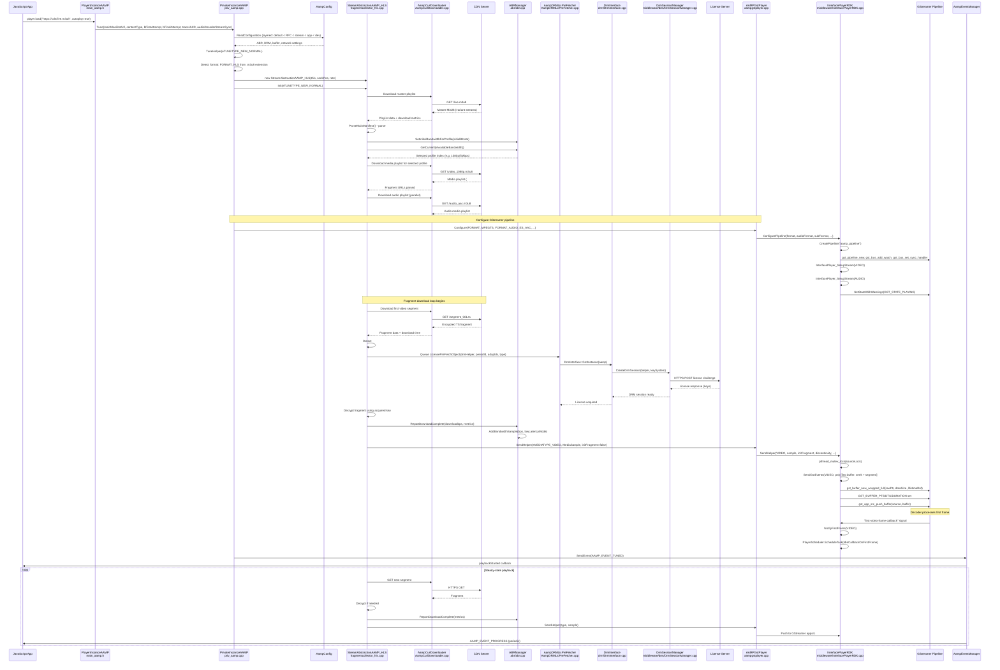
```mermaid
sequenceDiagram
    participant App as JavaScript App
    participant PI as PlayerInstanceAAMP<br/>main_aamp.h
    participant PA as PrivateInstanceAAMP<br/>priv_aamp.cpp
    participant Cfg as AampConfig
    participant HLS as StreamAbstractionAAMP_HLS<br/>fragmentcollector_hls.cpp
    participant Curl as AampCurlDownloader<br/>AampCurlDownloader.cpp
    participant CDN as CDN Server
    participant ABR as ABRManager<br/>abr/abr.cpp
    participant DRM as AampDRMLicPreFetcher<br/>AampDRMLicPreFetcher.cpp
    participant DI as DrmInterface<br/>drm/DrmInterface.cpp
    participant DSM as DrmSessionManager<br/>middleware/drm/DrmSessionManager.cpp
    participant LicSrv as License Server
    participant GST as AAMPGstPlayer<br/>aampgstplayer.cpp
    participant IRDK as InterfacePlayerRDK<br/>middleware/InterfacePlayerRDK.cpp
    participant Pipeline as GStreamer Pipeline
    participant Event as AampEventManager

    App->>PI: player.load("https://cdn/live.m3u8", autoplay=true)
    PI->>PA: Tune(mainManifestUrl, contentType, bFirstAttempt, bFinalAttempt, traceUUID, audioDecoderStreamSync)
    PA->>Cfg: ReadConfiguration (layered: default < RFC < stream < app < dev)
    Cfg-->>PA: ABR, DRM, buffer, network settings

    PA->>PA: TuneHelper(eTUNETYPE_NEW_NORMAL)
    PA->>PA: Detect format: FORMAT_HLS from .m3u8 extension
    PA->>HLS: new StreamAbstractionAAMP_HLS(this, seekPos, rate)
    PA->>HLS: Init(eTUNETYPE_NEW_NORMAL)

    HLS->>Curl: Download master playlist
    Curl->>CDN: GET /live.m3u8
    CDN-->>Curl: Master M3U8 (variant streams)
    Curl-->>HLS: Playlist data + download metrics

    HLS->>HLS: ParseMainManifest() - parse #EXT-X-STREAM-INF entries
    HLS->>ABR: SetInitialBandwidthForProfile(initialBitrate)
    HLS->>ABR: GetCurrentlyAvailableBandwidth()
    ABR-->>HLS: Selected profile index (e.g. 1080p/5Mbps)

    HLS->>Curl: Download media playlist for selected profile
    Curl->>CDN: GET /video_1080p.m3u8
    CDN-->>Curl: Media playlist (#EXTINF segments)
    Curl-->>HLS: Fragment URLs parsed

    HLS->>Curl: Download audio playlist (parallel)
    Curl->>CDN: GET /audio_aac.m3u8
    CDN-->>Curl: Audio media playlist

    Note over PA,GST: Configure GStreamer pipeline
    PA->>GST: Configure(FORMAT_MPEGTS, FORMAT_AUDIO_ES_AAC, ...)
    GST->>IRDK: ConfigurePipeline(format, audioFormat, subFormat, ...)
    IRDK->>IRDK: CreatePipeline("aamp_pipeline")
    IRDK->>Pipeline: gst_pipeline_new, gst_bus_add_watch, gst_bus_set_sync_handler
    IRDK->>IRDK: InterfacePlayer_SetupStream(VIDEO)
    IRDK->>IRDK: InterfacePlayer_SetupStream(AUDIO)
    IRDK->>Pipeline: SetStateWithWarnings(GST_STATE_PLAYING)

    Note over HLS,CDN: Fragment download loop begins
    HLS->>Curl: Download first video segment
    Curl->>CDN: GET /segment_001.ts
    CDN-->>Curl: Encrypted TS fragment
    Curl-->>HLS: Fragment data + download time

    HLS->>HLS: Detect #EXT-X-KEY (AES-128 or SAMPLE-AES)
    HLS->>DRM: Queue LicensePreFetchObject(drmHelper, periodId, adapIdx, type)
    DRM->>DI: DrmInterface::GetInstance(aamp)
    DI->>DSM: CreateDrmSession(helper, keySystem)
    DSM->>LicSrv: HTTPS POST license challenge
    LicSrv-->>DSM: License response (keys)
    DSM-->>DI: DRM session ready
    DI-->>DRM: License acquired

    HLS->>HLS: Decrypt fragment using acquired key
    HLS->>ABR: ReportDownloadComplete(downloadbps, metrics)
    ABR->>ABR: AddBandwidthSample(bps, lowLatencyMode)

    HLS->>GST: SendHelper(eMEDIATYPE_VIDEO, MediaSample, initFragment=false)
    GST->>IRDK: SendHelper(VIDEO, sample, initFragment, discontinuity, ...)
    IRDK->>IRDK: pthread_mutex_lock(sourceLock)
    IRDK->>IRDK: SendGstEvents(VIDEO, pts) [first buffer: seek + segment]
    IRDK->>Pipeline: gst_buffer_new_wrapped_full(rawPtr, dataSize, lifetimeRef)
    IRDK->>Pipeline: GST_BUFFER_PTS/DTS/DURATION set
    IRDK->>Pipeline: gst_app_src_push_buffer(source, buffer)

    Note over Pipeline: Decoder processes first frame
    Pipeline->>IRDK: "first-video-frame-callback" signal
    IRDK->>IRDK: NotifyFirstFrame(VIDEO)
    IRDK->>IRDK: PlayerScheduler.ScheduleTask(IdleCallbackOnFirstFrame)

    PA->>Event: SendEvent(AAMP_EVENT_TUNED)
    Event->>App: playbackStarted callback

    loop Steady-state playback
        HLS->>Curl: GET next segment
        Curl->>CDN: HTTPS GET
        CDN-->>Curl: Fragment
        HLS->>HLS: Decrypt if needed
        HLS->>ABR: ReportDownloadComplete(metrics)
        HLS->>GST: SendHelper(type, sample)
        GST->>IRDK: Push to GStreamer appsrc
        Event->>App: AAMP_EVENT_PROGRESS (periodic)
    end
```

---

## 4. E2E Workflow: DASH VOD Playback

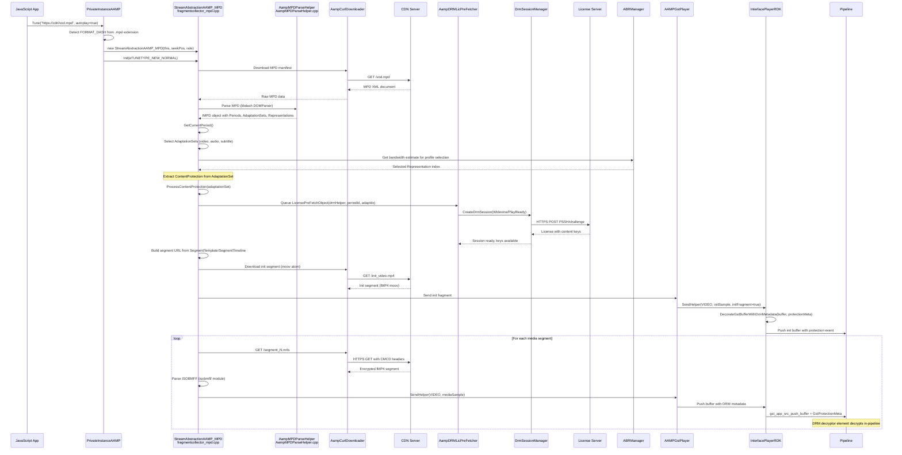
```mermaid
sequenceDiagram
    participant App as JavaScript App
    participant PA as PrivateInstanceAAMP
    participant MPD as StreamAbstractionAAMP_MPD<br/>fragmentcollector_mpd.cpp
    participant Parser as AampMPDParseHelper<br/>AampMPDParseHelper.cpp
    participant Curl as AampCurlDownloader
    participant CDN as CDN Server
    participant DRM as AampDRMLicPreFetcher
    participant DSM as DrmSessionManager
    participant LicSrv as License Server
    participant ABR as ABRManager
    participant GST as AAMPGstPlayer
    participant IRDK as InterfacePlayerRDK

    App->>PA: Tune("https://cdn/vod.mpd", autoplay=true)
    PA->>PA: Detect FORMAT_DASH from .mpd extension
    PA->>MPD: new StreamAbstractionAAMP_MPD(this, seekPos, rate)
    PA->>MPD: Init(eTUNETYPE_NEW_NORMAL)

    MPD->>Curl: Download MPD manifest
    Curl->>CDN: GET /vod.mpd
    CDN-->>Curl: MPD XML document
    Curl-->>MPD: Raw MPD data

    MPD->>Parser: Parse MPD (libdash DOMParser)
    Parser-->>MPD: IMPD object with Periods, AdaptationSets, Representations

    MPD->>MPD: GetCurrentPeriod()
    MPD->>MPD: Select AdaptationSets (video, audio, subtitle)
    MPD->>ABR: Get bandwidth estimate for profile selection
    ABR-->>MPD: Selected Representation index

    Note over MPD: Extract ContentProtection from AdaptationSet
    MPD->>MPD: ProcessContentProtection(adaptationSet)
    MPD->>DRM: Queue LicensePreFetchObject(drmHelper, periodId, adapIdx)
    DRM->>DSM: CreateDrmSession(Widevine/PlayReady)
    DSM->>LicSrv: HTTPS POST PSSH/challenge
    LicSrv-->>DSM: License with content keys
    DSM-->>DRM: Session ready, keys available

    MPD->>MPD: Build segment URL from SegmentTemplate/SegmentTimeline
    MPD->>Curl: Download init segment (moov atom)
    Curl->>CDN: GET /init_video.mp4
    CDN-->>Curl: Init segment (fMP4 moov)

    MPD->>GST: Send init fragment
    GST->>IRDK: SendHelper(VIDEO, initSample, initFragment=true)
    IRDK->>IRDK: DecorateGstBufferWithDrmMetadata(buffer, protectionMeta)
    IRDK->>Pipeline: Push init buffer with protection event

    loop For each media segment
        MPD->>Curl: GET /segment_N.m4s
        Curl->>CDN: HTTPS GET with CMCD headers
        CDN-->>Curl: Encrypted fMP4 segment
        MPD->>MPD: Parse ISOBMFF (isobmff/ module)
        MPD->>GST: SendHelper(VIDEO, mediaSample)
        GST->>IRDK: Push buffer with DRM metadata
        IRDK->>Pipeline: gst_app_src_push_buffer + GstProtectionMeta
        Note over Pipeline: DRM decryptor element decrypts in-pipeline
    end
```

---

## 5. E2E Workflow: Trick Play

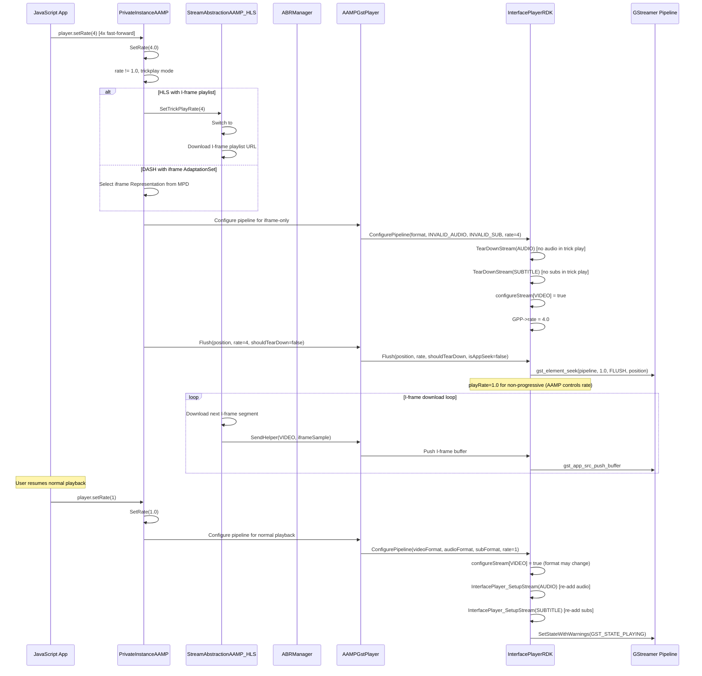
```mermaid
sequenceDiagram
    participant App as JavaScript App
    participant PA as PrivateInstanceAAMP
    participant HLS as StreamAbstractionAAMP_HLS
    participant ABR as ABRManager
    participant GST as AAMPGstPlayer
    participant IRDK as InterfacePlayerRDK
    participant Pipeline as GStreamer Pipeline

    App->>PA: player.setRate(4) [4x fast-forward]
    PA->>PA: SetRate(4.0)
    PA->>PA: rate != 1.0, trickplay mode

    alt HLS with I-frame playlist
        PA->>HLS: SetTrickPlayRate(4)
        HLS->>HLS: Switch to #EXT-X-I-FRAME-STREAM-INF playlist
        HLS->>HLS: Download I-frame playlist URL
    else DASH with iframe AdaptationSet
        PA->>PA: Select iframe Representation from MPD
    end

    PA->>GST: Configure pipeline for iframe-only
    GST->>IRDK: ConfigurePipeline(format, INVALID_AUDIO, INVALID_SUB, rate=4)
    IRDK->>IRDK: TearDownStream(AUDIO) [no audio in trick play]
    IRDK->>IRDK: TearDownStream(SUBTITLE) [no subs in trick play]
    IRDK->>IRDK: configureStream[VIDEO] = true
    IRDK->>IRDK: GPP->rate = 4.0

    PA->>GST: Flush(position, rate=4, shouldTearDown=false)
    GST->>IRDK: Flush(position, rate, shouldTearDown, isAppSeek=false)
    IRDK->>Pipeline: gst_element_seek(pipeline, 1.0, FLUSH, position)
    Note over IRDK: playRate=1.0 for non-progressive (AAMP controls rate)

    loop I-frame download loop
        HLS->>HLS: Download next I-frame segment
        HLS->>GST: SendHelper(VIDEO, iframeSample)
        GST->>IRDK: Push I-frame buffer
        IRDK->>Pipeline: gst_app_src_push_buffer
    end

    Note over App: User resumes normal playback
    App->>PA: player.setRate(1)
    PA->>PA: SetRate(1.0)
    PA->>GST: Configure pipeline for normal playback
    GST->>IRDK: ConfigurePipeline(videoFormat, audioFormat, subFormat, rate=1)
    IRDK->>IRDK: configureStream[VIDEO] = true (format may change)
    IRDK->>IRDK: InterfacePlayer_SetupStream(AUDIO) [re-add audio]
    IRDK->>IRDK: InterfacePlayer_SetupStream(SUBTITLE) [re-add subs]
    IRDK->>Pipeline: SetStateWithWarnings(GST_STATE_PLAYING)
```

---

## 6. E2E Workflow: Time-Shift Buffer / DVR

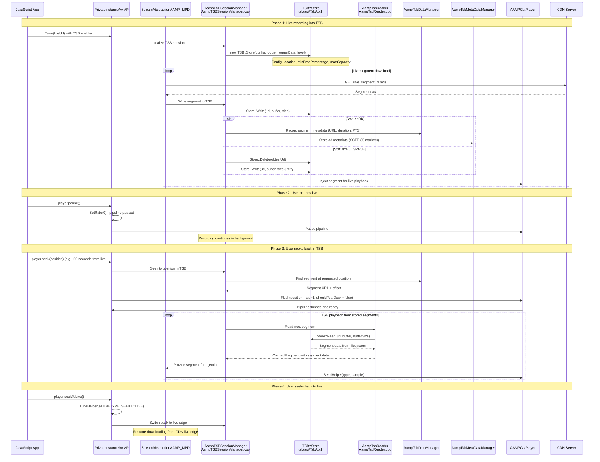
```mermaid
sequenceDiagram
    participant App as JavaScript App
    participant PA as PrivateInstanceAAMP
    participant Collector as StreamAbstractionAAMP_MPD
    participant TSBMgr as AampTSBSessionManager<br/>AampTSBSessionManager.cpp
    participant TSBStore as TSB::Store<br/>tsb/api/TsbApi.h
    participant TSBReader as AampTsbReader<br/>AampTsbReader.cpp
    participant TSBDataMgr as AampTsbDataManager
    participant MetaMgr as AampTsbMetaDataManager
    participant GST as AAMPGstPlayer
    participant CDN as CDN Server

    Note over App,CDN: Phase 1: Live recording into TSB
    App->>PA: Tune(liveUrl) with TSB enabled
    PA->>TSBMgr: Initialize TSB session
    TSBMgr->>TSBStore: new TSB::Store(config, logger, loggerData, level)
    Note over TSBStore: Config: location, minFreePercentage, maxCapacity

    loop Live segment download
        Collector->>CDN: GET /live_segment_N.m4s
        CDN-->>Collector: Segment data
        Collector->>TSBMgr: Write segment to TSB
        TSBMgr->>TSBStore: Store::Write(url, buffer, size)
        alt Status::OK
            TSBMgr->>TSBDataMgr: Record segment metadata (URL, duration, PTS)
            TSBMgr->>MetaMgr: Store ad metadata (SCTE-35 markers)
        else Status::NO_SPACE
            TSBMgr->>TSBStore: Store::Delete(oldestUrl)
            TSBMgr->>TSBStore: Store::Write(url, buffer, size) [retry]
        end
        Collector->>GST: Inject segment for live playback
    end

    Note over App,CDN: Phase 2: User pauses live
    App->>PA: player.pause()
    PA->>PA: SetRate(0) - pipeline paused
    PA->>GST: Pause pipeline
    Note over TSBMgr: Recording continues in background

    Note over App,CDN: Phase 3: User seeks back in TSB
    App->>PA: player.seek(position) [e.g. -60 seconds from live]
    PA->>TSBMgr: Seek to position in TSB
    TSBMgr->>TSBDataMgr: Find segment at requested position
    TSBDataMgr-->>TSBMgr: Segment URL + offset

    PA->>GST: Flush(position, rate=1, shouldTearDown=false)
    GST->>PA: Pipeline flushed and ready

    loop TSB playback from stored segments
        TSBMgr->>TSBReader: Read next segment
        TSBReader->>TSBStore: Store::Read(url, buffer, bufferSize)
        TSBStore-->>TSBReader: Segment data from filesystem
        TSBReader-->>TSBMgr: CachedFragment with segment data
        TSBMgr->>Collector: Provide segment for injection
        Collector->>GST: SendHelper(type, sample)
    end

    Note over App,CDN: Phase 4: User seeks back to live
    App->>PA: player.seekToLive()
    PA->>PA: TuneHelper(eTUNETYPE_SEEKTOLIVE)
    PA->>TSBMgr: Switch back to live edge
    Note over Collector: Resume downloading from CDN live edge
```

---

## 7. E2E Workflow: DRM License Acquisition

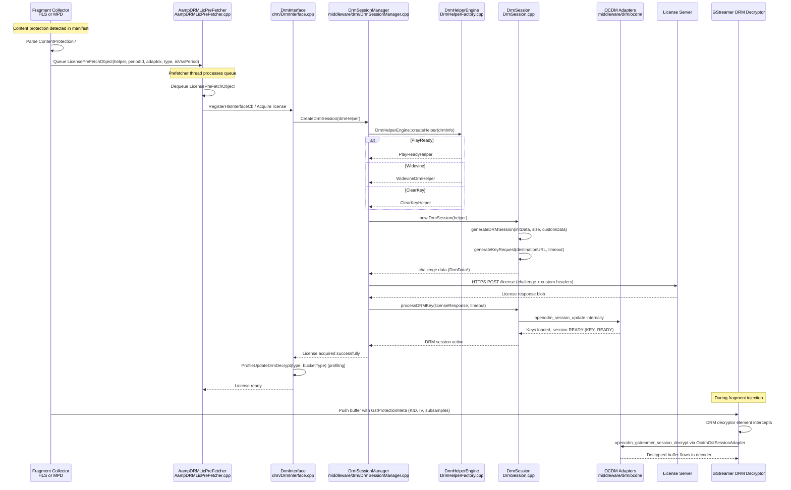
```mermaid
sequenceDiagram
    participant Collector as Fragment Collector<br/>HLS or MPD
    participant PreFetch as AampDRMLicPreFetcher<br/>AampDRMLicPreFetcher.cpp
    participant DI as DrmInterface<br/>drm/DrmInterface.cpp
    participant DSM as DrmSessionManager<br/>middleware/drm/DrmSessionManager.cpp
    participant Factory as DrmHelperEngine<br/>DrmHelperFactory.cpp
    participant Session as DrmSession<br/>DrmSession.cpp
    participant OCDM as OCDM Adapters<br/>middleware/drm/ocdm/
    participant LicSrv as License Server
    participant Pipeline as GStreamer DRM Decryptor

    Note over Collector: Content protection detected in manifest
    Collector->>Collector: Parse ContentProtection / #EXT-X-KEY
    Collector->>PreFetch: Queue LicensePreFetchObject(helper, periodId, adapIdx, type, isVssPeriod)

    Note over PreFetch: Prefetcher thread processes queue
    PreFetch->>PreFetch: Dequeue LicensePreFetchObject
    PreFetch->>DI: RegisterHlsInterfaceCb / Acquire license

    DI->>DSM: CreateDrmSession(drmHelper)
    DSM->>Factory: DrmHelperEngine::createHelper(drmInfo)
    alt PlayReady
        Factory-->>DSM: PlayReadyHelper
    else Widevine
        Factory-->>DSM: WidevineDrmHelper
    else ClearKey
        Factory-->>DSM: ClearKeyHelper
    end

    DSM->>Session: new DrmSession(helper)
    Session->>Session: generateDRMSession(initData, size, customData)
    Session->>Session: generateKeyRequest(destinationURL, timeout)
    Session-->>DSM: challenge data (DrmData*)

    DSM->>LicSrv: HTTPS POST /license (challenge + custom headers)
    LicSrv-->>DSM: License response blob

    DSM->>Session: processDRMKey(licenseResponse, timeout)
    Session->>OCDM: opencdm_session_update internally
    OCDM-->>Session: Keys loaded, session READY (KEY_READY)
    Session-->>DSM: DRM session active

    DSM-->>DI: License acquired successfully
    DI->>DI: ProfileUpdateDrmDecrypt(type, bucketType) [profiling]
    DI-->>PreFetch: License ready

    Note over Pipeline: During fragment injection
    Collector->>Pipeline: Push buffer with GstProtectionMeta (KID, IV, subsamples)
    Pipeline->>Pipeline: DRM decryptor element intercepts
    Pipeline->>OCDM: opencdm_gstreamer_session_decrypt via OcdmGstSessionAdapter
    OCDM-->>Pipeline: Decrypted buffer flows to decoder
```

---

## 8. E2E Workflow: ABR Profile Switch

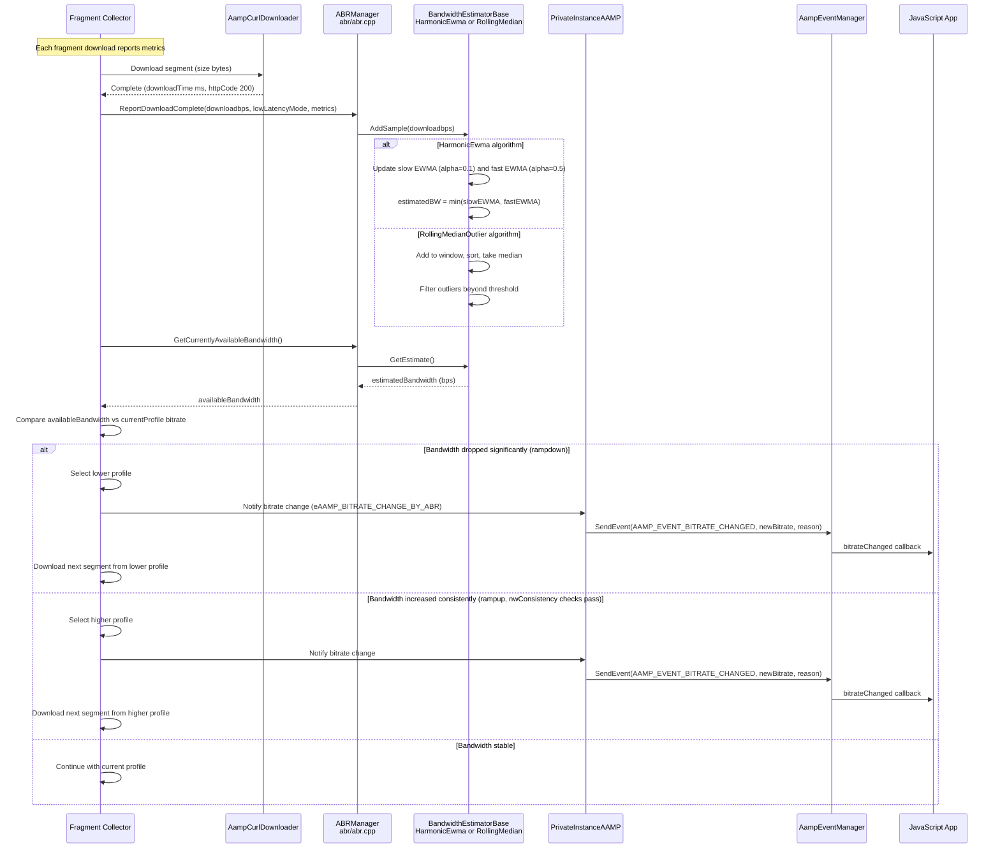
```mermaid
sequenceDiagram
    participant Collector as Fragment Collector
    participant Curl as AampCurlDownloader
    participant ABR as ABRManager<br/>abr/abr.cpp
    participant Estimator as BandwidthEstimatorBase<br/>HarmonicEwma or RollingMedian
    participant PA as PrivateInstanceAAMP
    participant Event as AampEventManager
    participant App as JavaScript App

    Note over Collector: Each fragment download reports metrics
    Collector->>Curl: Download segment (size bytes)
    Curl-->>Collector: Complete (downloadTime ms, httpCode 200)

    Collector->>ABR: ReportDownloadComplete(downloadbps, lowLatencyMode, metrics)
    ABR->>Estimator: AddSample(downloadbps)

    alt HarmonicEwma algorithm
        Estimator->>Estimator: Update slow EWMA (alpha=0.1) and fast EWMA (alpha=0.5)
        Estimator->>Estimator: estimatedBW = min(slowEWMA, fastEWMA)
    else RollingMedianOutlier algorithm
        Estimator->>Estimator: Add to window, sort, take median
        Estimator->>Estimator: Filter outliers beyond threshold
    end

    Collector->>ABR: GetCurrentlyAvailableBandwidth()
    ABR->>Estimator: GetEstimate()
    Estimator-->>ABR: estimatedBandwidth (bps)
    ABR-->>Collector: availableBandwidth

    Collector->>Collector: Compare availableBandwidth vs currentProfile bitrate

    alt Bandwidth dropped significantly (rampdown)
        Collector->>Collector: Select lower profile
        Collector->>PA: Notify bitrate change (eAAMP_BITRATE_CHANGE_BY_ABR)
        PA->>Event: SendEvent(AAMP_EVENT_BITRATE_CHANGED, newBitrate, reason)
        Event->>App: bitrateChanged callback
        Collector->>Collector: Download next segment from lower profile
    else Bandwidth increased consistently (rampup, nwConsistency checks pass)
        Collector->>Collector: Select higher profile
        Collector->>PA: Notify bitrate change
        PA->>Event: SendEvent(AAMP_EVENT_BITRATE_CHANGED, newBitrate, reason)
        Event->>App: bitrateChanged callback
        Collector->>Collector: Download next segment from higher profile
    else Bandwidth stable
        Collector->>Collector: Continue with current profile
    end
```

---

## 9. E2E Workflow: Seek / Flush

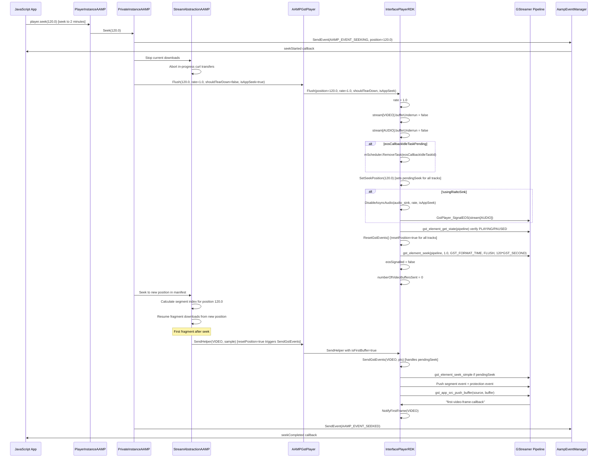
```mermaid
sequenceDiagram
    participant App as JavaScript App
    participant PI as PlayerInstanceAAMP
    participant PA as PrivateInstanceAAMP
    participant Collector as StreamAbstractionAAMP
    participant GST as AAMPGstPlayer
    participant IRDK as InterfacePlayerRDK
    participant Pipeline as GStreamer Pipeline
    participant Event as AampEventManager

    App->>PI: player.seek(120.0) [seek to 2 minutes]
    PI->>PA: Seek(120.0)
    PA->>Event: SendEvent(AAMP_EVENT_SEEKING, position=120.0)
    Event->>App: seekStarted callback

    PA->>Collector: Stop current downloads
    Collector->>Collector: Abort in-progress curl transfers

    PA->>GST: Flush(120.0, rate=1.0, shouldTearDown=false, isAppSeek=true)
    GST->>IRDK: Flush(position=120.0, rate=1.0, shouldTearDown, isAppSeek)

    IRDK->>IRDK: rate = 1.0
    IRDK->>IRDK: stream[VIDEO].bufferUnderrun = false
    IRDK->>IRDK: stream[AUDIO].bufferUnderrun = false

    alt eosCallbackIdleTaskPending
        IRDK->>IRDK: mScheduler.RemoveTask(eosCallbackIdleTaskId)
    end

    IRDK->>IRDK: SetSeekPosition(120.0) [sets pendingSeek for all tracks]

    alt !usingRialtoSink
        IRDK->>IRDK: DisableAsyncAudio(audio_sink, rate, isAppSeek)
        IRDK->>Pipeline: GstPlayer_SignalEOS(stream[AUDIO])
    end

    IRDK->>Pipeline: gst_element_get_state(pipeline) verify PLAYING/PAUSED
    IRDK->>IRDK: ResetGstEvents() [resetPosition=true for all tracks]
    IRDK->>Pipeline: gst_element_seek(pipeline, 1.0, GST_FORMAT_TIME, FLUSH, 120*GST_SECOND)

    IRDK->>IRDK: eosSignalled = false
    IRDK->>IRDK: numberOfVideoBuffersSent = 0

    PA->>Collector: Seek to new position in manifest
    Collector->>Collector: Calculate segment index for position 120.0
    Collector->>Collector: Resume fragment downloads from new position

    Note over Collector: First fragment after seek
    Collector->>GST: SendHelper(VIDEO, sample) [resetPosition=true triggers SendGstEvents]
    GST->>IRDK: SendHelper with isFirstBuffer=true
    IRDK->>IRDK: SendGstEvents(VIDEO, pts) [handles pendingSeek]
    IRDK->>Pipeline: gst_element_seek_simple if pendingSeek
    IRDK->>Pipeline: Push segment event + protection event
    IRDK->>Pipeline: gst_app_src_push_buffer(source, buffer)

    Pipeline->>IRDK: "first-video-frame-callback"
    IRDK->>IRDK: NotifyFirstFrame(VIDEO)
    PA->>Event: SendEvent(AAMP_EVENT_SEEKED)
    Event->>App: seekCompleted callback
```

---

## 10. GStreamer Pipeline Lifecycle via Middleware

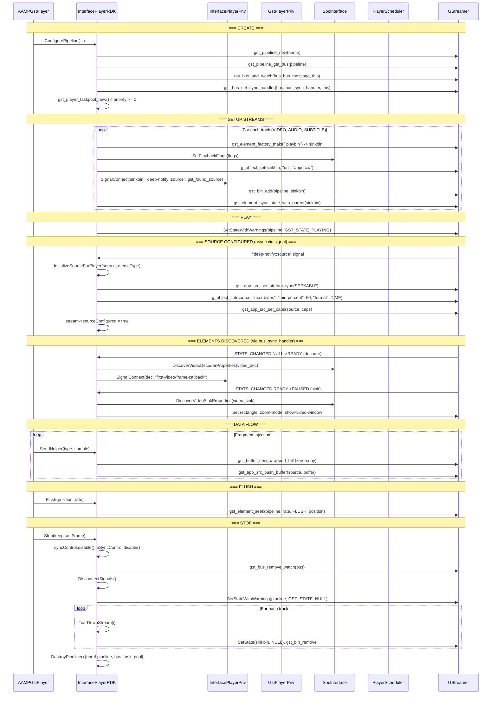
```mermaid
sequenceDiagram
    participant GST as AAMPGstPlayer
    participant IRDK as InterfacePlayerRDK
    participant Priv as InterfacePlayerPriv
    participant GPP as GstPlayerPriv
    participant SI as SocInterface
    participant Sched as PlayerScheduler
    participant Pipeline as GStreamer

    Note over GST,Pipeline: === CREATE ===
    GST->>IRDK: ConfigurePipeline(...)
    IRDK->>Pipeline: gst_pipeline_new(name)
    IRDK->>Pipeline: gst_pipeline_get_bus(pipeline)
    IRDK->>Pipeline: gst_bus_add_watch(bus, bus_message, this)
    IRDK->>Pipeline: gst_bus_set_sync_handler(bus, bus_sync_handler, this)
    IRDK->>IRDK: gst_player_taskpool_new() if priority >= 0

    Note over GST,Pipeline: === SETUP STREAMS ===
    loop For each track (VIDEO, AUDIO, SUBTITLE)
        IRDK->>Pipeline: gst_element_factory_make("playbin") -> sinkbin
        IRDK->>SI: SetPlaybackFlags(flags)
        IRDK->>Pipeline: g_object_set(sinkbin, "uri", "appsrc://")
        IRDK->>Priv: SignalConnect(sinkbin, "deep-notify::source", gst_found_source)
        IRDK->>Pipeline: gst_bin_add(pipeline, sinkbin)
        IRDK->>Pipeline: gst_element_sync_state_with_parent(sinkbin)
    end

    Note over GST,Pipeline: === PLAY ===
    IRDK->>Pipeline: SetStateWithWarnings(pipeline, GST_STATE_PLAYING)

    Note over GST,Pipeline: === SOURCE CONFIGURED (async via signal) ===
    Pipeline->>IRDK: "deep-notify::source" signal
    IRDK->>IRDK: InitializeSourceForPlayer(source, mediaType)
    IRDK->>Pipeline: gst_app_src_set_stream_type(SEEKABLE)
    IRDK->>Pipeline: g_object_set(source, "max-bytes", "min-percent"=50, "format"=TIME)
    IRDK->>Pipeline: gst_app_src_set_caps(source, caps)
    IRDK->>IRDK: stream->sourceConfigured = true

    Note over GST,Pipeline: === ELEMENTS DISCOVERED (via bus_sync_handler) ===
    Pipeline->>IRDK: STATE_CHANGED NULL->READY (decoder)
    IRDK->>SI: DiscoverVideoDecoderProperties(video_dec)
    IRDK->>Priv: SignalConnect(dec, "first-video-frame-callback")
    Pipeline->>IRDK: STATE_CHANGED READY->PAUSED (sink)
    IRDK->>SI: DiscoverVideoSinkProperties(video_sink)
    IRDK->>Pipeline: Set rectangle, zoom-mode, show-video-window

    Note over GST,Pipeline: === DATA FLOW ===
    loop Fragment injection
        GST->>IRDK: SendHelper(type, sample)
        IRDK->>Pipeline: gst_buffer_new_wrapped_full (zero-copy)
        IRDK->>Pipeline: gst_app_src_push_buffer(source, buffer)
    end

    Note over GST,Pipeline: === FLUSH ===
    GST->>IRDK: Flush(position, rate)
    IRDK->>Pipeline: gst_element_seek(pipeline, rate, FLUSH, position)

    Note over GST,Pipeline: === STOP ===
    GST->>IRDK: Stop(keepLastFrame)
    IRDK->>IRDK: syncControl.disable(), aSyncControl.disable()
    IRDK->>Pipeline: gst_bus_remove_watch(bus)
    IRDK->>IRDK: DisconnectSignals()
    IRDK->>Pipeline: SetStateWithWarnings(pipeline, GST_STATE_NULL)
    loop For each track
        IRDK->>IRDK: TearDownStream(i)
        IRDK->>Pipeline: SetState(sinkbin, NULL), gst_bin_remove
    end
    IRDK->>IRDK: DestroyPipeline() [unref pipeline, bus, task_pool]
```

---

## 11. Threading Model

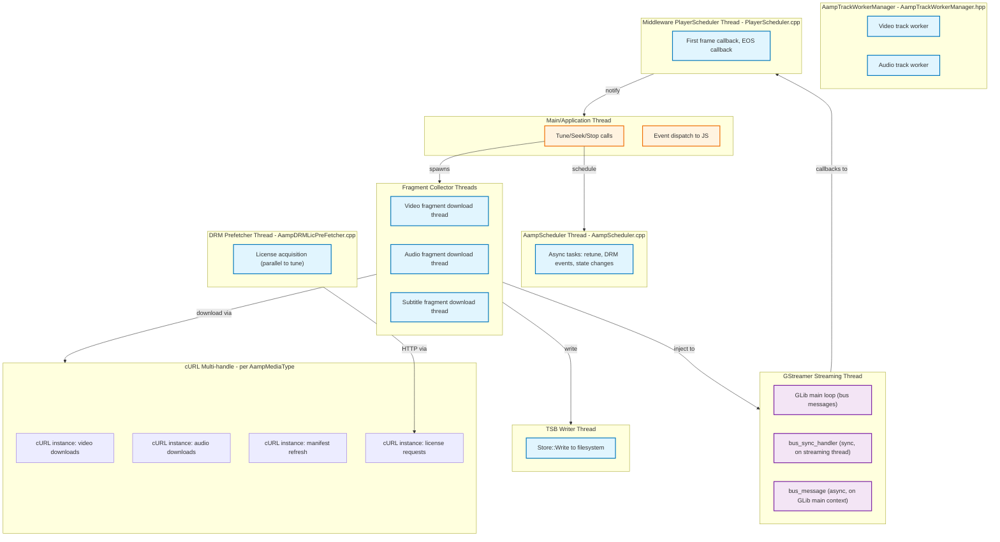
```mermaid
graph TD
    subgraph MainThread ["Main/Application Thread"]
        Tune["Tune/Seek/Stop calls"]
        EventDispatch["Event dispatch to JS"]
    end

    subgraph SchedulerThread ["AampScheduler Thread - AampScheduler.cpp"]
        AsyncTasks["Async tasks: retune, DRM events, state changes"]
    end

    subgraph CollectorThreads ["Fragment Collector Threads"]
        VideoThread["Video fragment download thread"]
        AudioThread["Audio fragment download thread"]
        SubThread["Subtitle fragment download thread"]
    end

    subgraph TrackWorkers ["AampTrackWorkerManager - AampTrackWorkerManager.hpp"]
        VWorker["Video track worker"]
        AWorker["Audio track worker"]
    end

    subgraph DRMThread ["DRM Prefetcher Thread - AampDRMLicPreFetcher.cpp"]
        LicFetch["License acquisition (parallel to tune)"]
    end

    subgraph GstThread ["GStreamer Streaming Thread"]
        GstLoop["GLib main loop (bus messages)"]
        BusSync["bus_sync_handler (sync, on streaming thread)"]
        BusAsync["bus_message (async, on GLib main context)"]
    end

    subgraph MWScheduler ["Middleware PlayerScheduler Thread - PlayerScheduler.cpp"]
        MWTasks["First frame callback, EOS callback"]
    end

    subgraph TSBThread ["TSB Writer Thread"]
        TSBWrite["Store::Write to filesystem"]
    end

    subgraph CurlThreads ["cURL Multi-handle - per AampMediaType"]
        CurlVideo["cURL instance: video downloads"]
        CurlAudio["cURL instance: audio downloads"]
        CurlManifest["cURL instance: manifest refresh"]
        CurlLicense["cURL instance: license requests"]
    end

    Tune -->|"spawns"| CollectorThreads
    Tune -->|"schedule"| SchedulerThread
    CollectorThreads -->|"download via"| CurlThreads
    CollectorThreads -->|"inject to"| GstThread
    DRMThread -->|"HTTP via"| CurlLicense
    GstThread -->|"callbacks to"| MWScheduler
    MWScheduler -->|"notify"| MainThread
    CollectorThreads -->|"write"| TSBThread

    classDef main fill:#fff3e0,stroke:#ef6c00,stroke-width:2px
    classDef worker fill:#e1f5fe,stroke:#0277bd,stroke-width:2px
    classDef gst fill:#f3e5f5,stroke:#7b1fa2,stroke-width:2px

    class Tune,EventDispatch main
    class AsyncTasks,VideoThread,AudioThread,SubThread,VWorker,AWorker,LicFetch,MWTasks,TSBWrite worker
    class GstLoop,BusSync,BusAsync gst
```

**Synchronization Primitives (verified from headers):**

| Primitive | Location | Purpose |
|-----------|----------|---------|
| `std::mutex mMutex` | InterfacePlayerRDK | Protects Stop/Configure concurrency |
| `pthread_mutex_t sourceLock[GST_TRACK_COUNT]` | GstPlayerPriv | Per-track appsrc injection lock |
| `pthread_mutex_t mProtectionLock` | InterfacePlayerRDK | DRM protection event mutex |
| `std::mutex mQMutex` | PlayerScheduler | Task queue access |
| `std::condition_variable mQCond` | PlayerScheduler | Wake worker thread |
| `std::mutex mExMutex` | PlayerScheduler | Execution lock (suspend/resume) |
| `GstHandlerControl` | InterfacePlayerRDK | RAII pattern: enable/disable/waitForDone |
| `std::condition_variable mSourceSetupCV` | InterfacePlayerRDK | Wait for appsrc configuration |
| `std::mutex mSignalVectorAccessMutex` | InterfacePlayerPriv | Signal registration safety |

---

## 12. Configuration Flow

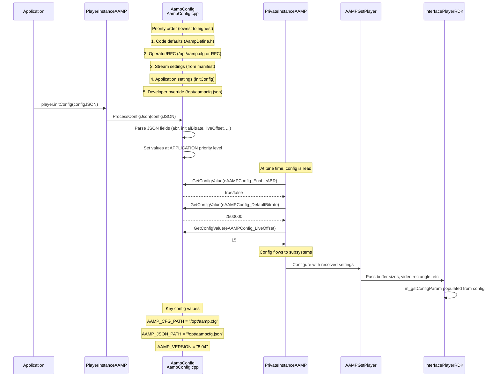
```mermaid
sequenceDiagram
    participant App as Application
    participant PI as PlayerInstanceAAMP
    participant Cfg as AampConfig<br/>AampConfig.cpp
    participant PA as PrivateInstanceAAMP
    participant GST as AAMPGstPlayer
    participant IRDK as InterfacePlayerRDK

    Note over Cfg: Priority order (lowest to highest)
    Note over Cfg: 1. Code defaults (AampDefine.h)
    Note over Cfg: 2. Operator/RFC (/opt/aamp.cfg or RFC)
    Note over Cfg: 3. Stream settings (from manifest)
    Note over Cfg: 4. Application settings (initConfig)
    Note over Cfg: 5. Developer override (/opt/aampcfg.json)

    App->>PI: player.initConfig(configJSON)
    PI->>Cfg: ProcessConfigJson(configJSON)
    Cfg->>Cfg: Parse JSON fields (abr, initialBitrate, liveOffset, ...)
    Cfg->>Cfg: Set values at APPLICATION priority level

    Note over PA: At tune time, config is read
    PA->>Cfg: GetConfigValue(eAAMPConfig_EnableABR)
    Cfg-->>PA: true/false
    PA->>Cfg: GetConfigValue(eAAMPConfig_DefaultBitrate)
    Cfg-->>PA: 2500000
    PA->>Cfg: GetConfigValue(eAAMPConfig_LiveOffset)
    Cfg-->>PA: 15

    Note over PA: Config flows to subsystems
    PA->>GST: Configure with resolved settings
    GST->>IRDK: Pass buffer sizes, video rectangle, etc
    IRDK->>IRDK: m_gstConfigParam populated from config

    Note over Cfg: Key config values
    Note over Cfg: AAMP_CFG_PATH = "/opt/aamp.cfg"
    Note over Cfg: AAMP_JSON_PATH = "/opt/aampcfg.json"
    Note over Cfg: AAMP_VERSION = "8.04"
```

---

## 13. Error Recovery Workflows

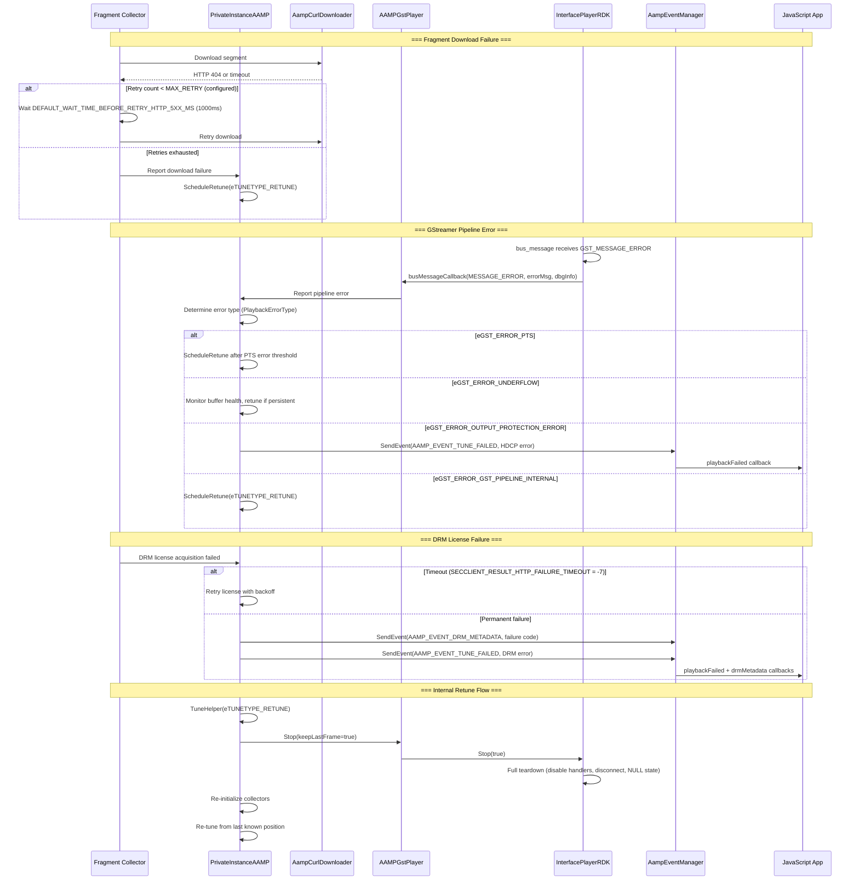
```mermaid
sequenceDiagram
    participant Collector as Fragment Collector
    participant PA as PrivateInstanceAAMP
    participant Curl as AampCurlDownloader
    participant GST as AAMPGstPlayer
    participant IRDK as InterfacePlayerRDK
    participant Event as AampEventManager
    participant App as JavaScript App

    Note over Collector,App: === Fragment Download Failure ===
    Collector->>Curl: Download segment
    Curl-->>Collector: HTTP 404 or timeout

    alt Retry count < MAX_RETRY (configured)
        Collector->>Collector: Wait DEFAULT_WAIT_TIME_BEFORE_RETRY_HTTP_5XX_MS (1000ms)
        Collector->>Curl: Retry download
    else Retries exhausted
        Collector->>PA: Report download failure
        PA->>PA: ScheduleRetune(eTUNETYPE_RETUNE)
    end

    Note over Collector,App: === GStreamer Pipeline Error ===
    IRDK->>IRDK: bus_message receives GST_MESSAGE_ERROR
    IRDK->>GST: busMessageCallback(MESSAGE_ERROR, errorMsg, dbgInfo)
    GST->>PA: Report pipeline error
    PA->>PA: Determine error type (PlaybackErrorType)

    alt eGST_ERROR_PTS
        PA->>PA: ScheduleRetune after PTS error threshold
    else eGST_ERROR_UNDERFLOW
        PA->>PA: Monitor buffer health, retune if persistent
    else eGST_ERROR_OUTPUT_PROTECTION_ERROR
        PA->>Event: SendEvent(AAMP_EVENT_TUNE_FAILED, HDCP error)
        Event->>App: playbackFailed callback
    else eGST_ERROR_GST_PIPELINE_INTERNAL
        PA->>PA: ScheduleRetune(eTUNETYPE_RETUNE)
    end

    Note over Collector,App: === DRM License Failure ===
    Collector->>PA: DRM license acquisition failed
    alt Timeout (SECCLIENT_RESULT_HTTP_FAILURE_TIMEOUT = -7)
        PA->>PA: Retry license with backoff
    else Permanent failure
        PA->>Event: SendEvent(AAMP_EVENT_DRM_METADATA, failure code)
        PA->>Event: SendEvent(AAMP_EVENT_TUNE_FAILED, DRM error)
        Event->>App: playbackFailed + drmMetadata callbacks
    end

    Note over Collector,App: === Internal Retune Flow ===
    PA->>PA: TuneHelper(eTUNETYPE_RETUNE)
    PA->>GST: Stop(keepLastFrame=true)
    GST->>IRDK: Stop(true)
    IRDK->>IRDK: Full teardown (disable handlers, disconnect, NULL state)
    PA->>PA: Re-initialize collectors
    PA->>PA: Re-tune from last known position
```

---

## 14. Module Dependency Map

```mermaid
graph TD
    subgraph PublicAPI ["Public API Layer"]
        PI["PlayerInstanceAAMP<br/>main_aamp.h"]
    end

    subgraph Core ["AAMP Core Layer"]
        PA["PrivateInstanceAAMP<br/>priv_aamp.h"]
        HLS["fragmentcollector_hls"]
        MPD["fragmentcollector_mpd"]
        PROG["fragmentcollector_progressive"]
        SA["StreamAbstractionAAMP<br/>base class"]
    end

    subgraph Media ["Media Pipeline Layer"]
        SinkMgr["AampStreamSinkManager"]
        GstPlayer["AAMPGstPlayer<br/>aampgstplayer.cpp"]
    end

    subgraph MWLayer ["Middleware Layer"]
        IRDK["InterfacePlayerRDK"]
        MWSched["PlayerScheduler"]
        SocIf["SocInterface"]
        HandlerCtrl["GstHandlerControl"]
        GstUtilsMW["GstUtils"]
    end

    subgraph DRMLayer ["DRM Layer"]
        PreFetch["AampDRMLicPreFetcher"]
        DrmIF["DrmInterface"]
        DrmSessMgr["DrmSessionManager"]
        DrmSess["DrmSession"]
        OCDMBridge["HlsOcdmBridge"]
        OCDM["opencdm API"]
    end

    subgraph TSBLayer2 ["TSB Layer"]
        TSBSessMgr["AampTSBSessionManager"]
        TSBRead["AampTsbReader"]
        TSBData["AampTsbDataManager"]
        TSBMeta["AampTsbMetaDataManager"]
        TSBLib["TSB::Store"]
    end

    subgraph Services ["Services Layer"]
        ABRMgr["ABRManager"]
        EvtMgr["AampEventManager"]
        CfgMgr["AampConfig"]
        Prof["AampProfiler"]
        Sched["AampScheduler"]
        BufCtrl["AampBufferControl"]
        CMCDColl["AampCMCDCollector"]
    end

    subgraph NetLayer ["Network Layer"]
        CurlDL["AampCurlDownloader"]
        CurlSt["AampCurlStore"]
    end

    PI --> PA
    PA --> SA
    SA --> HLS
    SA --> MPD
    SA --> PROG
    PA --> SinkMgr
    SinkMgr --> GstPlayer
    GstPlayer --> IRDK
    IRDK --> MWSched
    IRDK --> SocIf
    IRDK --> HandlerCtrl
    IRDK --> GstUtilsMW
    PA --> PreFetch
    PreFetch --> DrmIF
    DrmIF --> DrmSessMgr
    DrmSessMgr --> DrmSess
    DrmSess --> OCDM
    DrmIF --> OCDMBridge
    OCDMBridge --> OCDM
    PA --> TSBSessMgr
    TSBSessMgr --> TSBRead
    TSBSessMgr --> TSBData
    TSBSessMgr --> TSBMeta
    TSBSessMgr --> TSBLib
    PA --> ABRMgr
    PA --> EvtMgr
    PA --> CfgMgr
    PA --> Prof
    PA --> Sched
    GstPlayer --> BufCtrl
    HLS --> CurlDL
    MPD --> CurlDL
    CurlDL --> CurlSt
    HLS --> CMCDColl
    MPD --> CMCDColl

    classDef api fill:#fff3e0,stroke:#ef6c00,stroke-width:2px
    classDef core fill:#e1f5fe,stroke:#0277bd,stroke-width:2px
    classDef media fill:#fff2cc,stroke:#d6b656,stroke-width:2px
    classDef mw fill:#d0e0e3,stroke:#45818e,stroke-width:2px
    classDef drm fill:#fce5cd,stroke:#e69138,stroke-width:2px
    classDef tsb fill:#d9ead3,stroke:#6aa84f,stroke-width:2px
    classDef svc fill:#f3e5f5,stroke:#7b1fa2,stroke-width:2px
    classDef net fill:#d9d2e9,stroke:#674ea7,stroke-width:2px

    class PI api
    class PA,HLS,MPD,PROG,SA core
    class SinkMgr,GstPlayer media
    class IRDK,MWSched,SocIf,HandlerCtrl,GstUtilsMW mw
    class PreFetch,DrmIF,DrmSessMgr,DrmSess,OCDMBridge,OCDM drm
    class TSBSessMgr,TSBRead,TSBData,TSBMeta,TSBLib tsb
    class ABRMgr,EvtMgr,CfgMgr,Prof,Sched,BufCtrl,CMCDColl svc
    class CurlDL,CurlSt net
```

---

## 15. AAMP ↔ Middleware Interaction — Complete Interface Map (100% Verified)

This section documents **every single interaction** between AAMP (`AAMPGstPlayer` in `aampgstplayer.cpp`) and Middleware (`InterfacePlayerRDK` in `middleware/InterfacePlayerRDK.cpp`), verified line-by-line from source.

### 15.1 Architectural Boundary

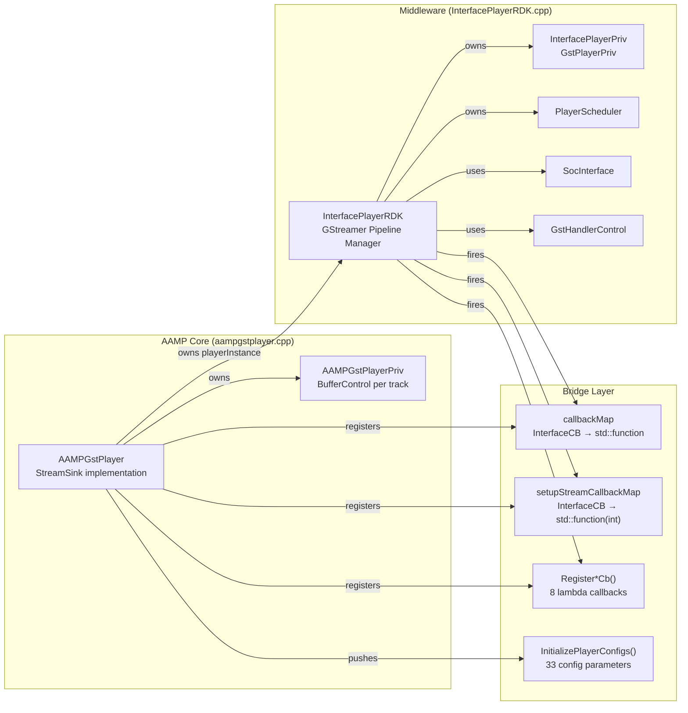
```mermaid
graph LR
    subgraph AAMP_Core ["AAMP Core (aampgstplayer.cpp)"]
        AAMPGstPlayer["AAMPGstPlayer<br/>StreamSink implementation"]
        AAMPGstPlayerPriv["AAMPGstPlayerPriv<br/>BufferControl per track"]
    end

    subgraph Bridge ["Bridge Layer"]
        CallbackMap["callbackMap<br/>InterfaceCB → std::function"]
        SetupStreamCBMap["setupStreamCallbackMap<br/>InterfaceCB → std::function(int)"]
        RegisterCBs["Register*Cb()<br/>8 lambda callbacks"]
        ConfigPush["InitializePlayerConfigs()<br/>33 config parameters"]
    end

    subgraph Middleware ["Middleware (InterfacePlayerRDK.cpp)"]
        IRDK["InterfacePlayerRDK<br/>GStreamer Pipeline Manager"]
        Priv["InterfacePlayerPriv<br/>GstPlayerPriv"]
        Sched["PlayerScheduler"]
        SocIf["SocInterface"]
        HC["GstHandlerControl"]
    end

    AAMPGstPlayer -->|"owns"| AAMPGstPlayerPriv
    AAMPGstPlayer -->|"owns playerInstance"| IRDK
    AAMPGstPlayer -->|"registers"| CallbackMap
    AAMPGstPlayer -->|"registers"| SetupStreamCBMap
    AAMPGstPlayer -->|"registers"| RegisterCBs
    AAMPGstPlayer -->|"pushes"| ConfigPush
    IRDK -->|"owns"| Priv
    IRDK -->|"owns"| Sched
    IRDK -->|"uses"| SocIf
    IRDK -->|"uses"| HC
    IRDK -->|"fires"| CallbackMap
    IRDK -->|"fires"| SetupStreamCBMap
    IRDK -->|"fires"| RegisterCBs
```

### 15.2 Construction & Callback Registration (Verified: aampgstplayer.cpp line 400-450)

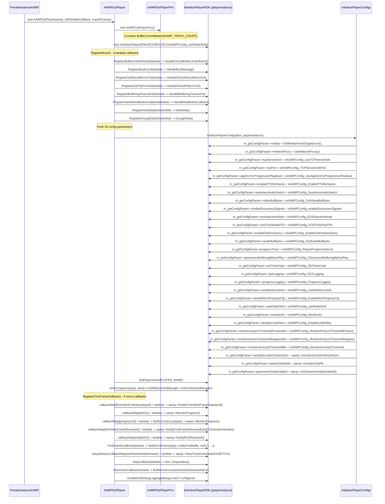
```mermaid
sequenceDiagram
    participant PA as PrivateInstanceAAMP
    participant GST as AAMPGstPlayer
    participant Priv as AAMPGstPlayerPriv
    participant IRDK as InterfacePlayerRDK (playerInstance)
    participant Cfg as InitializePlayerConfigs

    PA->>GST: new AAMPGstPlayer(aamp, id3HandlerCallback, exportFrames)
    GST->>Priv: new AAMPGstPlayerPriv()
    Note over Priv: Contains BufferControlMaster[AAMP_TRACK_COUNT]
    GST->>IRDK: new InterfacePlayerRDK(ISCONFIGSET(eAAMPConfig_useRialtoSink))

    Note over GST: RegisterBusCb - 8 lambda callbacks
    GST->>IRDK: RegisterBufferUnderflowCb(lambda -> HandleOnGstBufferUnderflowCb)
    GST->>IRDK: RegisterBusEvent(lambda -> HandleBusMessage)
    GST->>IRDK: RegisterGstDecodeErrorCb(lambda -> HandleOnGstDecodeErrorCb)
    GST->>IRDK: RegisterGstPtsErrorCb(lambda -> HandleOnGstPtsErrorCb)
    GST->>IRDK: RegisterBufferingTimeoutCb(lambda -> HandleBufferingTimeoutCb)
    GST->>IRDK: RegisterHandleRedButtonCallback(lambda -> HandleRedButtonCallback)
    GST->>IRDK: RegisterNeedDataCb(lambda -> NeedData)
    GST->>IRDK: RegisterEnoughDataCb(lambda -> EnoughData)

    Note over GST: Push 33 config parameters
    GST->>Cfg: InitializePlayerConfigs(this, playerInstance)
    Cfg->>IRDK: m_gstConfigParam->media = GetMediaFormatTypeEnum()
    Cfg->>IRDK: m_gstConfigParam->networkProxy = GetNetworkProxy()
    Cfg->>IRDK: m_gstConfigParam->tcpServerSink = eAAMPConfig_useTCPServerSink
    Cfg->>IRDK: m_gstConfigParam->tcpPort = eAAMPConfig_TCPServerSinkPort
    Cfg->>IRDK: m_gstConfigParam->appSrcForProgressivePlayback = eAAMPConfig_UseAppSrcForProgressivePlayback
    Cfg->>IRDK: m_gstConfigParam->enablePTSReStamp = eAAMPConfig_EnablePTSReStamp
    Cfg->>IRDK: m_gstConfigParam->seamlessAudioSwitch = eAAMPConfig_SeamlessAudioSwitch
    Cfg->>IRDK: m_gstConfigParam->videoBufBytes = eAAMPConfig_GstVideoBufBytes
    Cfg->>IRDK: m_gstConfigParam->enableDisconnectSignals = eAAMPConfig_enableDisconnectSignals
    Cfg->>IRDK: m_gstConfigParam->eosInjectionMode = eAAMPConfig_EOSInjectionMode
    Cfg->>IRDK: m_gstConfigParam->vodTrickModeFPS = eAAMPConfig_VODTrickPlayFPS
    Cfg->>IRDK: m_gstConfigParam->enableGstPosQuery = eAAMPConfig_EnableGstPositionQuery
    Cfg->>IRDK: m_gstConfigParam->audioBufBytes = eAAMPConfig_GstAudioBufBytes
    Cfg->>IRDK: m_gstConfigParam->progressTimer = eAAMPConfig_ReportProgressInterval
    Cfg->>IRDK: m_gstConfigParam->gstreamerBufferingBeforePlay = eAAMPConfig_GStreamerBufferingBeforePlay
    Cfg->>IRDK: m_gstConfigParam->seiTimeCode = eAAMPConfig_SEITimeCode
    Cfg->>IRDK: m_gstConfigParam->gstLogging = eAAMPConfig_GSTLogging
    Cfg->>IRDK: m_gstConfigParam->progressLogging = eAAMPConfig_ProgressLogging
    Cfg->>IRDK: m_gstConfigParam->useWesterosSink = eAAMPConfig_UseWesterosSink
    Cfg->>IRDK: m_gstConfigParam->enableRectPropertyCfg = eAAMPConfig_EnableRectPropertyCfg
    Cfg->>IRDK: m_gstConfigParam->useRialtoSink = eAAMPConfig_useRialtoSink
    Cfg->>IRDK: m_gstConfigParam->monitorAV = eAAMPConfig_MonitorAV
    Cfg->>IRDK: m_gstConfigParam->disableUnderflow = eAAMPConfig_DisableUnderflow
    Cfg->>IRDK: m_gstConfigParam->monitorAvsyncThresholdPositiveMs = eAAMPConfig_MonitorAVSyncThresholdPositive
    Cfg->>IRDK: m_gstConfigParam->monitorAvsyncThresholdNegativeMs = eAAMPConfig_MonitorAVSyncThresholdNegative
    Cfg->>IRDK: m_gstConfigParam->monitorAvJumpThresholdMs = eAAMPConfig_MonitorAVJumpThreshold
    Cfg->>IRDK: m_gstConfigParam->audioDecoderStreamSync = aamp->mAudioDecoderStreamSync
    Cfg->>IRDK: m_gstConfigParam->audioOnlyMode = aamp->mAudioOnlyPb
    Cfg->>IRDK: m_gstConfigParam->gstreamerSubsEnabled = aamp->IsGstreamerSubsEnabled()

    GST->>IRDK: SetPlayerName(PLAYER_NAME)
    GST->>IRDK: setEncryption(aamp, aamp->mDRMLicenseManager->mDrmSessionManager)

    Note over GST: RegisterFirstFrameCallbacks - 9 event callbacks
    GST->>IRDK: callbackMap[firstVideoFrameDisplayed] = lambda -> aamp->NotifyFirstVideoFrameDisplayed()
    GST->>IRDK: callbackMap[idleCb] = lambda -> aamp->MonitorProgress()
    GST->>IRDK: callbackMap[progressCb] = lambda -> BufferControl.update() + aamp->MonitorProgress()
    GST->>IRDK: callbackMap[firstVideoFrameReceived] = lambda -> aamp->NotifyFirstFrameReceived(GetCCDecoderHandle())
    GST->>IRDK: callbackMap[notifyEOS] = lambda -> aamp->NotifyEOSReached()
    GST->>IRDK: FirstFrameCallback(lambda -> NotifyFirstFrame(type, notifyFirstBuffer, initCC, ...))
    GST->>IRDK: setupStreamCallbackMap[startNewSubtitleStream] = lambda -> aamp->StopTrackDownloads(SUBTITLE)
    GST->>IRDK: StopCallback(lambda -> this->Stop(status))
    GST->>IRDK: TearDownCallback(lambda -> BufferControl.teardownStart/teardownEnd)

    GST->>IRDK: EnableGstDebugLogging(debugLevel) if configured
```

### 15.3 AAMP → Middleware: Complete API Call Map (All 35 Methods)

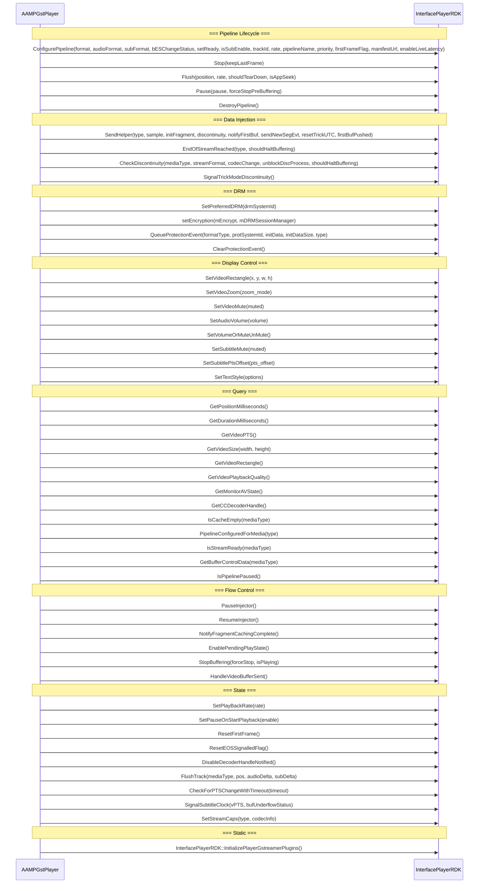
```mermaid
sequenceDiagram
    participant GST as AAMPGstPlayer
    participant IRDK as InterfacePlayerRDK

    Note over GST,IRDK: === Pipeline Lifecycle ===
    GST->>IRDK: ConfigurePipeline(format, audioFormat, subFormat, bESChangeStatus, setReady, isSubEnable, trackId, rate, pipelineName, priority, firstFrameFlag, manifestUrl, enableLiveLatency)
    GST->>IRDK: Stop(keepLastFrame)
    GST->>IRDK: Flush(position, rate, shouldTearDown, isAppSeek)
    GST->>IRDK: Pause(pause, forceStopPreBuffering)
    GST->>IRDK: DestroyPipeline()

    Note over GST,IRDK: === Data Injection ===
    GST->>IRDK: SendHelper(type, sample, initFragment, discontinuity, notifyFirstBuf, sendNewSegEvt, resetTrickUTC, firstBufPushed)
    GST->>IRDK: EndOfStreamReached(type, shouldHaltBuffering)
    GST->>IRDK: CheckDiscontinuity(mediaType, streamFormat, codecChange, unblockDiscProcess, shouldHaltBuffering)
    GST->>IRDK: SignalTrickModeDiscontinuity()

    Note over GST,IRDK: === DRM ===
    GST->>IRDK: SetPreferredDRM(drmSystemId)
    GST->>IRDK: setEncryption(mEncrypt, mDRMSessionManager)
    GST->>IRDK: QueueProtectionEvent(formatType, protSystemId, initData, initDataSize, type)
    GST->>IRDK: ClearProtectionEvent()

    Note over GST,IRDK: === Display Control ===
    GST->>IRDK: SetVideoRectangle(x, y, w, h)
    GST->>IRDK: SetVideoZoom(zoom_mode)
    GST->>IRDK: SetVideoMute(muted)
    GST->>IRDK: SetAudioVolume(volume)
    GST->>IRDK: SetVolumeOrMuteUnMute()
    GST->>IRDK: SetSubtitleMute(muted)
    GST->>IRDK: SetSubtitlePtsOffset(pts_offset)
    GST->>IRDK: SetTextStyle(options)

    Note over GST,IRDK: === Query ===
    GST->>IRDK: GetPositionMilliseconds()
    GST->>IRDK: GetDurationMilliseconds()
    GST->>IRDK: GetVideoPTS()
    GST->>IRDK: GetVideoSize(width, height)
    GST->>IRDK: GetVideoRectangle()
    GST->>IRDK: GetVideoPlaybackQuality()
    GST->>IRDK: GetMonitorAVState()
    GST->>IRDK: GetCCDecoderHandle()
    GST->>IRDK: IsCacheEmpty(mediaType)
    GST->>IRDK: PipelineConfiguredForMedia(type)
    GST->>IRDK: IsStreamReady(mediaType)
    GST->>IRDK: GetBufferControlData(mediaType)
    GST->>IRDK: IsPipelinePaused()

    Note over GST,IRDK: === Flow Control ===
    GST->>IRDK: PauseInjector()
    GST->>IRDK: ResumeInjector()
    GST->>IRDK: NotifyFragmentCachingComplete()
    GST->>IRDK: EnablePendingPlayState()
    GST->>IRDK: StopBuffering(forceStop, isPlaying)
    GST->>IRDK: HandleVideoBufferSent()

    Note over GST,IRDK: === State ===
    GST->>IRDK: SetPlayBackRate(rate)
    GST->>IRDK: SetPauseOnStartPlayback(enable)
    GST->>IRDK: ResetFirstFrame()
    GST->>IRDK: ResetEOSSignalledFlag()
    GST->>IRDK: DisableDecoderHandleNotified()
    GST->>IRDK: FlushTrack(mediaType, pos, audioDelta, subDelta)
    GST->>IRDK: CheckForPTSChangeWithTimeout(timeout)
    GST->>IRDK: SignalSubtitleClock(vPTS, bufUnderflowStatus)
    GST->>IRDK: SetStreamCaps(type, codecInfo)

    Note over GST,IRDK: === Static ===
    GST->>IRDK: InterfacePlayerRDK::InitializePlayerGstreamerPlugins()
```

### 15.4 Middleware → AAMP: Complete Callback Map (All 17 Callbacks)

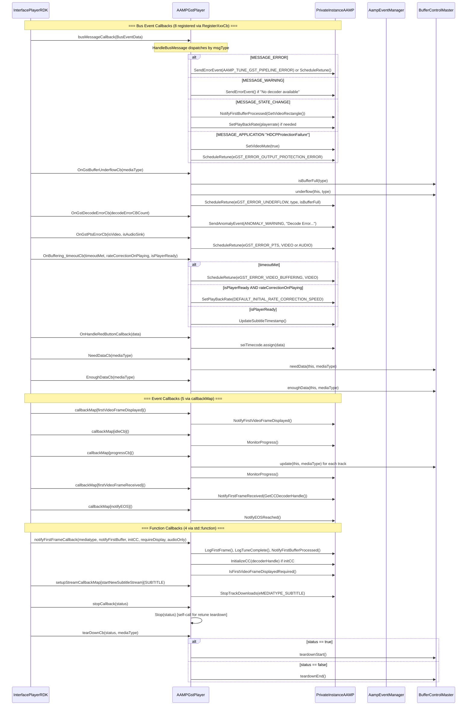
```mermaid
sequenceDiagram
    participant IRDK as InterfacePlayerRDK
    participant GST as AAMPGstPlayer
    participant PA as PrivateInstanceAAMP
    participant Evt as AampEventManager
    participant BC as BufferControlMaster

    Note over IRDK,PA: === Bus Event Callbacks (8 registered via RegisterXxxCb) ===

    IRDK->>GST: busMessageCallback(BusEventData)
    Note over GST: HandleBusMessage dispatches by msgType
    alt MESSAGE_ERROR
        GST->>PA: SendErrorEvent(AAMP_TUNE_GST_PIPELINE_ERROR) or ScheduleRetune()
    else MESSAGE_WARNING
        GST->>PA: SendErrorEvent() if "No decoder available"
    else MESSAGE_STATE_CHANGE
        GST->>PA: NotifyFirstBufferProcessed(GetVideoRectangle())
        GST->>PA: SetPlayBackRate(playerrate) if needed
    else MESSAGE_APPLICATION "HDCPProtectionFailure"
        GST->>PA: SetVideoMute(true)
        GST->>PA: ScheduleRetune(eGST_ERROR_OUTPUT_PROTECTION_ERROR)
    end

    IRDK->>GST: OnGstBufferUnderflowCb(mediaType)
    GST->>BC: isBufferFull(type)
    GST->>BC: underflow(this, type)
    GST->>PA: ScheduleRetune(eGST_ERROR_UNDERFLOW, type, isBufferFull)

    IRDK->>GST: OnGstDecodeErrorCb(decodeErrorCBCount)
    GST->>PA: SendAnomalyEvent(ANOMALY_WARNING, "Decode Error...")

    IRDK->>GST: OnGstPtsErrorCb(isVideo, isAudioSink)
    GST->>PA: ScheduleRetune(eGST_ERROR_PTS, VIDEO or AUDIO)

    IRDK->>GST: OnBuffering_timeoutCb(timeoutMet, rateCorrectionOnPlaying, isPlayerReady)
    alt timeoutMet
        GST->>PA: ScheduleRetune(eGST_ERROR_VIDEO_BUFFERING, VIDEO)
    else isPlayerReady AND rateCorrectionOnPlaying
        GST->>PA: SetPlayBackRate(DEFAULT_INITIAL_RATE_CORRECTION_SPEED)
    else isPlayerReady
        GST->>PA: UpdateSubtitleTimestamp()
    end

    IRDK->>GST: OnHandleRedButtonCallback(data)
    GST->>PA: seiTimecode.assign(data)

    IRDK->>GST: NeedDataCb(mediaType)
    GST->>BC: needData(this, mediaType)

    IRDK->>GST: EnoughDataCb(mediaType)
    GST->>BC: enoughData(this, mediaType)

    Note over IRDK,PA: === Event Callbacks (5 via callbackMap) ===

    IRDK->>GST: callbackMap[firstVideoFrameDisplayed]()
    GST->>PA: NotifyFirstVideoFrameDisplayed()

    IRDK->>GST: callbackMap[idleCb]()
    GST->>PA: MonitorProgress()

    IRDK->>GST: callbackMap[progressCb]()
    GST->>BC: update(this, mediaType) for each track
    GST->>PA: MonitorProgress()

    IRDK->>GST: callbackMap[firstVideoFrameReceived]()
    GST->>PA: NotifyFirstFrameReceived(GetCCDecoderHandle())

    IRDK->>GST: callbackMap[notifyEOS]()
    GST->>PA: NotifyEOSReached()

    Note over IRDK,PA: === Function Callbacks (4 via std::function) ===

    IRDK->>GST: notifyFirstFrameCallback(mediatype, notifyFirstBuffer, initCC, requireDisplay, audioOnly)
    GST->>PA: LogFirstFrame(), LogTuneComplete(), NotifyFirstBufferProcessed()
    GST->>PA: InitializeCC(decoderHandle) if initCC
    GST->>PA: IsFirstVideoFrameDisplayedRequired()

    IRDK->>GST: setupStreamCallbackMap[startNewSubtitleStream](SUBTITLE)
    GST->>PA: StopTrackDownloads(eMEDIATYPE_SUBTITLE)

    IRDK->>GST: stopCallback(status)
    GST->>GST: Stop(status) [self-call for retune teardown]

    IRDK->>GST: tearDownCb(status, mediaType)
    alt status == true
        GST->>BC: teardownStart()
    else status == false
        GST->>BC: teardownEnd()
    end
```

### 15.5 Data Flow: Fragment Injection Path (Verified from aampgstplayer.cpp line 830-920)

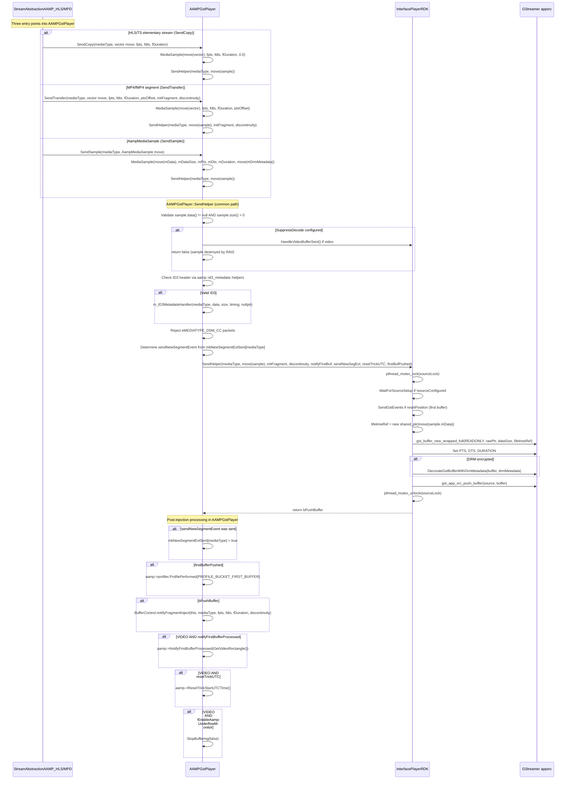
```mermaid
sequenceDiagram
    participant Collector as StreamAbstractionAAMP_HLS/MPD
    participant GST as AAMPGstPlayer
    participant IRDK as InterfacePlayerRDK
    participant Pipeline as GStreamer appsrc

    Note over Collector: Three entry points into AAMPGstPlayer
    alt HLS/TS elementary stream (SendCopy)
        Collector->>GST: SendCopy(mediaType, vector move, fpts, fdts, fDuration)
        GST->>GST: MediaSample(move(vector), fpts, fdts, fDuration, 0.0)
        GST->>GST: SendHelper(mediaType, move(sample))
    else MP4/fMP4 segment (SendTransfer)
        Collector->>GST: SendTransfer(mediaType, vector move, fpts, fdts, fDuration, ptsOffset, initFragment, discontinuity)
        GST->>GST: MediaSample(move(vector), fpts, fdts, fDuration, ptsOffset)
        GST->>GST: SendHelper(mediaType, move(sample), initFragment, discontinuity)
    else AampMediaSample (SendSample)
        Collector->>GST: SendSample(mediaType, AampMediaSample move)
        GST->>GST: MediaSample(move(mData), mDataSize, mPts, mDts, mDuration, move(mDrmMetadata))
        GST->>GST: SendHelper(mediaType, move(sample))
    end

    Note over GST: AAMPGstPlayer::SendHelper (common path)
    GST->>GST: Validate sample.data() != null AND sample.size() > 0
    alt SuppressDecode configured
        GST->>IRDK: HandleVideoBufferSent() if video
        GST->>GST: return false (sample destroyed by RAII)
    end
    GST->>GST: Check ID3 header via aamp::id3_metadata::helpers
    alt Valid ID3
        GST->>GST: m_ID3MetadataHandler(mediaType, data, size, timing, nullptr)
    end
    GST->>GST: Reject eMEDIATYPE_DSM_CC packets
    GST->>GST: Determine sendNewSegmentEvent from mbNewSegmentEvtSent[mediaType]

    GST->>IRDK: SendHelper(mediaType, move(sample), initFragment, discontinuity, notifyFirstBuf, sendNewSegEvt, resetTrickUTC, firstBufPushed)
    IRDK->>IRDK: pthread_mutex_lock(sourceLock)
    IRDK->>IRDK: WaitForSourceSetup if !sourceConfigured
    IRDK->>IRDK: SendGstEvents if resetPosition (first buffer)
    IRDK->>IRDK: lifetimeRef = new shared_ptr(move(sample.mData))
    IRDK->>Pipeline: gst_buffer_new_wrapped_full(READONLY, rawPtr, dataSize, lifetimeRef)
    IRDK->>Pipeline: Set PTS, DTS, DURATION
    alt DRM encrypted
        IRDK->>Pipeline: DecorateGstBufferWithDrmMetadata(buffer, drmMetadata)
    end
    IRDK->>Pipeline: gst_app_src_push_buffer(source, buffer)
    IRDK->>IRDK: pthread_mutex_unlock(sourceLock)
    IRDK-->>GST: return bPushBuffer

    Note over GST: Post-injection processing in AAMPGstPlayer
    alt sendNewSegmentEvent was sent
        GST->>GST: mbNewSegmentEvtSent[mediaType] = true
    end
    alt firstBufferPushed
        GST->>GST: aamp->profiler.ProfilePerformed(PROFILE_BUCKET_FIRST_BUFFER)
    end
    alt bPushBuffer
        GST->>GST: BufferControl.notifyFragmentInject(this, mediaType, fpts, fdts, fDuration, discontinuity)
    end
    alt VIDEO AND notifyFirstBufferProcessed
        GST->>GST: aamp->NotifyFirstBufferProcessed(GetVideoRectangle())
    end
    alt VIDEO AND resetTrickUTC
        GST->>GST: aamp->ResetTrickStartUTCTime()
    end
    alt VIDEO AND !EnableAampUnderflowMonitor
        GST->>GST: StopBuffering(false)
    end
```

---

## 16. Middleware Internal Architecture (100% Verified)

### 16.1 Middleware Module Dependency Graph

```mermaid
graph TD
    subgraph PublicInterface ["Public Interface"]
        IRDK["InterfacePlayerRDK<br/>InterfacePlayerRDK.h/.cpp<br/>211KB, ~5200 lines"]
    end

    subgraph PrivateImpl ["Private Implementation"]
        Priv["InterfacePlayerPriv<br/>InterfacePlayerPriv.h<br/>GstPlayerPriv struct"]
    end

    subgraph CoreUtils ["Core Utilities"]
        Sched["PlayerScheduler<br/>PlayerScheduler.h/.cpp<br/>Single worker thread"]
        GstU["GstUtils<br/>GstUtils.h/.cpp<br/>Caps, buffers, CLI init"]
        SocU["SocUtils<br/>SocUtils.h/.cpp<br/>Static SoC queries"]
        HC["GstHandlerControl<br/>GstHandlerControl.h<br/>RAII callback safety"]
        PU["PlayerUtils<br/>PlayerUtils.h/.cpp<br/>Base64, URL resolve, time"]
        PH["ProcessHandler<br/>ProcessHandler.h/.cpp<br/>Process kill via /proc"]
        PM["PlayerMetadata<br/>PlayerMetadata.h/.cpp<br/>Player name tracking"]
        MS["MediaSample<br/>MediaSample.h<br/>Zero-copy media transport"]
        PLM["PlayerLogManager<br/>playerLogManager/<br/>MW_LOG macros"]
        TP["gstplayertaskpool<br/>gstplayertaskpool.c<br/>Custom GStreamer thread pool"]
    end

    subgraph DRM_Module ["DRM Module (drm/)"]
        DSM["DrmSessionManager<br/>DrmSessionManager.cpp"]
        DS["DrmSession<br/>DrmSession.cpp"]
        DH["DrmHelper<br/>DrmHelper.cpp"]
        OCDM_IF["HlsOcdmBridge<br/>HlsOcdmBridge.cpp"]
        AES["AesDec<br/>AesDec.cpp"]
        OCDM_API["opencdm/<br/>open_cdm.h"]
    end

    subgraph Vendor_Module ["Vendor SoC (vendor/)"]
        SocIF["SocInterface<br/>Abstract base class"]
        Brcm["SocInterfaceBrcm<br/>vendor/brcm/"]
        RTK["SocInterfaceRealtek<br/>vendor/realtek/"]
        MTK["SocInterfaceMtk<br/>vendor/mtk/"]
        AML["SocInterfaceAmlogic<br/>vendor/amlogic/"]
        Def["SocInterfaceDefault<br/>vendor/default/"]
    end

    subgraph Externals_Module ["Externals (externals/)"]
        Thunder["ThunderAccessAAMP<br/>ThunderAccess.cpp"]
        RFC["DeviceSettings_RFC<br/>DeviceSettings.cpp"]
        FB["Firebolt<br/>Firebolt.cpp"]
        CSM["ContentSecurityManager - Base Class<br/>ContentSecurityManager.h"]
        SMT["SecManagerThunder - Subclass<br/>SecManagerThunder.h"]
        CPF["ContentProtectionFirebolt - Subclass<br/>IFirebolt/ContentProtectionFirebolt.h"]
        CSM --> SMT
        CSM --> CPF
    end

    subgraph GstPlugins ["GStreamer Plugins (gst-plugins/)"]
        PRDecrypt["PlayReadyDecryptor<br/>gst-plugins/drm/"]
        WVDecrypt["WidevineDecryptor<br/>gst-plugins/drm/"]
        CKDecrypt["ClearKeyDecryptor<br/>gst-plugins/drm/"]
        VMXDecrypt["VerimatrixDecryptor<br/>gst-plugins/drm/"]
        SubtecPlugin["SubtecPlugin<br/>gst-plugins/subtec/"]
    end

    subgraph Subtec_Module ["Subtitle (subtec/)"]
        SubParser["SubtitleParser<br/>subtec/subtecparser/"]
        LibSubtec["libsubtec<br/>subtec/libsubtec/"]
    end

    subgraph Util_Modules ["Utility Modules"]
        ISOBMFF["playerIsobmff<br/>playerisobmff/"]
        JsonObj["PlayerJsonObject<br/>playerJsonObject/"]
        BaseConv["BaseConversion<br/>baseConversion/"]
    end

    IRDK --> Priv
    IRDK --> Sched
    IRDK --> GstU
    IRDK --> SocU
    IRDK --> HC
    IRDK --> MS
    IRDK --> PLM
    IRDK --> TP

    SocU --> SocIF
    SocIF --> Brcm
    SocIF --> RTK
    SocIF --> MTK
    SocIF --> AML
    SocIF --> Def

    IRDK -.->|"sets properties on"| PRDecrypt
    IRDK -.->|"sets properties on"| WVDecrypt
    IRDK -.->|"sets properties on"| CKDecrypt
    IRDK -.->|"sets properties on"| VMXDecrypt

    DSM --> Thunder
    DSM --> RFC
    DSM --> CSM

    IRDK -.->|"creates"| SubtecPlugin

    PU --> BaseConv
    DSM --> JsonObj
```

### 16.2 Middleware Internal Data Flow

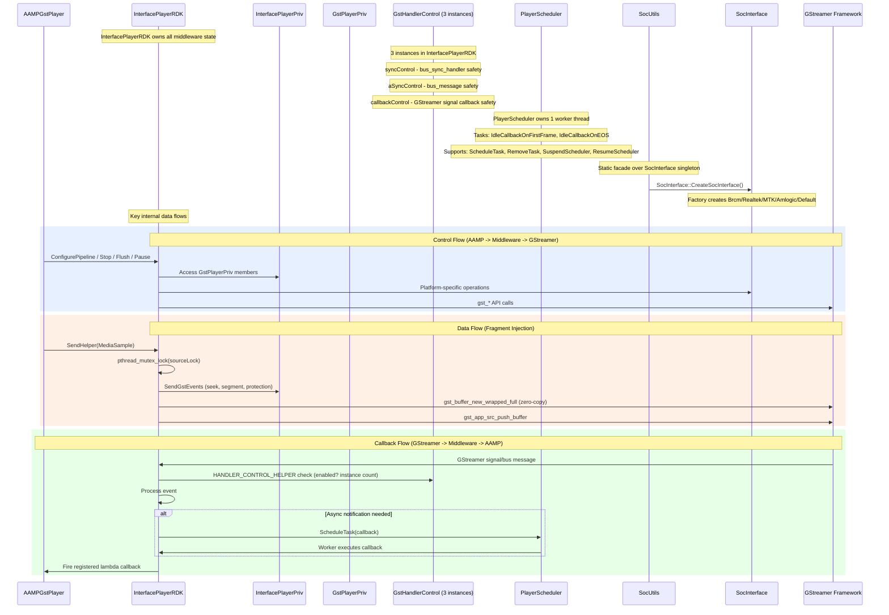
```mermaid
sequenceDiagram
    participant AAMP as AAMPGstPlayer
    participant IRDK as InterfacePlayerRDK
    participant Priv as InterfacePlayerPriv
    participant GPP as GstPlayerPriv
    participant HC as GstHandlerControl (3 instances)
    participant Sched as PlayerScheduler
    participant SocU as SocUtils
    participant SocIF as SocInterface
    participant GST as GStreamer Framework

    Note over IRDK: InterfacePlayerRDK owns all middleware state

    Note over HC: 3 instances in InterfacePlayerRDK
    Note over HC: syncControl - bus_sync_handler safety
    Note over HC: aSyncControl - bus_message safety
    Note over HC: callbackControl - GStreamer signal callback safety

    Note over Sched: PlayerScheduler owns 1 worker thread
    Note over Sched: Tasks: IdleCallbackOnFirstFrame, IdleCallbackOnEOS
    Note over Sched: Supports: ScheduleTask, RemoveTask, SuspendScheduler, ResumeScheduler

    Note over SocU: Static facade over SocInterface singleton
    SocU->>SocIF: SocInterface::CreateSocInterface()
    Note over SocIF: Factory creates Brcm/Realtek/MTK/Amlogic/Default

    Note over IRDK: Key internal data flows

    rect rgb(230, 240, 255)
        Note over IRDK,GST: Control Flow (AAMP -> Middleware -> GStreamer)
        AAMP->>IRDK: ConfigurePipeline / Stop / Flush / Pause
        IRDK->>Priv: Access GstPlayerPriv members
        IRDK->>SocIF: Platform-specific operations
        IRDK->>GST: gst_* API calls
    end

    rect rgb(255, 240, 230)
        Note over IRDK,GST: Data Flow (Fragment Injection)
        AAMP->>IRDK: SendHelper(MediaSample)
        IRDK->>IRDK: pthread_mutex_lock(sourceLock)
        IRDK->>Priv: SendGstEvents (seek, segment, protection)
        IRDK->>GST: gst_buffer_new_wrapped_full (zero-copy)
        IRDK->>GST: gst_app_src_push_buffer
    end

    rect rgb(230, 255, 230)
        Note over GST,AAMP: Callback Flow (GStreamer -> Middleware -> AAMP)
        GST->>IRDK: GStreamer signal/bus message
        IRDK->>HC: HANDLER_CONTROL_HELPER check (enabled? instance count)
        IRDK->>IRDK: Process event
        alt Async notification needed
            IRDK->>Sched: ScheduleTask(callback)
            Sched->>IRDK: Worker executes callback
        end
        IRDK->>AAMP: Fire registered lambda callback
    end
```

### 16.3 GstPlayerPriv — Complete State Structure (Verified from InterfacePlayerPriv.h)

```mermaid
classDiagram
    class GstPlayerPriv {
        +GstElement* pipeline
        +GstBus* bus
        +GstElement* video_dec
        +GstElement* audio_dec
        +GstElement* video_sink
        +GstElement* audio_sink
        +GstElement* subtitle_sink
        +GstObject* task_pool
        +GstQuery* positionQuery
        +gfloat rate
        +gboolean paused
        +gboolean pendingPlayState
        +gboolean eosSignalled
        +gboolean pauseOnStartPlayback
        +gboolean using_westerossink
        +gboolean usingRialtoSink
        +gboolean usingClosedCaptionsControl
        +gboolean firstFrameReceived
        +gboolean firstVideoFrameReceived
        +gboolean firstAudioFrameReceived
        +gboolean decoderHandleNotified
        +gboolean buffering_enabled
        +gboolean buffering_in_progress
        +GstState buffering_target_state
        +int buffering_timeout_cnt
        +GstState pipelineState
        +int NumberOfTracks
        +char videoRectangle[32]
        +int zoom
        +gboolean audioMuted
        +gboolean videoMuted
        +gboolean subtitleMuted
        +gdouble audioVolume
        +gboolean enableSEITimeCode
        +gboolean firstTuneWithWesterosSinkOff
        +long long lastKnownPTS
        +long long segmentStart
        +int numberOfVideoBuffersSent
        +int decodeErrorCBCount
        +long long decodeErrorMsgTimeMS
        +gboolean isMp4DemuxPlayback
        +GstEvent* protectionEvent[GST_TRACK_COUNT]
        +StreamInfo stream[GST_TRACK_COUNT]
        +guint periodicProgressCallbackIdleTaskId
        +guint bufferingTimeoutTimerId
        +guint ptsCheckForEosOnUnderflowIdleTaskId
    }

    class StreamInfo {
        +GstElement* sinkbin
        +GstAppSrc* source
        +GstStreamOutputFormat format
        +int32_t trackId
        +gboolean sourceConfigured
        +gboolean resetPosition
        +gboolean eosReached
        +gboolean bufferUnderrun
        +gboolean firstBufferProcessed
        +pthread_mutex_t sourceLock
    }

    class InterfacePlayerRDK {
        +Configs* m_gstConfigParam
        +char* mDrmSystem
        +void* mEncrypt
        +void* mDRMSessionManager
        +map callbackMap
        +map setupStreamCallbackMap
        +PlayerScheduler mScheduler
        +bool mPauseInjector
        +bool PipelineSetToReady
        +bool mFirstFrameRequired
        +mutex mMutex
        +mutex mSourceSetupMutex
        +condition_variable mSourceSetupCV
        +pthread_mutex_t mProtectionLock
        -InterfacePlayerPriv* interfacePlayerPriv
        -bool trickTeardown
    }

    GstPlayerPriv "1" --o "GST_TRACK_COUNT" StreamInfo : contains
    InterfacePlayerRDK "1" --> "1" InterfacePlayerPriv : owns
    InterfacePlayerPriv "1" --> "1" GstPlayerPriv : owns
```

### 16.4 Handler Control Safety Pattern (Verified from GstHandlerControl.h)

```mermaid
sequenceDiagram
    participant GST as GStreamer Thread
    participant Macro as HANDLER_CONTROL_HELPER Macro
    participant HC as GstHandlerControl
    participant SH as ScopeHelper (RAII)
    participant Stop as Stop Thread

    Note over HC: 3 instances in InterfacePlayerRDK
    Note over HC: syncControl (bus_sync_handler)
    Note over HC: aSyncControl (bus_message)
    Note over HC: callbackControl (signal callbacks)

    Note over GST: GStreamer callback fires
    GST->>Macro: HANDLER_CONTROL_HELPER(handlerControl, returnValue)
    Macro->>HC: getScopeHelper()
    HC->>HC: lock(mSync)
    HC->>HC: mInstanceCount++
    HC-->>SH: Create ScopeHelper(this)

    SH->>HC: isEnabled()
    HC-->>SH: return mEnabled

    alt Handler DISABLED (Stop in progress)
        SH-->>Macro: returnStraightAway() = true
        Note over SH: ~ScopeHelper() fires (RAII)
        SH->>HC: handlerEnd()
        HC->>HC: mInstanceCount--
        HC->>HC: mDoneCond.notify_one()
        Macro-->>GST: return returnValue immediately
    else Handler ENABLED (normal operation)
        SH-->>Macro: returnStraightAway() = false
        GST->>GST: Execute handler logic safely
        Note over SH: ~ScopeHelper() fires at scope exit
        SH->>HC: handlerEnd()
        HC->>HC: mInstanceCount--
        HC->>HC: mDoneCond.notify_one()
    end

    Note over Stop: During Stop()
    Stop->>HC: disable()
    HC->>HC: mEnabled = false
    Stop->>HC: waitForDone(timeoutMs, name)
    HC->>HC: lock(mSync)
    loop While mInstanceCount > 0 AND !timeout
        HC->>HC: mDoneCond.wait_until(deadline)
    end
    alt All handlers finished
        HC-->>Stop: return true
    else Timeout
        HC-->>Stop: return false (log warning)
    end
```

---

## 17. Middleware Subsystem Architecture Diagrams

### 17.1 DRM Subsystem (middleware/drm/)

```mermaid
graph TD
    subgraph DRM_Public ["DRM Public Interface"]
        IRDK_DRM["InterfacePlayerRDK<br/>setEncryption()<br/>SetPreferredDRM()<br/>QueueProtectionEvent()"]
    end

    subgraph DRM_Core ["DRM Core"]
        DSM["DrmSessionManager<br/>Session lifecycle"]
        DS["DrmSession<br/>Individual session"]
        DF["DrmSessionFactory<br/>Creates typed sessions"]
    end

    subgraph DRM_Helpers ["DRM Helpers"]
        DH["DrmHelper<br/>Key system detection"]
        PR_H["PlayReadyHelper"]
        WV_H["WidevineHelper"]
        CK_H["ClearKeyHelper"]
    end

    subgraph DRM_Bridge ["DRM Bridges"]
        OCDM_B["HlsOcdmBridge<br/>HLS SAMPLE-AES"]
        AES_D["AesDec<br/>AES-128 CBC"]
    end

    subgraph DRM_Platform ["Platform DRM"]
        OCDM["opencdm API<br/>open_cdm.h<br/>opencdm_session_construct<br/>opencdm_session_update<br/>opencdm_gstreamer_session_decrypt"]
    end

    subgraph GstPlugins_DRM ["GStreamer DRM Plugins"]
        PR_P["gstplayreadydecryptor"]
        WV_P["gstwidevinedecryptor"]
        CK_P["gstclearkeydecryptor"]
        VMX_P["gstverimatrixdecryptor"]
    end

    IRDK_DRM -->|"setEncryption()"| DSM
    IRDK_DRM -->|"SetPreferredDRM()"| DSM
    IRDK_DRM -->|"QueueProtectionEvent()"| DS
    IRDK_DRM -->|"g_object_set_property on sync handler"| PR_P
    IRDK_DRM -->|"g_object_set_property on sync handler"| WV_P
    DSM --> DF
    DF --> DS
    DSM --> DH
    DH --> PR_H
    DH --> WV_H
    DH --> CK_H
    DS --> OCDM
    OCDM_B --> OCDM
    PR_P --> OCDM
    WV_P --> OCDM
    CK_P --> OCDM
```

### 17.2 Vendor SoC Abstraction (middleware/vendor/)

```mermaid
graph TD
    subgraph Consumer ["Consumers"]
        IRDK_V["InterfacePlayerRDK"]
        SocU_V["SocUtils (static facade)"]
    end

    subgraph Factory ["Factory"]
        Create["SocInterface::CreateSocInterface(isRialto)<br/>Returns shared_ptr based on compile flags"]
    end

    subgraph Interface ["Abstract Interface"]
        SocIF_V["SocInterface<br/>(pure virtual methods)"]
    end

    subgraph Implementations ["Platform Implementations"]
        Brcm_V["SocInterfaceBrcm<br/>vendor/brcm/<br/>Broadcom STBs"]
        RTK_V["SocInterfaceRealtek<br/>vendor/realtek/<br/>Realtek SoCs"]
        MTK_V["SocInterfaceMtk<br/>vendor/mtk/<br/>MediaTek SoCs"]
        AML_V["SocInterfaceAmlogic<br/>vendor/amlogic/<br/>Amlogic SoCs"]
        Def_V["SocInterfaceDefault<br/>vendor/default/<br/>Simulator/generic"]
    end

    IRDK_V --> Create
    SocU_V --> Create
    Create --> SocIF_V
    SocIF_V --> Brcm_V
    SocIF_V --> RTK_V
    SocIF_V --> MTK_V
    SocIF_V --> AML_V
    SocIF_V --> Def_V

    SocIF_V -.->|"UseWesterosSink()"| IRDK_V
    SocIF_V -.->|"RequiredQueuedFrames()"| IRDK_V
    SocIF_V -.->|"EnablePTSRestamp()"| IRDK_V
    SocIF_V -.->|"SetPlaybackFlags()"| IRDK_V
    SocIF_V -.->|"GetVideoSink()"| IRDK_V
    SocIF_V -.->|"SetH264Caps() / SetHevcCaps()"| IRDK_V
    SocIF_V -.->|"DiscoverVideoDecoderProperties()"| IRDK_V
    SocIF_V -.->|"DiscoverVideoSinkProperties()"| IRDK_V
    SocIF_V -.->|"ConfigureAudioSink()"| IRDK_V
    SocIF_V -.->|"DisableAsyncAudio()"| IRDK_V
    SocIF_V -.->|"SetFreerunThreshold()"| IRDK_V
    SocIF_V -.->|"IsFirstTuneWithWesteros()"| IRDK_V
    SocIF_V -.->|"NotifyVideoFirstFrame()"| IRDK_V
    SocIF_V -.->|"IsSimulatorFirstFrame()"| IRDK_V
    SocIF_V -.->|"AudioOnlyMode()"| IRDK_V
    SocIF_V -.->|"ResetTrickUTC()"| IRDK_V
    SocIF_V -.->|"SetPlatformPlaybackRate()"| IRDK_V
```

### 17.3 Externals Subsystem (middleware/externals/)

```mermaid
graph TD
    subgraph Consumers_E ["Consumers"]
        DRM_E["DrmSessionManager"]
        Config_E["Device Configuration"]
    end

    subgraph Externals_E ["Externals"]
        Thunder_E["ThunderAccessAAMP<br/>ThunderAccess.cpp<br/>JSON-RPC over Thunder"]
        RFC_E["DeviceSettings_RFC<br/>DeviceSettings.cpp<br/>Runtime Feature Control"]
        FB_E["Firebolt<br/>Firebolt.cpp<br/>Firebolt API access"]
        CSM_E["ContentSecurityManager - Base<br/>ContentSecurityManager.h<br/>Extends PlayerScheduler"]
        SMT_E["SecManagerThunder<br/>SecManagerThunder.h<br/>Thunder org.rdk.SecManager.1"]
        CPF_E["ContentProtectionFirebolt<br/>IFirebolt/ContentProtectionFirebolt.h<br/>Firebolt Content Protection SDK"]
        CSM_E --> SMT_E
        CSM_E --> CPF_E
    end

    subgraph Platform_E ["Platform Services"]
        WPE["WPE Thunder Framework"]
        SecAPI["SecAPI / SecManager"]
    end

    DRM_E --> CSM_E
    DRM_E --> Thunder_E
    Config_E --> RFC_E
    Config_E --> FB_E
    Thunder_E --> WPE
    CSM_E --> SecAPI
```

---

## Verification Notes (Updated)

All information in sections 15-17 is verified from the actual source files:

| File | Path | Lines Read | Key Verification |
|------|------|-----------|------------------|
| `aampgstplayer.h` | `aamp/aampgstplayer.h` | 1-452 | Complete class definition, all public methods, `playerInstance` member |
| `aampgstplayer.cpp` | `aamp/aampgstplayer.cpp` | 1-1500 | All 35 API calls to IRDK, all 17 callbacks, constructor, destructor |
| `InterfacePlayerRDK.h` | `middleware/InterfacePlayerRDK.h` | 1-800 | Complete public API, all callback types, Configs struct, MonitorAVState |
| `InterfacePlayerRDK.cpp` | `middleware/InterfacePlayerRDK.cpp` | 1-5200 | Full implementation of all 18 phases |
| `InterfacePlayerPriv.h` | `middleware/InterfacePlayerPriv.h` | 1-16931 bytes | GstPlayerPriv struct, StreamInfo, all members |
| `GstHandlerControl.h` | `middleware/GstHandlerControl.h` | Full | ScopeHelper RAII pattern, enable/disable/waitForDone |
| `PlayerScheduler.h/.cpp` | `middleware/PlayerScheduler.h/.cpp` | Full | Worker thread, task queue, suspend/resume |

---

**Copyright 2026 RDK Management** - Licensed under Apache License 2.0.
