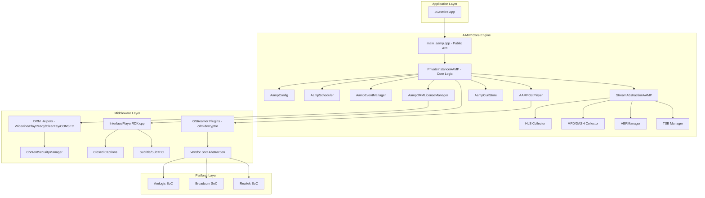
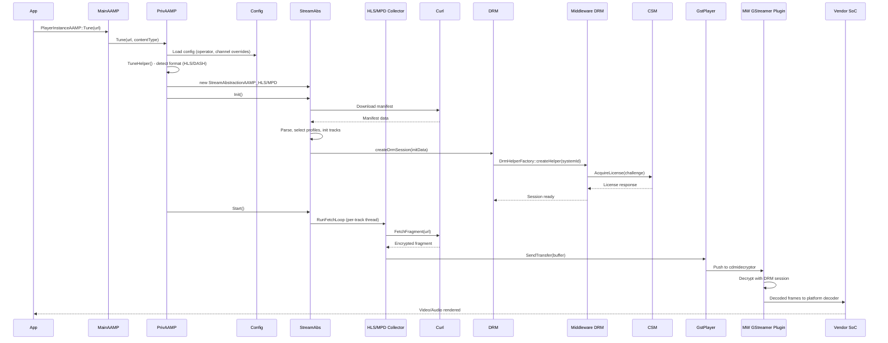

# AAMP + Middleware Combined End-to-End Architecture

## Overview

This document provides a unified view of the AAMP media player stack — from the core adaptive streaming engine through the middleware integration layer to platform-specific vendor implementations.

## System Architecture

## Layer Responsibilities

### AAMP Core (15 modules)
| Module | Diagram |
|--------|---------|
| Tune/Playback Lifecycle | [01-tune-playback-lifecycle.md](docs/aamp-core-sequence-diagrams/01-tune-playback-lifecycle.md) |
| GStreamer Pipeline | [02-gstreamer-pipeline.md](docs/aamp-core-sequence-diagrams/02-gstreamer-pipeline.md) |
| Stream Abstraction | [03-stream-abstraction.md](docs/aamp-core-sequence-diagrams/03-stream-abstraction.md) |
| HLS Fragment Collection | [04-fragment-collector-hls.md](docs/aamp-core-sequence-diagrams/04-fragment-collector-hls.md) |
| MPD/DASH Collection | [05-fragment-collector-mpd.md](docs/aamp-core-sequence-diagrams/05-fragment-collector-mpd.md) |
| DRM License Management | [06-drm-session-manager.md](docs/aamp-core-sequence-diagrams/06-drm-session-manager.md) |
| Event System | [07-event-manager.md](docs/aamp-core-sequence-diagrams/07-event-manager.md) |
| Config and Scheduler | [08-config-scheduler.md](docs/aamp-core-sequence-diagrams/08-config-scheduler.md) |
| Network/Curl | [09-curl-network.md](docs/aamp-core-sequence-diagrams/09-curl-network.md) |
| Time-Shift Buffer | [10-tsb-timeshift-buffer.md](docs/aamp-core-sequence-diagrams/10-tsb-timeshift-buffer.md) |
| ABR | [11-abr-adaptive-bitrate.md](docs/aamp-core-sequence-diagrams/11-abr-adaptive-bitrate.md) |
| MPD Utilities | [12-mpd-utils.md](docs/aamp-core-sequence-diagrams/12-mpd-utils.md) |
| Stream Sink Manager | [13-stream-sink-manager.md](docs/aamp-core-sequence-diagrams/13-stream-sink-manager.md) |
| Track Workers | [14-track-workers.md](docs/aamp-core-sequence-diagrams/14-track-workers.md) |
| Shims | [15-shims.md](docs/aamp-core-sequence-diagrams/15-shims.md) |

### Middleware (9 modules)
| Module | Diagram |
|--------|---------|
| Root-level (InterfacePlayerRDK) | [01-root-level-middleware.md](middleware/docs/sequence-diagrams/01-root-level-middleware.md) |
| Base Conversion | [02-baseConversion.md](middleware/docs/sequence-diagrams/02-baseConversion.md) |
| Closed Captions | [03-closedcaptions.md](middleware/docs/sequence-diagrams/03-closedcaptions.md) |
| DRM | [04-drm.md](middleware/docs/sequence-diagrams/04-drm.md) |
| Externals | [05-externals.md](middleware/docs/sequence-diagrams/05-externals.md) |
| GStreamer Plugins | [06-gst-plugins.md](middleware/docs/sequence-diagrams/06-gst-plugins.md) |
| PlayerISOBMFF/JSON/Log | [07-playerisobmff-json-log.md](middleware/docs/sequence-diagrams/07-playerisobmff-json-log.md) |
| Subtitle and SubTEC | [08-subtitle-subtec.md](middleware/docs/sequence-diagrams/08-subtitle-subtec.md) |
| Vendor/SoC | [09-vendor-soc.md](middleware/docs/sequence-diagrams/09-vendor-soc.md) |

## End-to-End Playback Flow

## Cross-Layer Integration Points

1. **AAMP Core <-> Middleware DRM**: AampDRMLicenseManager calls middleware DrmHelperFactory to instantiate platform-specific DRM helpers
2. **AAMP Core <-> Middleware GStreamer**: AAMPGstPlayer pipeline includes middleware cdmidecryptor element for content decryption
3. **AAMP Core <-> Middleware Subtitles**: Core triggers subtitle data delivery; middleware SubTEC renders on-screen
4. **Middleware <-> Vendor SoC**: GStreamer plugins delegate hardware decode to platform-specific vendor implementations
5. **Middleware <-> Externals**: ContentSecurityManager handles DRM license server communication and session persistence

## Source References

All content derived from verified source file reads across both AAMP core (141+ files) and middleware (9 subdirectory modules). See individual sequence diagram files for line-level references.
