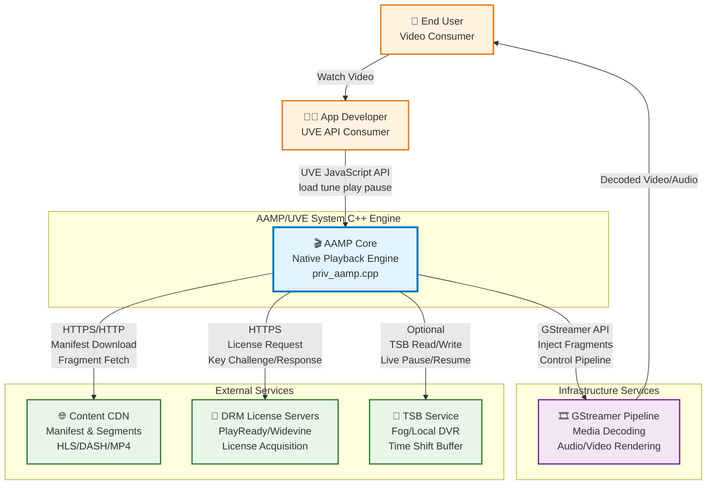
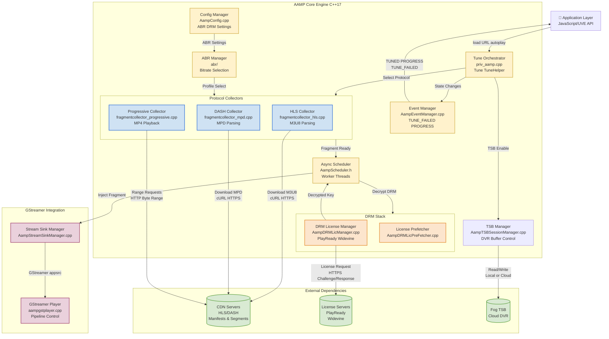
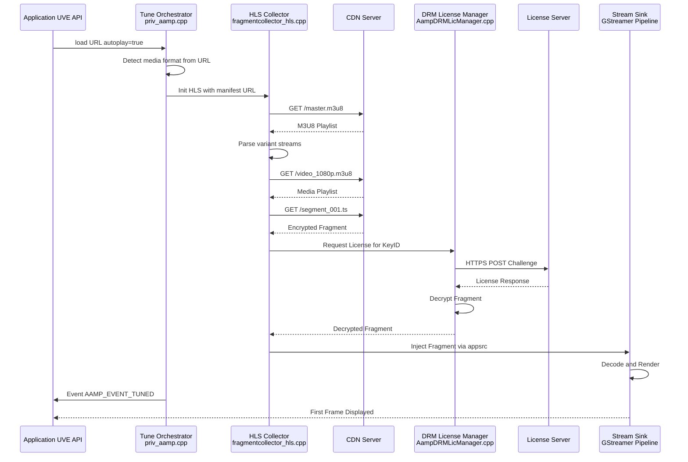
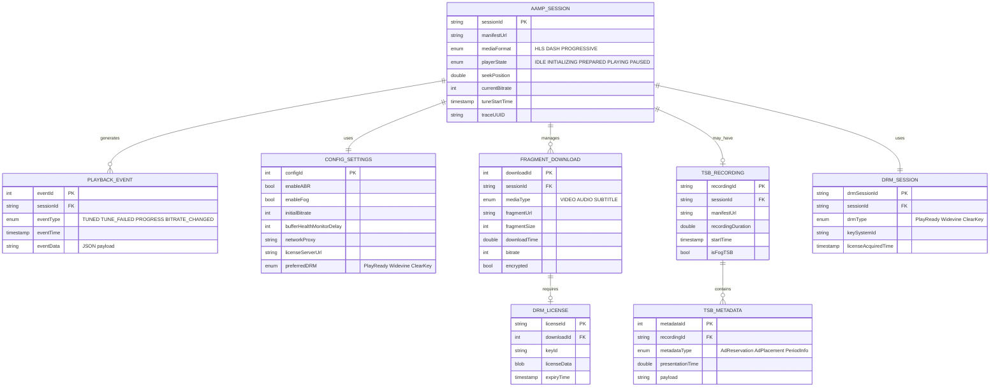
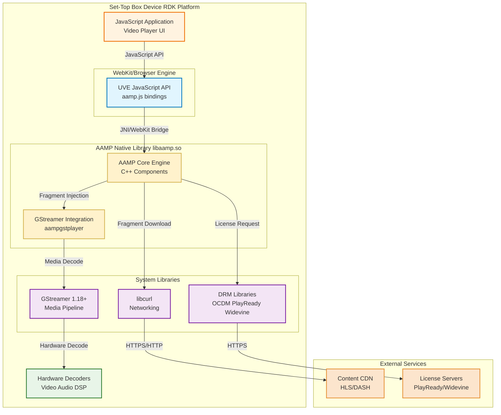

# AAMP Architecture Brief

## Table of Contents

- [Overview](#overview)
- [Problem Definitions & Business Context](#problem-definitions--business-context)
  - [Problem Statement](#problem-statement)
  - [Business Context](#business-context)
- [C4 System Context Diagram](#c4-system-context-diagram)
- [System Overview](#system-overview)
  - [C4 Container Diagram](#c4-container-diagram)
  - [C4 Container Diagram Explanation](#c4-container-diagram-explanation)
  - [Request Flow Sequence](#request-flow-sequence)
  - [Technology Stack](#technology-stack)
- [System Data Models](#system-data-models)
  - [Data Model ER Diagram](#data-model-er-diagram)
- [API Endpoints](#api-endpoints)
  - [Core API Routes](#core-api-routes)
- [Deployment Architecture](#deployment-architecture)

---

## Overview

AAMP (Advanced Adaptive Media Player) / Universal Video Engine (UVE) is a native C++ video playback engine optimized for embedded RDK-based devices. It provides adaptive streaming capabilities for HLS, MPEG-DASH, and progressive MP4 content with integrated DRM support, ABR (Adaptive Bitrate) control, and event-driven playback management. AAMP is primarily used by application developers through the UVE JavaScript API for building video player experiences on set-top boxes and embedded platforms.

**Primary Users:**
- Application developers integrating video playback functionality
- Platform/firmware engineers deploying on RDK devices
- QA teams validating playback, DRM, and streaming behavior

**Use Cases:**
- Live TV streaming with adaptive bitrate control
- VOD (Video on Demand) playback with DRM protection
- DVR/time-shift buffer playback for paused live content
- Multi-protocol streaming across HLS, DASH, and progressive MP4

---

## Problem Definitions & Business Context

### Problem Statement

RDK-based set-top boxes and embedded devices require a high-performance, memory-efficient video playback engine that can:

1. **Handle Multiple Streaming Protocols**: Support HLS, MPEG-DASH, and progressive MP4 with protocol-specific optimizations
2. **Manage DRM Requirements**: Integrate PlayReady, Widevine, and ClearKey DRM systems with license acquisition and key management
3. **Optimize for Embedded Constraints**: Minimize memory footprint and CPU usage while maintaining real-time playback performance
4. **Provide Adaptive Streaming**: Dynamically adjust bitrate based on network conditions and buffer health
5. **Enable DVR Functionality**: Support time-shift buffer (TSB) for pause/rewind/resume on live content

### Business Context

**Primary Users:**
- Application developers using the UVE JavaScript API
- Platform engineers integrating AAMP into RDK firmware
- QA engineers validating streaming and DRM functionality

**Use Cases:**
1. Live sports streaming with low-latency adaptive bitrate
2. Premium VOD content with multi-DRM protection
3. Time-shifted viewing with local or cloud-based TSB
4. Multi-bitrate profile selection for bandwidth-constrained networks

**Non-Functional Requirements:**
- **Availability**: 99.9% uptime for core playback engine
- **Performance**: < 2s tune time for channel changes, < 5s initial playback start
- **Security**: DRM compliance with HDCP output protection
- **Scalability**: Support for concurrent playback across multiple devices (device-side)
- **Memory**: Optimized for embedded devices with limited RAM (< 512MB for player stack)

**Integration Points:**
- **External CDN Services**: Manifest and media segment delivery
- **DRM License Servers**: PlayReady, Widevine license acquisition
- **GStreamer Pipeline**: Low-level media decoding and rendering
- **Application Layer**: JavaScript/UVE API for playback control
- **TSB Services**: Optional Fog or local time-shift buffer management

---

## C4 System Context Diagram

---

## System Overview

### C4 Container Diagram

### C4 Container Diagram Explanation

#### **Core Components:**

**1. Tune Orchestrator (priv_aamp.cpp)**
- Entry point for all playback operations
- Implements `Tune()` and `TuneHelper()` methods
- Manages playback state machine: `eSTATE_INITIALIZING` → `eSTATE_PREPARED` → `eSTATE_PLAYING`
- Coordinates protocol selection based on manifest URL detection

**2. Protocol Collectors**
- **HLS Collector**: Parses M3U8 playlists, handles AES-128 and SAMPLE-AES encryption
- **DASH Collector**: Parses MPD manifests, supports multi-period and SegmentTimeline
- **Progressive Collector**: Direct MP4 playback with HTTP range requests
- Each collector extends `StreamAbstractionAAMP` base class

**3. Event Manager**
- Dispatches events to registered JavaScript listeners
- Event types: `AAMP_EVENT_TUNED`, `AAMP_EVENT_TUNE_FAILED`, `AAMP_EVENT_PROGRESS`, `AAMP_EVENT_BITRATE_CHANGED`
- Supports sync and async event delivery modes

**4. Configuration Manager**
- Layered configuration system: default < operator < stream < app < developer
- Runtime configuration via `/opt/aamp.cfg` or `/opt/aampcfg.json`
- Controls ABR, DRM, buffering, and logging behavior

**5. DRM Stack**
- License Manager handles PlayReady, Widevine, and ClearKey
- License Prefetcher optimizes tune time by pre-acquiring licenses
- Integrates with platform-specific DRM implementations (OCDM, SecClient)

**6. ABR Manager**
- Network bandwidth estimation from download metrics
- Profile selection based on buffer health and network consistency
- Configurable rampdown/rampup thresholds

**7. TSB Manager**
- Supports local and cloud-based time-shift buffer
- Manages DVR operations: pause, resume, seek within live window
- Optional Fog TSB integration for cloud DVR

**8. Async Scheduler**
- Worker thread pool for fragment downloads
- Job queue with future-based completion tracking
- Per-media-type worker management via `AampTrackWorkerManager`

#### **GStreamer Integration:**

**Stream Sink Manager**
- Manages GStreamer pipeline lifecycle
- Injects decrypted fragments via `appsrc` element
- Handles pipeline state transitions: NULL → READY → PAUSED → PLAYING

**GStreamer Player (aampgstplayer.cpp)**
- Wraps GStreamer playback pipeline
- Configures video/audio decoders
- Supports Westeros sink for RDK platforms

#### **External Dependencies:**

**CDN Servers**
- Manifest and media segment delivery via HTTPS/HTTP
- Protocol-specific formats: M3U8 (HLS), MPD (DASH), MP4 (Progressive)

**License Servers**
- PlayReady and Widevine license acquisition
- Challenge/response protocol over HTTPS

**Fog TSB**
- Optional cloud-based time-shift buffer
- Supports live pause/resume with server-side recording

---

#### **Request Flow Sequence:**

**Critical Use Case: Live HLS Playback with DRM**

**Flow Explanation:**
1. Application calls `player.load(url, autoplay: true)` via UVE JavaScript API
2. Tune Orchestrator detects HLS format from `.m3u8` extension
3. HLS Collector downloads master and media playlists
4. First fragment is downloaded and detected as encrypted
5. DRM License Manager requests license from server
6. Fragment is decrypted and injected into GStreamer pipeline
7. TUNED event is dispatched to application when playback starts

---

### Technology Stack

**Runtime & Languages:**
- C++ 17 (primary language for core engine)
- CMake 3.5+ (build system)
- Bash (build and test automation)

**Media Framework:**
- GStreamer 1.18.0+ (media pipeline)
- gstreamer-app 1.0 (appsrc integration)

**Data Storage:**
- Cassandra (optional external metadata storage, not core dependency)
- Local file system (fragment caching, TSB local mode)

**Infrastructure:**
- Docker (CI containerization, see `.github/Dockerfile.ci`)
- GitHub Actions (CI/CD workflows)
- ctest (unit test execution via `test/utests/run.sh`)

**Networking & Protocols:**
- libcurl 7.81+ (macOS requires 8.5+) - HTTP/HTTPS requests
- OpenSSL (TLS/SSL encryption)
- libxml2 (XML parsing for DASH MPD)
- libdash (DASH manifest parsing library)

**DRM Services:**
- PlayReady (Microsoft DRM)
- Widevine (Google DRM)
- ClearKey (W3C standard)
- OCDM (Open Content Decryption Module for RDK)

**Monitoring & Logging:**
- AampLogManager (custom logging framework)
- AampTelemetry2 (telemetry data collection)
- systemd journal integration (Linux platforms)

**Testing & Quality:**
- Google Test 1.10+ (unit test framework)
- Google Mock (mocking framework)
- L1 unit tests (component-level testing)
- GitHub Actions (automated CI on push/PR)

---

## System Data Models

### Data Model ER Diagram

**Data Model Explanation:**

**AAMP_SESSION**: Core playback session entity
- Represents a single playback session from tune to stop
- Tracks current state, manifest URL, and playback position
- Links to configuration, events, and DRM sessions

**CONFIG_SETTINGS**: Runtime configuration
- Layered configuration values (default → operator → app → developer)
- Controls ABR, buffering, DRM, and network behavior
- Persists across sessions in `/opt/aamp.cfg` or `/opt/aampcfg.json`

**PLAYBACK_EVENT**: Event dispatch log
- Records all events emitted by EventManager
- JSON payload contains event-specific data (bitrate, error codes, progress)
- Events are delivered to JavaScript listeners via UVE API

**FRAGMENT_DOWNLOAD**: Media segment download tracking
- One record per downloaded fragment (video, audio, subtitle)
- Used for bandwidth estimation and ABR decisions
- Tracks download time, size, and encryption status

**DRM_SESSION**: DRM context management
- One session per playback with DRM content
- Manages license acquisition and key storage
- Supports multiple DRM types (PlayReady, Widevine, ClearKey)

**DRM_LICENSE**: License key storage
- Stores decryption keys per fragment or media
- Blob data contains platform-specific license format
- Expiry tracking for license renewal

**TSB_RECORDING**: Time-shift buffer session
- Records live stream for pause/rewind functionality
- Supports local (device storage) or Fog (cloud) mode
- Links to metadata for ad insertion and period boundaries

**TSB_METADATA**: DVR metadata
- Stores ad reservation, placement, and period transition info
- Used for accurate seek within time-shifted content
- Presentation time aligns with media timeline

---

## API Endpoints

### Core API Routes

**Note:** AAMP does not expose HTTP REST endpoints. Instead, it provides a JavaScript API (UVE) for application integration. The following documents the public UVE API methods, which are conceptually similar to API endpoints.

**Public UVE API Methods (Application-Facing):**

- `load(url, autoplay)` - Load manifest and initiate playback
  - **Parameters**: `url` (string), `autoplay` (boolean)
  - **Returns**: void
  - **Events Emitted**: `AAMP_EVENT_TUNED` on success, `AAMP_EVENT_TUNE_FAILED` on error

- `play()` - Resume playback from paused state
  - **Returns**: void
  - **Events Emitted**: `AAMP_EVENT_STATE_CHANGED`

- `pause()` - Pause playback
  - **Returns**: void
  - **Events Emitted**: `AAMP_EVENT_STATE_CHANGED`

- `seek(position)` - Seek to specified position in seconds
  - **Parameters**: `position` (double)
  - **Returns**: void
  - **Events Emitted**: `AAMP_EVENT_SEEKING`, `AAMP_EVENT_SEEKED`

- `stop()` - Stop playback and release resources
  - **Returns**: void
  - **Events Emitted**: `AAMP_EVENT_EOS`

- `setRate(rate)` - Set playback rate for trick play
  - **Parameters**: `rate` (float, e.g., 2.0 for 2x fast-forward)
  - **Returns**: void
  - **Events Emitted**: `AAMP_EVENT_SPEED_CHANGED`

- `setDRMConfig(config)` - Configure DRM license servers
  - **Parameters**: `config` (object with `com.microsoft.playready`, `com.widevine.alpha` keys)
  - **Returns**: void

- `addEventListener(event, handler)` - Register event listener
  - **Parameters**: `event` (string), `handler` (function)
  - **Returns**: void

**Internal C++ Methods (Component-Level):**

- `PrivateInstanceAAMP::Tune(url, autoplay, ...)` - Core tune implementation
  - Orchestrates protocol selection and stream initialization
  - File: `priv_aamp.cpp`

- `PrivateInstanceAAMP::TuneHelper(tuneType)` - Tune execution logic
  - Handles retune, seek, and live transitions
  - File: `priv_aamp.cpp`

- `StreamAbstractionAAMP::Init(tuneType)` - Protocol-specific initialization
  - Implemented by HLS, DASH, Progressive collectors
  - File: `StreamAbstractionAAMP.h` (abstract), `fragmentcollector_*.cpp` (concrete)

- `AampEventManager::SendEvent(event, mode)` - Event dispatch
  - Delivers events to JavaScript listeners
  - File: `AampEventManager.cpp`

**Event Types (Callback-Based):**

- `AAMP_EVENT_TUNED` - Playback successfully started
- `AAMP_EVENT_TUNE_FAILED` - Tune operation failed (includes error code)
- `AAMP_EVENT_PROGRESS` - Periodic playback position update
- `AAMP_EVENT_BITRATE_CHANGED` - ABR profile switch
- `AAMP_EVENT_DRM_METADATA` - DRM license acquisition status
- `AAMP_EVENT_BUFFER_UNDERFLOW` - Rebuffering event
- `AAMP_EVENT_EOS` - End of stream reached

---

## Deployment Architecture

AAMP is deployed as a native library integrated into RDK-based set-top box firmware. There is no standalone server deployment.

**Deployment Model:**

**Deployment Characteristics:**

1. **Library Integration**: AAMP is compiled as `libaamp.so` and linked into the RDK firmware image
2. **WebKit Bridge**: UVE JavaScript API communicates with native C++ via WebKit's injected bundle mechanism
3. **Hardware Acceleration**: Leverages platform-specific hardware decoders for video/audio
4. **On-Device Storage**: Optional local TSB writes to device storage (flash/HDD)
5. **Containerized CI**: Build and test runs in Docker (`.github/Dockerfile.ci`)

**Build Artifacts:**
- `libaamp.so` - Core playback library
- `aamp_cli` - Command-line test utility
- Unit test executables in `test/utests/build/`

**CI/CD Pipeline:**
- GitHub Actions workflow (`.github/workflows/L1-tests.yml`)
- CMake-based build with GCC/Clang
- L1 unit tests executed via `ctest`
- Test results published as JUnit XML

**Monitoring & Diagnostics:**
- Logging via AampLogManager (stdout, systemd journal, or custom sink)
- Telemetry via AampTelemetry2 (metrics collection)
- Profiling via AampProfiler (tune time, download metrics)

---

**Copyright 2026 RDK Management**

Licensed under the Apache License, Version 2.0.
