# Middleware E2E Architecture — 100% Verified

## Table of Contents
1. [System Overview](#1-system-overview)
2. [Middleware Module Map](#2-middleware-module-map)
3. [Core Player Lifecycle](#3-core-player-lifecycle)
4. [Data Flow Architecture](#4-data-flow-architecture)
5. [DRM Subsystem](#5-drm-subsystem)
6. [Vendor SoC Abstraction](#6-vendor-soc-abstraction)
7. [Externals Subsystem](#7-externals-subsystem)
8. [GStreamer Plugin Architecture](#8-gstreamer-plugin-architecture)
9. [Subtitle & Closed Captions](#9-subtitle--closed-captions)
10. [Threading & Synchronization](#10-threading--synchronization)
11. [E2E Playback Flow](#11-e2e-playback-flow)

---

## 1. System Overview

```mermaid
graph TB
    subgraph "Application Layer"
        APP[Application / RDK Shell]
    end

    subgraph "AAMP Core"
        AAMP[PrivateInstanceAAMP]
        GSP[AAMPGstPlayer - Bridge]
    end

    subgraph "Middleware Layer"
        IRDK[InterfacePlayerRDK]
        subgraph "Core Modules"
            PRIV[InterfacePlayerPriv]
            GPP[GstPlayerPriv]
            SCHED[PlayerScheduler]
            HC[GstHandlerControl]
        end
        subgraph "DRM"
            DSM[DrmSessionManager]
            DS[DrmSession]
            DH[DrmHelper]
            OCDM[OCDM Adapters]
        end
        subgraph "Vendor"
            SI[SocInterface]
            BRCM[SocBroadcom]
            RTK[SocRealtek]
            MTK[SocMTK]
            AML[SocAmlogic]
            DEF[SocDefault]
        end
        subgraph "Externals"
            THD[PlayerThunderInterface]
            RFC[RFCSettings namespace]
            FB[FireboltInterface]
            CSM[ContentSecurityManager]
            PEI[PlayerExternalsInterface]
        end
        subgraph "GStreamer Plugins"
            DECRYPT[gstcdmidecryptor]
            SUBTEC[gst-subtec plugins]
        end
        subgraph "Subtitles"
            SUBP[SubtitleParser]
            LIBSUB[libsubtec packets]
        end
        subgraph "Utilities"
            GU[GstUtils]
            PU[PlayerUtils]
            PH[ProcessHandler]
            SU[SocUtils]
            BLM[PlayerLogManager]
            ISOBMFF[PlayerISOBMFF]
            PJSON[PlayerJsonObject]
            BC[BaseConversion]
        end
    end

    subgraph "GStreamer Framework"
        PIPE[GstPipeline]
        APPSRC[GstAppSrc]
        DEC[Decoder Elements]
        SINK[Sink Elements]
    end

    subgraph "Hardware"
        HW[SoC Hardware - Video/Audio Decoder + Display]
    end

    APP --> AAMP
    AAMP --> GSP
    GSP --> IRDK
    IRDK --> PRIV
    PRIV --> GPP
    IRDK --> SCHED
    IRDK --> HC
    IRDK --> SI
    DSM --> CSM
    IRDK --> GU
    SI --> BRCM
    SI --> RTK
    SI --> MTK
    SI --> AML
    SI --> DEF
    DSM --> DS
    DS --> DH
    DS --> OCDM
    IRDK --> PIPE
    PIPE --> APPSRC
    PIPE --> DEC
    PIPE --> SINK
    SINK --> HW
```

---

## 2. Middleware Module Map

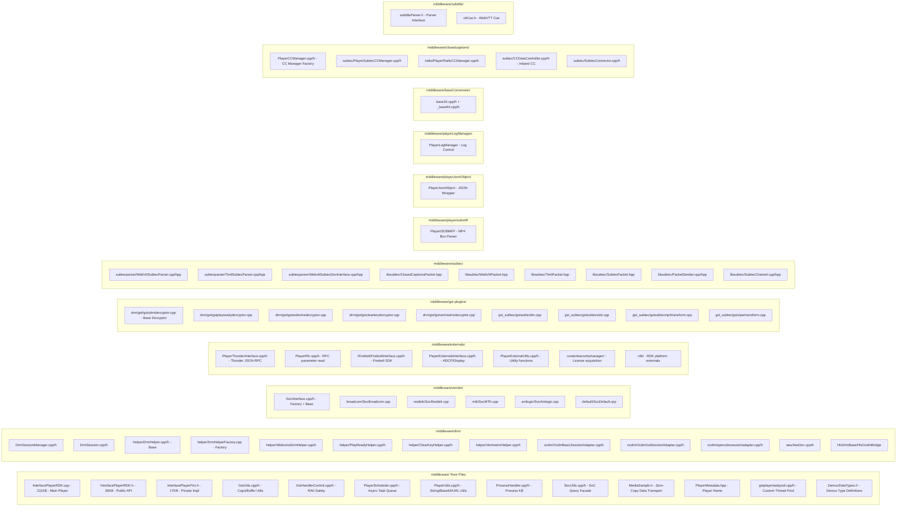

---

## 3. Core Player Lifecycle

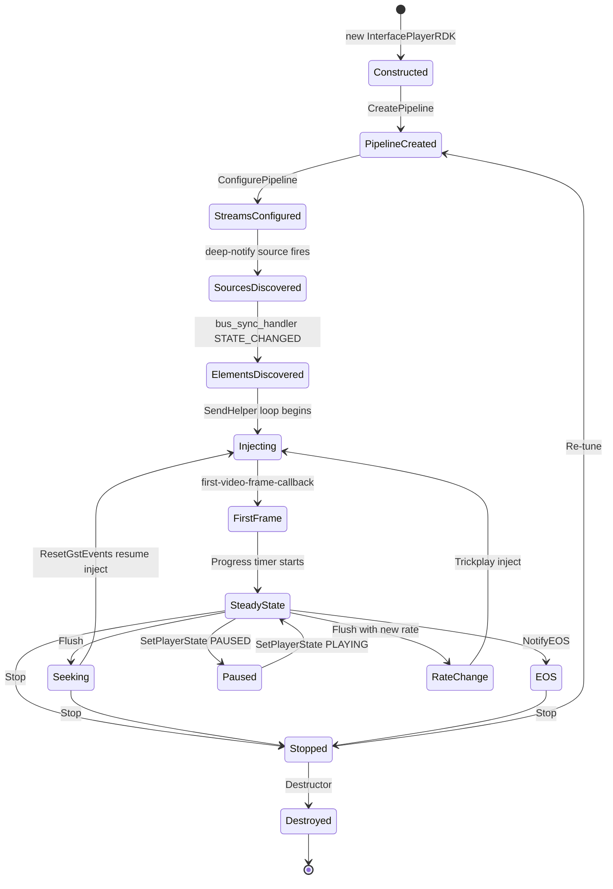

---

## 4. Data Flow Architecture

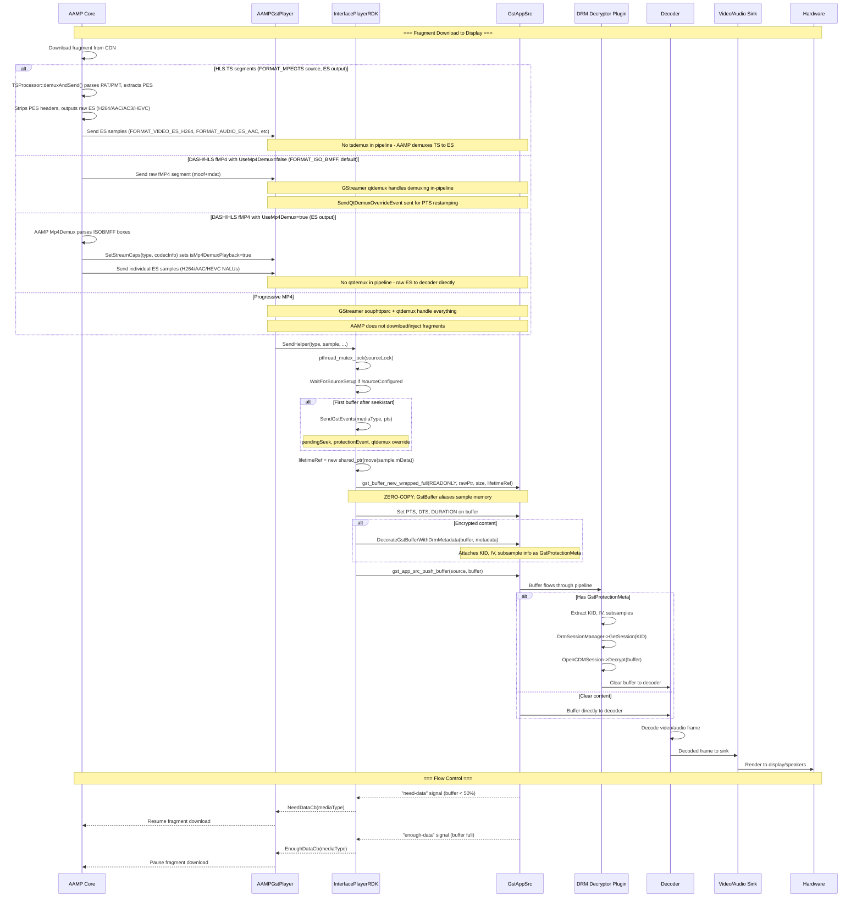

---

## 5. DRM Subsystem

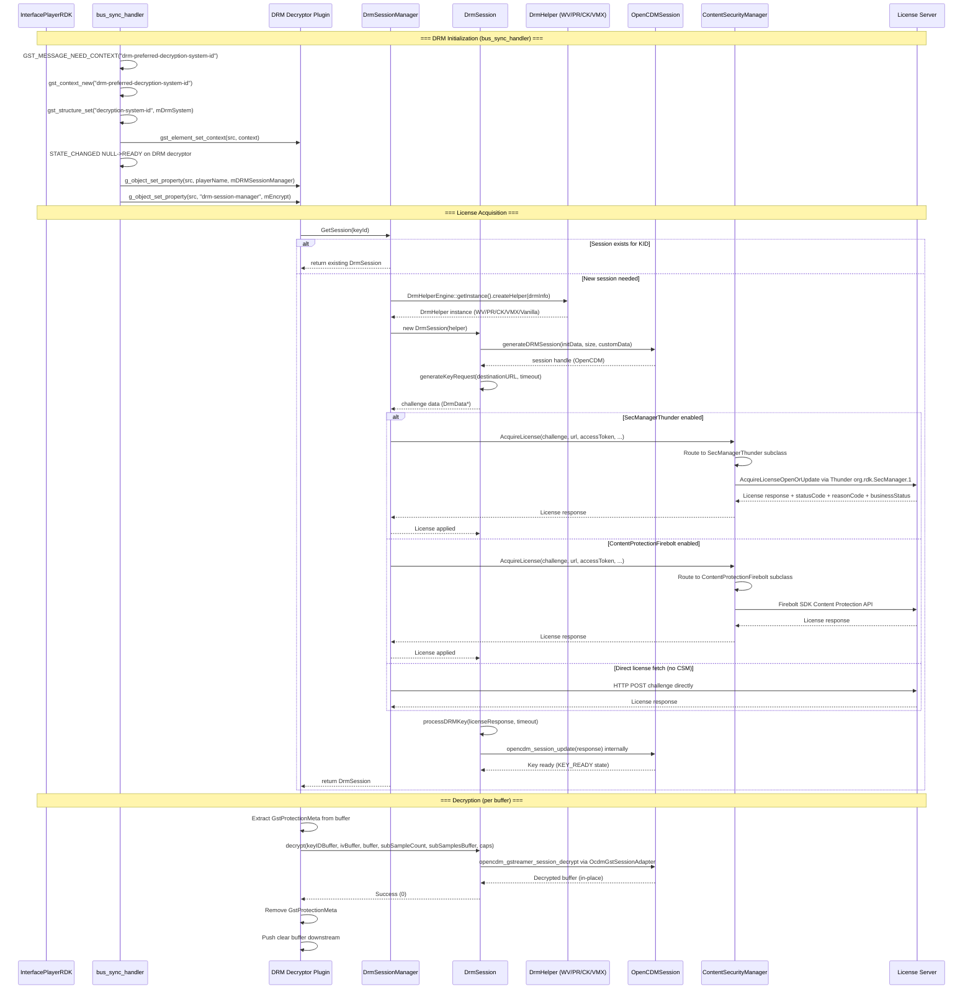

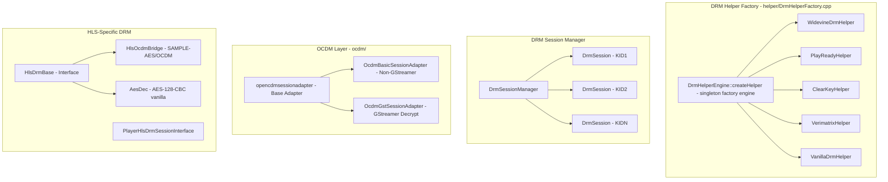

---

## 6. Vendor SoC Abstraction

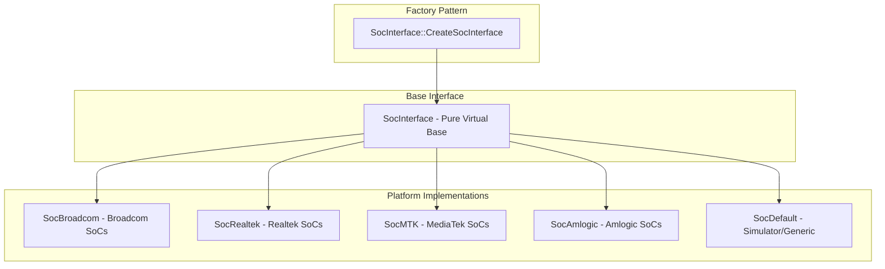

### SocInterface Key Virtual Methods (from vendor/SocInterface.h):

| Method | Type | Purpose |
|--------|------|---------|
| `UseWesterosSink()` | virtual | Whether platform uses Westeros video sink (default: true) |
| `UseAppSrc()` | virtual | Whether AppSrc element should be used (default: false) |
| `RequiredQueuedFrames()` | virtual | Min frames to queue before decode (default: 4) |
| `EnablePTSRestamp()` | virtual | Whether platform supports PTS restamping (default: false) |
| `IsFirstTuneWithWesteros()` | virtual | First-tune detection without Westeros (default: false) |
| `HasFirstAudioFrameCallback()` | virtual | Whether first audio frame callback exists (default: true) |
| `ShouldTearDownForTrickplay()` | virtual | Whether trickplay needs pipeline teardown (default: false) |
| `IsDecryptRequired()` | virtual | Whether platform needs explicit decryption (default: false) |
| `IsTransformCapsRequired()` | virtual | Whether transform caps are needed (default: false) |
| `AudioOnlyMode()` | virtual | Handle audio-only first frame detection (default: false) |
| `SetPlatformPlaybackRate()` | virtual | Apply rate to platform elements (default: false) |
| `DisableAsyncAudio()` | virtual | Disable async on audio sink during seek (default: false) |
| `ResetTrickUTC()` | virtual | Reset UTC reference for trickplay (default: false) |
| `NotifyVideoFirstFrame()` | virtual | Platform-specific first frame notification (default: false) |
| `IsSimulatorFirstFrame()` | virtual | Simulator first frame detection (default: false) |
| `SetVideoBufferSize()` | virtual | Platform buffer size configuration |
| `SetSinkAsync()` | virtual | Re-enable async on audio sink post-seek |
| `SetFreerunThreshold()` | virtual | Set AV sync freerun threshold |
| `SetSeamlessSwitch()` | virtual | Enable/disable seamless audio switch |
| `ConfigurePluginPriority()` | virtual | Set audio decoder plugin priorities |
| `SetH264Caps()` | virtual | Platform-specific H264 caps adjustments |
| `SetHevcCaps()` | virtual | Platform-specific HEVC caps adjustments |
| `SetDecodeError()` | virtual | Connect decode error callback |
| `GetVideoPts()` | virtual | Get current video PTS (90kHz ticks) |
| `DiscoverVideoDecoderProperties()` | virtual | Find decoder signals at NULL->READY |
| `DiscoverVideoSinkProperties()` | virtual | Find sink properties at READY->PAUSED |
| `SetAC4Tracks()` | virtual | AC4 audio track selection |
| `SetPlaybackFlags()` | **pure virtual** | Platform-specific GStreamer playbin flags |
| `SetPlaybackRate()` | **pure virtual** | Set rate on sources/pipeline/decoders |
| `SetRateCorrection()` | **pure virtual** | Set rate correction |
| `IsVideoSink()` | **pure virtual** | Check if element name is video sink |
| `IsAudioSinkOrAudioDecoder()` | **pure virtual** | Check if element is audio sink/decoder |
| `IsVideoDecoder()` | **pure virtual** | Check if element is video decoder |
| `IsAudioOrVideoDecoder()` | **pure virtual** | Check if element is audio or video decoder |
| `ConfigureAudioSink()` | **pure virtual** | Detect and configure platform audio sink |
| `GetCCDecoderHandle()` | **pure virtual** | Get closed caption decoder handle |
| `SetAudioProperty()` | **pure virtual** | Get volume/mute property names for platform |
| `GetVideoSink()` | virtual | Get/create platform video sink element |

---

## 7. Externals Subsystem

```mermaid
graph TB
    subgraph "PlayerThunderInterface"
        THD[PlayerThunderInterface]
        THD --> JSONRPC[JSON-RPC via Thunder WPEFramework]
        JSONRPC --> HDMI[DisplayInfo Plugin]
        JSONRPC --> SYSTEM[System Plugin]
    end

    subgraph "RFCSettings"
        RFC[RFCSettings::readRFCValue]
        RFC --> TR181[TR-181 DataModel via tr181api]
    end

    subgraph "FireboltInterface"
        FB[FireboltInterface - Singleton]
        FB --> FBSDK[Firebolt SDK - fireboltaamp.h]
        FBSDK --> CAPS[Device Capabilities]
    end

    subgraph "PlayerExternalsInterface"
        PEI[PlayerExternalsInterface]
        PEI --> HDCP[HDCP Status - dsHdcpProtocolVersion]
        PEI --> DISPLAY[Display Resolution]
        subgraph "RDK Implementation"
            RDKEXT[PlayerExternalsRdkInterface]
            RDKEXT --> DEVFB[DeviceFireboltInterface]
            RDKEXT --> DEVIARM[DeviceIARMInterface]
        end
    end

    subgraph "ContentSecurityManager - License Acquisition"
        CSM[ContentSecurityManager - Base Class<br/>ContentSecurityManager.h<br/>Extends PlayerScheduler]
        SMT[SecManagerThunder - Subclass<br/>SecManagerThunder.h<br/>Thunder Plugin: org.rdk.SecManager.1]
        CPF[ContentProtectionFirebolt - Subclass<br/>IFirebolt/ContentProtectionFirebolt.h<br/>Firebolt Content Protection SDK]
        CSMS[ContentSecurityManagerSession<br/>ContentSecurityManagerSession.h<br/>Per-Playback Session State]
        CSM --> SMT
        CSM --> CPF
        CSM --> CSMS
        SMT --> THUNDER_SM[Thunder SecManager Plugin]
        SMT --> THUNDER_WM[Thunder Watermark Plugin]
        SMT --> THUNDER_AUTH[Thunder AuthService Plugin]
        CPF --> FB_SDK[Firebolt SDK]
    end
```

---

## 8. GStreamer Plugin Architecture

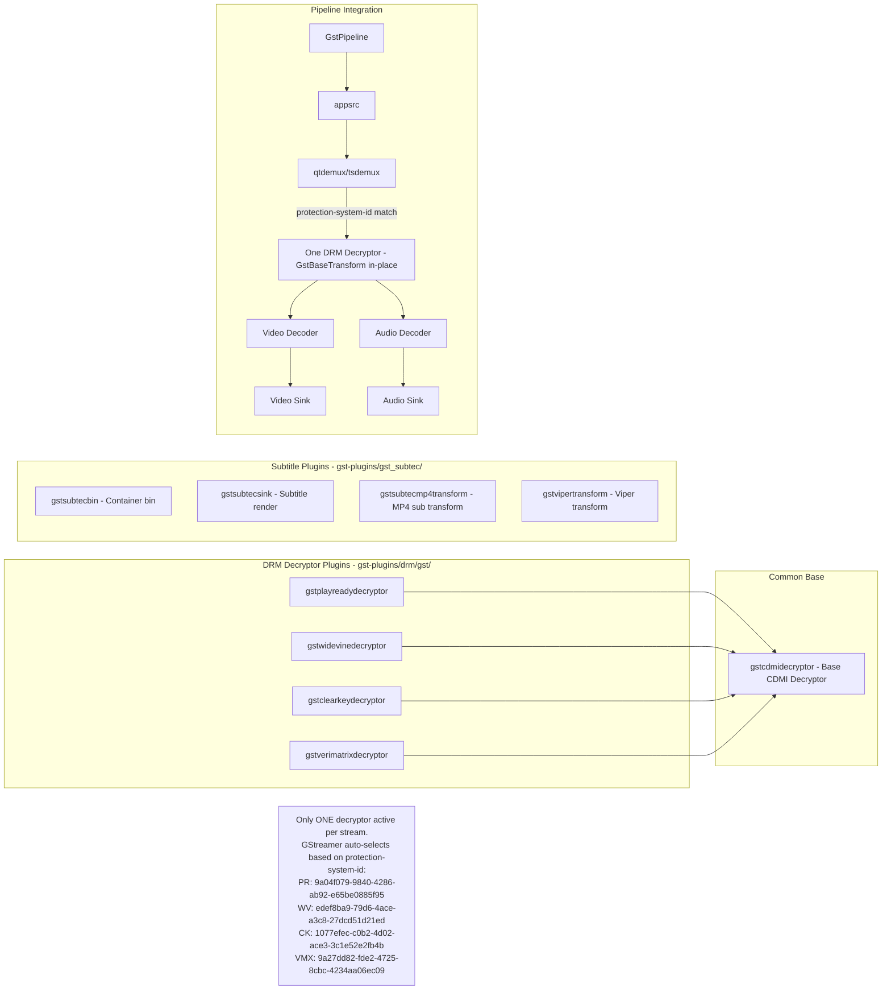

---

## 9. Subtitle & Closed Captions

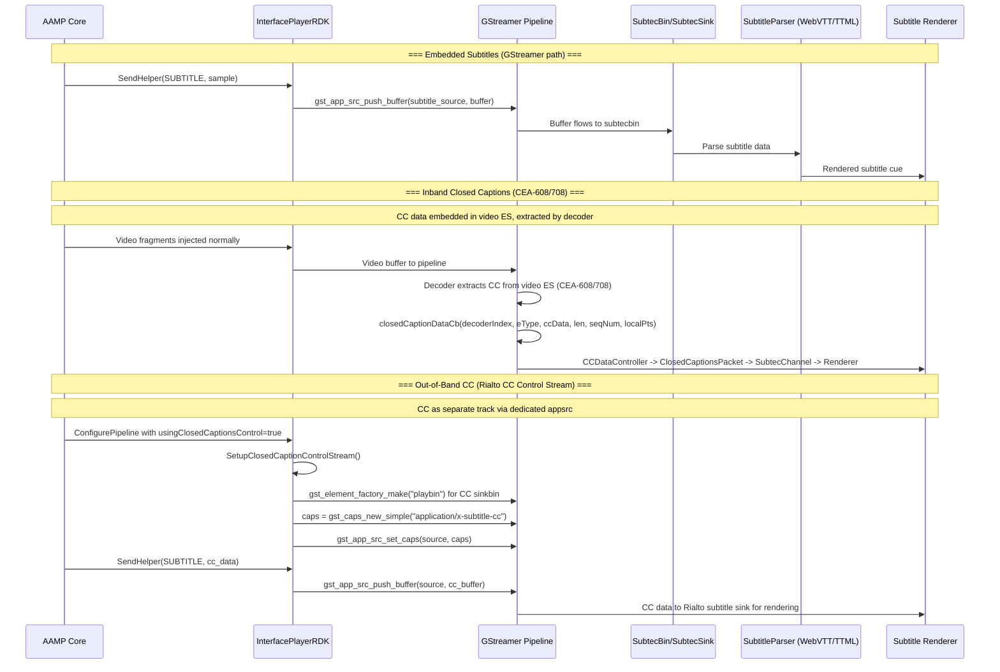

### CC Manager Class Hierarchy (from closedcaptions/PlayerCCManager.h):

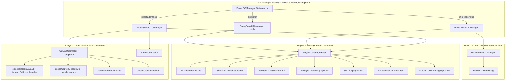

### Subtitle Parser Types (from subtec/subtecparser/):

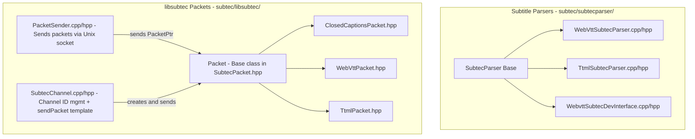

### Key CC Concepts:

| Type | Description | Data Source | Rendering Path |
|------|-------------|------------|----------------|
| **Inband CC** | CEA-608/708 embedded in video ES | Decoder extracts from video PES | `closedCaptionDataCb` -> `CCDataController` -> `ClosedCaptionsPacket` -> `SubtecChannel` |
| **Out-of-Band CC** | Separate subtitle track (WebVTT/TTML) | AAMP downloads and injects via separate appsrc | `SetupClosedCaptionControlStream` -> `application/x-subtitle-cc` caps -> Rialto subtitle sink |
| **OOB Check** | `IsOOBCCRenderingSupported()` | `PlayerCCManagerBase` virtual | Returns whether platform supports OOB CC rendering |
| **CC Formats** | `eCLOSEDCAPTION_FORMAT_608`, `eCLOSEDCAPTION_FORMAT_708`, `eCLOSEDCAPTION_FORMAT_DEFAULT` | `PlayerCCManager.h` enum | Used in `SetTrack(track, format)` |

---

## 10. Threading & Synchronization

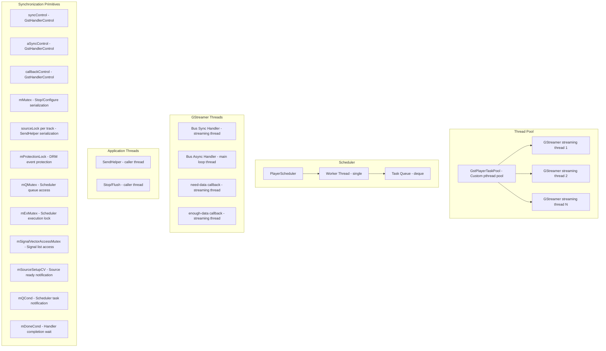

### Handler Control Pattern (RAII Safety):

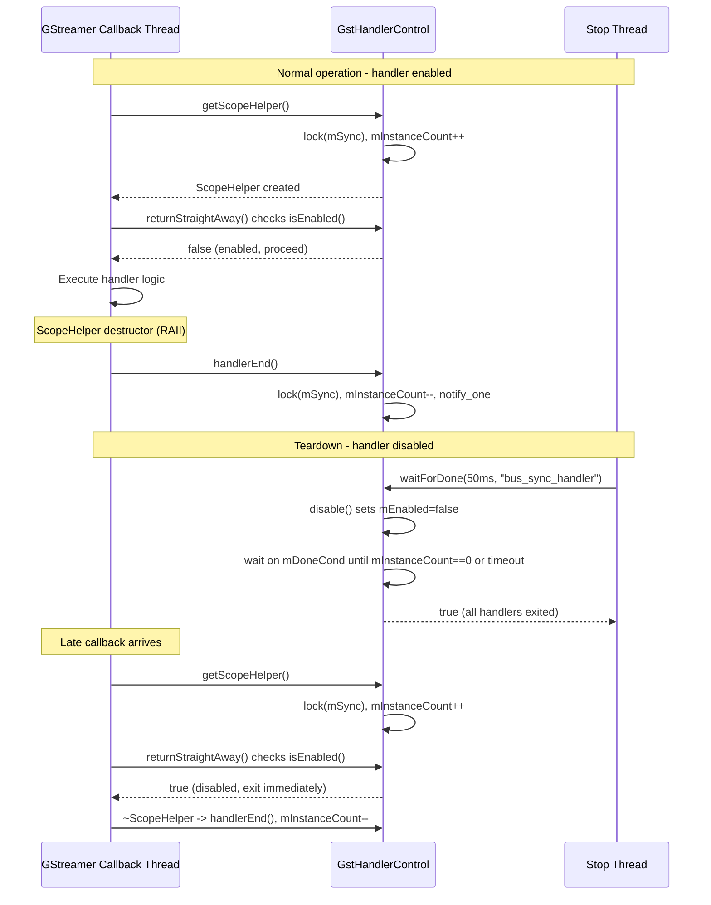

---

## 11. E2E Playback Flow

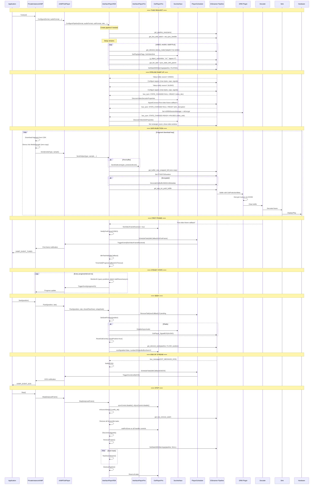

---

## Summary

| Component | Files | Responsibility |
|-----------|-------|---------------|
| **InterfacePlayerRDK** | InterfacePlayerRDK.cpp/h | Main GStreamer player - pipeline management, data injection, bus handling |
| **InterfacePlayerPriv** | InterfacePlayerPriv.h | Private implementation - GstEvents, segments, protection events |
| **GstPlayerPriv** | (in InterfacePlayerPriv.h) | State structure - pipeline, bus, sinks, decoders, flags |
| **PlayerScheduler** | PlayerScheduler.cpp/h | Single-threaded async task queue for callbacks |
| **GstHandlerControl** | GstHandlerControl.h | RAII safety - prevent callbacks during teardown |
| **SocInterface** | vendor/SocInterface.cpp/h + platforms | Hardware abstraction factory |
| **DrmSessionManager** | drm/DrmSessionManager.cpp/h | DRM session lifecycle management |
| **DrmSession** | drm/DrmSession.cpp/h | Individual DRM session + OCDM interaction |
| **DrmHelper** | drm/helper/DrmHelper*.cpp/h | DRM system-specific logic (WV/PR/CK/VMX/Vanilla) |
| **DrmHelperFactory** | drm/helper/DrmHelperFactory.cpp | Creates correct helper by key system |
| **OCDM Adapters** | drm/ocdm/Ocdm*SessionAdapter.cpp/h | OpenCDM session wrappers (Basic + GStreamer) |
| **gstcdmidecryptor** | gst-plugins/drm/gst/gstcdmidecryptor.cpp | GStreamer CDMI decrypt element base |
| **GstUtils** | GstUtils.cpp | Caps creation, buffer utilities |
| **PlayerUtils** | PlayerUtils.cpp | Base64, URL resolution, time utils |
| **SocUtils** | SocUtils.cpp | Static facade over SocInterface |
| **SubtitleParser** | subtec/subtecparser/ | WebVTT (WebVttSubtecParser), TTML (TtmlSubtecParser) |
| **libsubtec** | subtec/libsubtec/ | Subtitle packet protocol (SubtecPacket, CC, WebVtt, Ttml) |
| **PlayerISOBMFF** | playerisobmff/ | MP4 box parsing utilities |
| **PlayerJsonObject** | playerJsonObject/ | JSON wrapper for DRM challenges |
| **PlayerLogManager** | playerLogManager/ | Log level control |
| **PlayerCCManager** | closedcaptions/PlayerCCManager.cpp/h | CC manager factory (Subtec/Rialto/Fake) |
| **PlayerSubtecCCManager** | closedcaptions/subtec/PlayerSubtecCCManager.cpp/h | Subtec-based CC with CCDataController |
| **PlayerRialtoCCManager** | closedcaptions/rialto/PlayerRialtoCCManager.cpp/h | Rialto-based CC rendering |
| **Externals** | externals/ | PlayerThunderInterface, RFCSettings, FireboltInterface, PlayerExternalsInterface, ContentSecurityManager (SecManagerThunder + ContentProtectionFirebolt) |
