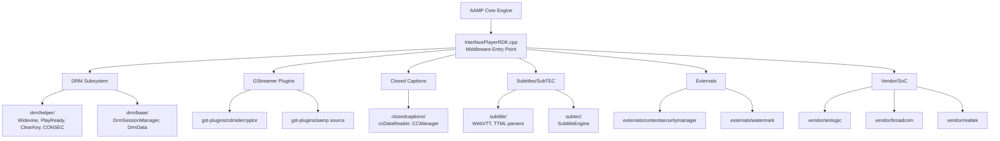
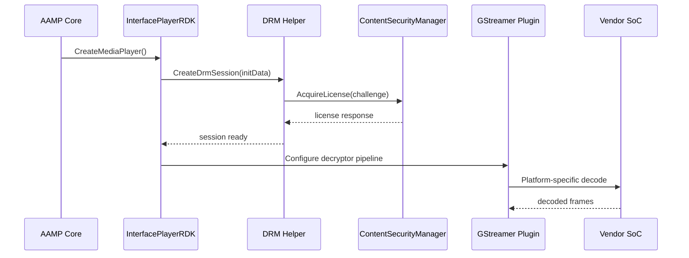

# Middleware End-to-End Architecture

## Overview

The AAMP Middleware layer sits between the AAMP core player engine and platform-specific integrations. It provides DRM session management, GStreamer plugin wrappers, closed caption/subtitle rendering, vendor SoC abstraction, and external service interfaces.

## High-Level Component Architecture

## Module Summary

| Module | Sequence Diagram |
|--------|-----------------|
| Root-level middleware (InterfacePlayerRDK.cpp) | [01-root-level-middleware.md](docs/sequence-diagrams/01-root-level-middleware.md) |
| Base Conversion utilities | [02-baseConversion.md](docs/sequence-diagrams/02-baseConversion.md) |
| Closed Captions | [03-closedcaptions.md](docs/sequence-diagrams/03-closedcaptions.md) |
| DRM (helpers, sessions, factories) | [04-drm.md](docs/sequence-diagrams/04-drm.md) |
| Externals (CSM, watermark) | [05-externals.md](docs/sequence-diagrams/05-externals.md) |
| GStreamer Plugins (CDMI decryptor, sources) | [06-gst-plugins.md](docs/sequence-diagrams/06-gst-plugins.md) |
| PlayerISOBMFF, JSON, LogManager | [07-playerisobmff-json-log.md](docs/sequence-diagrams/07-playerisobmff-json-log.md) |
| Subtitle & SubTEC | [08-subtitle-subtec.md](docs/sequence-diagrams/08-subtitle-subtec.md) |
| Vendor/SoC abstraction | [09-vendor-soc.md](docs/sequence-diagrams/09-vendor-soc.md) |

## Data Flow

## Source References

All diagrams generated from verified source file reads in middleware/ subdirectories.
