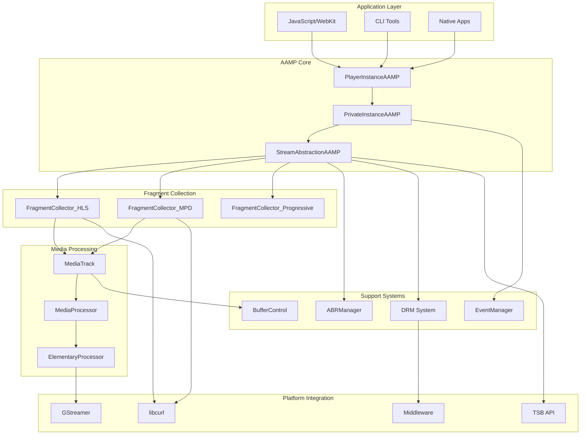
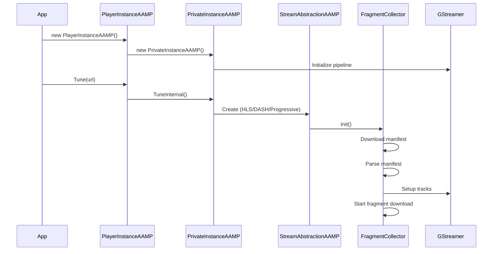
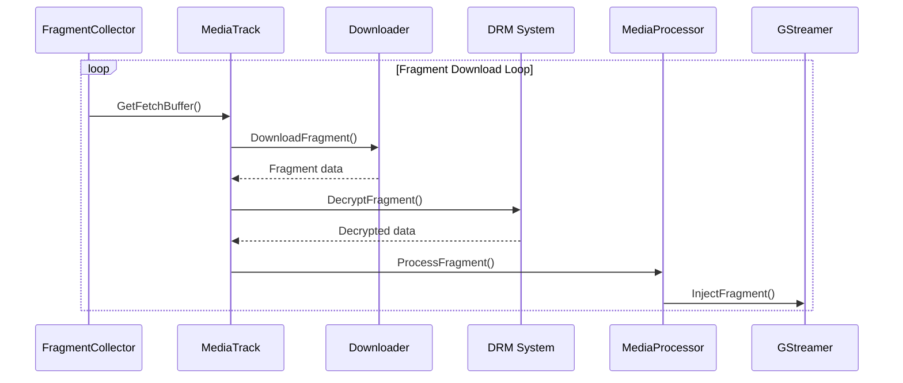

# AAMP Architecture Overview

## Table of Contents
1. [High-Level Purpose & Architecture](#high-level-purpose--architecture)
2. [Role in ENT / RDK Infrastructure](#role-in-ent--rdk-infrastructure)
3. [Architectural Overview](#architectural-overview)
4. [Component Interactions](#component-interactions)
5. [Design Principles](#design-principles)

## High-Level Purpose & Architecture

### What is AAMP?

AAMP (Advanced Adaptive Media Player) is a native C++ video playback engine designed for embedded systems, particularly RDK (Reference Design Kit) platforms. It provides:

- **Adaptive Streaming Support**: HLS (HTTP Live Streaming) and DASH (Dynamic Adaptive Streaming over HTTP)
- **DRM Integration**: Support for multiple DRM systems (Widevine, PlayReady, ClearKey, etc.)
- **Low Latency Playback**: Optimized for live streaming with minimal delay
- **Platform Integration**: Native integration with RDK, WPE WebKit, and GStreamer

### Core Responsibilities

AAMP owns the following responsibilities:

1. **Manifest Parsing**: Downloading and parsing HLS playlists and DASH MPDs
2. **Fragment Management**: Downloading, caching, decrypting, and injecting media fragments
3. **Adaptive Bitrate (ABR)**: Intelligent quality selection based on network conditions
4. **DRM Handling**: License acquisition, key management, and content decryption
5. **Buffer Management**: Time-based and byte-based buffering strategies
6. **Event System**: Comprehensive event notification for playback state changes
7. **GStreamer Integration**: Low-level media pipeline management

### What AAMP Does NOT Do

- **Video Rendering**: AAMP does not render video directly; it feeds data to GStreamer
- **UI/UX**: AAMP is a headless player engine; UI is handled by applications
- **Content Delivery**: AAMP does not serve content; it consumes HTTP/HTTPS streams
- **Network Management**: AAMP uses libcurl but doesn't manage network infrastructure

## Role in ENT / RDK Infrastructure

### Integration Points

AAMP integrates with several RDK subsystems:

1. **WPE WebKit**: JavaScript bindings provide UVE (Universal Video Engine) API
2. **GStreamer**: Core media pipeline for decoding and rendering
3. **FOG (Fragment Orchestrator)**: Optional server-side fragment orchestration
4. **TSB (Time Shift Buffer)**: Local and remote time-shifted playback
5. **DRM Middleware**: Platform-specific DRM implementations (OCDM, SecClient, etc.)
6. **Platform Services**: RFC configuration, Thunder/RPC, logging systems

### Responsibilities in RDK Stack

```
┌─────────────────────────────────────────────────────────┐
│                    Application Layer                     │
│  (JavaScript/WebKit, Native Apps, CLI Tools)            │
└────────────────────┬────────────────────────────────────┘
                     │
┌────────────────────▼────────────────────────────────────┐
│              AAMP Player (This Component)                │
│  ┌──────────┐  ┌──────────┐  ┌──────────┐             │
│  │ Fragment │  │   ABR    │  │   DRM    │             │
│  │Collectors│  │  Manager │  │  System  │             │
│  └──────────┘  └──────────┘  └──────────┘             │
└──────┬──────────────┬──────────────┬────────────────────┘
       │              │              │
┌──────▼──────┐ ┌─────▼─────┐ ┌─────▼──────┐
│ GStreamer  │ │  libcurl   │ │ DRM        │
│  Pipeline  │ │  (HTTP)    │ │ Middleware │
└────────────┘ └────────────┘ └────────────┘
```

### Subsystem Interactions

#### Readers (Input)
- **Manifest Readers**: Download and parse HLS/DASH manifests
- **Fragment Downloaders**: HTTP-based fragment retrieval
- **Configuration Readers**: File system, environment variables, RFC

#### Writers (Output)
- **GStreamer Sink**: Fragment injection into media pipeline
- **Event Dispatchers**: Event notification to listeners
- **Log Writers**: Diagnostic and telemetry output

#### Persistence Layers
- **Fragment Cache**: In-memory fragment buffers
- **TSB Storage**: Local filesystem for time-shifted content
- **Configuration Cache**: Runtime configuration state

#### IPC (Inter-Process Communication)
- **JavaScript Bindings**: UVE API via WebKit injected bundle
- **Thunder/RPC**: Platform service integration
- **Event System**: Asynchronous event delivery

## Architectural Overview

### High-Level Architecture Diagram



### Major Components

#### 1. PlayerInstanceAAMP
- **Purpose**: Public API interface for applications
- **Location**: `main_aamp.h/cpp`
- **Responsibilities**:
  - Public method exposure (Tune, Seek, SetRate, etc.)
  - Event listener registration
  - Configuration management
  - JavaScript binding integration

#### 2. PrivateInstanceAAMP
- **Purpose**: Internal player implementation
- **Location**: `priv_aamp.h/cpp`
- **Responsibilities**:
  - Core playback logic
  - GStreamer pipeline management
  - State machine management
  - Error handling and recovery

#### 3. StreamAbstractionAAMP
- **Purpose**: Base class for protocol-specific implementations
- **Location**: `StreamAbstractionAAMP.h`, `streamabstraction.cpp`
- **Responsibilities**:
  - Common fragment caching and injection logic
  - MediaTrack management
  - ABR coordination
  - Discontinuity handling

#### 4. Fragment Collectors
- **HLS**: `fragmentcollector_hls.h/cpp`
- **DASH**: `fragmentcollector_mpd.h/cpp`
- **Progressive**: `fragmentcollector_progressive.h/cpp`
- **Responsibilities**:
  - Manifest parsing
  - Fragment URL generation
  - Playlist refresh management
  - Track synchronization

#### 5. ABRManager
- **Purpose**: Adaptive bitrate decision making
- **Location**: `abr/abr.h/cpp`
- **Responsibilities**:
  - Bandwidth estimation
  - Profile selection
  - Ramp-up/ramp-down logic
  - Buffer-based decisions

#### 6. DRM System
- **Purpose**: Digital Rights Management
- **Location**: `drm/`, `middleware/drm/`
- **Responsibilities**:
  - License acquisition
  - Key management
  - Content decryption
  - Session management

#### 7. EventManager
- **Purpose**: Event dispatch and listener management
- **Location**: `AampEventManager.h/cpp`
- **Responsibilities**:
  - Event queuing
  - Listener registration
  - Async event dispatch
  - Event statistics

### Component Interaction Flow

#### Initialization Flow



#### Playback Flow



## Component Interactions

### Internal Dependencies

1. **StreamAbstractionAAMP** depends on:
   - `PrivateInstanceAAMP` (player instance)
   - `MediaTrack` (track management)
   - `ABRManager` (bitrate decisions)
   - `AampEventManager` (events)

2. **Fragment Collectors** depend on:
   - `StreamAbstractionAAMP` (base functionality)
   - `AampCurlDownloader` (HTTP downloads)
   - `AampDRMLicManager` (DRM operations)
   - `MediaStreamContext` (DASH) or `TrackState` (HLS)

3. **MediaTrack** depends on:
   - `CachedFragment` (fragment storage)
   - `MediaProcessor` (fragment processing)
   - `IsoBmffHelper` (ISO BMFF parsing)

### External Dependencies

1. **GStreamer**: Media pipeline, decoding, rendering
2. **libcurl**: HTTP/HTTPS downloads
3. **libdash**: DASH manifest parsing
4. **OpenSSL**: Cryptographic operations
5. **libxml2**: XML parsing
6. **JavaScriptCore**: JavaScript bindings (WebKit)

## Design Principles

### SOLID Principles

1. **Single Responsibility**: Each class has one clear purpose
   - `FragmentCollector_HLS`: HLS-specific logic only
   - `ABRManager`: Bitrate decisions only
   - `AampEventManager`: Event dispatch only

2. **Open/Closed**: Extensible via inheritance
   - `StreamAbstractionAAMP` as base class
   - Protocol-specific collectors inherit and extend

3. **Liskov Substitution**: Subtypes are interchangeable
   - All fragment collectors implement same interface
   - Different DRM helpers share common interface

4. **Interface Segregation**: Small, specific interfaces
   - `AampEventListener`: Event callbacks
   - `StreamSink`: Stream output interface
   - `DrmInterface`: DRM operations

5. **Dependency Inversion**: Depend on abstractions
   - Use interfaces, not concrete implementations
   - Dependency injection for testability

### Modern C++ Patterns

1. **RAII**: Resource management
   - Smart pointers (`std::shared_ptr`, `std::unique_ptr`)
   - Automatic cleanup in destructors

2. **Thread Safety**:
   - Mutexes for shared data
   - Condition variables for synchronization
   - Atomic operations where appropriate

3. **Move Semantics**:
   - Efficient data transfer
   - Reduced copying overhead

4. **Lambda Functions**:
   - Callback mechanisms
   - Async operations

### Performance Optimizations

1. **Fragment Caching**: Pre-download and cache fragments
2. **Parallel Downloads**: Concurrent fragment fetching
3. **Buffer Management**: Time-based and byte-based strategies
4. **Memory Efficiency**: Growable buffers, fragment reuse
5. **Network Optimization**: Connection reuse, DNS caching

## Summary

AAMP is a sophisticated adaptive streaming player that balances performance, memory efficiency, and code size. Its architecture follows modern C++ design principles and integrates seamlessly with RDK infrastructure. The modular design allows for protocol-specific implementations while sharing common functionality through base classes.

The system is designed to handle:
- Multiple streaming protocols (HLS, DASH, Progressive)
- Various DRM systems
- Adaptive bitrate streaming
- Low-latency playback
- Time-shifted viewing
- Platform-specific integrations

This architecture enables AAMP to serve as a robust foundation for video playback in embedded systems while maintaining flexibility for future enhancements.