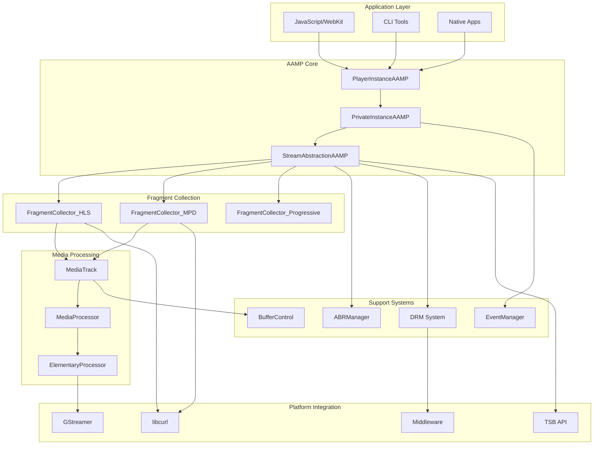
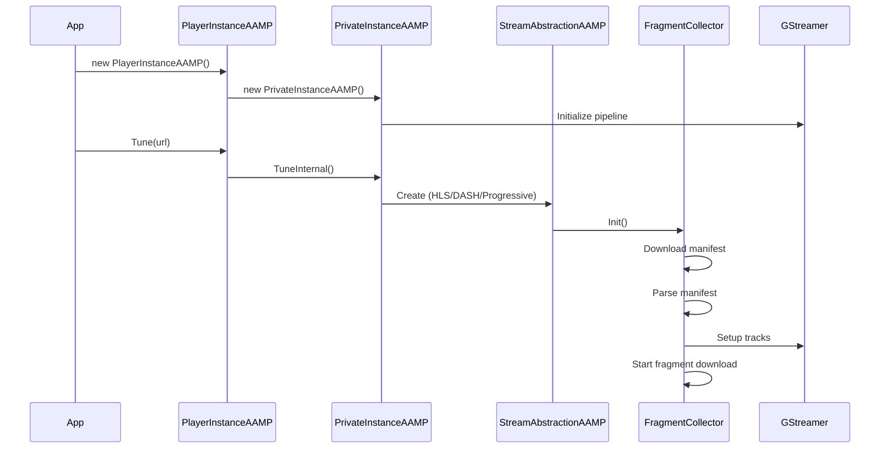
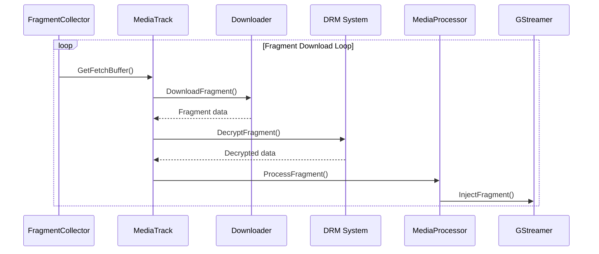

# AAMP Architecture Overview

## Table of Contents
1. [High-Level Purpose & Architecture](#high-level-purpose--architecture)
2. [Role in ENT / RDK Infrastructure](#role-in-ent--rdk-infrastructure)
3. [Architectural Overview](#architectural-overview)
4. [Component Interactions](#component-interactions)
5. [Design Principles](#design-principles)

## High-Level Purpose & Architecture

### What is AAMP?

AAMP (Advanced Adaptive Media Player) is a native C++ video playback engine designed for embedded systems, particularly RDK (Reference Design Kit) platforms. It provides:

- **Adaptive Streaming Support**: HLS (HTTP Live Streaming) and DASH (Dynamic Adaptive Streaming over HTTP)
- **DRM Integration**: Support for multiple DRM systems (Widevine, PlayReady, ClearKey, etc.)
- **Low Latency Playback**: Optimized for live streaming with minimal delay
- **Platform Integration**: Native integration with RDK, WPE WebKit, and GStreamer

### Core Responsibilities

AAMP owns the following responsibilities:

1. **Manifest Parsing**: Downloading and parsing HLS playlists and DASH MPDs
2. **Fragment Management**: Downloading, caching, decrypting, and injecting media fragments
3. **Adaptive Bitrate (ABR)**: Intelligent quality selection based on network conditions
4. **DRM Handling**: License acquisition, key management, and content decryption
5. **Buffer Management**: Time-based and byte-based buffering strategies
6. **Event System**: Comprehensive event notification for playback state changes
7. **GStreamer Integration**: Low-level media pipeline management

### What AAMP Does NOT Do

- **Video Rendering**: AAMP does not render video directly; it feeds data to GStreamer
- **UI/UX**: AAMP is a headless player engine; UI is handled by applications
- **Content Delivery**: AAMP does not serve content; it consumes HTTP/HTTPS streams
- **Network Management**: AAMP uses libcurl but doesn't manage network infrastructure

## Role in ENT / RDK Infrastructure

### Integration Points

AAMP integrates with several RDK subsystems:

1. **WPE WebKit**: JavaScript bindings provide UVE (Universal Video Engine) API
2. **GStreamer**: Core media pipeline for decoding and rendering
3. **FOG (Fragment Orchestrator)**: Optional server-side fragment orchestration
4. **TSB (Time Shift Buffer)**: Local and remote time-shifted playback
5. **DRM Middleware**: Platform-specific DRM implementations (OCDM, SecClient, etc.)
6. **Platform Services**: RFC configuration, Thunder/RPC, logging systems

### Responsibilities in RDK Stack

```
┌─────────────────────────────────────────────────────────┐
│                    Application Layer                     │
│  (JavaScript/WebKit, Native Apps, CLI Tools)            │
└────────────────────┬────────────────────────────────────┘
                     │
┌────────────────────▼────────────────────────────────────┐
│              AAMP Player (This Component)                │
│  ┌──────────┐  ┌──────────┐  ┌──────────┐             │
│  │ Fragment │  │   ABR    │  │   DRM    │             │
│  │Collectors│  │  Manager │  │  System  │             │
│  └──────────┘  └──────────┘  └──────────┘             │
└──────┬──────────────┬──────────────┬────────────────────┘
       │              │              │
┌──────▼──────┐ ┌─────▼─────┐ ┌─────▼──────┐
│ GStreamer  │ │  libcurl   │ │ DRM        │
│  Pipeline  │ │  (HTTP)    │ │ Middleware │
└────────────┘ └────────────┘ └────────────┘
```

### Subsystem Interactions

#### Readers (Input)
- **Manifest Readers**: Download and parse HLS/DASH manifests
- **Fragment Downloaders**: HTTP-based fragment retrieval
- **Configuration Readers**: File system, environment variables, RFC

#### Writers (Output)
- **GStreamer Sink**: Fragment injection into media pipeline
- **Event Dispatchers**: Event notification to listeners
- **Log Writers**: Diagnostic and telemetry output

#### Persistence Layers
- **Fragment Cache**: In-memory fragment buffers
- **TSB Storage**: Local filesystem for time-shifted content
- **Configuration Cache**: Runtime configuration state

#### IPC (Inter-Process Communication)
- **JavaScript Bindings**: UVE API via WebKit injected bundle
- **Thunder/RPC**: Platform service integration
- **Event System**: Asynchronous event delivery

## Architectural Overview

### High-Level Architecture Diagram



### Major Components

#### 1. PlayerInstanceAAMP
- **Purpose**: Public API interface for applications providing pimpl idiom encapsulation
- **Location**: `main_aamp.h/cpp`
- **Thread Safety**: All public methods protected with internal mutexes
- **Key Attributes**:
  ```cpp
  class PrivateInstanceAAMP *aamp;                   // Internal implementation pointer
  std::shared_ptr<PrivateInstanceAAMP> sp_aamp;     // Shared ownership management
  AampConfig mConfig;                                // Configuration management instance
  ```
- **Responsibilities**:
  - **Public Method Exposure**: Complete playback API (Tune, Seek, SetRate, Stop, etc.)
  - **Event Listener Management**: Registration, deregistration, and lifecycle management
  - **Configuration Interface**: Centralized config access via `AampConfig`
  - **JavaScript Integration**: WebKit JS injection bundle interfaces
  - **Memory Management**: Safe resource cleanup via RAII and smart pointers

#### 2. PrivateInstanceAAMP
- **Purpose**: Core player implementation with internal state management
- **Location**: `priv_aamp.h/cpp`
- **Inheritance**: `public DrmCallbacks, public std::enable_shared_from_this<PrivateInstanceAAMP>`
- **Key Attributes**:
  ```cpp
  std::atomic<PrivAAMPState> mState;                 // Thread-safe state tracking
  StreamAbstractionAAMP *mpStreamAbstraction;        // Protocol handler instance
  AAMPGstPlayer *mGstPlayer;                        // GStreamer pipeline manager
  AampEventManager *mEventManager;                   // Event dispatch system
  ABRManager *mhAbrManager;                         // Adaptive bitrate controller
  CurlInstance mCurl;                               // HTTP client instance
  pthread_mutex_t mLock;                            // Thread synchronization
  ```
- **Responsibilities**:
  - **State Machine**: Manages IDLE→INITIALIZING→PREPARING→PLAYING transitions
  - **GStreamer Integration**: Pipeline creation, configuration, and fragment injection
  - **Protocol Coordination**: StreamAbstraction lifecycle management
  - **DRM Callback Implementation**: License events, key rotation, error handling
  - **Thread Management**: Fragment collection, injection, and ABR threads
  - **Error Recovery**: Automatic retries, fallback mechanisms, and cleanup

#### 3. StreamAbstractionAAMP
- **Purpose**: Protocol-agnostic base class providing common streaming functionality
- **Location**: `StreamAbstractionAAMP.h`, `streamabstraction.cpp`
- **Design Pattern**: Template Method pattern with virtual protocol-specific implementations
- **Key Attributes**:
  ```cpp
  MediaTrack* mediaTrack[AAMP_TRACK_COUNT];         // Video/Audio/Subtitle tracks
  ProfileInfo streamInfo[MAX_PROFILES];             // Available quality profiles
  int currentProfileIndex;                          // Active quality selection
  double playbackRate;                              // Current playback rate
  std::atomic<bool> mTrickPlayInProgress;          // Trick play state flag
  ```
- **Responsibilities**:
  - **Fragment Caching**: Shared cache management across all protocols
  - **MediaTrack Coordination**: Multi-track synchronization and lifecycle
  - **ABR Integration**: Profile switching coordination and bandwidth feedback
  - **Discontinuity Handling**: Cross-track synchronization for stream transitions
  - **Buffer Management**: Fragment injection pacing and underflow prevention

#### 4. Fragment Collectors - Protocol-Specific Implementations

##### HLS Fragment Collector (`fragmentcollector_hls.h/cpp`)
- **Unique Features**:
  ```cpp
  class TrackState : public MediaTrack {
      std::vector<IndexNode> indexNodeList;           // Playlist fragment index
      std::vector<KeyTagStruct> keyTagList;           // EXT-X-KEY DRM information
      std::vector<DiscontinuityIndexNode> discontinuityIndexList; // Stream sync points
      std::vector<MediaInfo> mMediaInfoTrack;         // EXT-X-MEDIA track metadata
  };
  ```
- **HLS-Specific Processing**:
  - **Playlist Parsing**: M3U8 master and variant playlist processing
  - **Live Edge Tracking**: Dynamic playlist refresh with sequence number management
  - **AES-128 Decryption**: Native AES implementation for encrypted fragments
  - **fMP4 Support**: EXT-X-MAP initialization fragment handling
  - **Program Date Time**: Wall clock synchronization for live streams

##### DASH Fragment Collector (`fragmentcollector_mpd.h/cpp`)
- **External Dependencies**: Integrated with industry-standard `libdash` library
- **Key Features**:
  ```cpp
  struct ProfileInfo {
      int adaptationSetIndex;    // MPD AdaptationSet reference
      int representationIndex;   // Representation within AdaptationSet
  };

  struct TimeSyncClient {
      long long lastSync;        // UTC sync timestamp (epoch ms)
      double lastOffset;         // Time delta cache (seconds)
      bool hasSynced;           // Successful sync completion flag
  };
  ```
- **DASH-Specific Processing**:
  - **MPD Parsing**: Complete MPEG-DASH manifest processing with libdash
  - **Segment Templates**: $Number$/$Time$/$Bandwidth$ template resolution
  - **Period Transitions**: Content switching for live and VOD scenarios
  - **UTC Time Sync**: Network time protocol integration for low-latency DASH
  - **CENC Decryption**: Common Encryption with PSSH box processing

##### Progressive Collector (`fragmentcollector_progressive.h/cpp`)
- **Simplified Design**: Direct file download without adaptive streaming complexity
- **Key Features**:
  ```cpp
  class StreamAbstractionAAMP_PROGRESSIVE : public StreamAbstractionAAMP {
      double seekPosition;                             // Current seek offset for range requests
      // No complex manifest parsing or multi-profile management needed
  };
  ```
- **Progressive-Specific Processing**:
  - **HTTP Range Requests**: Efficient seeking via "Range: bytes=offset-" headers
  - **Single Track**: No multi-track synchronization complexity
  - **Direct Injection**: Immediate GStreamer injection without fragment caching
  - **Format Detection**: Automatic MP3/MP4/AAC format identification
  - Track synchronization

#### 5. ABRManager - Intelligent Adaptive Bitrate Management
- **Purpose**: Data-driven quality adaptation with network-aware profile selection
- **Location**: `abr/abr.h/cpp`
- **Algorithm Implementation**:
  ```cpp
  class ABRManager {
      std::vector<StreamInfo> mProfiles;              // Available quality profiles
      std::map<long, int> mSortedBWProfileList;      // Bandwidth-to-profile mapping
      BandwidthData mBandwidthData;                   // Network measurement history
      BufferHealth mBufferHealth;                     // Buffer level monitoring
  };
  ```
- **ABR Decision Logic**:
  - **Bandwidth Estimation**: Exponential moving average of download speeds
  - **Buffer-Based Adaptation**: Conservative ramp-down on buffer depletion
  - **Ramp-Up Strategy**: Gradual quality increases to avoid oscillation
  - **Startup Optimization**: Fast initial profile selection for quick startup
  - **Network Type Awareness**: Different strategies for WiFi vs cellular connections

#### 6. DRM System - Multi-DRM Content Protection
- **Purpose**: Comprehensive digital rights management across multiple DRM vendors
- **Location**: `drm/`, `middleware/drm/`
- **Supported Systems**:
  ```cpp
  enum DRMSystems {
      eDRM_PlayReady,    // Microsoft PlayReady DRM
      eDRM_WideVine,     // Google Widevine DRM
      eDRM_ClearKey,     // W3C Clear Key (testing)
      eDRM_CONSEC,       // CONSEC agnostic DRM
      eDRM_Adobe,        // Adobe Access (legacy)
      eDRM_Vanilla       // Apple FairPlay (via ExternalDRM)
  };
  ```
- **DRM Responsibilities**:
  - **License Acquisition**: Automated license server communication with retry logic
  - **Key Management**: Secure key storage, rotation, and lifecycle management
  - **Content Decryption**: High-performance AES decryption for media fragments
  - **Session Management**: DRM session creation, maintenance, and cleanup
  - **Hardware Security**: TEE/TrustZone integration where available

#### 7. EventManager - Asynchronous Event Architecture
- **Purpose**: Decoupled event system with async dispatch and listener management
- **Location**: `AampEventManager.h/cpp`
- **Event Architecture**:
  ```cpp
  struct ListenerData {
      std::shared_ptr<EventListener> eventListener;   // Listener reference
      ListenerData* pNext;                           // Linked list structure
  };

  class AampEventManager {
      ListenerData* mEventListeners[AAMP_MAX_NUM_EVENTS]; // Per-event listener arrays
      std::queue<AAMPEventPtr> mEventWorkerDataQue;       // Async event queue
      std::queue<AAMPEventPtr> mPendingAsyncEvents;       // Pending events buffer
  };
  ```
- **Event Management**:
  - **Type-Safe Events**: Strongly typed event system with enum-based dispatching
  - **Async Dispatch**: Non-blocking event delivery to prevent pipeline stalls
  - **Event Filtering**: Selective listener registration for specific event types
  - **Event Batching**: Bulk event delivery for performance optimization
  - **Error Resilience**: Listener failure isolation and automatic retry mechanisms

#### 8. Media Processing Pipeline

##### MediaTrack - Per-Track Fragment Management
```cpp
class MediaTrack {
    CachedFragment* cachedFragment[MAX_CACHED_FRAGMENTS_PER_TRACK];
    std::mutex mTrackMutex;                          // Thread-safe operations
    std::condition_variable mTrackCondition;         // Fragment availability signaling
    bool enabled;                                    // Track enable/disable state
    int numberOfFragmentsCached;                     // Current cache occupancy
    double totalInjectedDuration;                    // Injected content duration
};
```

##### Fragment Processing Flow
```cpp
void MediaTrack::InjectFragment() {
    // 1. Fragment Validation
    if (!ValidateFragment(fragment)) return;

    // 2. Decryption (if encrypted)
    if (fragment->encrypted) {
        drmSession->DecryptFragment(fragment);
    }

    // 3. Format Processing (ISO BMFF, TS, etc.)
    ProcessFragmentFormat(fragment);

    // 4. GStreamer Injection
    gstPlayer->SendTransfer(fragment->mediaType,
                           fragment->fragment.ptr,
                           fragment->fragment.len);

    // 5. Buffer Tracking Update
    UpdateBufferMetrics(fragment);
}
```

#### 9. Configuration Management - Centralized Settings Architecture
- **Implementation**: `AampConfig.h/cpp` - Hierarchical configuration system
- **Configuration Sources** (priority order):
  ```cpp
  enum ConfigPriority {
      AAMP_APPLICATION_SETTING = 0,    // Application overrides (highest)
      AAMP_JSON_CONFIG_SETTING,        // JSON configuration files
      AAMP_STREAM_SETTING,            // Stream-specific settings
      AAMP_OPERATOR_SETTING,          // Operator/MSO defaults
      AAMP_DEFAULT_SETTING            // Built-in defaults (lowest)
  };
  ```
- **Dynamic Reconfiguration**: Runtime setting updates without restart requirements
- **Validation Framework**: Type safety and range validation for all configuration parameters

### Component Interaction Flow

#### Initialization Flow



#### Playback Flow



## Component Interactions

### Internal Dependencies

1. **StreamAbstractionAAMP** depends on:
   - `PrivateInstanceAAMP` (player instance)
   - `MediaTrack` (track management)
   - `ABRManager` (bitrate decisions)
   - `AampEventManager` (events)

2. **Fragment Collectors** depend on:
   - `StreamAbstractionAAMP` (base functionality)
   - `AampCurlDownloader` (HTTP downloads)
   - `AampDRMLicManager` (DRM operations)
   - `MediaStreamContext` (DASH) or `TrackState` (HLS)

3. **MediaTrack** depends on:
   - `CachedFragment` (fragment storage)
   - `MediaProcessor` (fragment processing)
   - `IsoBmffHelper` (ISO BMFF parsing)

### External Dependencies

1. **GStreamer**: Media pipeline, decoding, rendering
2. **libcurl**: HTTP/HTTPS downloads
3. **libdash**: DASH manifest parsing
4. **OpenSSL**: Cryptographic operations
5. **libxml2**: XML parsing
6. **JavaScriptCore**: JavaScript bindings (WebKit)

## Design Principles

### SOLID Principles

1. **Single Responsibility**: Each class has one clear purpose
   - `FragmentCollector_HLS`: HLS-specific logic only
   - `ABRManager`: Bitrate decisions only
   - `AampEventManager`: Event dispatch only

2. **Open/Closed**: Extensible via inheritance
   - `StreamAbstractionAAMP` as base class
   - Protocol-specific collectors inherit and extend

3. **Liskov Substitution**: Subtypes are interchangeable
   - All fragment collectors implement same interface
   - Different DRM helpers share common interface

4. **Interface Segregation**: Small, specific interfaces
   - `AampEventListener`: Event callbacks
   - `StreamSink`: Stream output interface
   - `DrmInterface`: DRM operations

5. **Dependency Inversion**: Depend on abstractions
   - Use interfaces, not concrete implementations
   - Dependency injection for testability

### Modern C++ Patterns

1. **RAII**: Resource management
   - Smart pointers (`std::shared_ptr`, `std::unique_ptr`)
   - Automatic cleanup in destructors

2. **Thread Safety**:
   - Mutexes for shared data
   - Condition variables for synchronization
   - Atomic operations where appropriate

3. **Move Semantics**:
   - Efficient data transfer
   - Reduced copying overhead

4. **Lambda Functions**:
   - Callback mechanisms
   - Async operations

### Performance Optimizations

1. **Fragment Caching**: Pre-download and cache fragments
2. **Parallel Downloads**: Concurrent fragment fetching
3. **Buffer Management**: Time-based and byte-based strategies
4. **Memory Efficiency**: Growable buffers, fragment reuse
5. **Network Optimization**: Connection reuse, DNS caching

## Summary

AAMP is a sophisticated adaptive streaming player that balances performance, memory efficiency, and code size. Its architecture follows modern C++ design principles and integrates seamlessly with RDK infrastructure. The modular design allows for protocol-specific implementations while sharing common functionality through base classes.

The system is designed to handle:
- Multiple streaming protocols (HLS, DASH, Progressive)
- Various DRM systems
- Adaptive bitrate streaming
- Low-latency playback
- Time-shifted viewing
- Platform-specific integrations

This architecture enables AAMP to serve as a robust foundation for video playback in embedded systems while maintaining flexibility for future enhancements.

---

## For Newcomers vs Advanced Readers

### Must Know First (Beginner)

- **What AAMP is**: A native C++ player engine for HLS/DASH/progressive streaming; it does not render video itself but feeds decrypted media to GStreamer.
- **Entry point**: All usage goes through **PlayerInstanceAAMP** (`main_aamp.h`); internal logic lives in **PrivateInstanceAAMP** (`priv_aamp.h/cpp`).
- **Protocols**: HLS, DASH, and progressive are handled by different **StreamAbstraction** implementations and **fragment collectors**; see [02-code-organization.md](02-code-organization.md) and [04-fragment-collection.md](04-fragment-collection.md).
- **Key flows**: Tune → manifest parse → fragment download → (optional DRM) → inject into GStreamer → events to app. See [15-workflows-execution.md](15-workflows-execution.md) and [18-beginners-guide.md](18-beginners-guide.md).

### Advanced Details to Learn Later

- **State machine and threading**: PrivateInstanceAAMP state transitions, scheduler, and track workers; see [03-core-classes-interfaces.md](03-core-classes-interfaces.md) and [15-workflows-execution.md](15-workflows-execution.md).
- **ABR algorithms and buffer health**: ABRManager, NetworkBandwidthEstimator, time-based buffer manager; see [05-adaptive-bitrate.md](05-adaptive-bitrate.md) and [06-buffer-management.md](06-buffer-management.md).
- **DRM session lifecycle and middleware**: License acquisition, key rotation, platform DRM plugins; see [07-drm-system.md](07-drm-system.md) and [12-middleware-platform.md](12-middleware-platform.md).
- **RDK-E integration**: How other components call AAMP and how AAMP uses platform services; see [20-rdk-integration-usage.md](20-rdk-integration-usage.md) and [AAMP_High_Level_Design_and_RDK-E_Usage.md](AAMP_High_Level_Design_and_RDK-E_Usage.md).