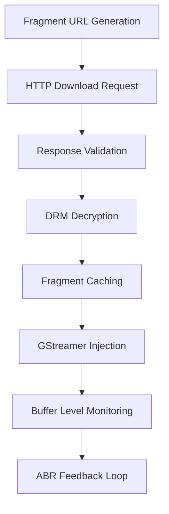

# Fragment Collection System

## Table of Contents
1. [Overview](#overview)
2. [HLS Fragment Collector](#hls-fragment-collector)
3. [DASH Fragment Collector](#dash-fragment-collector)
4. [Progressive Fragment Collector](#progressive-fragment-collector)
5. [Common Base Functionality](#common-base-functionality)
6. [Fragment Lifecycle](#fragment-lifecycle)
7. [Implementation Details](#implementation-details)

## Overview

The Fragment Collection System is responsible for downloading, parsing, and managing media fragments for adaptive streaming. AAMP supports three protocols with dedicated implementations:

1. **HLS (HTTP Live Streaming)**: Apple's adaptive streaming protocol (`fragmentcollector_hls.h/cpp`)
2. **DASH (Dynamic Adaptive Streaming over HTTP)**: MPEG-DASH standard (`fragmentcollector_mpd.h/cpp`)
3. **Progressive MP4**: Simple progressive download (`fragmentcollector_progressive.h/cpp`)

All fragment collectors inherit from `StreamAbstractionAAMP`, providing common functionality for:
- Fragment caching and injection to GStreamer
- Media track management (video/audio/subtitle)
- ABR coordination and profile switching
- Thread management and synchronization
- Discontinuity handling and stream synchronization

## HLS Fragment Collector

### Architecture

**Files**: `fragmentcollector_hls.h/cpp`
**Class**: `StreamAbstractionAAMP_HLS`
**Purpose**: HLS protocol-specific manifest parsing and fragment collection

### Key Data Structures

#### HlsStreamInfo
Stream information from `#EXT-X-STREAM-INF` tags:

```cpp
typedef struct HlsStreamInfo: public StreamInfo
{
    long program_id;                    // Media program ID
    std::string audio;                  // Audio group reference
    std::string uri;                    // Playlist URI
    BitsPerSecond averageBandwidth;     // Average stream bandwidth
    std::string closedCaptions;         // CC group reference
    std::string subtitles;              // Subtitle group reference
    StreamOutputFormat audioFormat;     // Audio codec information
};
```

#### MediaInfo
Media information from `#EXT-X-MEDIA` tags:

```cpp
typedef struct MediaInfo
{
    AampMediaType type;          // Video/Audio/Subtitle
    std::string group_id;        // Group identifier
    std::string name;            // Human-readable name
    std::string language;        // Language code (RFC 5646)
    bool autoselect;             // Auto-selection flag
    bool isDefault;              // Default selection flag
    std::string uri;             // Media playlist URI (if external)
    StreamOutputFormat audioFormat; // Audio codec details
    int channels;                // Audio channel count
    std::string instreamID;      // In-stream ID for CC
    bool forced;                 // Forced subtitle flag
    std::string characteristics; // Accessibility characteristics
    bool isCC;                   // Closed caption flag
};
```

#### IndexNode
Individual fragment information in playlist:

```cpp
struct IndexNode
{
    AampTime completionTimeSecondsFromStart; // Fragment position from stream start
    long long mediaSequenceNumber;           // EXT-X-MEDIA-SEQUENCE value
    lstring pFragmentInfo;                   // Fragment URL string
    int drmMetadataIdx;                      // Index into DRM key array
    lstring initFragmentPtr;                 // fMP4 initialization fragment
};
```

#### KeyTagStruct
DRM key information from `#EXT-X-KEY` tags:

```cpp
struct KeyTagStruct
{
    std::string mShaID;              // SHA hash of key tag for uniqueness
    AampTime mKeyStartDuration;      // Duration where this key becomes active
    std::string mKeyTagStr;          // Complete key tag string (for trickplay)
};
```

#### TrackState (HLS-specific MediaTrack)
HLS implementation of MediaTrack with additional state:

```cpp
class TrackState : public MediaTrack
{
    // Core HLS data structures
    std::vector<IndexNode> indexNodeList;           // Fragment index table
    std::vector<KeyTagStruct> keyTagList;           // DRM key information
    std::vector<DiscontinuityIndexNode> discontinuityIndexList; // Discontinuity markers

    // Playlist parsing state
    int playlistPosition;                           // Current position in playlist
    long long lastMediaSequenceNumber;              // Last processed sequence number
    AampTime playlistDurationSeconds;               // Total playlist duration

    // Fragment collection state
    bool fragmentEncrypted;                         // Current fragment encryption status
    unsigned char drmIV[DRM_IV_LEN];               // DRM initialization vector
    std::string effectiveUrl;                       // Current effective URL (post-redirects)

    // Thread management
    std::thread fragmentCollectorThread;            // Fragment download thread
    bool exitFetchLoop;                             // Thread termination flag

    // Synchronization
    id3_callback_t id3Handler;                      // ID3 metadata callback
    ptsoffset_update_t ptsUpdate;                   // PTS offset update callback
};
```

### HLS Playlist Processing

#### Master Playlist Parsing
Processes the main HLS manifest to extract stream variants:

```cpp
void StreamAbstractionAAMP_HLS::ProcessMasterPlaylist(AampGrowableBuffer& playlistBuffer)
{
    // Parse #EXT-X-VERSION for HLS protocol version
    // Extract #EXT-X-STREAM-INF entries with:
    //   - BANDWIDTH (required)
    //   - RESOLUTION (video dimensions)
    //   - CODECS (codec information)
    //   - AUDIO/VIDEO/SUBTITLES group references
    //   - PROGRAM-ID (legacy identifier)

    // Parse #EXT-X-MEDIA entries for alternate renditions:
    //   - Audio tracks with language/channel info
    //   - Subtitle tracks with accessibility info
    //   - Closed caption tracks with instreamID

    // Build streamInfo[] array for ABR decisions
    // Populate mMediaInfoTrack[] for track selection
}
```

#### Media Playlist Processing
Processes individual track playlists for fragment information:

```cpp
void TrackState::IndexPlaylist(bool IsRefresh, AampTime &culledSec)
{
    // Parse playlist header information:
    //   #EXT-X-VERSION, #EXT-X-TARGETDURATION
    //   #EXT-X-MEDIA-SEQUENCE, #EXT-X-PLAYLIST-TYPE

    // Process fragment entries:
    //   #EXTINF - fragment duration and title
    //   #EXT-X-BYTERANGE - byte range requests
    //   #EXT-X-DISCONTINUITY - stream discontinuity markers
    //   #EXT-X-KEY - DRM key information with METHOD/URI/IV
    //   #EXT-X-MAP - fMP4 initialization segments
    //   #EXT-X-PROGRAM-DATE-TIME - wall clock synchronization

    // Build indexNodeList[] with fragment information
    // Update keyTagList[] with encryption keys
    // Handle discontinuityIndexList[] for stream sync

    // Live playlist management:
    //   - Remove old fragments (culling)
    //   - Detect playlist updates
    //   - Handle sequence number gaps
}
```

### HLS-Specific Features

#### DRM Key Handling
```cpp
typedef enum {
    eDRM_KEY_METHOD_NONE,           // No encryption
    eDRM_KEY_METHOD_AES_128,        // AES-128 encryption
    eDRM_KEY_METHOD_SAMPLE_AES,     // Sample-AES encryption
    eDRM_KEY_METHOD_SAMPLE_AES_CTR, // Sample-AES-CTR encryption
    eDRM_KEY_METHOD_UNKNOWN         // Unsupported method
} DrmKeyMethod;
```

#### Discontinuity Management
```cpp
struct DiscontinuityIndexNode {
    uint64_t discontinuitySequenceIndex; // Period index for cross-track sync
    int fragmentIdx;                      // Fragment index in playlist
    AampTime position;                    // Timeline position
    AampTime fragmentDuration;            // Fragment duration
    AampTime discontinuityPDT;            // Program date-time reference
};
```

#### Live Streaming Optimizations
- **Playlist refresh logic**: Dynamic refresh intervals based on target duration
- **Sequence number tracking**: Gap detection and recovery mechanisms
- **Low-latency support**: Delta playlist updates and partial segment downloads
- **Clock synchronization**: EXT-X-PROGRAM-DATE-TIME processing for live alignment

## DASH Fragment Collector

### Architecture

**Files**: `fragmentcollector_mpd.h/cpp`
**Class**: `StreamAbstractionAAMP_MPD`
**Purpose**: MPEG-DASH MPD parsing and segment collection with libdash integration

### Key Data Structures

#### ProfileInfo
Maps DASH representation to internal profile:

```cpp
struct ProfileInfo {
    int adaptationSetIndex;    // Index in MPD AdaptationSet array
    int representationIndex;   // Index in AdaptationSet Representation array
};
```

#### TimeSyncClient
UTC time synchronization for live DASH streams:

```cpp
struct TimeSyncClient {
    long long lastSync;     // Last sync timestamp (epoch ms)
    double lastOffset;      // Cached time delta (seconds)
    bool hasSynced;         // Successful sync completed flag

    TimeSyncClient();       // Initializes with current time
};
```

#### AampDashWorkerJob
Asynchronous job processing for DASH operations:

```cpp
class AampDashWorkerJob : public aamp::AampTrackWorkerJob {
private:
    std::function<void()> mJobFunction;    // Job execution function
public:
    void DoWork() override { mJobFunction(); }
    // Supports lambda-based job scheduling for:
    //   - Manifest downloads and parsing
    //   - Segment template resolution
    //   - UTC time synchronization
    //   - Period transition handling
};
```

### DASH MPD Processing

#### Manifest Parsing with libdash
Uses industry-standard libdash library for robust MPD parsing:

```cpp
// Core libdash integration
#include "libdash/IMPD.h"
#include "libdash/IDASHManager.h"
#include "libdash/INode.h"

void StreamAbstractionAAMP_MPD::Init(TuneType tuneType) {
    // Initialize libdash manager
    mDashManager = dash::IDASHManager::Create();

    // Parse MPD manifest
    mMpd = mDashManager->Open(mpdBuffer.ptr, mpdBuffer.len);

    // Extract period and adaptation set information
    ProcessMPD(mMpd, tuneType);
}
```

#### Period and AdaptationSet Management
DASH content is organized hierarchically:

```cpp
// MPD Structure Navigation
for (auto period : mMpd->GetPeriods()) {
    for (auto adaptationSet : period->GetAdaptationSets()) {
        for (auto representation : adaptationSet->GetRepresentations()) {
            // Build profile mapping
            ProfileInfo profile = {
                .adaptationSetIndex = adaptSetIdx,
                .representationIndex = reprIdx
            };

            // Extract codec and bandwidth information
            // Populate streamInfo[] for ABR decisions
        }
    }
}
```

#### Segment Template Resolution
DASH uses templates for scalable segment URL generation:

```cpp
// Segment URL Template Processing
std::string GenerateSegmentUrl(int representationIndex, uint64_t segmentNumber) {
    ISegmentTemplate* segmentTemplate = representation->GetSegmentTemplate();

    // Replace template variables:
    // $Number$ - segment sequence number
    // $Bandwidth$ - representation bitrate
    // $Time$ - segment timeline position
    // $RepresentationID$ - representation identifier

    return ResolveTemplate(segmentTemplate->GetMedia(),
                          segmentNumber,
                          representation->GetBandwidth(),
                          representation->GetId());
}
```

### DASH-Specific Features

#### Low Latency DASH (LLD)
Optimizations for ultra-low latency streaming:

```cpp
// LLD Configuration Constants
#define LL_DASH_SERVICE_PROFILE "http://www.dashif.org/guidelines/low-latency-live-v5"
#define MAX_LOW_LATENCY_DASH_CORRECTION_ALLOWED 100
#define MAX_LOW_LATENCY_DASH_ABR_SPEEDSTORE_SIZE 10

// UTC Time Server Synchronization
#define URN_UTC_HTTP_XSDATE "urn:mpeg:dash:utc:http-xsdate:2014"
#define URN_UTC_HTTP_ISO "urn:mpeg:dash:utc:http-iso:2014"
#define URN_UTC_HTTP_NTP "urn:mpeg:dash:utc:http-ntp:2014"
```

#### Dynamic Manifest Updates
Live DASH manifests update dynamically during playback:

```cpp
void ProcessManifestUpdate() {
    // Download updated MPD
    // Compare with cached version
    // Detect new periods/representations
    // Update segment timeline
    // Trigger ABR re-evaluation if needed
}
```

## Progressive Fragment Collector

### Architecture

**Files**: `fragmentcollector_progressive.h/cpp`
**Class**: `StreamAbstractionAAMP_PROGRESSIVE`
**Purpose**: Simple progressive download for MP3/MP4 files without adaptive streaming complexity

The progressive fragment collector provides a simplified streaming implementation for non-adaptive content (single MP4 files, MP3 audio files) that don't require manifest parsing or quality adaptation. Progressive streams are downloaded sequentially from a single URL, enabling straightforward playback without the complexity of adaptive streaming protocols.

Progressive playback is suitable for VOD content with fixed quality, simple audio-only streams, or scenarios where adaptive streaming overhead is unnecessary. The collector leverages HTTP Range requests for efficient seeking and supports direct streaming to GStreamer without extensive fragment caching.

### Implementation Details

#### Simplified Design

Progressive streams don't require complex manifest parsing, multi-profile management, or adaptive quality selection:

```cpp
class StreamAbstractionAAMP_PROGRESSIVE : public StreamAbstractionAAMP {
public:
    double seekPosition;     // Current seek position for range requests

    // Simplified interface - no profile switching needed
    void Start() override;
    void Stop(bool clearChannelData) override;
    AAMPStatusType Init(TuneType tuneType) override;

    // Stream information queries
    void GetStreamFormat(StreamOutputFormat &primaryOutputFormat,
                        StreamOutputFormat &audioOutputFormat,
                        StreamOutputFormat &subtitleOutputFormat) override;
    double GetStreamPosition() override;
    double GetFirstPTS() override;
};
```

**Design Simplifications**:
- **No Manifest Parsing**: Progressive streams don't require manifest download or parsing. The URL directly points to the media file, eliminating manifest processing overhead and complexity.
- **Single Quality Level**: Progressive streams have fixed quality (single bitrate, resolution), eliminating ABR logic, profile management, and quality switching. This simplifies download logic and reduces computational overhead.
- **Direct Streaming**: Fragments can be streamed directly to GStreamer without extensive caching, reducing memory usage. Direct streaming is enabled via `appSrcForProgressivePlayback` configuration, bypassing fragment cache for immediate pipeline injection.
- **Single Track**: Progressive streams typically contain single media track (video-only MP4 or audio-only MP3), eliminating multi-track synchronization complexity. Single track simplifies buffer management and playback coordination.

#### Range Request Support

Progressive streams enable efficient seeking via HTTP Range requests:

```cpp
void ProcessProgressiveDownload(double seekPos) {
    if (seekPos > 0) {
        // Calculate byte offset from time position
        uint64_t byteOffset = CalculateByteOffset(seekPos);

        // Issue HTTP Range request: "Range: bytes=offset-"
        std::string rangeHeader = "bytes=" + std::to_string(byteOffset) + "-";
        curl_easy_setopt(curl, CURLOPT_RANGE, rangeHeader.c_str());
    }

    // Direct download to GStreamer without fragment caching
    DownloadToGStreamer(url);
}
```

**Range Request Implementation**:
- **Byte Offset Calculation**: When seeking to a time position, the system calculates corresponding byte offset in the media file. Byte offset calculation uses content duration and file size to estimate position, or uses file metadata (MP4 moov box) for accurate seeking. Accurate byte offset calculation enables frame-accurate seeking in progressive streams.

- **HTTP Range Header**: The calculated byte offset is formatted as HTTP Range header (`Range: bytes=offset-`), requesting content from the specified offset to end of file. Range requests enable efficient seeking without downloading entire file, reducing bandwidth usage and seek latency.

- **Range Request Execution**: libcurl executes HTTP GET request with Range header, receiving partial content response (HTTP 206 Partial Content). The server responds with content starting at requested byte offset, enabling immediate playback from seek position without downloading preceding content.

- **Seek Optimization**: Range requests enable instant seeking in progressive streams, as content can be requested from any byte position. This contrasts with adaptive streams where seeking requires manifest parsing and fragment URL generation, providing faster seek response for progressive content.

#### Single Track Management

Progressive streams use simplified single-track management:

```cpp
AAMPStatusType StreamAbstractionAAMP_PROGRESSIVE::Init(TuneType tuneType) {
    // Create single MediaTrack for primary content
    mediaTrack = new MediaTrack(eTRACK_VIDEO, aamp, "progressive");

    // Enable direct streaming to GStreamer
    mediaTrack->enabled = true;
    mediaTrack->streamOutputFormat = FORMAT_MP4;  // Default format

    return eAAMPSTATUS_OK;
}
```

**Single Track Benefits**:
- **Simplified Initialization**: Only one `MediaTrack` instance is created for the primary content stream. Track initialization doesn't require parsing multiple tracks from manifest or coordinating track selection, reducing initialization complexity.

- **No Track Synchronization**: Single track eliminates audio/video synchronization requirements, as there's only one stream to manage. This removes PTS synchronization logic, discontinuity handling, and multi-track coordination overhead.

- **Direct Format Detection**: Stream format (MP4, MP3) is detected from URL extension or content type, enabling automatic format selection. Format detection determines appropriate GStreamer pipeline configuration without manifest parsing.

- **Reduced Resource Usage**: Single track reduces memory usage (one fragment cache instead of multiple), CPU usage (one download/injection thread instead of multiple), and complexity (no track coordination logic). This makes progressive playback lightweight and efficient.

## Common Base Functionality

All fragment collectors inherit from `StreamAbstractionAAMP`, providing shared infrastructure that eliminates code duplication and ensures consistent behavior across protocols:

### MediaTrack Management

The base class provides unified track management across all protocols:

```cpp
class StreamAbstractionAAMP {
protected:
    MediaTrack* mediaTrack[AAMP_TRACK_COUNT];  // Video/Audio/Subtitle tracks

    // Track lifecycle management
    void StartAllMediaTracks();
    void StopAllMediaTracks(bool clearData);
    void InitializeAllMediaTracks();
};
```

**Track Management Features**:
- **Multi-Track Support**: The base class maintains an array of `MediaTrack` pointers (`mediaTrack[AAMP_TRACK_COUNT]`) for video, audio, and subtitle tracks. Each track operates independently with its own download thread, injection thread, and fragment cache, enabling parallel track processing.

- **Track Lifecycle**: `InitializeAllMediaTracks()` creates `MediaTrack` instances for enabled tracks based on manifest information. `StartAllMediaTracks()` starts download and injection threads for all tracks, coordinating thread startup to ensure tracks begin simultaneously. `StopAllMediaTracks()` stops all tracks gracefully, ensuring threads exit cleanly and resources are released.

- **Track Coordination**: The base class coordinates track operations (start, stop, seek) to ensure synchronized behavior. Track coordination handles scenarios where tracks start at different times (e.g., audio track available before video track) and ensures proper synchronization during playback.

- **Track State Management**: Each track maintains its own state (enabled/disabled, buffer status, download position), while the base class provides unified state queries and management. Track state is used for buffer health monitoring, ABR decisions, and error recovery.

### Fragment Caching Architecture

The fragment caching system provides efficient fragment storage and retrieval:

```cpp
class MediaTrack {
    CachedFragment* cachedFragment[MAX_CACHED_FRAGMENTS_PER_TRACK];

    // Fragment injection pipeline
    void InjectFragment();          // Push fragment to GStreamer
    void ProcessFragment();         // Process and decrypt fragment
    void CacheFragment();          // Store in fragment cache
};
```

**Caching Architecture**:
- **Circular Buffer Design**: Fragment cache operates as a circular buffer (`cachedFragment[]`) with fixed size (`MAX_CACHED_FRAGMENTS_PER_TRACK`, configurable via `downloadBuffer`). New fragments are added at the tail, while fragments are consumed from the head, maintaining FIFO ordering. When cache is full, new fragments overwrite oldest fragments, ensuring continuous operation without unbounded memory growth.

- **Fragment Storage**: `CachedFragment` structures store fragment data (`AampGrowableBuffer`), metadata (PTS/DTS, duration, sequence number), encryption status, and download metrics. Fragments remain in cache until consumed by injection thread or overwritten by new fragments, enabling potential reuse for seek operations.

- **Cache Management**: `CacheFragment()` stores downloaded fragments in cache, managing cache indices and buffer allocation. Cache management handles cache full conditions (waiting for space or overwriting oldest fragments) and coordinates with download and injection threads via condition variables.

- **Fragment Processing Pipeline**: Fragments flow through processing pipeline:
  - **`ProcessFragment()`**: Format-specific processing (ISO BMFF parsing, TS demuxing) extracts elementary stream data and metadata
  - **Decryption**: If encrypted, fragments are decrypted using DRM keys before processing
  - **`InjectFragment()`**: Processed fragments are injected into GStreamer pipeline via `AAMPGstPlayer::SendTransfer()`

**Thread Coordination**: Cache operations are thread-safe, with download threads populating cache and injection threads consuming from cache. Mutex protection and condition variables ensure safe concurrent access and efficient thread coordination.

### ABR Integration

The base class integrates with ABR system for adaptive quality selection:

```cpp
void StreamAbstractionAAMP::CheckForProfileChange() {
    int newProfile = aamp->GetABRManager()->GetDesiredProfile();

    if (newProfile != currentProfileIndex) {
        // Trigger profile switch
        NotifyBitrateUpdate(newProfile, BitrateChangeReason::eAAMP_BITRATE_CHANGE_BY_ABR);
        SwitchToProfile(newProfile);
    }
}
```

**ABR Integration Process**:
- **Profile Change Detection**: `CheckForProfileChange()` periodically queries `ABRManager` for desired profile based on network bandwidth and buffer levels. The check occurs during fragment download or buffer monitoring, ensuring timely quality adaptation.

- **Profile Switch Execution**: When desired profile differs from current profile, `SwitchToProfile()` updates profile index and triggers fragment URL regeneration for new profile. Profile switch coordinates with download threads to switch fragment sources smoothly, ensuring continuous playback during quality transitions.

- **Event Notification**: `NotifyBitrateUpdate()` generates `AAMP_EVENT_BITRATE_CHANGED` event with new profile information (bitrate, resolution, profile index). Event notification enables applications to update UI, track quality changes, and perform analytics.

- **Smooth Transitions**: Profile switches are coordinated to occur at fragment boundaries, preventing visual artifacts during quality changes. The system may wait for current fragment completion before switching, or switch immediately if buffer conditions require urgent quality reduction.

## Fragment Lifecycle

### Download Pipeline


### State Transitions
1. **Initialization**: Manifest download and parsing
2. **Profile Selection**: Initial quality selection based on bandwidth estimate
3. **Fragment Collection**: Continuous download of media segments
4. **Quality Adaptation**: Dynamic profile switching based on network conditions
5. **Discontinuity Handling**: Stream synchronization across track boundaries
6. **Cleanup**: Resource deallocation and thread termination

## Implementation Summary

| **Protocol** | **Files** | **Key Features** |
|--------------|-----------|------------------|
| **HLS** | `fragmentcollector_hls.*` | M3U8 parsing, AES-128 decryption, sequence number tracking, live playlist updates |
| **DASH/MPD** | `fragmentcollector_mpd.*` | libdash integration, segment templates, CENC encryption, UTC time sync, low-latency optimizations |
| **Progressive** | `fragmentcollector_progressive.*` | Direct file download, HTTP range requests, simplified single-track handling |

Each implementation optimizes for its protocol-specific requirements while sharing common infrastructure through the `StreamAbstractionAAMP` base class for maximum code reuse and maintainability.
    // Handle #EXT-X-KEY for DRM
    // Handle #EXT-X-DISCONTINUITY
}
```

### Fragment URL Generation

HLS fragments are typically relative URLs that need to be resolved:

```cpp
std::string TrackState::GetFragmentUrl(int index)
{
    // Resolve relative URL against playlist base URL
    // Handle #EXT-X-BYTERANGE if present
    return resolvedUrl;
}
```

### Playlist Refresh

For live streams, playlists are periodically refreshed:

```cpp
void TrackState::PlaylistDownloader()
{
    while (!abortPlaylistDownloader)
    {
        // Download playlist
        // Parse updates
        // Add new fragments to indexNodeList
        // Wait for next refresh interval
    }
}
```

### Track Synchronization

HLS requires synchronization between audio and video tracks:

```cpp
void StreamAbstractionAAMP_HLS::SyncTracks()
{
    // Use sequence numbers or PDT (Program Date Time)
    // Align audio and video fragment indices
    // Handle discontinuities
}
```

### DRM Key Management

HLS uses `#EXT-X-KEY` tags for encryption:

```cpp
void TrackState::ProcessKeyTag(const std::string& keyTag)
{
    // Extract key URI, IV, method
    // Store in keyTagList
    // Associate with fragments
}
```

## DASH Fragment Collector

### Architecture

**Files**: `fragmentcollector_mpd.h/cpp`

**Class**: `StreamAbstractionAAMP_MPD`

### Key Components

#### MediaStreamContext
Represents a DASH stream (adaptation set + representation):

```cpp
class MediaStreamContext : public MediaTrack
{
    // DASH-specific context
    IPeriod* period;
    IAdaptationSet* adaptationSet;
    IRepresentation* representation;
    FragmentDescriptor fragmentDescriptor;
    // ... stream-specific data
};
```

#### FragmentDescriptor
DASH fragment information:

```cpp
struct FragmentDescriptor
{
    uint64_t Number;      // Segment number
    uint64_t Time;        // Presentation time
    uint32_t TimeScale;   // Time scale
    BitsPerSecond Bandwidth;
    // ... fragment metadata
};
```

### MPD Parsing

Uses libdash library for MPD parsing:

```cpp
bool StreamAbstractionAAMP_MPD::Init(TuneType tuneType)
{
    // Download MPD
    IMPD* mpd = dashManager->Open(url);

    // Parse periods
    for (auto period : mpd->GetPeriods())
    {
        // Parse adaptation sets
        for (auto adaptSet : period->GetAdaptationSets())
        {
            // Parse representations
            // Build profile list
        }
    }
}
```

### Period Management

DASH content is organized into periods:

```cpp
void StreamAbstractionAAMP_MPD::ProcessPeriod(IPeriod* period)
{
    // Extract period start time
    // Process adaptation sets
    // Handle period transitions
    // Manage period-specific ABR
}
```

### Segment URL Generation

DASH segments can be generated using templates or explicit URLs:

```cpp
std::string MediaStreamContext::GetSegmentUrl(
    uint64_t segmentNumber)
{
    ISegmentURL* segmentUrl = segmentTemplate->GetMediaURL(
        representation, segmentNumber);
    return segmentUrl->GetUrl();
}
```

### Low-Latency DASH

Special handling for low-latency DASH (LL-DASH):

```cpp
void StreamAbstractionAAMP_MPD::ProcessLLDash()
{
    // Use chunked transfer encoding
    // Process partial segments
    // Handle availability time offset
    // Manage chunk timing
}
```