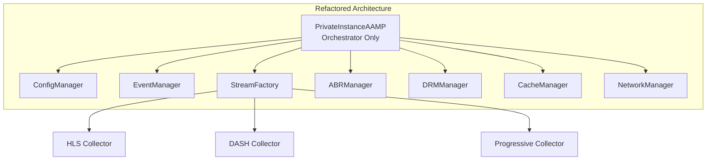

# Current Design Analysis & Problems

Comprehensive analysis of design issues, code problems, and proposed solutions

[← Back to Index](README.md) | [← Previous: APIs and Classes](03_apis_classes.md) | [Next: Refactored Solutions →](05_refactored_solutions.md)

## 1. Executive Summary

This document provides a detailed analysis of the AAMP codebase, identifying design problems, code quality issues, thread safety concerns, memory management problems, and architectural weaknesses. Each issue is documented with:

- Problem description
- Location (file and line numbers where applicable)
- Impact assessment
- Root cause analysis
- Proposed solution

## 2. Code Organization Issues

### 2.1 Monolithic Files

**Problem:** Extremely large source files that violate Single Responsibility Principle

- `priv_aamp.cpp`: 14,057 lines - Contains entire player core logic
- `fragmentcollector_hls.cpp`: 7,551 lines - HLS-specific logic
- `fragmentcollector_mpd.cpp`: 14,171 lines - DASH-specific logic
- `streamabstraction.cpp`: 4,656 lines - Stream abstraction base

**Impact:**

- Difficult to maintain and test
- High compilation time
- Increased risk of merge conflicts
- Poor code discoverability

**Solution:** Break down into smaller, focused classes following SOLID principles

### 2.2 Mixed Abstraction Levels

**Problem:** High-level orchestration mixed with low-level implementation details

**Location:** `priv_aamp.cpp` lines 5749-6100 (Tune method)

The `Tune()` method performs:

- Configuration management
- URL remapping
- State management
- Stream abstraction creation
- GStreamer initialization
- Cache configuration

**Solution:** Extract responsibilities into separate classes (TuneOrchestrator, ConfigManager, StreamFactory)

## 3. Memory Management Issues

### 3.1 Raw Pointer Usage

**Problem:** Use of raw pointers with manual memory management

**Location:** `priv_aamp.cpp` lines 1302-1336

```cpp
// Current problematic code:
mAampCacheHandler = new AampCacheHandler(mPlayerId);
mEventManager = new AampEventManager(mPlayerId);
mCMCDCollector = new AampCMCDCollector();
mDRMLicenseManager = new AampDRMLicenseManager(maxDrmSession, this);
```

**Issues:**

- Manual memory management required
- Risk of memory leaks if exceptions occur
- No automatic cleanup on early returns

**Solution:** Use smart pointers (`std::unique_ptr` or `std::shared_ptr`)

### 3.2 Missing RAII for Resources

**Problem:** C-style resource management for curl handles

**Location:** `priv_aamp.cpp` lines 1321-1336

```cpp
// Current code:
curlhost[i] = new eCurlHostMap();
// ... usage ...
// No explicit cleanup visible in constructor
```

**Solution:** Use RAII wrappers for curl handles

## 4. Thread Safety Issues

### 4.1 Multiple Mutex Types

**Problem:** Mixed use of `std::mutex` and `std::recursive_mutex`

**Location:** `priv_aamp.h` and throughout `priv_aamp.cpp`

- `mLock` - recursive_mutex
- `mStreamLock` - recursive_mutex
- `mPausePositionMonitorMutex` - mutex
- `mDiscoCompleteLock` - mutex
- `mFragmentCachingLock` - recursive_mutex
- `mAdEventQMtx` - mutex

**Issues:**

- Recursive mutexes indicate potential design problems (re-entrancy)
- Risk of deadlocks when acquiring multiple locks
- No clear locking order defined

**Solution:** 

- Eliminate recursive mutexes by restructuring code
- Define and document lock ordering
- Use `std::lock()` for multiple lock acquisition

### 4.2 Lock Granularity Issues

**Problem:** Coarse-grained locking causing performance bottlenecks

**Location:** `priv_aamp.cpp` line 2770

```cpp
// Large critical section:
std::unique_lock<std::recursive_mutex> lock(mLock);
// ... hundreds of lines of code ...
```

**Solution:** Use fine-grained locking with lock-free data structures where possible

### 4.3 Race Conditions

**Problem:** Potential race conditions in state management

**Location:** `priv_aamp.cpp` - State transitions

State changes may occur between check and use:

```cpp
// Potential race condition:
if (state != eSTATE_IDLE) {
    // State may change here
    StopInternal(true, false);
}
```

**Solution:** Use atomic state variables or ensure proper synchronization

## 5. Design Pattern Violations

### 5.1 God Object Anti-Pattern

**Problem:** `PrivateInstanceAAMP` class has too many responsibilities

**Responsibilities include:**

- Player state management
- Configuration management
- Event management
- Stream abstraction management
- DRM management
- ABR management
- Network management
- Cache management

**Solution:** Apply Single Responsibility Principle - extract managers for each concern

### 5.2 Tight Coupling

**Problem:** Direct dependencies between components

**Example:** Fragment collectors directly access `PrivateInstanceAAMP` members

**Solution:** Use dependency injection and interfaces

### 5.3 Missing Interface Abstractions

**Problem:** Concrete classes used instead of interfaces

**Location:** Throughout codebase

**Solution:** Define interfaces for major components (IDownloader, IStreamAbstraction, etc.)

## 6. Code Quality Issues

### 6.1 Magic Numbers

**Problem:** Hardcoded values without named constants

**Examples:**

- Timeout values scattered throughout code
- Buffer sizes as magic numbers
- Retry counts hardcoded

**Solution:** Extract to named constants or configuration

### 6.2 Long Parameter Lists

**Problem:** Methods with excessive parameters

**Location:** `main_aamp.h` line 125-148

```cpp
void Tune(const char *mainManifestUrl,
          bool autoPlay = true,
          const char *contentType = NULL,
          bool bFirstAttempt = true,
          bool bFinalAttempt = false,
          const char *traceUUID = NULL,
          bool audioDecoderStreamSync = true,
          const char *refreshManifestUrl = NULL,
          int mpdStitchingMode = 0,
          std::string sid = std::string{},
          const char *manifestData = NULL);
```

**Solution:** Use parameter objects or builder pattern

### 6.3 Error Handling

**Problem:** Inconsistent error handling

- Mix of return codes, exceptions, and error events
- Silent failures in some cases
- No error recovery strategy

**Solution:** Standardize on exception-based error handling with proper error types

## 7. Performance Issues

### 7.1 Unnecessary Copies

**Problem:** String and container copies where moves would suffice

**Solution:** Use move semantics and const references

### 7.2 Inefficient Data Structures

**Problem:** Use of `std::vector` for frequent insertions/deletions

**Solution:** Use appropriate containers (`std::deque`, `std::list`)

### 7.3 Synchronous Operations

**Problem:** Blocking operations on main thread

**Solution:** Use async operations with futures/promises

## 8. C++11 Standard Compliance Issues

### 8.1 Legacy C-Style Code

**Problem:** Mix of C and C++ styles

- C-style casts instead of `static_cast`, `dynamic_cast`
- C-style arrays instead of `std::array`
- C-style string functions instead of `std::string` methods

**Solution:** Modernize to C++11 idioms

### 8.2 Missing const-correctness

**Problem:** Methods that don't modify state not marked as `const`

**Solution:** Add `const` qualifiers where appropriate

## 9. Specific Code Issues with Line Numbers

### 9.1 priv_aamp.cpp Issues

| Line | Issue | Severity | Fix |
|------|-------|----------|-----|
| 1302 | Raw pointer: `new AampCacheHandler` | High | Use `std::make_unique` |
| 1304 | Raw pointer: `new AampEventManager` | High | Use `std::make_unique` |
| 1321 | Raw pointer array: `curlhost[i] = new eCurlHostMap()` | High | Use `std::vector<std::unique_ptr<eCurlHostMap>>` |
| 2770 | Large critical section with recursive mutex | Medium | Refactor to reduce lock scope |
| 5749-6100 | Tune() method too long (350+ lines) | Medium | Break into smaller methods |

### 9.2 fragmentcollector_hls.cpp Issues

| Line | Issue | Severity | Fix |
|------|-------|----------|-----|
| 1290-1583 | FetchFragmentHelper() method too complex | Medium | Extract helper methods |
| Multiple | Repeated playlist parsing logic | Low | Extract to parser class |

## 10. Solution Architecture

The proposed refactoring follows these principles:

1. **Separation of Concerns:** Each class has a single, well-defined responsibility
2. **Dependency Injection:** Dependencies passed via constructors
3. **Interface-Based Design:** Program to interfaces, not implementations
4. **RAII:** Resource management through constructors/destructors
5. **Modern C++11:** Smart pointers, move semantics, const-correctness
6. **Thread Safety:** Clear locking strategy with minimal lock scope

### Refactored Architecture Diagram



---

[← Back to Index](README.md) | [← Previous: APIs and Classes](03_apis_classes.md) | [Next: Refactored Solutions →](05_refactored_solutions.md)

