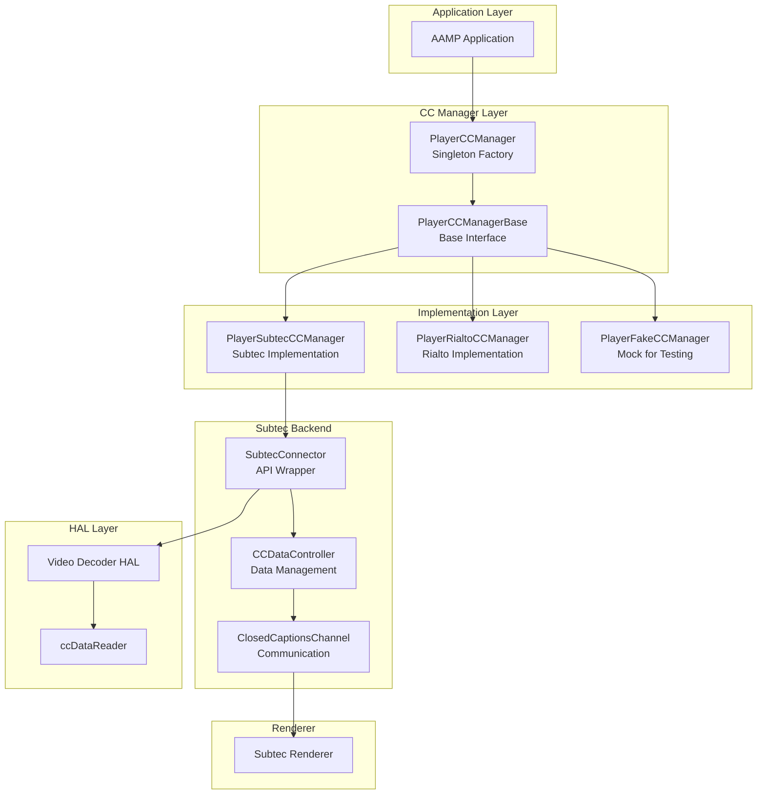
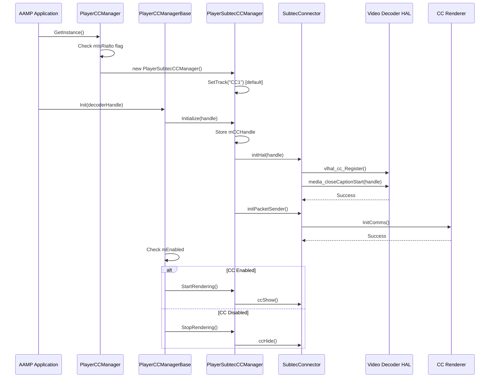
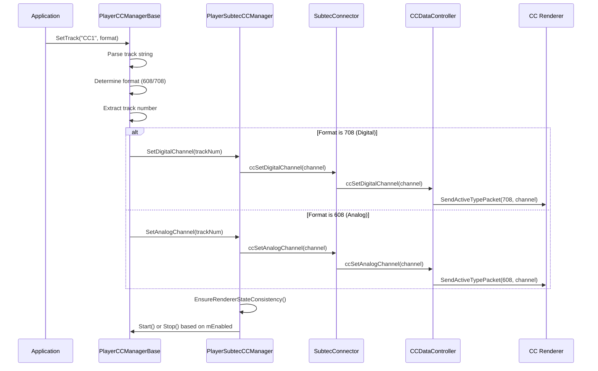
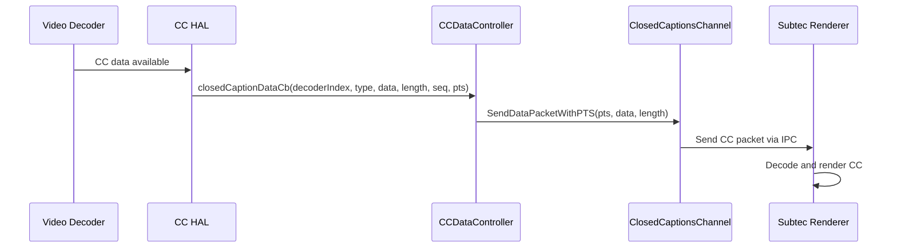
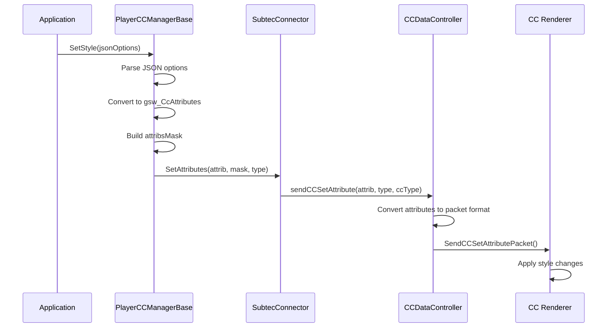
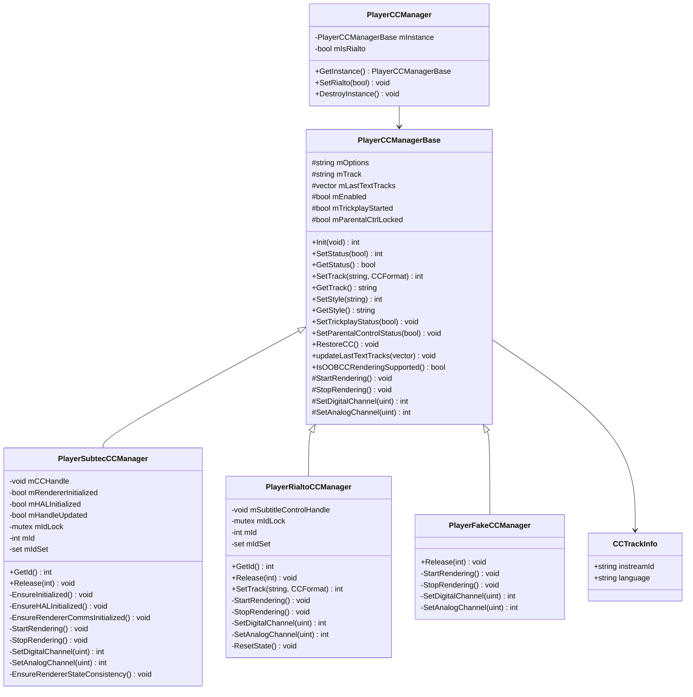
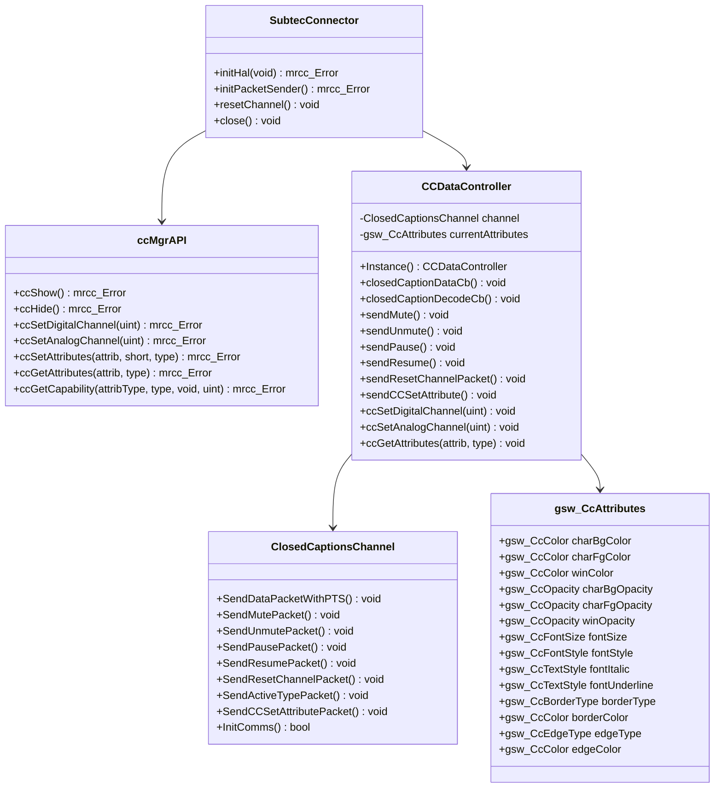

# Closed Captions Architecture & Implementation

Comprehensive documentation of AAMP closed captions subfolder: architecture, codeflow, APIs, classes, and implementation details

[← Back to Index](README.md)

## 1. Executive Summary

The AAMP closed captions subsystem provides a comprehensive solution for rendering closed captions (CC) and subtitles in media playback. This document provides detailed analysis of:

- High-level architecture and component organization
- Code organization and folder structure
- Complete execution flows (initialization → track selection → rendering → style management)
- Important APIs and classes with detailed documentation
- Implementation details for Subtec and Rialto backends
- Integration with AAMP core and GStreamer
- CC format support (CEA-608, CEA-708)
- Style management and rendering control

## 2. High-Level Architecture

### 2.1 Architecture Overview

The closed captions subsystem follows a layered architecture with clear separation of concerns:



### 2.2 Key Design Patterns

- **Singleton Pattern:** PlayerCCManager uses singleton to ensure single instance
- **Factory Pattern:** Creates appropriate implementation (Subtec/Rialto/Fake) based on configuration
- **Strategy Pattern:** Different implementations (Subtec/Rialto) for different platforms
- **Template Method Pattern:** Base class defines algorithm, derived classes implement specifics

## 3. Code Organization

### 3.1 Folder Structure

```
middleware/closedcaptions/
├── PlayerCCManager.h/cpp          # Base class and singleton factory
├── CCTrackInfo.h                   # Track information structure
│
├── subtec/                         # Subtec implementation
│   ├── PlayerSubtecCCManager.h/cpp # Subtec CC manager
│   ├── SubtecConnector.h/cpp       # Subtec API wrapper
│   └── CCDataController.h/cpp      # CC data management
│
└── rialto/                         # Rialto implementation
    └── PlayerRialtoCCManager.h/cpp # Rialto CC manager
```

### 3.2 File Responsibilities

| File | Responsibility |
|------|----------------|
| `PlayerCCManager.h/cpp` | Base class interface, singleton factory, common CC operations (SetStatus, SetTrack, SetStyle) |
| `CCTrackInfo.h` | Structure to hold CC track information (instreamId, language) |
| `PlayerSubtecCCManager.h/cpp` | Subtec-specific implementation of CC operations |
| `SubtecConnector.h/cpp` | Wrapper for Subtec CC API, type definitions, constants |
| `CCDataController.h/cpp` | Manages CC data flow, packet creation, communication with renderer |
| `PlayerRialtoCCManager.h/cpp` | Rialto-specific implementation using GObject properties |

## 4. Code Flow

### 4.1 Initialization Flow



### 4.2 Track Selection Flow



### 4.3 CC Data Flow (Subtec)



### 4.4 Style Setting Flow



## 5. Important APIs and Classes

### 5.1 PlayerCCManager (Singleton Factory)

```cpp
class PlayerCCManager {
public:
    // Get singleton instance (creates Subtec or Rialto based on mIsRialto)
    static PlayerCCManagerBase* GetInstance();
    
    // Set whether to use Rialto implementation
    static void SetRialto(bool bIsRialto);
    
    // Destroy singleton instance
    static void DestroyInstance();
    
private:
    static PlayerCCManagerBase* mInstance;
    static bool mIsRialto;
};
```

### 5.2 PlayerCCManagerBase (Base Interface)

```cpp
class PlayerCCManagerBase {
public:
    // Initialize CC with decoder handle
    int Init(void *handle);
    
    // Enable/disable CC rendering
    int SetStatus(bool enable);
    bool GetStatus();
    
    // Set/Get CC track (e.g., "CC1", "SERVICE1", "1")
    int SetTrack(const std::string &track, CCFormat format = DEFAULT);
    const std::string& GetTrack();
    
    // Set/Get CC rendering styles (JSON format)
    int SetStyle(const std::string &options);
    const std::string& GetStyle();
    
    // Handle trickplay (stops CC during trickplay)
    void SetTrickplayStatus(bool enable);
    
    // Handle parental control (stops CC when locked)
    void SetParentalControlStatus(bool locked);
    
    // Restore CC state after new tune
    void RestoreCC();
    
    // Update text tracks list
    void updateLastTextTracks(const std::vector<CCTrackInfo>& tracks);
    
    // Check OOB CC rendering support
    bool IsOOBCCRenderingSupported();
    
protected:
    // Pure virtual methods implemented by derived classes
    virtual void StartRendering() = 0;
    virtual void StopRendering() = 0;
    virtual int SetDigitalChannel(unsigned int id) = 0;
    virtual int SetAnalogChannel(unsigned int id) = 0;
    
    // State variables
    std::string mOptions;              // CC style options
    std::string mTrack;                 // Current track
    std::vector<CCTrackInfo> mLastTextTracks;
    bool mEnabled;                      // CC enabled flag
    bool mTrickplayStarted;             // Trickplay active
    bool mParentalCtrlLocked;           // Parental control locked
};
```

### 5.3 PlayerSubtecCCManager

```cpp
class PlayerSubtecCCManager : public PlayerCCManagerBase {
public:
    PlayerSubtecCCManager();
    
    // Get unique ID for this instance
    int GetId();
    
    // Release resources (when last user releases, closes HAL)
    void Release(int id);
    
private:
    // Initialize HAL and renderer communication
    void EnsureInitialized();
    void EnsureHALInitialized();
    void EnsureRendererCommsInitialized();
    
    // Start/stop CC rendering
    void StartRendering() override;
    void StopRendering() override;
    
    // Set CC channels
    int SetDigitalChannel(unsigned int id) override;
    int SetAnalogChannel(unsigned int id) override;
    
    // Ensure renderer state matches internal state
    void EnsureRendererStateConsistency();
    
    void* mCCHandle;                    // Decoder handle
    bool mRendererInitialized;          // Renderer comms initialized
    bool mHALInitialized;               // HAL initialized
    bool mHandleUpdated;                // Handle changed flag
    std::mutex mIdLock;                 // ID management mutex
    int mId;                            // Current ID counter
    std::set<int> mIdSet;               // Active ID set
};
```

### 5.4 PlayerRialtoCCManager

```cpp
class PlayerRialtoCCManager : public PlayerCCManagerBase {
public:
    PlayerRialtoCCManager();
    
    // Get unique ID for this instance
    int GetId();
    
    // Release resources
    void Release(int id);
    
    // Override SetTrack to use GObject properties
    int SetTrack(const std::string &track, CCFormat format) override;
    
private:
    // Start/stop CC rendering via GObject properties
    void StartRendering() override;
    void StopRendering() override;
    
    // Set CC channels (stubs, not used in Rialto)
    int SetDigitalChannel(unsigned int id) override;
    int SetAnalogChannel(unsigned int id) override;
    
    void ResetState() override;
    
    void* mSubtitleControlHandle;        // GObject handle
    std::mutex mIdLock;
    int mId;
    std::set<int> mIdSet;
};
```

### 5.5 SubtecConnector (API Wrapper)

```cpp
namespace subtecConnector {
    // Initialize HAL with decoder handle
    mrcc_Error initHal(void *handle);
    
    // Initialize packet sender (renderer communication)
    mrcc_Error initPacketSender();
    
    // Reset CC channel
    void resetChannel();
    
    // Close CC resources
    void close();
    
    namespace ccMgrAPI {
        // Show/hide CC
        mrcc_Error ccShow();
        mrcc_Error ccHide();
        
        // Set CC channel
        mrcc_Error ccSetDigitalChannel(unsigned int channel);
        mrcc_Error ccSetAnalogChannel(unsigned int channel);
        
        // Set/get CC attributes (styles)
        mrcc_Error ccSetAttributes(gsw_CcAttributes *attrib, short type, gsw_CcType ccType);
        mrcc_Error ccGetAttributes(gsw_CcAttributes *attrib, gsw_CcType ccType);
        
        // Get CC capabilities
        mrcc_Error ccGetCapability(gsw_CcAttribType attribType, gsw_CcType ccType, 
                                   void **value, unsigned int *size);
    }
}
```

### 5.6 CCDataController

```cpp
class CCDataController {
public:
    static CCDataController* Instance();
    
    // Callbacks from HAL
    void closedCaptionDataCb(int decoderIndex, VL_CC_DATA_TYPE eType, 
                             unsigned char* ccData, unsigned dataLength, 
                             int sequenceNumber, long long localPts);
    void closedCaptionDecodeCb(int decoderIndex, int event);
    
    // Control commands
    void sendMute();
    void sendUnmute();
    void sendPause();
    void sendResume();
    void sendResetChannelPacket();
    void sendCCSetAttribute(gsw_CcAttributes *attrib, short type, gsw_CcType ccType);
    
    // Channel selection
    void ccSetDigitalChannel(unsigned int channel);
    void ccSetAnalogChannel(unsigned int channel);
    
    // Get current attributes
    void ccGetAttributes(gsw_CcAttributes *attrib, gsw_CcType ccType);
    
private:
    CCDataController();
    ClosedCaptionsChannel channel;      // Communication channel
    gsw_CcAttributes currentAttributes;  // Current style attributes
};
```

### 5.7 CCTrackInfo

```cpp
struct CCTrackInfo {
    std::string instreamId;  // Track identifier (e.g., "CC1", "SERVICE1")
    std::string language;    // Track language code
    
    CCTrackInfo() : instreamId(""), language("") {}
};
```

## 6. Implementation Details

### 6.1 Track String Parsing

The `SetTrack()` method in `PlayerCCManagerBase` parses various track string formats:

- **"CC1" - "CC4":** Analog channels 1-4 (CEA-608)
- **"TXT1" - "TXT4" or "TEXT1" - "TEXT4":** Text channels 5-8 (CEA-608)
- **"SERVICE1" - "SERVICE63":** Digital channels 1-63 (CEA-708)
- **Numeric "1" - "63":** Generic track number (format determined by format parameter)

```cpp
// Example track parsing logic
if (track starts with "CC") {
    format = CEA-608;
    trackNum = extract number (1-4);
    SetAnalogChannel(GSW_CC_ANALOG_SERVICE_CC1 + (trackNum - 1));
}
else if (track starts with "SERVICE") {
    format = CEA-708;
    trackNum = extract number (1-63);
    SetDigitalChannel(trackNum);
}
else if (numeric) {
    // Use format parameter to determine 608 vs 708
    if (format == 608) SetAnalogChannel(...);
    else if (format == 708) SetDigitalChannel(...);
}
```

### 6.2 Style Management

CC styles are managed through JSON input and converted to `gsw_CcAttributes` structure:

```json
// Example JSON style options
{
    "fontStyle": "monospaced_serif",
    "textEdgeColor": "WHITE",
    "textEdgeStyle": "raised",
    "textForegroundColor": "YELLOW",
    "textForegroundOpacity": "solid",
    "textBackgroundColor": "BLACK",
    "textBackgroundOpacity": "translucent",
    "penItalicized": "false",
    "penSize": "large",
    "penUnderline": "true",
    "windowBorderEdgeColor": "CYAN",
    "windowBorderEdgeStyle": "uniform",
    "windowFillColor": "BLUE",
    "windowFillOpacity": "transparent"
}
```

The style parser converts these JSON values to appropriate enum values and sets them in the attributes structure with a bitmask indicating which attributes were changed.

### 6.3 Subtec Implementation Details

#### 6.3.1 HAL Initialization

```cpp
// Subtec HAL initialization flow
1. Register CC data callback: vlhal_cc_Register(0, CCDataController::Instance(), 
                                                 closedCaptionDataCb, closedCaptionDecodeCb)
2. Start CC decoder: media_closeCaptionStart(decoderHandle)
3. Initialize packet sender: ClosedCaptionsChannel::InitComms()
```

#### 6.3.2 Data Flow

CC data flows from video decoder → HAL → CCDataController → ClosedCaptionsChannel → Subtec Renderer:

1. Video decoder extracts CC data from video stream
2. HAL calls `closedCaptionDataCb()` with CC data and PTS
3. CCDataController creates packet and sends via `SendDataPacketWithPTS()`
4. Renderer receives packet, decodes, and renders CC

#### 6.3.3 ID Management

Subtec implementation uses ID-based reference counting:

- Each client calls `GetId()` to get unique ID
- ID is stored in `mIdSet`
- When `Release(id)` is called, ID is removed from set
- When set becomes empty, HAL is closed and resources released

### 6.4 Rialto Implementation Details

#### 6.4.1 GObject Integration

Rialto implementation uses GObject properties to control CC:

```cpp
// Set track
g_object_set(mSubtitleControlHandle, "text-track-identifier", track.c_str(), NULL);

// Show CC
g_object_set(mSubtitleControlHandle, "mute", FALSE, NULL);

// Hide CC
g_object_set(mSubtitleControlHandle, "mute", TRUE, NULL);
```

#### 6.4.2 Handle Management

Rialto stores the subtitle control handle and reconfigures it when handle changes or track is set.

## 7. Integration with AAMP

### 7.1 Initialization in AAMP

AAMP initializes CC manager during player setup:

1. Determine platform (Rialto or Subtec) and call `PlayerCCManager::SetRialto()`
2. Get CC manager instance: `PlayerCCManager::GetInstance()`
3. When video decoder is ready, call `Init(decoderHandle)`
4. Application can then set track, enable/disable, set styles

### 7.2 Track Management

AAMP maintains a list of available text tracks and updates CC manager:

```cpp
// When text tracks are discovered
std::vector<CCTrackInfo> tracks;
for (auto track : availableTracks) {
    CCTrackInfo info;
    info.instreamId = track.id;  // e.g., "CC1", "SERVICE1"
    info.language = track.language;
    tracks.push_back(info);
}
ccManager->updateLastTextTracks(tracks);

// When tune completes, restore CC state
ccManager->RestoreCC();  // Selects matching track or defaults to first track
```

### 7.3 Trickplay and Parental Control Integration

AAMP calls CC manager when trickplay or parental control state changes:

```cpp
// When trickplay starts
ccManager->SetTrickplayStatus(true);  // Stops CC rendering

// When trickplay ends
ccManager->SetTrickplayStatus(false);  // Resumes if enabled

// When parental control locks
ccManager->SetParentalControlStatus(true);  // Stops CC rendering

// When parental control unlocks
ccManager->SetParentalControlStatus(false);  // Resumes if enabled
```

## 8. Class Diagrams

### 8.1 Core CC Manager Classes



### 8.2 Subtec Backend Classes



## 9. CC Format Support

### 9.1 CEA-608 (Analog)

CEA-608 supports up to 4 caption channels (CC1-CC4) and 4 text channels (TXT1-TXT4 or TEXT1-TEXT4):

- **CC1-CC4:** Primary caption services
- **TXT1-TXT4:** Text services (typically used for program guides)

### 9.2 CEA-708 (Digital)

CEA-708 supports up to 63 service channels (SERVICE1-SERVICE63):

- More flexible than CEA-608
- Supports multiple languages per service
- Enhanced styling capabilities

## 10. Thread Safety

### 10.1 ID Management

Both Subtec and Rialto implementations use mutex-protected ID management:

```cpp
// Thread-safe ID allocation
int GetId() {
    std::lock_guard<std::mutex> lock(mIdLock);
    mId++;
    mIdSet.insert(mId);
    return mId;
}

// Thread-safe ID release
void Release(int id) {
    std::lock_guard<std::mutex> lock(mIdLock);
    if (mIdSet.erase(id) > 0) {
        if (mIdSet.empty()) {
            // Last user, release resources
        }
    }
}
```

### 10.2 State Management

State variables are protected by the base class design, with derived classes ensuring proper initialization before use.

## 11. Error Handling

### 11.1 Return Codes

The CC subsystem uses consistent return codes:

- **0:** Success
- **-1:** Failure
- **CC_VL_OS_API_RESULT_*:** Subtec-specific error codes

### 11.2 Error Scenarios

- **NULL handle:** Init() returns -1 if handle is NULL
- **HAL initialization failure:** Logged, returns failure
- **Invalid track:** Logged, operation ignored
- **JSON parse error:** Caught, logged, returns -1

## 12. Code Analysis and Improvements

### 12.1 Strengths

- Clean separation of concerns with base/derived class design
- Support for multiple backends (Subtec, Rialto)
- Comprehensive style management
- Thread-safe ID management
- Proper resource cleanup

### 12.2 Potential Improvements

- **Error Handling:** Could use exceptions or more detailed error codes
- **State Machine:** Could benefit from explicit state machine for CC lifecycle
- **Async Operations:** Some operations could be async to avoid blocking
- **Configuration:** Style defaults could be configurable
- **Testing:** More unit tests for edge cases in track parsing

---

[← Back to Index](README.md)

