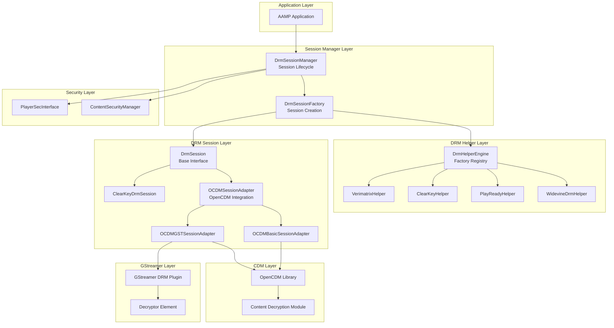
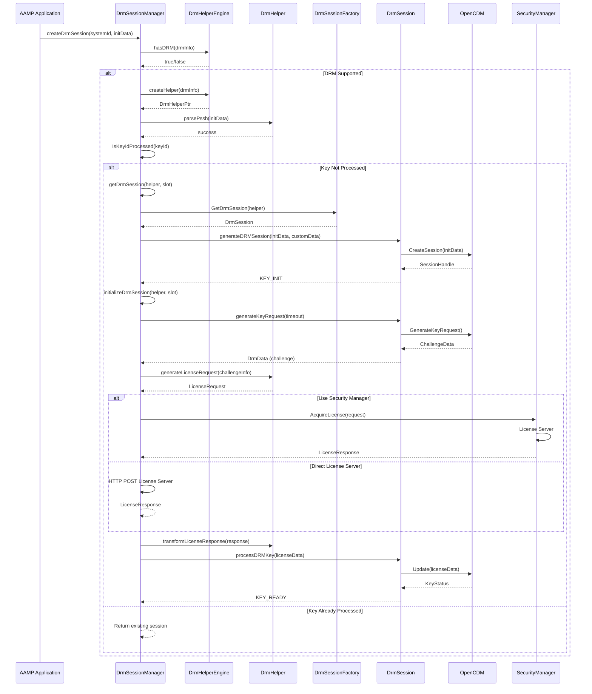
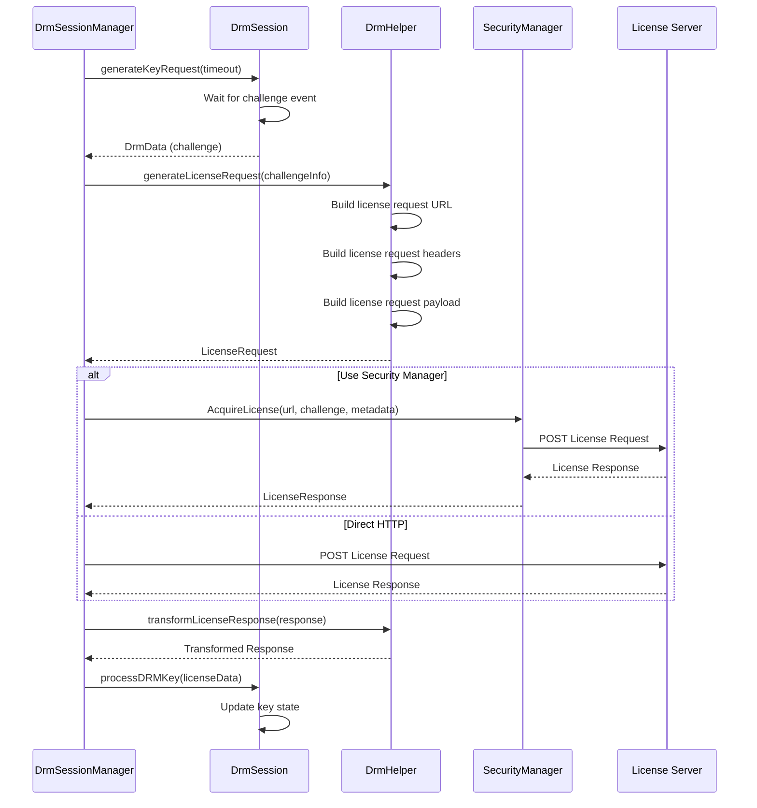
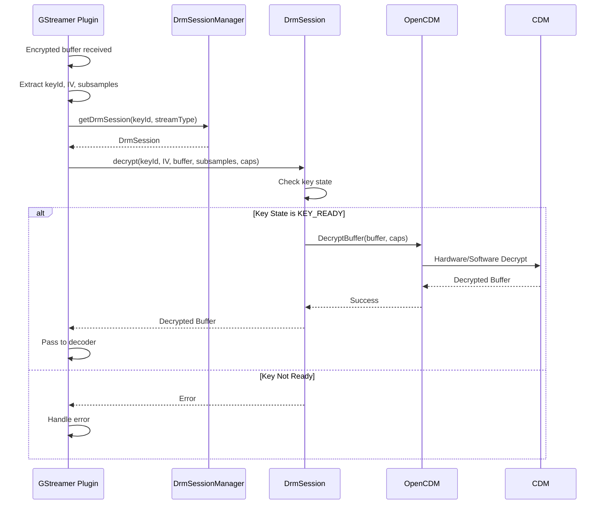
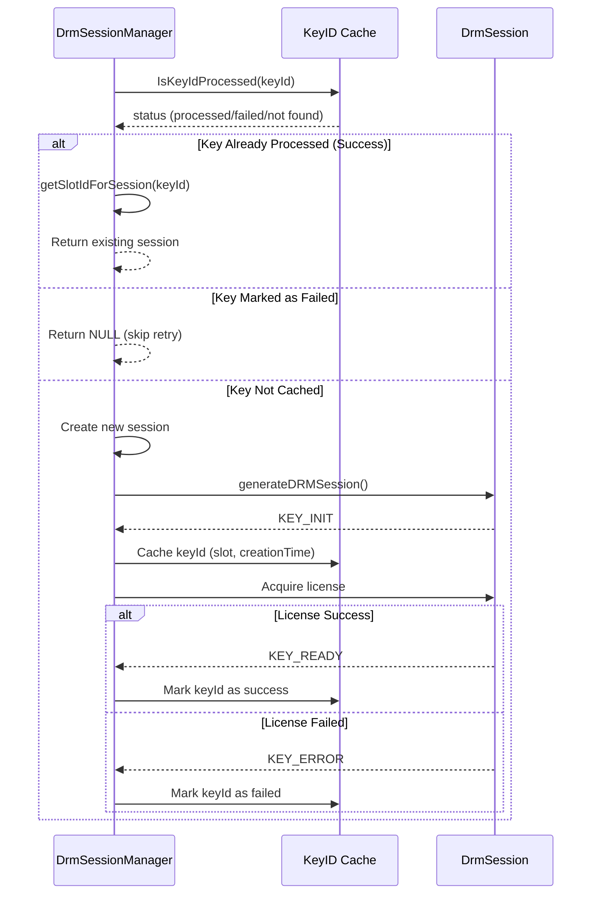
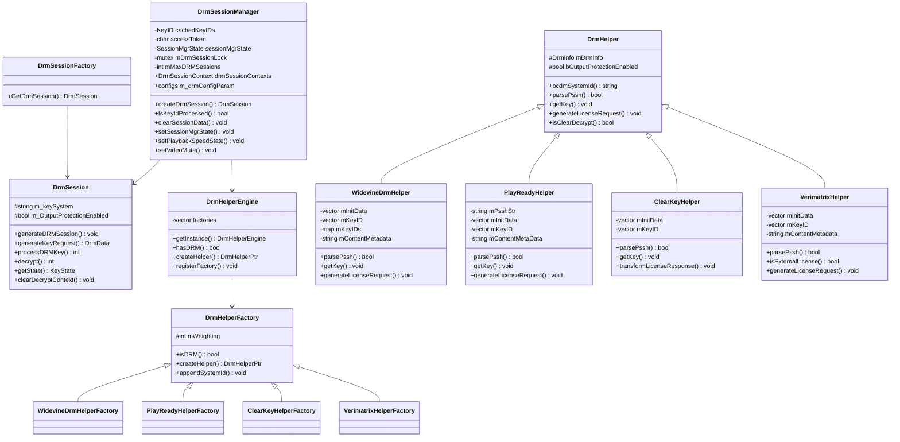
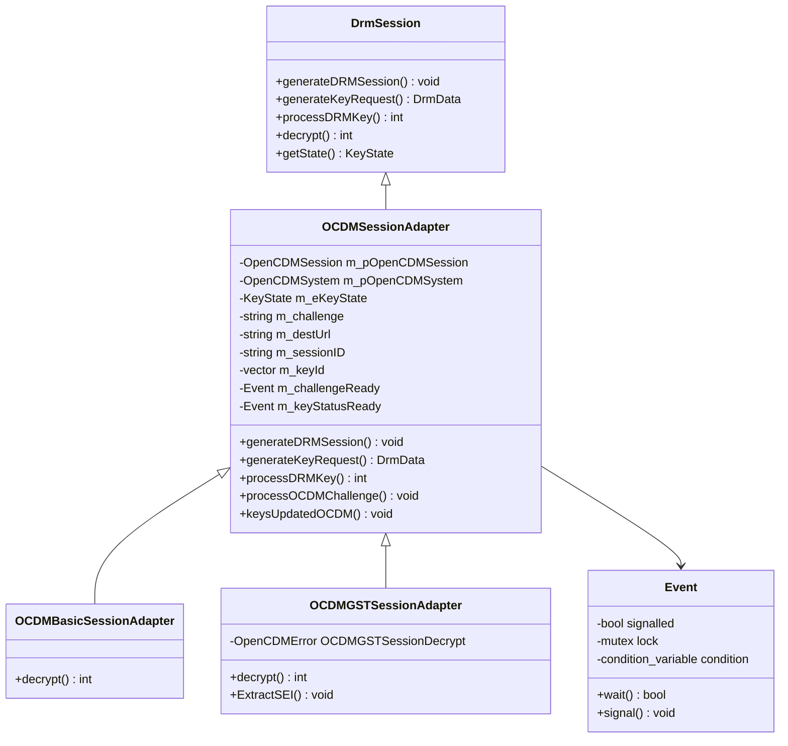

# DRM Architecture & Implementation

Comprehensive documentation of AAMP DRM subfolder: architecture, codeflow, APIs, classes, and implementation details

[← Back to Index](README.md)

## 1. Executive Summary

The AAMP DRM subsystem provides a comprehensive solution for managing Digital Rights Management (DRM) sessions, license acquisition, and content decryption. This document provides detailed analysis of:

- High-level architecture and component organization
- Code organization and folder structure
- Complete execution flows (initialization → session creation → license acquisition → decryption)
- Important APIs and classes with detailed documentation
- Implementation details for multiple DRM systems (Widevine, PlayReady, ClearKey, Verimatrix)
- Integration with AAMP core, GStreamer, and OpenCDM
- Session management and key caching
- Content Security Manager integration

## 2. High-Level Architecture

### 2.1 Architecture Overview

The DRM subsystem follows a layered architecture with clear separation of concerns:



### 2.2 Key Design Patterns

- **Factory Pattern:** DrmHelperFactory and DrmSessionFactory create appropriate DRM helpers and sessions
- **Strategy Pattern:** Different DRM implementations (Widevine, PlayReady, etc.) as strategies
- **Adapter Pattern:** OCDMSessionAdapter adapts OpenCDM interface to DrmSession interface
- **Singleton Pattern:** DrmHelperEngine uses singleton to manage factory registry
- **Template Method Pattern:** Base DrmSession defines algorithm, derived classes implement specifics

## 3. Code Organization

### 3.1 Folder Structure

```
middleware/drm/
├── DrmSessionManager.h/cpp          # Main session manager
├── DrmSession.h/cpp                 # Base DRM session interface
├── DrmSessionFactory.h/cpp          # Factory for creating sessions
├── DrmInfo.h                        # DRM information structure
├── DrmData.h                        # License data container
├── DrmUtils.h/cpp                   # DRM utility functions
├── DrmCallbacks.h                   # Callback interface
├── DrmConstants.h                   # DRM constants
├── DrmSystems.h                     # DRM system types
├── DrmMediaFormat.h                 # Media format definitions
├── DrmMemorySystem.h                # Memory system interface
├── DrmJsonObject.h/cpp              # JSON utilities
│
├── helper/                          # DRM-specific helpers
│   ├── DrmHelper.h/cpp              # Base helper class
│   ├── DrmHelperFactory.cpp        # Helper factory engine
│   ├── WidevineDrmHelper.h/cpp      # Widevine implementation
│   ├── PlayReadyHelper.h/cpp       # PlayReady implementation
│   ├── ClearKeyHelper.h/cpp        # ClearKey implementation
│   ├── VerimatrixHelper.h/cpp       # Verimatrix implementation
│   └── VanillaDrmHelper.h           # Vanilla AES helper
│
├── ocdm/                            # OpenCDM adapters
│   ├── opencdmsessionadapter.h/cpp  # Base OCDM adapter
│   ├── OcdmBasicSessionAdapter.h/cpp # Basic session adapter
│   └── OcdmGstSessionAdapter.h/cpp  # GStreamer session adapter
│
├── aes/                             # AES encryption utilities
│   ├── Aes.h/cpp                    # AES implementation
│
├── HlsDrmSessionManager.h/cpp      # HLS-specific DRM manager
├── HlsOcdmBridge.h/cpp              # HLS-OCDM bridge
├── HlsOcdmBridgeInterface.h/cpp     # HLS-OCDM bridge interface
├── HlsDrmBase.h                     # HLS DRM base class
├── PlayerHlsDrmSessionInterface.h/cpp # HLS DRM session interface
├── PlayerHlsDrmSessionInterfaceBase.h # HLS DRM base interface
└── processProtectionHls.cpp         # HLS protection processing
```

### 3.2 File Responsibilities

| File | Responsibility |
|------|----------------|
| `DrmSessionManager.h/cpp` | Manages DRM session lifecycle, key caching, license acquisition, session state management |
| `DrmSession.h/cpp` | Base class interface for DRM sessions (generateDRMSession, generateKeyRequest, processDRMKey, decrypt) |
| `DrmSessionFactory.h/cpp` | Factory to create appropriate DrmSession based on DRM system (OCDM, ClearKey) |
| `DrmHelper.h/cpp` | Base class for DRM-specific operations (PSSH parsing, key extraction, license request generation) |
| `DrmHelperFactory.cpp` | Manages factory registry, creates helpers based on DrmInfo |
| `WidevineDrmHelper.h/cpp` | Widevine-specific PSSH parsing, key extraction, license request generation |
| `PlayReadyHelper.h/cpp` | PlayReady-specific PSSH parsing, metadata extraction, license request generation |
| `ClearKeyHelper.h/cpp` | ClearKey-specific implementation for testing and development |
| `VerimatrixHelper.h/cpp` | Verimatrix-specific implementation with external license handling |
| `opencdmsessionadapter.h/cpp` | Adapter between DrmSession interface and OpenCDM library |
| `OcdmBasicSessionAdapter.h/cpp` | Basic OpenCDM session adapter for non-GStreamer decryption |
| `OcdmGstSessionAdapter.h/cpp` | GStreamer-specific OpenCDM session adapter |
| `HlsDrmSessionManager.h/cpp` | HLS-specific DRM session manager interface |

## 4. Code Flow

### 4.1 DRM Session Creation Flow



### 4.2 License Acquisition Flow



### 4.3 Decryption Flow (GStreamer)



### 4.4 Key Caching and Session Reuse



## 5. Important APIs and Classes

### 5.1 DrmSessionManager

```cpp
class DrmSessionManager {
public:
    // Constructor
    DrmSessionManager(int maxDrmSessions, void *player, 
                      std::function<void(uint32_t, uint32_t, const std::string&)> 
                      watermarkSessionUpdateCallback);
    
    // Create DRM session from system ID and init data
    DrmSession* createDrmSession(int &responseCode, int &err, 
                                  const char* systemId, MediaFormat mediaFormat,
                                  const unsigned char * initDataPtr, 
                                  uint16_t dataLength, int streamType,
                                  DrmCallbacks* player, void *ptr, 
                                  const unsigned char *contentMetadata = nullptr,
                                  bool isPrimarySession = false);
    
    // Create DRM session from DrmHelper
    DrmSession* createDrmSession(int& responseCode, int &err, 
                                 DrmHelperPtr drmHelper, DrmCallbacks* Instance, 
                                 int streamType, void *metaDataPtr);
    
    // Check if key ID has been processed
    bool IsKeyIdProcessed(std::vector<uint8_t> keyIdArray, bool &status);
    
    // Get slot ID for a session
    int getSlotIdForSession(DrmSession* session);
    
    // Clear session data
    void clearSessionData();
    void clearDrmSession(bool forceClearSession = false);
    void clearFailedKeyIds();
    
    // Access token management
    const char* getAccessToken(int &tokenLength, int &error_code, 
                               bool bSslPeerVerify);
    void clearAccessToken();
    
    // Session state management
    void setSessionMgrState(SessionMgrState state);
    SessionMgrState getSessionMgrState();
    
    // Video window and playback state
    void setVideoWindowSize(int width, int height);
    void setPlaybackSpeedState(bool live, double currentLatency, 
                               bool livepoint, double liveOffsetMs,
                               int speed, double positionMs, 
                               bool firstFrameSeen = false);
    void setVideoMute(bool live, double currentLatency, bool livepoint,
                      double liveOffsetMs, bool videoMuteStatus, 
                      double positionMs);
    void hideWatermarkOnDetach();
    
    // Configuration
    void UpdateDRMConfig(bool useSecManager, bool enablePROutputProtection,
                        bool propagateURIParam, bool isFakeTune,
                        bool wideVineKIDWorkaround);
    
    // Callback registration
    void RegisterLicenseDataCb(const LicenseCallback Callback);
    void RegisterProfilingUpdateCb(const ProfileUpdateCallback callback);
    void RegisterHandleContentProtectionCb(const ContentUpdateCallback callback);
    
    // Public members
    DrmSessionContext *drmSessionContexts;
    configs *m_drmConfigParam;
    PlayerSecInterface *playerSecInstance;
    ContentSecurityManagerSession mContentSecurityManagerSession;
    std::atomic<bool> mFirstFrameSeen;
    std::atomic<bool> mIsVideoOnMute;
    std::atomic<int> mCurrentSpeed;
    
private:
    KeyID *cachedKeyIDs;
    char* accessToken;
    int accessTokenLen;
    SessionMgrState sessionMgrState;
    std::mutex accessTokenMutex;
    std::mutex cachedKeyMutex;
    std::mutex mDrmSessionLock;
    bool mEnableAccessAttributes;
    int mMaxDRMSessions;
    std::function<void(uint32_t, uint32_t, const std::string&)> 
        mPlayerSendWatermarkSessionUpdateEventCB;
    
    KeyState getDrmSession(int &err, DrmHelperPtr drmHelper, 
                           int &selectedSlot, DrmCallbacks* Instance, 
                           bool isPrimarySession = false);
    KeyState initializeDrmSession(DrmHelperPtr drmHelper, int sessionSlot, 
                                   int &err);
};
```

### 5.2 DrmSession (Base Interface)

```cpp
class DrmSession {
public:
    // Constructor
    DrmSession(const string &keySystem);
    
    // Generate DRM session with init data
    virtual void generateDRMSession(const uint8_t *f_pbInitData,
                                   uint32_t f_cbInitData, 
                                   std::string &customData) = 0;
    
    // Generate key request (license challenge)
    virtual DrmData* generateKeyRequest(string& destinationURL, 
                                       uint32_t timeout) = 0;
    
    // Process license response
    virtual int processDRMKey(DrmData* key, uint32_t timeout) = 0;
    
    // Decrypt GStreamer buffer
    virtual int decrypt(GstBuffer* keyIDBuffer, GstBuffer* ivBuffer, 
                       GstBuffer* buffer, unsigned subSampleCount, 
                       GstBuffer* subSamplesBuffer, GstCaps* caps = NULL);
    
    // Decrypt standard buffer
    virtual int decrypt(const uint8_t *f_pbIV, uint32_t f_cbIV, 
                       const uint8_t *payloadData, uint32_t payloadDataSize, 
                       uint8_t **ppOpaqueData);
    
    // Get current session state
    virtual KeyState getState() = 0;
    
    // Wait for specific state
    virtual bool waitForState(KeyState state, const uint32_t timeout);
    
    // Clear decrypt context
    virtual void clearDecryptContext() = 0;
    
    // Get key system
    string getKeySystem();
    
    // Output protection
    void setOutputProtection(bool bValue);
    
    // Security manager session
    void setSecManagerSession(ContentSecurityManagerSession session);
    ContentSecurityManagerSession getSecManagerSession() const;
    
protected:
    std::string m_keySystem;
    bool m_OutputProtectionEnabled;
    ContentSecurityManagerSession mContentSecurityManagerSession;
};
```

### 5.3 DrmHelper (Base Interface)

```cpp
class DrmHelper {
public:
    // Constructor
    DrmHelper(const struct DrmInfo drmInfo);
    
    // Get OCDM system ID
    virtual const std::string& ocdmSystemId() const = 0;
    
    // Create init data from PSSH
    virtual void createInitData(std::vector<uint8_t>& initData) const = 0;
    
    // Parse PSSH data
    virtual bool parsePssh(const uint8_t* initData, uint32_t initDataLen) = 0;
    
    // Check if clear decrypt (data leaves TEE)
    virtual bool isClearDecrypt() const = 0;
    
    // Check HDCP 2.2 requirement
    virtual bool isHdcp22Required() const;
    
    // Get DRM metadata
    virtual const std::string& getDrmMetaData() const;
    virtual void setDrmMetaData(const std::string& metaData);
    
    // Get key ID(s)
    virtual void getKey(std::vector<uint8_t>& keyID) const = 0;
    virtual void getKeys(std::map<int, std::vector<uint8_t>>& keyIDs) const;
    
    // Get UUID
    virtual const std::string& getUuid() const;
    
    // License request generation
    virtual void generateLicenseRequest(const ChallengeInfo& challengeInfo, 
                                       LicenseRequest& licenseRequest) const = 0;
    
    // Transform license response
    virtual void transformLicenseResponse(std::shared_ptr<DrmData> 
                                         licenseResponse) const;
    
    // Check if external license (DRM fetches license itself)
    virtual bool isExternalLicense() const;
    
    // Compare helpers (for session reuse)
    virtual bool compare(DrmHelperPtr other);
    
    // Get protection scheme
    uint32_t getProtectionScheme();
    
    // Timeouts
    virtual uint32_t licenseGenerateTimeout() const;
    virtual uint32_t keyProcessTimeout() const;
    
protected:
    uint32_t protectionScheme;
    const DrmInfo mDrmInfo;
    bool bOutputProtectionEnabled;
};
```

### 5.4 DrmHelperEngine

```cpp
class DrmHelperEngine {
public:
    // Get singleton instance
    static DrmHelperEngine& getInstance();
    
    // Check if DRM is supported
    bool hasDRM(const struct DrmInfo& drmInfo) const;
    
    // Create helper for DRM info
    DrmHelperPtr createHelper(const struct DrmInfo& drmInfo) const;
    
    // Get supported system IDs
    void getSystemIds(std::vector<std::string>& ids) const;
    
    // Register factory
    void registerFactory(DrmHelperFactory* factory);
    
private:
    std::vector<DrmHelperFactory* > factories;
};
```

### 5.5 OCDMSessionAdapter

```cpp
class OCDMSessionAdapter : public DrmSession {
public:
    // Constructor
    OCDMSessionAdapter(DrmHelperPtr drmHelper, DrmCallbacks *callbacks);
    
    // Generate DRM session
    void generateDRMSession(const uint8_t *f_pbInitData,
                           uint32_t f_cbInitData, 
                           std::string &customData) override;
    
    // Generate key request
    DrmData* generateKeyRequest(string& destinationURL, 
                               uint32_t timeout) override;
    
    // Process DRM key
    int processDRMKey(DrmData* key, uint32_t timeout) override;
    
    // Get state
    KeyState getState() override;
    
    // Clear decrypt context
    void clearDecryptContext() override;
    
    // Wait for state
    bool waitForState(KeyState state, const uint32_t timeout) override;
    
    // OCDM callbacks
    void processOCDMChallenge(const char destUrl[], 
                              const uint8_t challenge[], 
                              const uint16_t challengeSize);
    void keysUpdatedOCDM();
    void keyUpdateOCDM(const uint8_t key[], const uint8_t keySize);
    
protected:
    OpenCDMSession* m_pOpenCDMSession;
    struct OpenCDMSystem* m_pOpenCDMSystem;
    OpenCDMSessionCallbacks m_OCDMSessionCallbacks;
    KeyState m_eKeyState;
    std::string m_challenge;
    std::string m_destUrl;
    std::string m_sessionID;
    std::vector<uint8_t> m_keyId;
    DrmHelperPtr m_drmHelper;
    DrmCallbacks *m_drmCallbacks;
    Event m_challengeReady;
    Event m_keyStatusReady;
    Event m_keyStatusWait;
};
```

### 5.6 DrmInfo Structure

```cpp
struct DrmInfo {
    DrmMethod method;              // Encryption method (eMETHOD_AES_128)
    MediaFormat mediaFormat;        // Format (eMEDIAFORMAT_HLS, DASH)
    bool useFirst16BytesAsIV;      // Use first 16 bytes as IV
    bool bPropagateUriParams;      // Propagate manifest URI params
    bool bUseMediaSequenceIV;       // Create IV using media sequence
    bool bDecryptClearSamplesRequired; // Decrypt clear samples
    unsigned char iv[DRM_IV_LEN];  // Initialization vector [16]
    std::string masterManifestURL; // Master manifest URL
    std::string manifestURL;       // Playlist URL
    std::string keyURI;            // Key URI
    std::string keyFormat;          // Key format
    std::string systemUUID;        // DRM system UUID
    std::string initData;          // Base64 init data string
};
```

## 6. Implementation Details

### 6.1 Widevine Implementation

#### 6.1.1 PSSH Parsing

Widevine PSSH box structure:

- **Box Header:** 8 bytes (size + type 'pssh')
- **Version/Flags:** 4 bytes
- **System ID:** 16 bytes (Widevine UUID)
- **PSSH Data Size:** 4 bytes
- **PSSH Data:** Contains key IDs and content metadata

```cpp
// Widevine PSSH parsing extracts:
// - Key ID(s) from PSSH data
// - Content metadata (optional)
// - Protection scheme (CENC, CBCS, etc.)
// - Multiple key support (key rotation)
```

#### 6.1.2 License Request Generation

Widevine license request includes:

- Challenge data from CDM
- Content metadata (if available)
- Custom data (from application)
- HTTP headers (X-Requested-With, Content-Type)

### 6.2 PlayReady Implementation

#### 6.2.1 PSSH Parsing

PlayReady PSSH contains:

- **PRO Header:** PlayReady Object header
- **Key ID:** 16-byte key identifier
- **Content Header:** Content metadata
- **License Acquisition URL:** Embedded in PSSH

#### 6.2.2 Output Protection

PlayReady supports HDCP output protection:

- HDCP 2.2 requirement check
- Output protection enforcement
- Video mute handling

### 6.3 ClearKey Implementation

ClearKey is used for testing and development:

- Simple key extraction from PSSH
- Base64-encoded key IDs
- License response transformation (JSON to binary)
- Clear decrypt mode (data leaves TEE)

### 6.4 Verimatrix Implementation

Verimatrix-specific features:

- External license handling (DRM fetches license itself)
- Custom PSSH parsing
- Content metadata extraction

### 6.5 Session Management

#### 6.5.1 Key ID Caching

The session manager maintains a cache of processed key IDs:

- **KeyID Structure:** Stores key ID vector, creation time, failed status, primary key flag
- **Cache Lookup:** Check if key ID already processed before creating new session
- **Session Reuse:** Return existing session if key ID matches
- **Failed Key Tracking:** Mark failed key IDs to avoid retry loops

#### 6.5.2 Session Slot Management

Session manager uses fixed-size array of session slots:

- Maximum sessions configurable (default: 2 for audio/video)
- Slot selection algorithm: Find empty slot or reuse oldest
- Thread-safe slot access with mutex protection

### 6.6 Content Security Manager Integration

Integration with Content Security Manager for:

- **License Acquisition:** SecMgr handles license requests with watermarking
- **Watermarking:** Session-based watermarking based on playback state
- **Video Window Size:** Set video window dimensions for watermarking
- **Playback Speed:** Update playback speed for watermarking
- **Video Mute:** Handle video mute state for watermarking

## 7. Integration with AAMP

### 7.1 Initialization

AAMP initializes DRM session manager during player setup:

1. Create DrmSessionManager instance with max sessions
2. Register DRM helper factories (Widevine, PlayReady, ClearKey, Verimatrix)
3. Register callbacks (license acquisition, profiling, content protection)
4. Configure DRM parameters (use SecManager, output protection, etc.)

### 7.2 Session Creation from Manifest

When manifest parser encounters DRM information:

```cpp
// Pseudo-code flow
DrmInfo drmInfo;
drmInfo.systemUUID = extractUUIDFromManifest();
drmInfo.initData = extractPSSHFromManifest();
drmInfo.keyURI = extractKeyURIFromManifest();

DrmSession* session = drmSessionManager->createDrmSession(
    responseCode, err, drmInfo.systemUUID.c_str(),
    mediaFormat, initDataPtr, initDataLen,
    streamType, callbacks, metadata);
```

### 7.3 GStreamer Integration

GStreamer DRM plugins use session manager:

- Plugin receives encrypted buffer with protection event
- Extract key ID from protection event
- Get DRM session from session manager
- Call decrypt() on session
- Return decrypted buffer to pipeline

### 7.4 License Renewal

License renewal flow:

1. CDM triggers key status change event
2. Session manager receives renewal callback
3. Generate new license request
4. Acquire new license
5. Update session with new license

## 8. Class Diagrams

### 8.1 Core DRM Classes



### 8.2 OpenCDM Adapter Classes



## 9. Thread Safety

### 9.1 Session Manager Thread Safety

DrmSessionManager uses multiple mutexes for thread safety:

- **mDrmSessionLock:** Protects session creation and access
- **cachedKeyMutex:** Protects key ID cache access
- **accessTokenMutex:** Protects access token access
- **sessionMutex (per session):** Protects individual session operations

### 9.2 Atomic Variables

Atomic variables for state tracking:

- `mFirstFrameSeen`: First video frame seen flag
- `mIsVideoOnMute`: Video mute state
- `mCurrentSpeed`: Current playback speed

### 9.3 Event Synchronization

OCDMSessionAdapter uses Event class for async callback synchronization:

- **m_challengeReady:** Signals when challenge is ready
- **m_keyStatusReady:** Signals when key status is updated
- **m_keyStatusWait:** Waits for key status change

## 10. Error Handling

### 10.1 Error Codes

DRM subsystem uses consistent error codes:

- **MW_DRM_INIT_FAILED:** DRM initialization failure
- **MW_DRM_DATA_BIND_FAILED:** InitData binding failed
- **MW_DRM_SESSIONID_EMPTY:** Empty DRM session ID
- **MW_DRM_CHALLENGE_FAILED:** Key request challenge generation failed
- **MW_INVALID_DRM_KEY:** Invalid license key
- **MW_CORRUPT_DRM_DATA:** Corrupt DRM data
- **MW_CORRUPT_DRM_METADATA:** Corrupt DRM metadata
- **MW_DRM_DECRYPT_FAILED:** Decryption failed
- **MW_DRM_UNSUPPORTED:** DRM format unsupported
- **MW_DRM_KEY_UPDATE_FAILED:** Failed to process DRM key
- **MW_FAILED_TO_GET_KEYID:** Failed to parse key ID

### 10.2 Key State Management

Key states in DRM session lifecycle:

- **KEY_INIT:** Session initialized, ready for key request
- **KEY_PENDING:** Key message pending to be processed
- **KEY_READY:** Usable key available, ready for decryption
- **KEY_ERROR:** Error occurred
- **KEY_CLOSED:** Session closed
- **KEY_ERROR_EMPTY_SESSION_ID:** Empty DRM session ID error

### 10.3 Error Recovery

Error recovery mechanisms:

- **Failed Key Tracking:** Mark failed key IDs to avoid retry loops
- **Session Cleanup:** Clear failed sessions on tune
- **State Reset:** Reset session state on error
- **Self-Heal:** Clear corrupt data and retry

## 11. Code Analysis and Improvements

### 11.1 Strengths

- Clean separation of concerns with helper pattern
- Support for multiple DRM systems (Widevine, PlayReady, ClearKey, Verimatrix)
- Comprehensive session management with key caching
- Thread-safe operations with mutex protection
- Proper integration with OpenCDM and GStreamer
- Content Security Manager integration for watermarking
- Flexible factory pattern for extensibility

### 11.2 Potential Improvements

- **Error Handling:** Could use exceptions or more detailed error codes
- **State Machine:** Could benefit from explicit state machine for session lifecycle
- **Async Operations:** Some operations could be async to avoid blocking
- **Configuration:** DRM parameters could be more configurable
- **Testing:** More unit tests for edge cases in PSSH parsing
- **Documentation:** More inline documentation for complex algorithms
- **Memory Management:** Some raw pointers could use smart pointers
- **Logging:** More structured logging for debugging

---

[← Back to Index](README.md)

