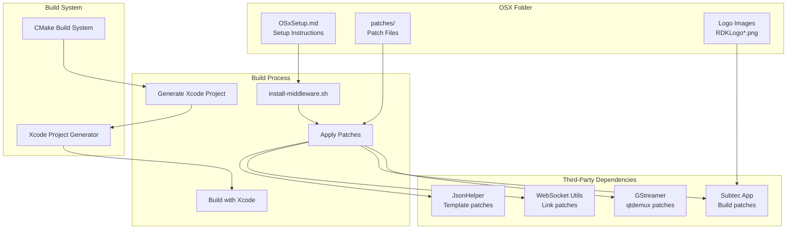
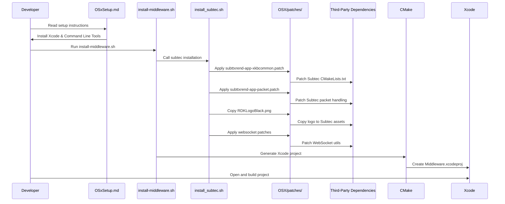
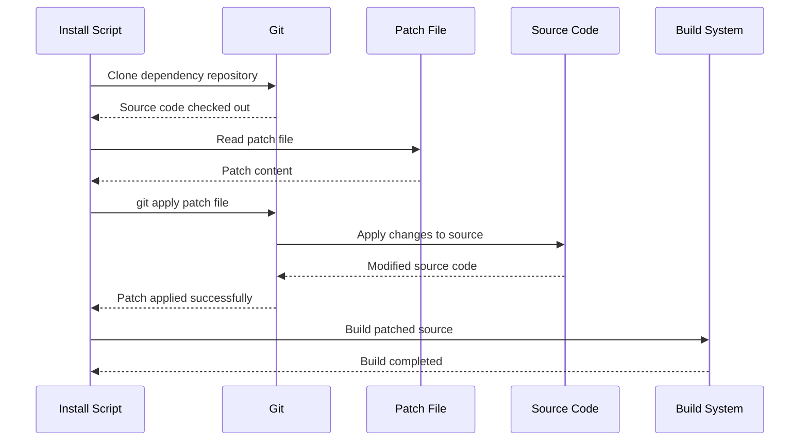
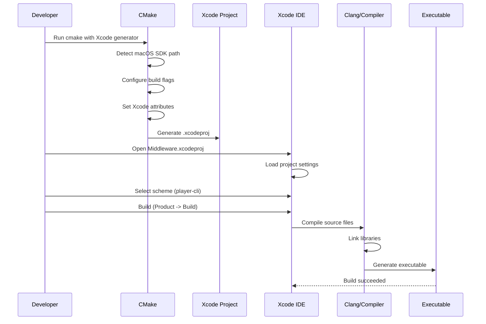

# OSX Build Support & Patches

Comprehensive documentation of AAMP OSX subfolder: build support, patches, and macOS-specific configurations

[← Back to Index](README.md)

## 1. Executive Summary

The AAMP OSX subfolder provides essential build support and patches for building AAMP middleware on macOS (OSX). This document provides detailed analysis of:

- High-level architecture and purpose
- Code organization and folder structure
- Build process and integration flow
- Patch files and their purposes
- macOS-specific configurations
- Xcode project setup and build system integration
- Dependency patching for GStreamer, Subtec, and other components

## 2. High-Level Architecture

### 2.1 Purpose and Overview

The OSX subfolder serves as a build support directory that enables AAMP middleware to be built and run on macOS. It provides:

- **Build Documentation:** Setup instructions for macOS development environment
- **Patch Files:** Patches for third-party dependencies to fix macOS compatibility issues
- **Build Assets:** Logo images and other resources needed during build
- **Xcode Integration:** Scheme patches for Xcode project configuration



### 2.2 Key Design Patterns

- **Patch Pattern:** Uses git patches to modify third-party dependencies without forking
- **Platform Abstraction:** Provides macOS-specific fixes while maintaining cross-platform compatibility
- **Build System Integration:** Integrates with CMake and Xcode build systems
- **Documentation-Driven:** Setup instructions guide developers through the build process

## 3. Code Organization

### 3.1 Folder Structure

```
middleware/OSX/
├── OSxSetup.md                    # macOS setup and build instructions
│
└── patches/                        # Patch files for dependencies
    ├── 0009-qtdemux-tm_gst-1.16.patch
    ├── 0013-qtdemux-remove-override-segment-event_gst-1.16.patch
    ├── 0014-qtdemux-clear-crypto-info-on-trak-switch_gst-1.16.patch
    ├── 0021-qtdemux-tm-multiperiod_gst-1.16.patch
    ├── JsonHelper.patch
    ├── subttxrend-app-packet.patch
    ├── subttxrend-app-ubuntu_24_04_build.patch
    ├── subttxrend-app-xkbcommon.patch
    ├── websocket-ipplayer2-link.patch
    ├── websocket-ipplayer2-typescpp.patch
    ├── websocket-ipplayer2-ubuntu_24_04_build.patch
    ├── RDKLogo.png
    ├── RDKLogoBlack.png
    └── RDKLogoGreen.png
```

### 3.2 File Responsibilities

| File | Responsibility |
|------|----------------|
| `OSxSetup.md` | Documentation for setting up and building AAMP middleware on macOS, including Xcode configuration and troubleshooting |
| `patches/0009-qtdemux-tm_gst-1.16.patch` | GStreamer qtdemux patch for timeline/multiperiod support |
| `patches/0013-qtdemux-remove-override-segment-event_gst-1.16.patch` | GStreamer qtdemux patch to remove override segment event handling |
| `patches/0014-qtdemux-clear-crypto-info-on-trak-switch_gst-1.16.patch` | GStreamer qtdemux patch to clear crypto info on track switch |
| `patches/0021-qtdemux-tm-multiperiod_gst-1.16.patch` | GStreamer qtdemux patch for timeline multiperiod support |
| `patches/JsonHelper.patch` | JsonHelper template specialization fix for macOS compiler compatibility |
| `patches/subttxrend-app-xkbcommon.patch` | Subtec app patch to add xkbcommon dependency for macOS |
| `patches/subttxrend-app-packet.patch` | Subtec app patch for packet handling on macOS |
| `patches/subttxrend-app-ubuntu_24_04_build.patch` | Subtec app patch for Ubuntu 24.04 build compatibility (also used on macOS) |
| `patches/websocket-ipplayer2-link.patch` | WebSocket utils patch for linking on macOS |
| `patches/websocket-ipplayer2-typescpp.patch` | WebSocket utils patch for C++ type handling |
| `patches/websocket-ipplayer2-ubuntu_24_04_build.patch` | WebSocket utils patch for Ubuntu 24.04 build compatibility |
| `patches/RDKLogo*.png` | RDK logo images used during Subtec app build |

## 4. Build Process Flow

### 4.1 Initial Setup Flow



### 4.2 Patch Application Flow



### 4.3 Xcode Build Flow



## 5. Patch Files Details

### 5.1 GStreamer qtdemux Patches

#### 5.1.1 Timeline/Multiperiod Support

**Files:** `0009-qtdemux-tm_gst-1.16.patch`, `0021-qtdemux-tm-multiperiod_gst-1.16.patch`

**Purpose:** These patches add timeline and multiperiod support to GStreamer's qtdemux plugin, which is essential for handling DASH content with multiple periods.

- Enables proper timeline handling in qtdemux
- Adds support for multiperiod DASH streams
- Fixes segment timing issues on macOS

#### 5.1.2 Segment Event Handling

**File:** `0013-qtdemux-remove-override-segment-event_gst-1.16.patch`

**Purpose:** Removes override segment event handling that can cause issues on macOS.

#### 5.1.3 Crypto Info Management

**File:** `0014-qtdemux-clear-crypto-info-on-trak-switch_gst-1.16.patch`

**Purpose:** Ensures crypto information is properly cleared when switching tracks, which is critical for DRM-protected content on macOS.

### 5.2 JsonHelper Patch

**File:** `JsonHelper.patch`

**Purpose:** Fixes template specialization syntax for macOS compiler compatibility.

```cpp
// Before (causes compiler error on macOS):
template void JsonHelper::put<std::uint64_t>(...);

// After (correct syntax):
template <> void JsonHelper::put<std::uint64_t>(...);
```

**Changes:**

- Fixes template specialization for `std::uint64_t` and `std::int64_t`
- Applies to `put()`, `appendArrayElem()`, and `putArray()` methods
- Required for macOS Clang compiler compatibility

### 5.3 Subtec App Patches

#### 5.3.1 xkbcommon Dependency

**File:** `subttxrend-app-xkbcommon.patch`

**Purpose:** Adds xkbcommon dependency to Subtec app CMakeLists.txt files for macOS keyboard handling.

```cmake
// Adds to CMakeLists.txt:
find_package(PkgConfig REQUIRED)
pkg_check_modules(XKBCOMMON REQUIRED xkbcommon)
include_directories(${XKBCOMMON_INCLUDE_DIRS})
```

#### 5.3.2 Packet Handling

**File:** `subttxrend-app-packet.patch`

**Purpose:** Fixes packet handling in Subtec app for macOS compatibility.

#### 5.3.3 Ubuntu 24.04 Build Compatibility

**File:** `subttxrend-app-ubuntu_24_04_build.patch`

**Purpose:** Provides build compatibility fixes that also apply to macOS builds.

### 5.4 WebSocket Utils Patches

#### 5.4.1 Linking Fix

**File:** `websocket-ipplayer2-link.patch`

**Purpose:** Fixes linking issues for WebSocket utils on macOS.

#### 5.4.2 C++ Type Handling

**File:** `websocket-ipplayer2-typescpp.patch`

**Purpose:** Fixes C++ type handling in WebSocket utils for macOS compiler compatibility.

#### 5.4.3 Ubuntu 24.04 Build Compatibility

**File:** `websocket-ipplayer2-ubuntu_24_04_build.patch`

**Purpose:** Provides build compatibility fixes for WebSocket utils.

## 6. macOS-Specific Configurations

### 6.1 CMake Configuration

The middleware CMakeLists.txt includes macOS-specific configurations:

```cmake
# Mac OS X
if(CMAKE_SYSTEM_NAME STREQUAL Darwin)
    execute_process (
        COMMAND bash -c "xcrun --show-sdk-path" 
        OUTPUT_VARIABLE osxSdkPath 
        OUTPUT_STRIP_TRAILING_WHITESPACE
    )
    set(OS_CXX_FLAGS "${OS_CXX_FLAGS} -std=c++14 -g -x objective-c++ 
        -Wno-inconsistent-missing-override 
        -F${osxSdkPath}/System/Library/Frameworks")
    set(OS_LD_FLAGS "${OS_LD_FLAGS} 
        -F${osxSdkPath}/System/Library/Frameworks 
        -framework Cocoa 
        -L${osxSdkPath}/../MacOSX.sdk/usr/lib 
        -L.libs/lib -L/usr/local/lib/")
    set(CMAKE_CXX_FLAGS "${CMAKE_CXX_FLAGS} 
        -isysroot ${osxSdkPath}/../MacOSX.sdk 
        -I/usr/local/include")
    
    # XCode build flags
    set(CMAKE_XCODE_ATTRIBUTE_GCC_WARN_UNUSED_FUNCTION "YES")
    set(CMAKE_XCODE_ATTRIBUTE_GCC_WARN_UNUSED_VARIABLE "YES")
endif()
```

### 6.2 Xcode Project Generation

CMake generates Xcode project with macOS-specific settings:

- **SDK Path Detection:** Automatically detects macOS SDK path using `xcrun --show-sdk-path`
- **Framework Linking:** Links Cocoa framework and system frameworks
- **Objective-C++ Support:** Enables Objective-C++ compilation for macOS integration
- **Compiler Flags:** Sets appropriate compiler flags for macOS

### 6.3 Build Script Integration

The install scripts use OSX patches during dependency installation:

```bash
# From install_subtec.sh
echo "Patching subtec-app from ${1}"
git apply -p1 ${1}/OSX/patches/subttxrend-app-xkbcommon.patch
git apply -p1 ${1}/OSX/patches/subttxrend-app-packet.patch
git apply -p1 ${1}/OSX/patches/websocket-ipplayer2-link.patch \
    --directory websocket-ipplayer2-utils
git apply -p1 ${1}/OSX/patches/websocket-ipplayer2-typescpp.patch \
    --directory websocket-ipplayer2-utils
cp ${1}/OSX/patches/RDKLogoBlack.png \
    subttxrend-gfx/quartzcpp/assets/RDKLogo.png
```

## 7. Setup Instructions

### 7.1 Prerequisites

1. **Install Xcode:** Download and install Xcode from the Apple App Store
2. **Install Command Line Tools:** For macOS < 10.15:
   ```bash
   xcode-select --install
   sudo installer -pkg /Library/Developer/CommandLineTools/Packages/macOS_SDK_headers_for_macOS_<version>.pkg -target /
   ```
3. **Check SDK Path:** For macOS 10.15+:
   ```bash
   xcrun --sdk macosx --show-sdk-path
   ```

### 7.2 Build Process

1. **Clone Repository:**
   ```bash
   git clone "https://code.rdkcentral.com/r/rdk/components/generic/aamp" -b dev_sprint
   cd aamp/middleware/
   bash install-middleware.sh
   ```

2. **Open Xcode Project:**
   ```bash
   # Open build/middleware/Middleware.xcodeproj in Xcode
   # Product -> Build
   ```

3. **Select Target:**
   ```bash
   # Product -> Scheme -> Choose Scheme
   # Select: player-cli
   ```

4. **Execute:**
   ```bash
   # Product -> Run
   ```

### 7.3 Troubleshooting

#### 7.3.1 CMAKE_C_COMPILER Error

**Issue:** "No CMAKE_C_COMPILER could be found"

**Solution:**

- Check that CMake version matches minimum required version
- Run: `sudo xcode-select --reset`
- Re-execute the build script

#### 7.3.2 Deployment Target Warning

**Issue:** "Machine runs macOS 10.15.7, which is lower than player-cli's minimum deployment target of 11.1"

**Solution:**

- Open Xcode project
- Click "Middleware" project
- Lower "macOS Deployment Target" version (e.g., to 10.11)
- Rebuild

## 8. Integration with AAMP

### 8.1 Build System Integration

The OSX folder integrates with AAMP build system through:

- **CMake Detection:** CMake detects macOS platform and applies OSX-specific configurations
- **Install Scripts:** Install scripts reference OSX patches during dependency installation
- **Xcode Generation:** CMake generates Xcode project files for macOS development

### 8.2 Dependency Patching

OSX patches are applied during dependency installation:

1. Install script clones third-party dependency
2. Script applies relevant patches from OSX/patches/
3. Patched source is built and linked with AAMP

### 8.3 Development Workflow

macOS developers use OSX folder for:

- Setting up development environment
- Building AAMP middleware locally
- Debugging with Xcode
- Testing on macOS platform

## 9. Patch File Format

### 9.1 Git Patch Format

All patches use standard git patch format:

```
Source: COMCAST
Upstream-Status: Pending
Notice: Code in patch files takes the license of the source which is being patched.
--- a/filename.cpp	2024-03-07 16:33:38.158962188 +0000
+++ b/filename.cpp	2024-03-07 17:03:08.693947151 +0000
@@ -400,17 +400,17 @@
 
 template void JsonHelper::put<std::string>(...);
-template void JsonHelper::put<std::uint64_t>(...);
+template <> void JsonHelper::put<std::uint64_t>(...);
```

### 9.2 Patch Application

Patches are applied using git apply command:

```bash
# Apply patch from root of repository
git apply -p1 path/to/patch/file.patch

# Apply patch to specific subdirectory
git apply -p1 path/to/patch/file.patch --directory subdirectory
```

### 9.3 Patch Maintenance

- Patches are version-controlled in the repository
- Each patch includes source attribution
- Patches are tested against specific dependency versions
- Upstream status is tracked (Pending/Inappropriate/etc.)

## 10. Code Analysis and Improvements

### 10.1 Strengths

- Clear separation of platform-specific build support
- Well-documented setup process
- Comprehensive patch coverage for dependencies
- Easy to maintain and update patches
- Good integration with build system

### 10.2 Potential Improvements

- **Automated Testing:** Could add automated tests to verify patches apply correctly
- **Patch Validation:** Could validate patches against multiple dependency versions
- **Documentation:** Could add more detailed patch descriptions and rationale
- **Version Management:** Could track which dependency versions patches are tested against
- **Build Verification:** Could add CI/CD to verify macOS builds
- **Patch Consolidation:** Some patches could potentially be consolidated

---

[← Back to Index](README.md)

