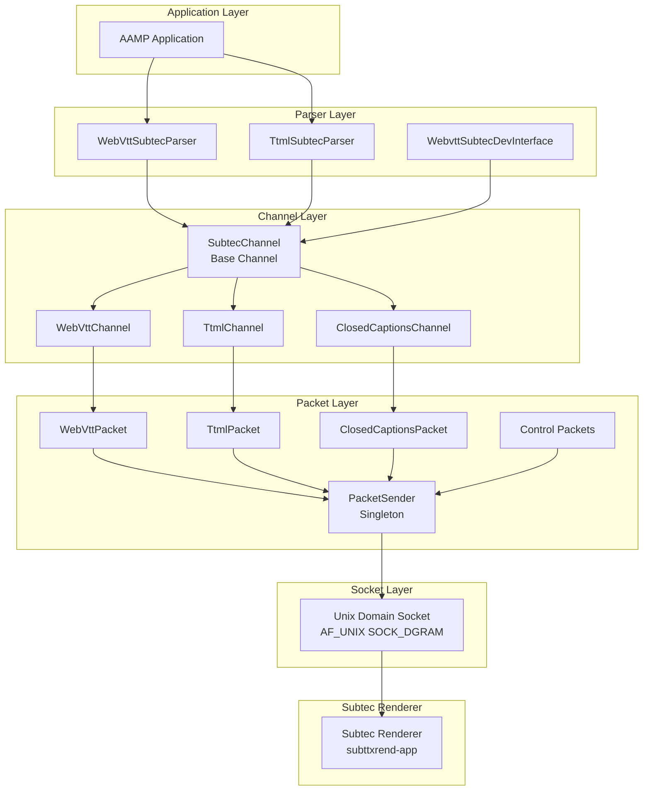
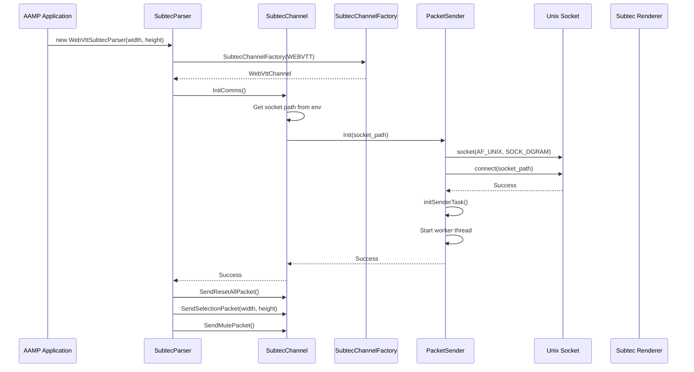
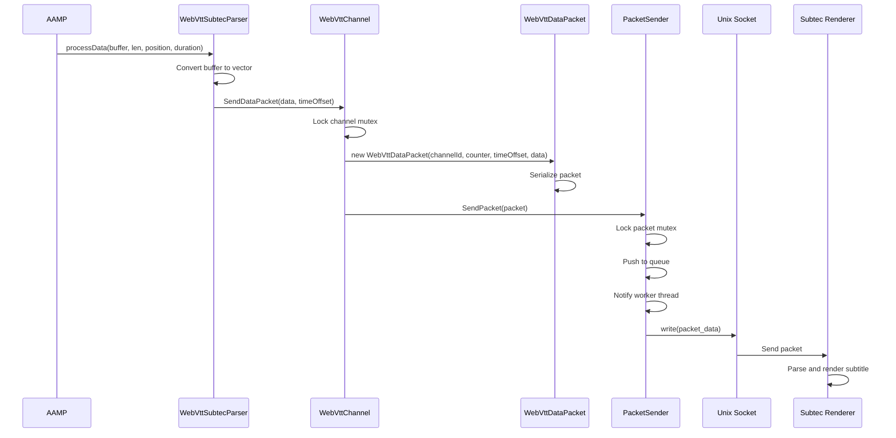
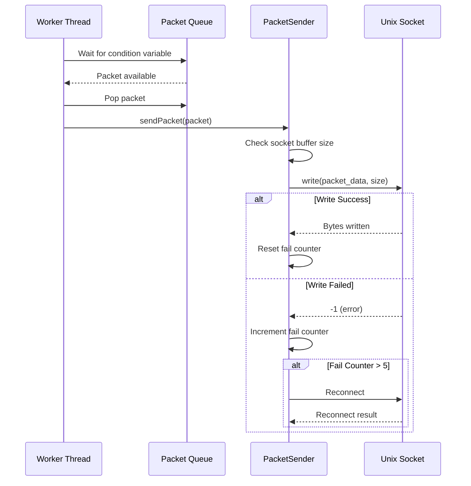
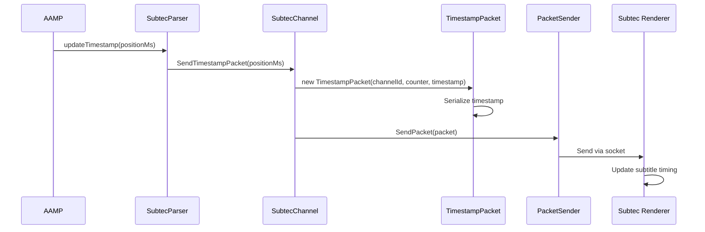
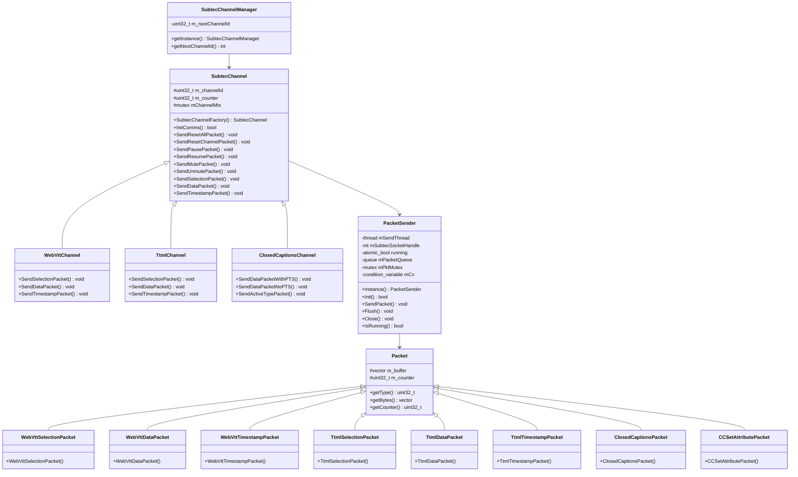
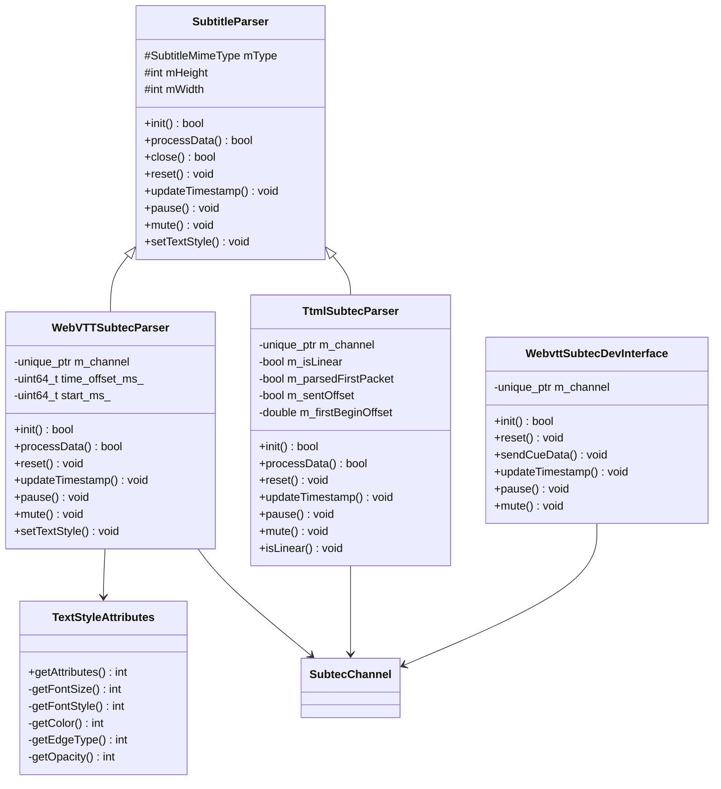

# Subtec Architecture & Implementation

Comprehensive documentation of AAMP Subtec subfolder: architecture, codeflow, APIs, classes, and implementation details

[← Back to Index](README.md)

## 1. Executive Summary

The AAMP Subtec subsystem provides a comprehensive solution for rendering subtitles (WebVTT, TTML) and closed captions through the Subtec renderer. This document provides detailed analysis of:

- High-level architecture and component organization
- Code organization and folder structure
- Complete execution flows (initialization → parsing → packet creation → rendering)
- Important APIs and classes with detailed documentation
- Implementation details for WebVTT, TTML, and Closed Captions
- Integration with AAMP core, GStreamer, and Subtec renderer
- Packet-based communication protocol
- Text style attribute management

## 2. High-Level Architecture

### 2.1 Architecture Overview

The Subtec subsystem follows a layered architecture with clear separation of concerns:



### 2.2 Key Design Patterns

- **Factory Pattern:** SubtecChannelFactory creates appropriate channel types (WebVTT, TTML, CC)
- **Strategy Pattern:** Different parsers (WebVTT, TTML) for different subtitle formats
- **Singleton Pattern:** PacketSender uses singleton to manage socket communication
- **Template Method Pattern:** Base SubtecChannel defines algorithm, derived classes implement specifics
- **Packet Pattern:** All communication uses packet-based protocol

## 3. Code Organization

### 3.1 Folder Structure

```
middleware/subtec/
├── libsubtec/                        # Core Subtec library
│   ├── SubtecChannel.hpp/cpp        # Base channel class
│   ├── PacketSender.hpp/cpp          # Packet sender singleton
│   ├── SubtecPacket.hpp              # Base packet class
│   ├── WebVttPacket.hpp              # WebVTT packet types
│   ├── TtmlPacket.hpp                # TTML packet types
│   ├── ClosedCaptionsPacket.hpp      # CC packet types
│   └── SubtecAttribute.hpp           # Attribute definitions
│
├── subtecparser/                     # Subtitle parsers
│   ├── WebVttSubtecParser.hpp/cpp   # WebVTT parser
│   ├── TtmlSubtecParser.hpp/cpp     # TTML parser
│   ├── WebvttSubtecDevInterface.hpp/cpp # Dev interface
│   └── TextStyleAttributes.h/cpp     # Text style management
│
└── test/                             # Test code
    └── subtec_test.cpp
```

### 3.2 File Responsibilities

| File | Responsibility |
|------|----------------|
| `SubtecChannel.hpp/cpp` | Base channel class for Subtec communication, factory method, common packet operations |
| `PacketSender.hpp/cpp` | Singleton for sending packets via Unix domain socket, thread-safe packet queue |
| `SubtecPacket.hpp` | Base packet class, packet type definitions, packet serialization |
| `WebVttPacket.hpp` | WebVTT-specific packets (Selection, Data, Timestamp) |
| `TtmlPacket.hpp` | TTML-specific packets (Selection, Data, Timestamp) |
| `ClosedCaptionsPacket.hpp` | Closed captions packets (Data with/without PTS, ActiveType) |
| `SubtecAttribute.hpp` | Attribute type definitions and constants |
| `WebVttSubtecParser.hpp/cpp` | WebVTT subtitle parser implementing SubtitleParser interface |
| `TtmlSubtecParser.hpp/cpp` | TTML subtitle parser with ISO BMFF support |
| `WebvttSubtecDevInterface.hpp/cpp` | Development interface for WebVTT subtitle handling |
| `TextStyleAttributes.h/cpp` | Text style attribute parsing and conversion from JSON |

## 4. Code Flow

### 4.1 Initialization Flow



### 4.2 Subtitle Data Processing Flow



### 4.3 Packet Sender Worker Thread Flow



### 4.4 Timestamp Update Flow



## 5. Important APIs and Classes

### 5.1 SubtecChannel (Base Interface)

```cpp
class SubtecChannel {
public:
    enum class ChannelType {
        TTML,
        WEBVTT,
        CC
    };
    
    // Factory method to create channel
    static std::unique_ptr<SubtecChannel> SubtecChannelFactory(ChannelType type);
    
    // Initialize communication
    static bool InitComms();
    static bool InitComms(const char* socket_path);
    
    // Control packets
    void SendResetAllPacket();
    void SendResetChannelPacket();
    void SendPausePacket();
    void SendResumePacket();
    void SendMutePacket();
    void SendUnmutePacket();
    void SendCCSetAttributePacket(std::uint32_t ccType, 
                                   std::uint32_t attribType, 
                                   const attributesType &attributesValues);
    
    // Virtual methods for subtitle-specific packets
    virtual void SendSelectionPacket(uint32_t width, uint32_t height);
    virtual void SendDataPacket(std::vector<uint8_t> &&data, 
                               std::int64_t time_offset_ms = 0);
    virtual void SendTimestampPacket(uint64_t timestampMs);
    
    virtual ~SubtecChannel() = 0;
    
protected:
    uint32_t m_channelId;
    uint32_t m_counter;
    std::mutex mChannelMtx;
    
    template<typename PacketType, typename ...Args>
    void sendPacket(Args && ...args);
};
```

### 5.2 PacketSender (Singleton)

```cpp
class PacketSender {
public:
    // Get singleton instance
    static PacketSender* Instance();
    
    // Initialize socket communication
    bool Init();
    bool Init(const char *socket_path);
    
    // Send packet (thread-safe)
    void SendPacket(PacketPtr && packet);
    
    // Flush packet queue
    void Flush();
    
    // Close socket and stop worker thread
    void Close();
    
    // Check if running
    bool IsRunning();
    
private:
    // Worker thread function
    void senderTask();
    
    // Internal methods
    void closeSenderTask();
    void flushPacketQueue();
    void sendPacket(PacketPtr && pkt);
    bool initSenderTask();
    bool initSocket(const char *socket_path);
    
    std::thread mSendThread;
    int mSubtecSocketHandle;
    std::atomic_bool running;
    std::queue<PacketPtr> mPacketQueue;
    std::mutex mPktMutex;
    std::condition_variable mCv;
    std::mutex mStartMutex;
    int mSockBufSize;
    int mPktWriteFailCtr;
    std::string mSocketPath;
};
```

### 5.3 Packet (Base Class)

```cpp
class Packet {
public:
    Packet();
    Packet(std::uint32_t counter);
    
    // Get packet type
    const uint32_t getType();
    
    // Get serialized bytes
    const std::vector<uint8_t>& getBytes();
    
    // Get packet counter
    const std::uint32_t getCounter();
    
    // Get type string for debugging
    static std::string getTypeString(uint32_t type);
    
protected:
    enum class PacketType : std::uint32_t {
        PES_DATA,
        TIMESTAMP,
        RESET_ALL,
        RESET_CHANNEL,
        SUBTITLE_SELECTION,
        TELETEXT_SELECTION,
        TTML_SELECTION,
        TTML_DATA,
        TTML_TIMESTAMP,
        WEBVTT_SELECTION,
        WEBVTT_DATA,
        WEBVTT_TIMESTAMP,
        CC_DATA,
        PAUSE,
        RESUME,
        MUTE,
        UNMUTE,
        CC_SET_ATTRIBUTE,
        INVALID = 0xFFFFFFFF
    };
    
    std::vector<uint8_t> m_buffer;
    std::uint32_t m_counter;
    
    void append32(std::uint32_t value);
    void append64(std::int64_t value);
    void appendType(PacketType type);
};

using PacketPtr = std::unique_ptr<Packet>;
```

### 5.4 WebVttSubtecParser

```cpp
class WebVTTSubtecParser : public SubtitleParser {
public:
    WebVTTSubtecParser(SubtitleMimeType type, int width, int height);
    
    // Initialize parser
    bool init(double startPosSeconds, unsigned long long basePTS) override;
    
    // Process subtitle data
    bool processData(const char* buffer, size_t bufferLen, 
                    double position, double duration) override;
    
    // Close parser
    bool close() override;
    
    // Reset parser
    void reset() override;
    
    // Update playback timestamp
    void updateTimestamp(unsigned long long positionMs) override;
    
    // Pause/resume
    void pause(bool pause) override;
    
    // Mute/unmute
    void mute(bool mute) override;
    
    // Set text style
    void setTextStyle(const std::string &options) override;
    
protected:
    std::unique_ptr<SubtecChannel> m_channel;
    
private:
    std::uint64_t time_offset_ms_;
    std::uint64_t start_ms_;
};
```

### 5.5 TtmlSubtecParser

```cpp
class TtmlSubtecParser : public SubtitleParser {
public:
    TtmlSubtecParser(SubtitleMimeType type, int width, int height);
    
    // Initialize parser
    bool init(double startPosSeconds, unsigned long long basePTS) override;
    
    // Process TTML data (ISO BMFF format)
    bool processData(const char* buffer, size_t bufferLen, 
                    double position, double duration) override;
    
    // Close parser
    bool close() override;
    
    // Reset parser
    void reset() override;
    
    // Update playback timestamp
    void updateTimestamp(unsigned long long positionMs) override;
    
    // Pause/resume
    void pause(bool pause) override;
    
    // Mute/unmute
    void mute(bool mute) override;
    
    // Set linear/non-linear content
    void isLinear(bool isLinear) override;
    
protected:
    std::unique_ptr<SubtecChannel> m_channel;
    
private:
    bool m_isLinear;
    bool m_parsedFirstPacket;
    bool m_sentOffset;
    double m_firstBeginOffset;
};
```

### 5.6 TextStyleAttributes

```cpp
class TextStyleAttributes {
public:
    // Font size enumeration
    typedef enum FontSize {
        FONT_SIZE_EMBEDDED = -1,
        FONT_SIZE_SMALL,
        FONT_SIZE_STANDARD,
        FONT_SIZE_LARGE,
        FONT_SIZE_EXTRALARGE
    } FontSize;
    
    // Font style enumeration
    typedef enum FontStyle {
        FONT_STYLE_EMBEDDED = -1,
        FONT_STYLE_DEFAULT,
        FONT_STYLE_MONOSPACED_SERIF,
        FONT_STYLE_PROPORTIONAL_SERIF,
        FONT_STYLE_MONOSPACED_SANSSERIF,
        FONT_STYLE_PROPORTIONAL_SANSSERIF,
        FONT_STYLE_CASUAL,
        FONT_STYLE_CURSIVE,
        FONT_STYLE_SMALL_CAPITALS
    } FontStyle;
    
    // Supported colors
    typedef enum SupportedColors {
        COLOR_EMBEDDED = 0xFF000000,
        COLOR_BLACK = 0x00000000,
        COLOR_WHITE = 0x00FFFFFF,
        COLOR_RED = 0x00FF0000,
        COLOR_GREEN = 0x0000FF00,
        COLOR_BLUE = 0x000000FF,
        COLOR_YELLOW = 0x00FFFF00,
        COLOR_MAGENTA = 0x00FF00FF,
        COLOR_CYAN = 0x0000FFFF
    } SupportedColors;
    
    // Edge types
    typedef enum EdgeType {
        EDGE_TYPE_EMBEDDED = -1,
        EDGE_TYPE_NONE,
        EDGE_TYPE_RAISED,
        EDGE_TYPE_DEPRESSED,
        EDGE_TYPE_UNIFORM,
        EDGE_TYPE_SHADOW_LEFT,
        EDGE_TYPE_SHADOW_RIGHT
    } EdgeType;
    
    // Opacity options
    typedef enum Opacity {
        OPACITY_EMBEDDED = -1,
        OPACITY_SOLID,
        OPACITY_FLASHING,
        OPACITY_TRANSLUCENT,
        OPACITY_TRANSPARENT
    } Opacity;
    
    // Parse JSON options and extract attributes
    int getAttributes(std::string options, 
                     attributesType &attributesValues, 
                     uint32_t &attributesMask);
    
private:
    int getFontSize(std::string input, FontSize *fontSizeOut);
    int getFontStyle(std::string input, FontStyle *fontStyleOut);
    int getColor(std::string input, SupportedColors *colorOut);
    int getEdgeType(std::string input, EdgeType *edgeTypeOut);
    int getOpacity(std::string input, Opacity *opacityOut);
};
```

## 6. Implementation Details

### 6.1 Packet Format

All Subtec packets follow a common format:

- **Type (4 bytes):** Packet type identifier
- **Counter (4 bytes):** Sequence number for ordering
- **Size (4 bytes):** Size of data payload
- **Data (variable):** Packet-specific data

### 6.2 WebVTT Packet Types

#### 6.2.1 WebVTT Selection Packet

```
// Packet format:
// Type: WEBVTT_SELECTION (4 bytes)
// Counter: sequence number (4 bytes)
// Size: 12 (4 bytes)
// Channel ID: channel identifier (4 bytes)
// Width: display width (4 bytes)
// Height: display height (4 bytes)
```

#### 6.2.2 WebVTT Data Packet

```
// Packet format:
// Type: WEBVTT_DATA (4 bytes)
// Counter: sequence number (4 bytes)
// Size: 8 + 4 + dataLen (4 bytes)
// Channel ID: channel identifier (4 bytes)
// Time Offset: time offset in ms (8 bytes)
// Data: WebVTT subtitle data (variable)
```

#### 6.2.3 WebVTT Timestamp Packet

```
// Packet format:
// Type: WEBVTT_TIMESTAMP (4 bytes)
// Counter: sequence number (4 bytes)
// Size: 12 (4 bytes)
// Channel ID: channel identifier (4 bytes)
// Timestamp: timestamp in ms (8 bytes)
```

### 6.3 TTML Packet Types

TTML packets follow similar structure to WebVTT:

- **TTML_SELECTION:** Initialize TTML channel with display dimensions
- **TTML_DATA:** Send TTML subtitle data (ISO BMFF mdat box content)
- **TTML_TIMESTAMP:** Update playback timestamp

### 6.4 Closed Captions Packet Types

#### 6.4.1 CC Data Packet

```
// Packet format (with PTS):
// Type: CC_DATA (4 bytes)
// Counter: sequence number (4 bytes)
// Size: 16 + dataLen (4 bytes)
// Channel ID: channel identifier (4 bytes)
// Channel Type: 3 (CC) (4 bytes)
// PTS Presence: 1 (4 bytes)
// PTS Value: presentation timestamp (4 bytes)
// Data: CC data (variable)

// Packet format (without PTS):
// Type: CC_DATA (4 bytes)
// Counter: sequence number (4 bytes)
// Size: 16 + dataLen (4 bytes)
// Channel ID: channel identifier (4 bytes)
// Channel Type: 3 (CC) (4 bytes)
// PTS Presence: 0 (4 bytes)
// PTS Value: 0 (4 bytes)
// Data: CC data (variable)
```

#### 6.4.2 CC Active Type Packet

```
// Packet format:
// Type: SUBTITLE_SELECTION (4 bytes)
// Counter: sequence number (4 bytes)
// Size: 16 (4 bytes)
// Channel ID: channel identifier (4 bytes)
// Subtitle Type: 3 (CC) (4 bytes)
// CEA Type: 0 (608) or 1 (708) (4 bytes)
// Service: service number (4 bytes)
```

### 6.5 Socket Communication

#### 6.5.1 Socket Path

Socket path is determined by:

1. Check environment variable: `{PLAYER_NAME}_SUBTITLE_SOCKET`
2. If not set, use default:
   - Simulator/Ubuntu: `/tmp/pes_data_main`
   - Device: `/run/subttx/pes_data_main`

#### 6.5.2 Socket Buffer Management

PacketSender manages socket buffer size dynamically:

- Initial buffer size obtained from `getsockopt(SO_SNDBUF)`
- Kernel returns twice the actual size, so divide by 2
- If packet size exceeds buffer, increase buffer up to 8MB
- Reconnect socket if 5 consecutive write failures occur

### 6.6 Thread Safety

Subtec subsystem uses multiple mutexes for thread safety:

- **mChannelMtx:** Protects channel operations (per channel)
- **mPktMutex:** Protects packet queue access
- **mStartMutex:** Protects initialization
- **Condition Variable (mCv):** Signals worker thread when packets available

### 6.7 TTML Linear Content Handling

TtmlSubtecParser handles linear (live) content specially:

- Parses first packet to extract "begin" timestamp
- Calculates time offset based on position delta
- Sends timestamp packet with calculated offset
- Ensures proper subtitle timing for live streams

## 7. Integration with AAMP

### 7.1 Parser Creation

AAMP creates Subtec parsers when subtitle tracks are detected:

```cpp
// From fragmentcollector_hls.cpp
if (format == FORMAT_SUBTITLE_WEBVTT) {
    if (ISCONFIGSET(eAAMPConfig_GstSubtecEnabled)) {
        // Use GStreamer subtec plugin
        // GStreamer handles subtitle rendering
    } else {
        // Use legacy subtec parser
        ts->mSubtitleParser = RegisterSubtitleParser_CB(eSUB_TYPE_WEBVTT);
        // Creates WebVttSubtecParser or TtmlSubtecParser
    }
}
```

### 7.2 Data Processing

When subtitle fragments are downloaded:

1. AAMP calls `processData()` on parser
2. Parser converts data to packet format
3. Parser sends packet via SubtecChannel
4. PacketSender queues and sends packet to renderer

### 7.3 GStreamer Integration

GStreamer subtec plugin (gstsubtecsink) integrates with Subtec:

- Plugin receives subtitle buffers from pipeline
- Creates appropriate SubtecChannel based on caps
- Sends data packets via channel
- Handles pause/resume/mute events

### 7.4 Style Management

Text style attributes are set via JSON:

```json
// Example JSON style options
{
    "penSize": "large",
    "fontStyle": "monospaced_serif",
    "textForegroundColor": "YELLOW",
    "textBackgroundColor": "BLACK",
    "textEdgeStyle": "raised",
    "textEdgeColor": "WHITE",
    "textForegroundOpacity": "solid",
    "textBackgroundOpacity": "translucent"
}

// Parser converts to attributesType array and sends CC_SET_ATTRIBUTE packet
```

## 8. Class Diagrams

### 8.1 Core Subtec Classes



### 8.2 Parser Classes



## 9. Packet Protocol Details

### 9.1 Packet Type Enumeration

All packet types defined in Packet::PacketType:

- **PES_DATA:** PES (Packetized Elementary Stream) data
- **TIMESTAMP:** Generic timestamp packet
- **RESET_ALL:** Reset all channels
- **RESET_CHANNEL:** Reset specific channel
- **SUBTITLE_SELECTION:** Subtitle track selection
- **TTML_SELECTION:** TTML channel selection
- **TTML_DATA:** TTML subtitle data
- **TTML_TIMESTAMP:** TTML timestamp update
- **WEBVTT_SELECTION:** WebVTT channel selection
- **WEBVTT_DATA:** WebVTT subtitle data
- **WEBVTT_TIMESTAMP:** WebVTT timestamp update
- **CC_DATA:** Closed captions data
- **PAUSE:** Pause subtitle rendering
- **RESUME:** Resume subtitle rendering
- **MUTE:** Mute (hide) subtitles
- **UNMUTE:** Unmute (show) subtitles
- **CC_SET_ATTRIBUTE:** Set closed caption attributes

### 9.2 Channel ID Management

SubtecChannelManager manages unique channel IDs:

- Singleton pattern ensures single instance
- Each channel gets unique ID via `getNextChannelId()`
- Channel IDs are used to distinguish multiple subtitle tracks

### 9.3 Packet Counter

Each channel maintains a packet counter:

- Incremented for each packet sent
- Used for packet ordering and debugging
- Reset to 1 when channel is reset

## 10. Error Handling and Recovery

### 10.1 Socket Write Failures

PacketSender handles socket write failures:

- Tracks consecutive write failures with `mPktWriteFailCtr`
- After 5 consecutive failures, attempts socket reconnect
- Reconnect uses same socket path
- Counter reset after successful reconnect or write

### 10.2 Initialization Failures

If SubtecChannel initialization fails:

- Parser throws `std::runtime_error`
- AAMP handles exception and disables subtitle parsing
- Playback continues without subtitles

### 10.3 Buffer Overflow Protection

PacketSender protects against buffer overflow:

- Maximum socket buffer size: 8MB
- Dynamically adjusts buffer size for large packets
- Logs warnings if buffer adjustment fails

## 11. Code Analysis and Improvements

### 11.1 Strengths

- Clean separation of concerns with channel and packet abstraction
- Support for multiple subtitle formats (WebVTT, TTML, CC)
- Thread-safe packet queue with worker thread
- Automatic socket reconnection on failures
- Comprehensive text style attribute support
- Good integration with GStreamer and AAMP
- Flexible socket path configuration via environment variables

### 11.2 Potential Improvements

- **Error Handling:** Could use exceptions or more detailed error codes
- **Packet Validation:** Could validate packet size and format before sending
- **Rate Limiting:** Could add rate limiting for packet sending
- **Statistics:** Could add packet statistics (sent, failed, queue size)
- **Configuration:** Socket buffer size and reconnect threshold could be configurable
- **Testing:** More unit tests for packet serialization and parsing
- **Documentation:** More inline documentation for packet formats
- **Memory Management:** Some raw pointers could use smart pointers

---

[← Back to Index](README.md)

