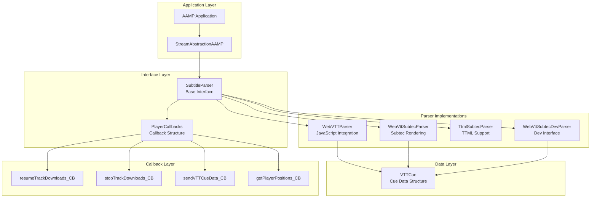
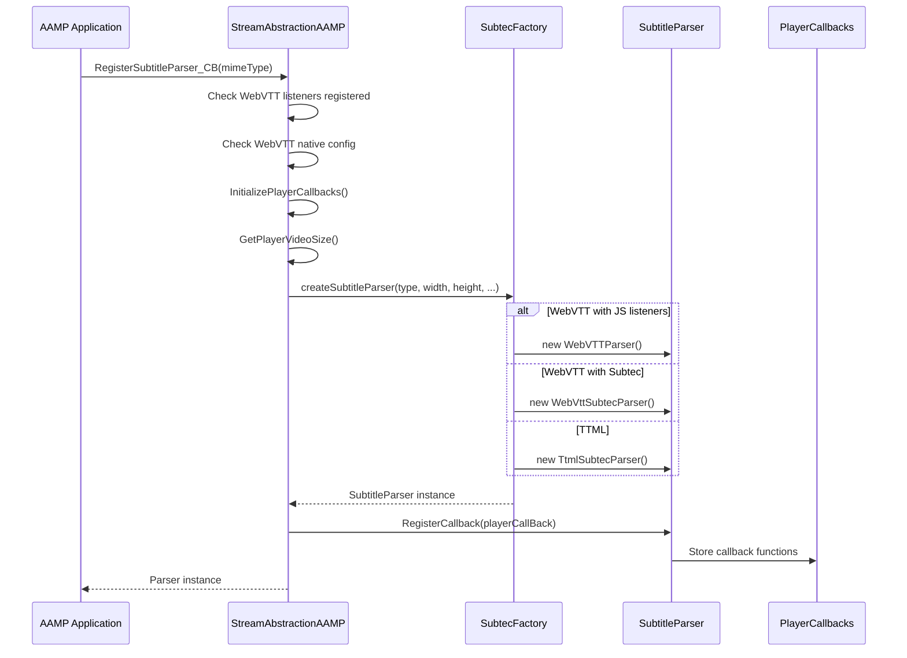
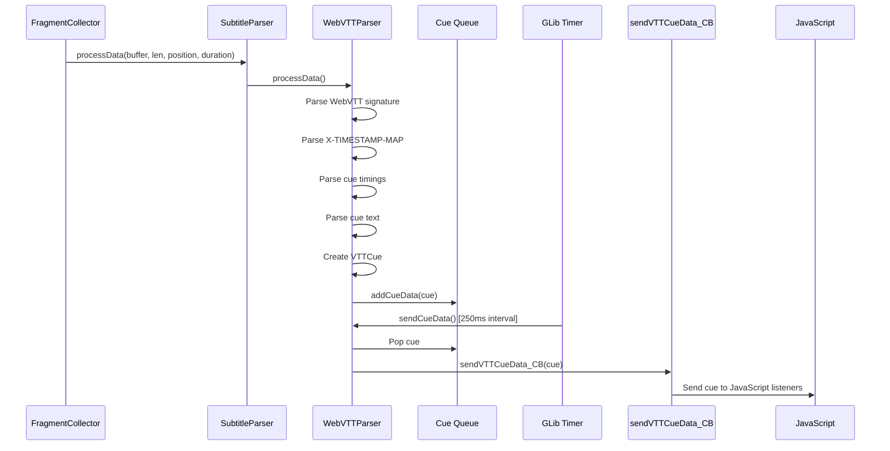
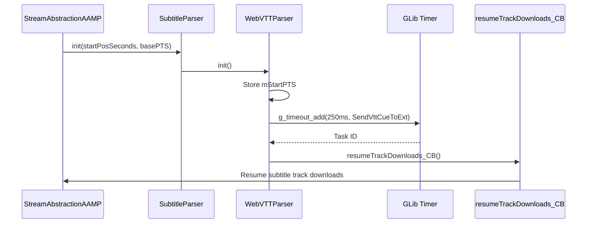
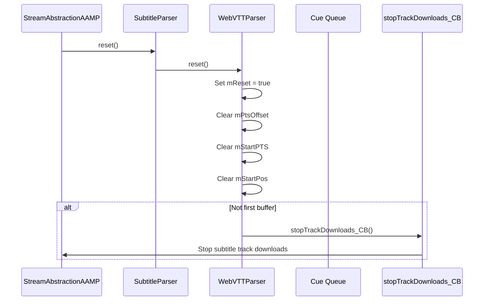
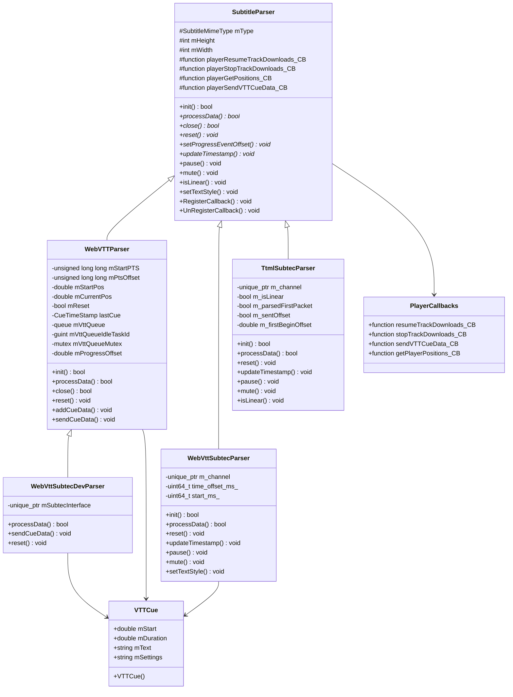

# Subtitle Architecture & Implementation

Comprehensive documentation of AAMP middleware subtitle subfolder: architecture, codeflow, APIs, classes, and implementation details

[← Back to Index](README.md)

## 1. Executive Summary

The AAMP middleware subtitle subfolder provides the base interface and data structures for subtitle parsing in AAMP. This document provides detailed analysis of:

- High-level architecture and component organization
- Code organization and folder structure
- Complete execution flows (parser creation → initialization → data processing → cue delivery)
- Important APIs and classes with detailed documentation
- Implementation details for SubtitleParser interface
- VTTCue data structure and usage
- Integration with AAMP core, WebVTTParser, and Subtec parsers
- Player callback mechanism

## 2. High-Level Architecture

### 2.1 Architecture Overview

The subtitle subsystem provides a base interface that all subtitle parsers must implement:



### 2.2 Key Design Patterns

- **Template Method Pattern:** SubtitleParser defines algorithm skeleton, derived classes implement specifics
- **Strategy Pattern:** Different parser implementations for different subtitle formats and rendering backends
- **Callback Pattern:** PlayerCallbacks structure enables communication with AAMP core
- **Factory Pattern:** SubtecFactory creates appropriate parser based on configuration

## 3. Code Organization

### 3.1 Folder Structure

```
middleware/subtitle/
├── subtitleParser.h          # Base SubtitleParser interface
└── vttCue.h                  # VTTCue data structure

Note: Parser implementations are in:
├── subtitle/                 # Root level (WebVTTParser)
│   ├── webvttParser.h/cpp
│   └── vttCue.h
│
└── middleware/subtec/subtecparser/  # Subtec parsers
    ├── WebVttSubtecParser.hpp/cpp
    ├── TtmlSubtecParser.hpp/cpp
    └── WebvttSubtecDevParser.hpp/cpp
```

### 3.2 File Responsibilities

| File | Responsibility |
|------|----------------|
| `subtitleParser.h` | Base abstract class defining the interface for all subtitle parsers, SubtitleMimeType enumeration, PlayerCallbacks structure |
| `vttCue.h` | Data structure to hold WebVTT cue information (start time, duration, text, settings) |

## 4. Code Flow

### 4.1 Parser Creation Flow



### 4.2 Subtitle Data Processing Flow



### 4.3 Initialization Flow



### 4.4 Reset Flow



## 5. Important APIs and Classes

### 5.1 SubtitleParser (Base Interface)

```cpp
/**
 * @brief Base class for subtitle parsers in AAMP
 */
class SubtitleParser {
public:
    SubtitleParser(SubtitleMimeType type, int width, int height);
    
    // Copy constructor and assignment deleted
    SubtitleParser(const SubtitleParser&) = delete;
    SubtitleParser& operator=(const SubtitleParser&) = delete;
    
    virtual ~SubtitleParser();
    
    // Initialization
    virtual bool init(double startPosSeconds, unsigned long long basePTS);
    
    // Data processing (pure virtual - must be implemented)
    virtual bool processData(const char* buffer, 
                            size_t bufferLen, 
                            double position, 
                            double duration) = 0;
    
    // Cleanup
    virtual bool close() = 0;
    
    // Reset parser state
    virtual void reset() = 0;
    
    // Progress event offset
    virtual void setProgressEventOffset(double offset) = 0;
    
    // Timestamp update
    virtual void updateTimestamp(unsigned long long positionMs) = 0;
    
    // Playback control (optional - default empty)
    virtual void pause(bool pause) {}
    virtual void mute(bool mute) {}
    virtual void isLinear(bool isLinear) {}
    virtual void setTextStyle(const std::string &options) {}
    
    // Callback registration
    void RegisterCallback(const PlayerCallbacks& playerCallBack);
    void UnRegisterCallback();
    
protected:
    SubtitleMimeType mType;      // Subtitle format type
    int mHeight;                 // Display height
    int mWidth;                  // Display width
    
    // Player callbacks
    std::function<void()> playerResumeTrackDownloads_CB;
    std::function<void()> playerStopTrackDownloads_CB;
    std::function<void(long long&, double&)> playerGetPositions_CB;
    std::function<void(VTTCue*)> playerSendVTTCueData_CB;
};
```

### 5.2 SubtitleMimeType Enumeration

```cpp
/**
 * @brief Subtitle data types supported by AAMP
 */
typedef enum {
    eSUB_TYPE_WEBVTT,      // WebVTT format (text/vtt)
    eSUB_TYPE_MP4,          // MP4 subtitle format
    eSUB_TYPE_TTML,         // TTML format (application/ttml+xml)
    eSUB_TYPE_UNKNOWN       // Unknown/unsupported format
} SubtitleMimeType;
```

### 5.3 PlayerCallbacks Structure

```cpp
/**
 * @brief Structure holding player callback functions
 * 
 * These callbacks enable communication between subtitle parsers
 * and the AAMP core player
 */
struct PlayerCallbacks {
    /** Callback to resume track downloads */
    std::function<void()> resumeTrackDownloads_CB;
    
    /** Callback to stop track downloads */
    std::function<void()> stopTrackDownloads_CB;
    
    /** Callback to send VTT cue data to JavaScript */
    std::function<void(VTTCue*)> sendVTTCueData_CB;
    
    /** Callback to get player positions */
    std::function<void(long long&, double&)> getPlayerPositions_CB;
};
```

### 5.4 VTTCue Structure

```cpp
/**
 * @brief Data structure to hold a WebVTT cue
 * 
 * This structure stores parsed WebVTT cue information
 * including timing, text content, and rendering settings
 */
struct VTTCue {
    /**
     * @brief Constructor
     * @param startTime Cue start time in milliseconds
     * @param duration Cue duration in milliseconds
     * @param text Cue text content
     * @param settings Cue rendering settings (e.g., position, alignment)
     */
    VTTCue(double startTime, double duration, 
           std::string text, std::string settings);
    
    double mStart;          // Start time in milliseconds
    double mDuration;       // Duration in milliseconds
    std::string mText;      // Cue text content
    std::string mSettings;  // Cue rendering settings
};
```

## 6. Implementation Details

### 6.1 SubtitleParser Interface Methods

#### 6.1.1 init()

**Purpose:** Initialize the parser with start position and base PTS

- **startPosSeconds:** Playlist start position in seconds
- **basePTS:** Base presentation timestamp for timing synchronization
- **Returns:** true if initialization successful

**Typical Implementation:**

- Store base PTS for timing calculations
- Set up timers or worker threads if needed
- Call `resumeTrackDownloads_CB` to start receiving data

#### 6.1.2 processData()

**Purpose:** Process incoming subtitle data fragment

- **buffer:** Subtitle data buffer
- **bufferLen:** Buffer length in bytes
- **position:** Fragment position in playlist (seconds)
- **duration:** Fragment duration (seconds)
- **Returns:** true if processing successful

**Typical Implementation:**

- Parse subtitle format (WebVTT, TTML, etc.)
- Extract cues with timing information
- Convert timing to absolute playback time
- Queue cues for delivery or send directly

#### 6.1.3 reset()

**Purpose:** Reset parser state (called on discontinuity or seek)

- Clear internal state (PTS offset, position, etc.)
- Clear cue queue
- Call `stopTrackDownloads_CB` to pause downloads
- Set reset flag to wait for new base PTS

#### 6.1.4 close()

**Purpose:** Clean up resources

- Remove timers or worker threads
- Clear cue queue and free memory
- Unregister callbacks

### 6.2 Callback Mechanism

The callback mechanism enables bidirectional communication:

- **Parser → Player:** Using stored callback functions
- **Player → Parser:** Through method calls on parser instance

#### 6.2.1 resumeTrackDownloads_CB

Called by parser when ready to receive subtitle fragments:

- Typically called in `init()`
- Resumes downloading subtitle track fragments
- Enables continuous subtitle data flow

#### 6.2.2 stopTrackDownloads_CB

Called by parser to pause subtitle downloads:

- Typically called in `reset()`
- Stops downloading subtitle fragments
- Used during discontinuities or seeks

#### 6.2.3 sendVTTCueData_CB

Called by parser to deliver parsed cues:

- Passes VTTCue pointer to AAMP core
- AAMP sends cue to JavaScript listeners via events
- Used by WebVTTParser for JavaScript integration

#### 6.2.4 getPlayerPositions_CB

Called by parser to get current playback position:

- Returns current playback time and seek position
- Used for timing calculations in parsers
- Helps synchronize subtitle timing with video

### 6.3 VTTCue Usage

VTTCue structure is used to represent parsed WebVTT cues:

- **mStart:** Cue start time in milliseconds (relative to playlist start)
- **mDuration:** Cue duration in milliseconds
- **mText:** Cue text content (may contain HTML tags)
- **mSettings:** Cue rendering settings (position, alignment, etc.)

#### 6.3.1 Cue Timing Calculation

Cue timing is calculated relative to playlist start:

1. Parse cue local time from WebVTT
2. Apply PTS offset from X-TIMESTAMP-MAP
3. Convert to absolute MPEG time
4. Calculate relative position from playlist start
5. Store in VTTCue.mStart

### 6.4 Thread Safety

SubtitleParser interface does not enforce thread safety:

- Implementations must handle thread safety internally
- WebVTTParser uses mutex for cue queue access
- Callbacks may be called from different threads
- Parser methods should be thread-safe or called from single thread

## 7. Integration with AAMP

### 7.1 Parser Registration

AAMP registers subtitle parsers when subtitle tracks are detected:

```cpp
// From streamabstraction.cpp
std::unique_ptr<SubtitleParser> 
StreamAbstractionAAMP::RegisterSubtitleParser_CB(SubtitleMimeType mimeType, 
                                                  bool isExpectedMimeType) {
    int width = 0, height = 0;
    bool webVTTCueListenersRegistered = false;
    bool isWebVTTNativeConfigured = false;
    bool resumeTrackDownload = false;
    PlayerCallbacks playerCallBack = {};
    
    // Check if JavaScript listeners are registered
    if (isExpectedMimeType) {
        webVTTCueListenersRegistered = aamp->WebVTTCueListenersRegistered();
        isWebVTTNativeConfigured = ISCONFIGSET(eAAMPConfig_WebVTTNative);
    }
    
    // Initialize player callbacks
    this->InitializePlayerCallbacks(playerCallBack);
    aamp->GetPlayerVideoSize(width, height);
    
    // Create parser via factory
    std::unique_ptr<SubtitleParser> subtitleParser = 
        SubtecFactory::createSubtitleParser(mimeType, width, height, 
                                           webVTTCueListenersRegistered, 
                                           isWebVTTNativeConfigured, 
                                           resumeTrackDownload);
    
    if (subtitleParser) {
        // Register callbacks
        subtitleParser->RegisterCallback(playerCallBack);
        
        // Resume downloads if needed (e.g., for TTML)
        if (resumeTrackDownload) {
            aamp->ResumeTrackDownloads(eMEDIATYPE_SUBTITLE);
        }
    }
    
    return subtitleParser;
}
```

### 7.2 Data Processing

When subtitle fragments are downloaded:

1. FragmentCollector receives subtitle fragment
2. Calls `processData()` on parser
3. Parser parses fragment and extracts cues
4. Parser queues or sends cues via callbacks

### 7.3 JavaScript Integration

WebVTTParser integrates with JavaScript via events:

- Parses WebVTT cues from fragments
- Queues cues with calculated timing
- Sends cues via `sendVTTCueData_CB` callback
- AAMP core sends `AAMP_EVENT_WEBVTT_CUE_DATA` event
- JavaScript listeners receive cue data

### 7.4 Subtec Integration

Subtec parsers use different approach:

- WebVttSubtecParser sends data directly to Subtec renderer
- TtmlSubtecParser processes ISO BMFF TTML data
- Both use SubtecChannel for communication
- No JavaScript callback needed

## 8. Class Diagrams

### 8.1 SubtitleParser Class Hierarchy



## 9. WebVTT Parsing Details

### 9.1 WebVTT Format Support

WebVTTParser supports standard WebVTT format:

- **Signature:** "WEBVTT" header (with optional UTF-8 BOM)
- **X-TIMESTAMP-MAP:** Maps local time to MPEG-2 PTS
- **Cue Timings:** HH:MM:SS.mmm format
- **Cue Settings:** Position, alignment, size, etc.
- **Cue Text:** Multi-line text content

### 9.2 Cue Settings Parsing

WebVTTParser parses cue settings:

- **line:** Vertical position (percentage or line number)
- **position:** Horizontal position (percentage)
- **size:** Cue width (percentage)
- **align:** Text alignment (start, center, end, left, right)

**Note:** Settings are parsed but not currently used in VTTCue structure

### 9.3 Timing Synchronization

WebVTTParser handles timing synchronization:

1. Parse X-TIMESTAMP-MAP to get PTS offset
2. Convert cue local time to MPEG time
3. Calculate relative position from playlist start
4. Store in VTTCue for JavaScript delivery

## 10. Error Handling

### 10.1 Parser Creation Failures

If parser creation fails:

- Factory returns empty unique_ptr
- AAMP disables subtitle track
- Playback continues without subtitles

### 10.2 Data Processing Failures

If `processData()` fails:

- Returns false to indicate failure
- FragmentCollector may retry or skip fragment
- Parser state remains consistent

### 10.3 Discontinuity Handling

On discontinuity:

- `reset()` is called
- Parser clears internal state
- Stops downloading until new base PTS
- Waits for new `init()` call

## 11. Code Analysis and Improvements

### 11.1 Strengths

- Clean interface design with clear separation of concerns
- Flexible callback mechanism for player integration
- Support for multiple subtitle formats
- Extensible design allows new parser implementations
- Good integration with AAMP core and JavaScript

### 11.2 Potential Improvements

- **Thread Safety:** Could add thread safety guarantees to base class
- **Error Handling:** Could use exceptions or error codes for better error reporting
- **Documentation:** Could add more detailed documentation for timing calculations
- **Settings Support:** VTTCue settings field is not fully utilized
- **Memory Management:** Could use smart pointers for VTTCue in some implementations
- **Testing:** Could add more unit tests for interface compliance
- **Configuration:** Could make parser behavior configurable

---

[← Back to Index](README.md)

