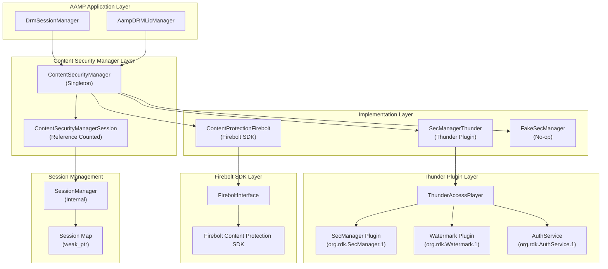
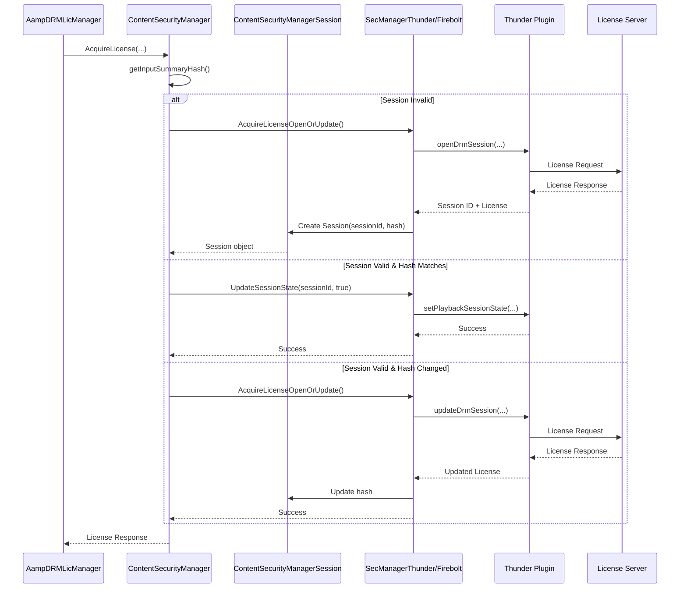
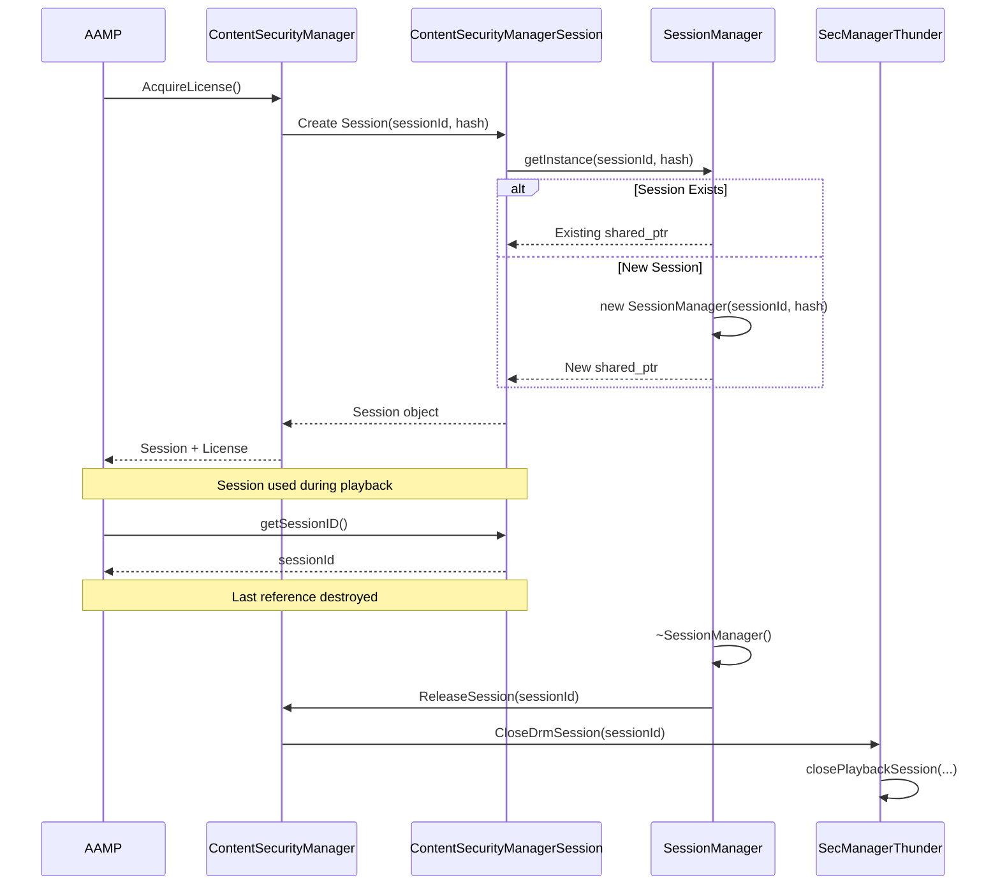
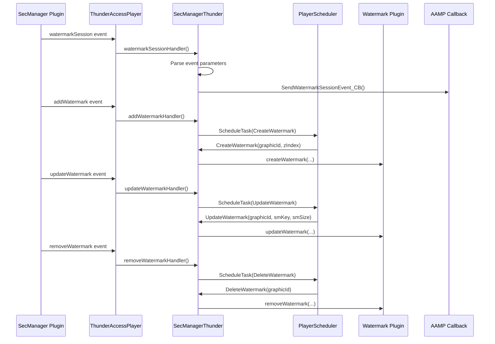
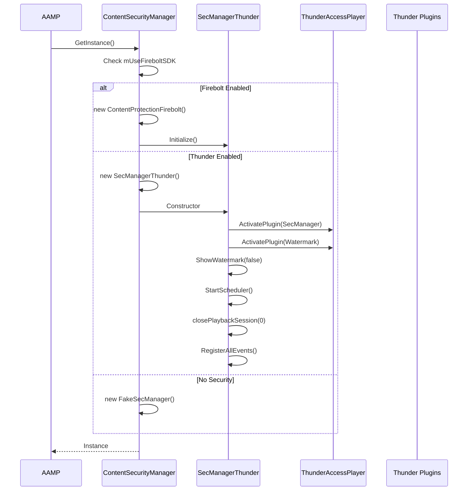
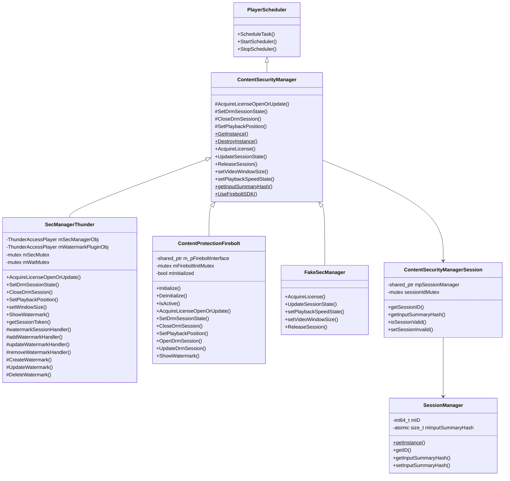

# Content Security Manager Architecture & Implementation

Comprehensive documentation of AAMP middleware externals/contentsecuritymanager: architecture, codeflow, APIs, classes, and implementation details

[← Back to Index](README.md)

## 1. Executive Summary

The Content Security Manager subsystem provides DRM license acquisition, session management, and watermarking capabilities for AAMP. This document provides detailed analysis of:

- High-level architecture and component organization
- Code organization and folder structure
- Complete execution flows (license acquisition → session management → watermarking)
- Important APIs and classes with detailed documentation
- Implementation details for DRM license acquisition
- Session lifecycle management with reference counting
- Watermarking integration and event handling
- Integration with AAMP DRM system and Thunder/Firebolt SDKs

## 2. High-Level Architecture

### 2.1 Architecture Overview

The Content Security Manager provides a unified interface for DRM license acquisition and watermarking:



### 2.2 Key Design Patterns

- **Singleton Pattern:** ContentSecurityManager uses singleton for global access
- **Strategy Pattern:** Different implementations (Thunder, Firebolt, Fake) for different platforms
- **Reference Counting:** ContentSecurityManagerSession uses shared_ptr for automatic session cleanup
- **Factory Pattern:** GetInstance() creates appropriate implementation based on configuration
- **Observer Pattern:** Watermark event handlers subscribe to Thunder plugin events

## 3. Code Organization

### 3.1 Folder Structure

```
middleware/externals/contentsecuritymanager/
├── ContentSecurityManager.h/cpp          # Base class and singleton
├── ContentSecurityManagerSession.h/cpp  # Session management with ref counting
├── SecManagerThunder.h/cpp              # Thunder plugin implementation
├── IFirebolt/
│   └── ContentProtectionFirebolt.h/cpp  # Firebolt SDK implementation
├── PlayerSecInterface.h/cpp              # Security interface definitions
├── PlayerMemoryUtils.h/cpp               # Shared memory utilities
└── ThunderAccessPlayer.h/cpp             # Thunder plugin access wrapper
```

### 3.2 File Responsibilities

| File | Responsibility |
|------|----------------|
| `ContentSecurityManager.h/cpp` | Base class defining interface for DRM license acquisition, session management, watermarking. Singleton pattern implementation. |
| `ContentSecurityManagerSession.h/cpp` | Session wrapper with reference counting. Automatically closes sessions when last reference is destroyed. |
| `SecManagerThunder.h/cpp` | Thunder plugin implementation. Communicates with SecManager and Watermark plugins via JSON-RPC. |
| `ContentProtectionFirebolt.h/cpp` | Firebolt SDK implementation. Provides Firebolt Content Protection SDK integration. |
| `PlayerSecInterface.h/cpp` | Error code definitions and security interface utilities. |
| `PlayerMemoryUtils.h/cpp` | Shared memory utilities for watermark image data transfer. |
| `ThunderAccessPlayer.h/cpp` | Wrapper for Thunder plugin JSON-RPC communication. |

## 4. Code Flow

### 4.1 License Acquisition Flow



### 4.2 Session Lifecycle Flow



### 4.3 Watermark Event Flow



### 4.4 Initialization Flow



## 5. Important APIs and Classes

### 5.1 ContentSecurityManager (Base Class)

```cpp
/**
 * @class ContentSecurityManager
 * @brief Base class for DRM license acquisition and session management
 */
class ContentSecurityManager : public PlayerScheduler {
public:
    // Singleton access
    static ContentSecurityManager* GetInstance();
    static void DestroyInstance();
    
    // License acquisition
    virtual bool AcquireLicense(
        std::string clientId, 
        std::string appId, 
        const char* licenseUrl,
        const char* moneyTraceMetadata[][2],
        const char* accessAttributes[][2],
        const char* contentMetadata, 
        size_t contentMetadataLen,
        const char* licenseRequest, 
        size_t licenseRequestLen,
        const char* keySystemId,
        const char* mediaUsage,
        const char* accessToken, 
        size_t accessTokenLen,
        ContentSecurityManagerSession &session,
        char** licenseResponse, 
        size_t* licenseResponseLength,
        int32_t* statusCode, 
        int32_t* reasonCode, 
        int32_t* businessStatus, 
        bool isVideoMuted, 
        int sleepTime
    );
    
    // Session management
    virtual bool UpdateSessionState(int64_t sessionId, bool active);
    virtual void ReleaseSession(int64_t sessionId);
    
    // Watermarking
    virtual bool setVideoWindowSize(int64_t sessionId, int64_t width, int64_t height);
    virtual bool setPlaybackSpeedState(int64_t sessionId, int64_t speed, int64_t position);
    
    // Callbacks
    static void setWatermarkSessionEvent_CB(
        const std::function<void(uint32_t, uint32_t, const std::string&)>& callback
    );
    
    // Utilities
    static std::size_t getInputSummaryHash(...);
    static void UseFireboltSDK(bool status);
    
protected:
    // Override in implementations
    virtual bool AcquireLicenseOpenOrUpdate(...) { return false; }
    virtual bool SetDrmSessionState(int64_t sessionId, bool active) { return false; }
    virtual void CloseDrmSession(int64_t sessionId) {}
    virtual bool SetPlaybackPosition(int64_t sessionId, float speed, int32_t position) { return false; }
    virtual bool setWindowSize(int64_t sessionId, int64_t width, int64_t height) { return false; }
};
```

### 5.2 ContentSecurityManagerSession

```cpp
/**
 * @class ContentSecurityManagerSession
 * @brief Session wrapper with reference counting
 * 
 * Sessions are automatically closed when the last reference is destroyed
 */
class ContentSecurityManagerSession {
public:
    // Constructors
    ContentSecurityManagerSession(int64_t sessionID, std::size_t inputSummaryHash);
    ContentSecurityManagerSession(); // Invalid session
    
    // Copyable (increases reference count)
    ContentSecurityManagerSession(const ContentSecurityManagerSession& other);
    ContentSecurityManagerSession& operator=(const ContentSecurityManagerSession& other);
    
    // Accessors
    int64_t getSessionID() const;
    std::size_t getInputSummaryHash();
    bool isSessionValid() const;
    void setSessionInvalid();
    std::string ToString();
    
private:
    class SessionManager {
    private:
        int64_t mID;
        std::atomic<std::size_t> mInputSummaryHash;
        
    public:
        static std::shared_ptr<SessionManager> getInstance(
            int64_t sessionID, 
            std::size_t inputSummaryHash
        );
        
        // Destructor calls ContentSecurityManager::ReleaseSession()
        ~SessionManager();
    };
    
    std::shared_ptr<SessionManager> mpSessionManager;
    mutable std::mutex sessionIdMutex;
};
```

### 5.3 SecManagerThunder

```cpp
/**
 * @class SecManagerThunder
 * @brief Thunder plugin implementation of ContentSecurityManager
 */
class SecManagerThunder : public ContentSecurityManager {
public:
    SecManagerThunder();
    ~SecManagerThunder();
    
    // Override base class methods
    bool AcquireLicenseOpenOrUpdate(...) override;
    bool SetDrmSessionState(int64_t sessionId, bool active) override;
    void CloseDrmSession(int64_t sessionId) override;
    bool SetPlaybackPosition(int64_t sessionId, float speed, int32_t position) override;
    bool setWindowSize(int64_t sessionId, int64_t width, int64_t height) override;
    bool getSessionToken(std::string &token);
    
    // Watermarking
    void ShowWatermark(bool show);
    
protected:
    // Event handlers
    void watermarkSessionHandler(const JsonObject& parameters);
    void addWatermarkHandler(const JsonObject& parameters);
    void updateWatermarkHandler(const JsonObject& parameters);
    void removeWatermarkHandler(const JsonObject& parameters);
    void showWatermarkHandler(const JsonObject& parameters);
    
    // Watermark operations
    void CreateWatermark(int graphicId, int zIndex);
    void UpdateWatermark(int graphicId, int smKey, int smSize);
    void DeleteWatermark(int graphicId);
    bool loadClutWatermark(...);
    
    // Event registration
    void RegisterAllEvents();
    void UnRegisterAllEvents();
    
private:
    ThunderAccessPlayer mSecManagerObj;      // SecManager plugin access
    ThunderAccessPlayer mWatermarkPluginObj; // Watermark plugin access
    std::mutex mSecMutex;
    std::mutex mWatMutex;
    std::mutex mSpeedStateMutex;
    std::list<std::string> mRegisteredEvents;
    bool mSchedulerStarted;
};
```

### 5.4 ContentProtectionFirebolt

```cpp
/**
 * @class ContentProtectionFirebolt
 * @brief Firebolt SDK implementation of ContentSecurityManager
 */
class ContentProtectionFirebolt : public ContentSecurityManager {
public:
    ContentProtectionFirebolt();
    ~ContentProtectionFirebolt();
    
    // Initialization
    void Initialize();
    void DeInitialize();
    bool IsActive(bool force = false);
    
    // Override base class methods
    bool AcquireLicenseOpenOrUpdate(...) override;
    bool SetDrmSessionState(int64_t sessionId, bool active) override;
    void CloseDrmSession(int64_t sessionId) override;
    bool SetPlaybackPosition(int64_t sessionId, float speed, int32_t position) override;
    
    // Firebolt-specific
    bool OpenDrmSession(...);
    bool UpdateDrmSession(...);
    void ShowWatermark(bool show, int64_t sessionId);
    void HandleWatermarkEvent(...);
    
private:
    void SubscribeEvents();
    void UnSubscribeEvents();
    
    std::mutex mFireboltInitMutex;
    std::mutex mContentProtectionMutex;
    std::mutex mSpeedStateMutex;
    bool mInitialized;
    static uint64_t mSubscriptionId;
    std::shared_ptr<FireboltInterface> m_pFireboltInterface;
};
```

## 6. Implementation Details

### 6.1 License Acquisition Logic

The `AcquireLicense` method implements smart session reuse:

1. **Calculate Input Hash:** Hash of all input parameters (metadata, license request, etc.)
2. **Check Session Validity:**
    - If session invalid → Open new session
    - If session valid and hash matches → Activate existing session
    - If session valid but hash changed → Update session
3. **Call Implementation:** Delegates to `AcquireLicenseOpenOrUpdate` if needed

### 6.2 Session Reference Counting

ContentSecurityManagerSession uses shared_ptr for automatic cleanup:

- **SessionManager:** Internal class that holds session ID and hash
- **Shared Instance Map:** Static map of sessionID → weak_ptr<SessionManager>
- **Automatic Cleanup:** When last shared_ptr is destroyed, ~SessionManager() calls ReleaseSession()
- **Thread Safety:** Mutex protection for session access

### 6.3 Input Summary Hash

The input summary hash is calculated from:

- Money trace metadata (distributedTraceId)
- Video mute state
- Key system ID
- Media usage (stream/download)
- Access token
- Content metadata
- License request

This hash is used to determine if session can be reused or needs update.

### 6.4 Thunder Plugin Communication

SecManagerThunder communicates via JSON-RPC:

- **SecManager Plugin:** `org.rdk.SecManager.1`
    - `openDrmSession` - Open new DRM session
    - `updateDrmSession` - Update existing session
    - `closePlaybackSession` - Close session
    - `setPlaybackSessionState` - Set active/inactive
    - `setPlaybackPosition` - Update playback position
    - `setWindowSize` - Set video window size
- **Watermark Plugin:** `org.rdk.Watermark.1`
    - `createWatermark` - Create watermark graphic
    - `updateWatermark` - Update watermark image
    - `removeWatermark` - Remove watermark
    - `showWatermark` - Show/hide watermark
- **AuthService Plugin:** `org.rdk.AuthService.1`
    - `getSessionToken` - Get access token

### 6.5 Watermark Event Handling

Watermark events are handled asynchronously:

1. Thunder plugin sends event via JSON-RPC
2. Event handler parses parameters
3. Task scheduled on PlayerScheduler thread
4. Watermark operation executed (create/update/delete)
5. Watermark plugin called via JSON-RPC

### 6.6 Shared Memory for Watermark

Watermark image data is transferred via shared memory:

- **PlayerMemoryUtils:** Provides shared memory creation/cleanup
- **Buffer Keys:** Shared memory keys passed to watermark plugin
- **CLUT Palette:** Color lookup table for watermark rendering
- **Image Buffer:** Watermark image data

### 6.7 Error Codes

Content Security Manager uses structured error codes:

- **Class Codes:** General category (SUCCESS, API_FAIL, DRM_FAIL, WATERMARK_FAIL)
- **Reason Codes:** Specific error within category
- **Business Status:** Business-level status code

## 7. Integration with AAMP

### 7.1 DRM License Acquisition

AAMP integrates ContentSecurityManager for license acquisition:

```cpp
// From AampDRMLicManager.cpp
if (aampInstance->mConfig->IsConfigSet(eAAMPConfig_UseSecManager) || 
    aampInstance->mConfig->IsConfigSet(eAAMPConfig_UseFireboltSDK)) {
    
    bool res = ContentSecurityManager::GetInstance()->AcquireLicense(
        clientId, appId, licenseUrl,
        requestMetadata, accessAttributes,
        encodedData, encodedDataLen,
        encodedChallengeData, encodedChallengeDataLen,
        keySystem, mediaUsage,
        secclientSessionToken, tokenLen,
        mDrmSessionManager->mContentSecurityManagerSession,
        &licenseResponseStr, &licenseResponseLength,
        &statusCode, &reasonCode, &businessStatus,
        videoMuteState, sleepTime
    );
    
    if (res) {
        // Process license response
        licenseResponse = new DrmData(licenseResponseStr, licenseResponseLength);
    } else {
        // Handle error
        eventHandle->SetVerboseErrorCode(statusCode, reasonCode, businessStatus);
    }
}
```

### 7.2 Session State Management

DrmSessionManager manages session lifecycle:

- **Session Creation:** Created during license acquisition
- **Session Activation:** Set to active when playback starts
- **Session Deactivation:** Set to inactive on pause/cleanup
- **Session Release:** Automatically released when last reference destroyed

### 7.3 Watermark Callback Registration

DrmSessionManager registers watermark event callback:

```cpp
// From DrmSessionManager.cpp
void DrmSessionManager::registerCallback() {
    ContentSecurityManager::setWatermarkSessionEvent_CB(
        [this](uint32_t classCode, uint32_t reasonCode, const std::string& appId) {
            // Handle watermark session event
            // Send event to AAMP application
        }
    );
}
```

### 7.4 Playback State Updates

AAMP updates playback state for watermark alignment:

- **Window Size:** Updated when video resolution changes
- **Playback Speed:** Updated for trick play (fast forward/rewind)
- **Playback Position:** Updated for seek operations

## 8. Class Diagrams

### 8.1 Content Security Manager Class Hierarchy



## 9. Error Handling

### 9.1 License Acquisition Failures

License acquisition may fail with various error codes:

- **DRM Failures:** General failures, timeouts, network errors, busy, token errors
- **API Failures:** Invalid parameters, invalid session ID, invalid application ID
- **Business Failures:** Entitlement errors, permission denied, rule errors

Errors are returned via statusCode, reasonCode, and businessStatus parameters.

### 9.2 Session Management Failures

Session operations may fail if:

- Session ID is invalid
- Thunder plugin is unavailable
- Session already closed

### 9.3 Watermark Failures

Watermark operations may fail with:

- Watermark service unavailable
- Image tampering detected
- Memory allocation errors
- Protocol errors

### 9.4 Retry Logic

License acquisition includes retry logic:

- **MAX_LICENSE_REQUEST_ATTEMPTS:** 2 attempts
- **Retry Conditions:** Timeout, network failure, service busy
- **Sleep Time:** Configurable delay between retries

## 10. Thread Safety

### 10.1 Singleton Thread Safety

GetInstance() and DestroyInstance() are protected by mutex:

- InstanceMutex protects singleton creation/destruction
- Race condition still possible between GetInstance() and DestroyInstance()
- Instance pointer should be used immediately after GetInstance()

### 10.2 Session Thread Safety

ContentSecurityManagerSession is thread-safe:

- sessionIdMutex protects mpSessionManager access
- Copy operations lock both source and destination mutexes
- SessionManager uses atomic for inputSummaryHash

### 10.3 Implementation Thread Safety

Implementations use mutexes for:

- **SecManagerThunder:** mSecMutex, mWatMutex, mSpeedStateMutex
- **ContentProtectionFirebolt:** mFireboltInitMutex, mContentProtectionMutex, mSpeedStateMutex
- **Watermark Operations:** Scheduled on PlayerScheduler thread

## 11. Code Analysis and Improvements

### 11.1 Strengths

- Clean abstraction with base class and implementations
- Smart session reuse reduces license server load
- Automatic session cleanup via reference counting
- Comprehensive error code structure
- Asynchronous watermark event handling
- Support for multiple backends (Thunder, Firebolt)

### 11.2 Potential Improvements

- **Singleton Race Condition:** Could use std::call_once for safer singleton initialization
- **Error Handling:** Could use exceptions or error codes more consistently
- **Documentation:** Could add more detailed documentation for error codes
- **Testing:** Could add more unit tests for session management
- **Configuration:** Could make retry logic and timeouts configurable
- **Memory Management:** Could use smart pointers for license response
- **Logging:** Could add more detailed logging for debugging

---

[← Back to Index](README.md)

