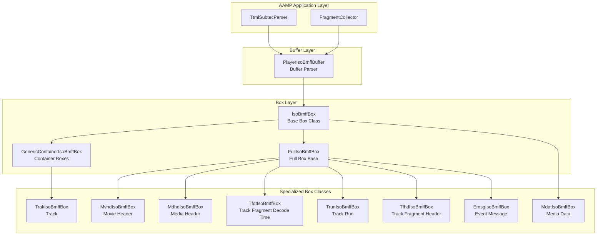
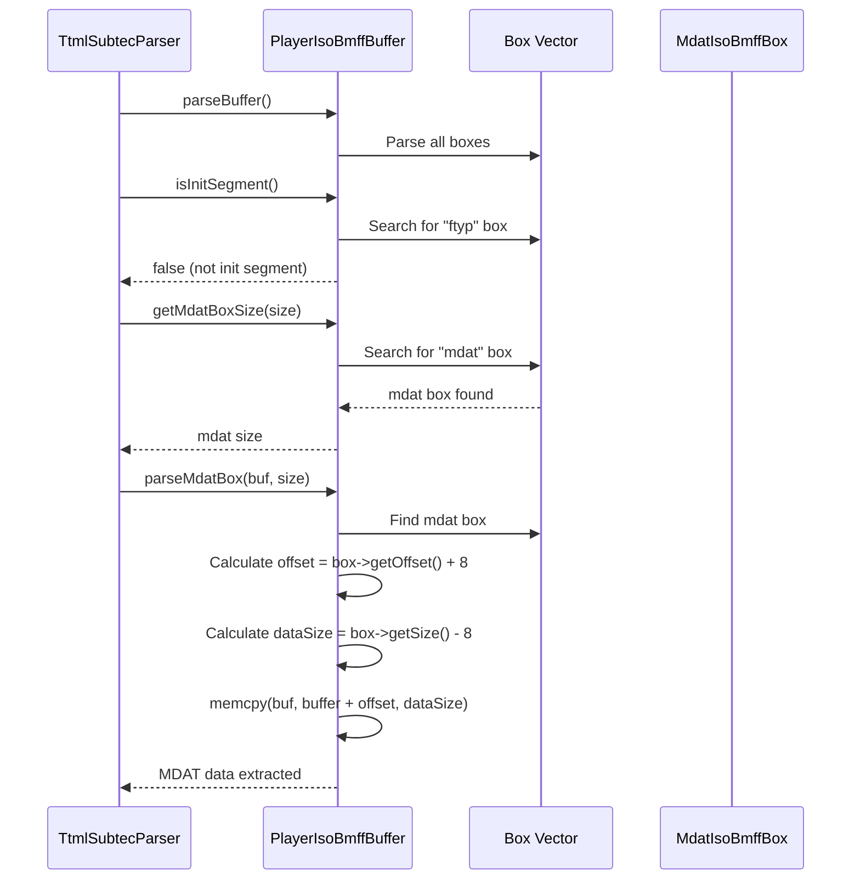

# Player ISO BMFF Architecture & Implementation

Comprehensive documentation of AAMP middleware playerisobmff: architecture, codeflow, APIs, classes, and implementation details

[← Back to Index](README.md)

## 1. Executive Summary

The Player ISO BMFF subsystem provides parsing and manipulation capabilities for ISO Base Media File Format (ISO BMFF) containers used in DASH and HLS streaming. This document provides detailed analysis of:

- High-level architecture and component organization
- Code organization and folder structure
- Complete execution flows (buffer parsing → box construction → data extraction)
- Important APIs and classes with detailed documentation
- Implementation details for ISO BMFF box parsing
- Box type hierarchy and specialized box classes
- Integration with AAMP for TTML subtitle parsing and media segment processing

## 2. High-Level Architecture

### 2.1 Architecture Overview

The ISO BMFF parser provides a hierarchical box-based parsing system:



### 2.2 Key Design Patterns

- **Factory Pattern:** IsoBmffBox::constructBox() creates appropriate box type based on box type string
- **Composite Pattern:** GenericContainerIsoBmffBox contains child boxes, forming a tree structure
- **Template Method Pattern:** Base IsoBmffBox defines common interface, derived classes implement specifics
- **Strategy Pattern:** Different box types handle different data structures

## 3. Code Organization

### 3.1 Folder Structure

```
middleware/playerisobmff/
├── playerisobmffbox.h/cpp      # Box class hierarchy and implementations
└── playerisobmffbuffer.h/cpp  # Buffer parser and box management
```

### 3.2 File Responsibilities

| File | Responsibility |
|------|----------------|
| `playerisobmffbox.h/cpp` | Base IsoBmffBox class, specialized box classes (Mvhd, Mdhd, Tfdt, Trun, Tfhd, Emsg, etc.), box construction factory, utility functions for reading/writing box data |
| `playerisobmffbuffer.h/cpp` | PlayerIsoBmffBuffer class for parsing ISO BMFF buffers, managing box collection, extracting mdat boxes, checking initialization segments |

## 4. Code Flow

### 4.1 Buffer Parsing Flow

```mermaid
sequenceDiagram
    participant App as AAMP/TtmlParser
    participant Buffer as PlayerIsoBmffBuffer
    participant Factory as IsoBmffBox::constructBox
    participant Box as IsoBmffBox
    participant Container as GenericContainer
    
    App->>Buffer: setBuffer(buffer, size)
    App->>Buffer: parseBuffer()
    Buffer->>Buffer: curOffset = 0
    loop For each box in buffer
        Buffer->>Factory: constructBox(buffer+offset, remainingSize)
        Factory->>Factory: Read size (4 bytes)
        Factory->>Factory: Read type (4 bytes)
        alt Container Box (moov, moof, trak, etc.)
            Factory->>Container: constructContainer()
            Container->>Container: Parse child boxes recursively
            Container-->>Factory: Container box
        else Specialized Box (mvhd, mdhd, tfdt, etc.)
            Factory->>Box: construct specialized box
            Box-->>Factory: Specialized box
        else Generic Box
            Factory->>Box: new IsoBmffBox()
            Box-->>Factory: Generic box
        end
        Factory-->>Buffer: Box object
        Buffer->>Box: setOffset(curOffset)
        Buffer->>Buffer: boxes.push_back(box)
        Buffer->>Buffer: curOffset += box->getSize()
    end
    Buffer-->>App: Parsing complete
```

### 4.2 Box Construction Flow

```mermaid
sequenceDiagram
    participant Factory as constructBox
    participant Buffer as Input Buffer
    participant Box as IsoBmffBox
    participant FullBox as FullIsoBmffBox
    participant Specialized as Specialized Box
    
    Factory->>Buffer: Read 4 bytes (size)
    Factory->>Buffer: Read 4 bytes (type)
    Factory->>Factory: Check box type
    alt Container Box Type
        Factory->>FullBox: Read version + flags
        Factory->>Specialized: constructContainer()
        Specialized->>Specialized: Parse children recursively
        Specialized-->>Factory: Container box
    else Header Box Type
        Factory->>FullBox: Read version + flags
        Factory->>Specialized: constructMvhdBox/constructMdhdBox()
        Specialized->>Specialized: Parse timeScale
        Specialized-->>Factory: Header box
    else TFDT Box Type
        Factory->>FullBox: Read version + flags
        Factory->>Specialized: constructTfdtBox()
        Specialized->>Specialized: Parse baseMDT
        Specialized-->>Factory: TFDT box
    else TRUN Box Type
        Factory->>FullBox: Read version + flags
        Factory->>Specialized: constructTrunBox()
        Specialized->>Specialized: Parse sample entries
        Specialized-->>Factory: TRUN box
    else MDAT Box Type
        Factory->>Specialized: constructMdatBox()
        Specialized-->>Factory: MDAT box
    else Unknown Type
        Factory->>Box: new IsoBmffBox(size, type)
        Box-->>Factory: Generic box
    end
```

### 4.3 MDAT Extraction Flow



## 5. Important APIs and Classes

### 5.1 PlayerIsoBmffBuffer

```cpp
/**
 * @class PlayerIsoBmffBuffer
 * @brief Class for parsing ISO BMFF buffers
 */
class PlayerIsoBmffBuffer {
public:
    PlayerIsoBmffBuffer();
    ~PlayerIsoBmffBuffer();
    
    // Buffer management
    void setBuffer(uint8_t *buf, size_t sz);
    bool parseBuffer(bool correctBoxSize = false, int newTrackId = -1);
    
    // Box access
    player_isobmff::IsoBmffBox* getChunkedfBox() const;
    
    // Segment identification
    bool isInitSegment();
    
    // MDAT extraction
    bool parseMdatBox(uint8_t *buf, size_t &size);
    bool getMdatBoxSize(size_t &size);
    
    // Debugging
    void printBoxes();
    
    // Buffer update (for chunked boxes)
    int UpdateBufferData(size_t parsedBoxCount, char* &unParsedBuffer,
                        size_t &unParsedBufferSize, size_t &parsedBufferSize);
};
```

### 5.2 IsoBmffBox (Base Class)

```cpp
namespace player_isobmff {
class IsoBmffBox {
public:
    // Box type constants
    static constexpr const char *FTYP = "ftyp";
    static constexpr const char *MOOV = "moov";
    static constexpr const char *MVHD = "mvhd";
    static constexpr const char *TRAK = "trak";
    static constexpr const char *MDAT = "mdat";
    static constexpr const char *TFDT = "tfdt";
    static constexpr const char *TRUN = "trun";
    // ... more types
    
    // Construction
    static IsoBmffBox* constructBox(uint8_t *hdr, uint32_t maxSz, 
                                   bool correctBoxSize = false, 
                                   int newTrackId = -1);
    
    // Accessors
    uint32_t getSize() const;
    void setSize(uint32_t newSize);
    const char *getType() const;
    uint32_t getOffset() const;
    void setOffset(uint32_t os);
    
    // Children (for container boxes)
    virtual bool hasChildren() const;
    virtual const std::vector<IsoBmffBox*> *getChildren() const;
    
    // Manipulation
    void rewriteAsSkipBox();
    virtual void truncate(void) {}
};
```

### 5.3 Specialized Box Classes

#### MvhdIsoBmffBox (Movie Header)
```cpp
class MvhdIsoBmffBox : public FullIsoBmffBox {
public:
    void setTimeScale(uint32_t tScale);
    uint32_t getTimeScale();
    static MvhdIsoBmffBox* constructMvhdBox(uint32_t sz, uint8_t *ptr);
};
```

#### TfdtIsoBmffBox (Track Fragment Decode Time)
```cpp
class TfdtIsoBmffBox : public FullIsoBmffBox {
public:
    void setBaseMDT(uint64_t mdt);
    uint64_t getBaseMDT();
    static TfdtIsoBmffBox* constructTfdtBox(uint32_t sz, uint8_t *ptr);
};
```

#### TrunIsoBmffBox (Track Run)
```cpp
class TrunIsoBmffBox : public FullIsoBmffBox {
public:
    struct Entry {
        uint32_t sample_duration;
        uint32_t sample_size;
        uint32_t sample_flags;
        uint32_t sample_composition_time_offset;
    };
    
    void setFirstSampleDuration(uint64_t sampleDuration);
    uint64_t getSampleDuration();
    uint32_t getSampleCount();
    static TrunIsoBmffBox* constructTrunBox(uint32_t sz, uint8_t *ptr);
};
```

## 6. Implementation Details

### 6.1 Box Structure

ISO BMFF boxes have a standard structure:
- **Size (4 bytes):** Total box size including header
- **Type (4 bytes):** Box type identifier (e.g., "ftyp", "moov")
- **Data (variable):** Box-specific data

For FullBox types, additional fields:
- **Version (1 byte):** Box version
- **Flags (3 bytes):** Box flags

### 6.2 Box Construction Factory

The `constructBox()` factory method:
1. Reads box size and type from buffer
2. Validates size against available buffer
3. Optionally corrects box size if `correctBoxSize` is true
4. Matches box type to specialized constructor
5. Returns appropriate box object

### 6.3 Container Box Parsing

Container boxes parse children recursively:
1. Read container box header
2. Calculate remaining size
3. While remaining size > 0:
   - Call `constructBox()` for child
   - Add child to children vector
   - Update remaining size

### 6.4 Box Size Correction

Box size correction handles edge cases:
- When box size > available buffer size
- Used for HTTP range requests where entire file is received
- Corrects box size to match available buffer
- Prevents parsing errors from invalid sizes

## 7. Integration with AAMP

### 7.1 TTML Subtitle Parsing

TtmlSubtecParser uses PlayerIsoBmffBuffer to extract TTML data:

```cpp
// From TtmlSubtecParser.cpp
bool TtmlSubtecParser::processData(const char* buffer, size_t bufferLen, 
                                   double position, double duration) {
    PlayerIsoBmffBuffer isobuf;
    
    isobuf.setBuffer((uint8_t *)buffer, bufferLen);
    isobuf.parseBuffer();
    
    if (!isobuf.isInitSegment()) {
        uint8_t *mdat;
        size_t mdatLen;
        
        // Get MDAT box size
        isobuf.getMdatBoxSize(mdatLen);
        
        // Allocate and extract MDAT data
        mdat = (uint8_t *)malloc(mdatLen);
        isobuf.parseMdatBox(mdat, mdatLen);
        
        // Process TTML data from MDAT
        std::vector<uint8_t> data(mdatLen);
        data.assign(mdat, mdat+mdatLen);
        
        // Send to Subtec renderer
    }
}
```

### 7.2 Initialization Segment Detection

AAMP uses `isInitSegment()` to distinguish:
- **Init Segments:** Contain "ftyp" box, provide track configuration
- **Media Segments:** Contain "moof" and "mdat" boxes, provide media samples

## 8. Box Type Reference

### 8.1 Container Boxes

| Box Type | Description | Usage |
|----------|-------------|-------|
| `ftyp` | File Type | Identifies file type and compatibility |
| `moov` | Movie | Contains movie metadata (init segment) |
| `moof` | Movie Fragment | Contains fragment metadata (media segment) |
| `trak` | Track | Contains track information |
| `mdia` | Media | Contains media information |
| `traf` | Track Fragment | Contains track fragment information |

### 8.2 Full Boxes

| Box Type | Description | Key Fields |
|----------|-------------|------------|
| `mvhd` | Movie Header | timeScale, duration |
| `mdhd` | Media Header | timeScale, duration |
| `tfhd` | Track Fragment Header | track_ID, default_sample_duration |
| `tfdt` | Track Fragment Decode Time | baseMediaDecodeTime |
| `trun` | Track Run | sample_count, sample entries |
| `emsg` | Event Message | scheme_id_uri, message_data, presentation_time |

### 8.3 Data Boxes

| Box Type | Description | Usage |
|----------|-------------|-------|
| `mdat` | Media Data | Contains actual media samples |
| `sidx` | Segment Index | Provides segment indexing information |
| `senc` | Sample Encryption | Contains encryption information |
| `saiz` | Sample Auxiliary Information Sizes | Contains sizes of auxiliary information |

## 9. Error Handling

### 9.1 Invalid Box Size

When box size > available buffer:
- If `correctBoxSize` is true, box size is corrected to buffer size
- Otherwise, parsing continues but box may be incomplete
- Chunked box flag is set for later completion

### 9.2 Unknown Box Types

Unknown box types are handled by:
- Creating generic `IsoBmffBox` object
- Preserving box size and type
- Allowing parsing to continue
- Box can be skipped or processed generically

## 10. Code Analysis and Improvements

### 10.1 Strengths

- Clean factory pattern for box construction
- Hierarchical box structure matches ISO BMFF specification
- Support for specialized box types with type-specific accessors
- Efficient parsing with minimal memory allocation
- Support for box size correction and chunked boxes

### 10.2 Potential Improvements

- **Memory Management:** Could use smart pointers for box ownership
- **Error Handling:** Could use exceptions or error codes for better error reporting
- **Validation:** Could add more validation for box structure and data integrity
- **Performance:** Could optimize box search operations
- **Thread Safety:** Could add thread safety if needed for concurrent parsing

---

[← Back to Index](README.md)

