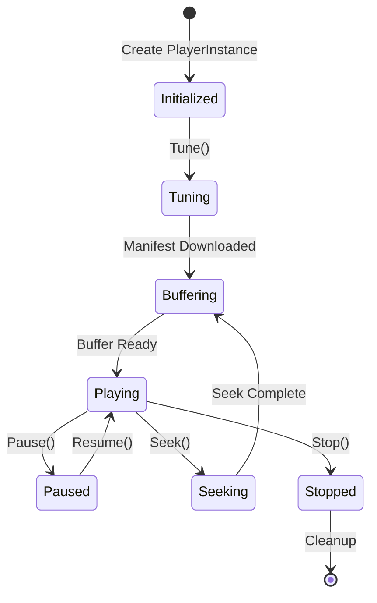
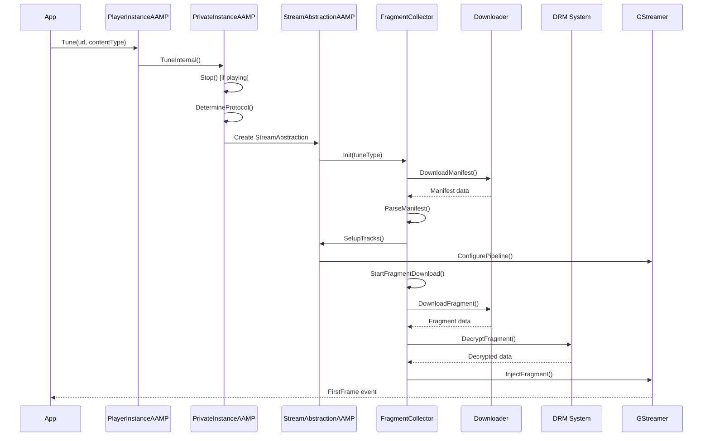
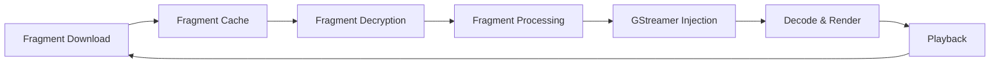
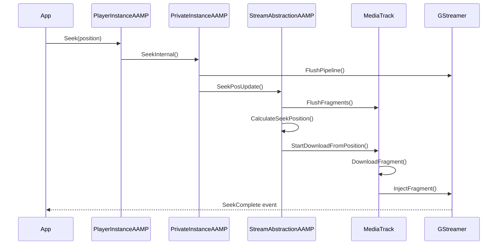
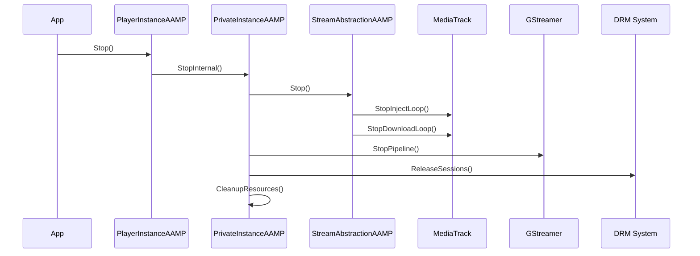

# Workflows & Execution Flow

## Table of Contents
1. [Lifecycle Overview](#lifecycle-overview)
2. [Initialization Sequence](#initialization-sequence)
3. [Tune Workflow](#tune-workflow)
4. [Playback Flow](#playback-flow)
5. [Seek Workflow](#seek-workflow)
6. [Error Handling](#error-handling)
7. [Shutdown Sequence](#shutdown-sequence)

## Lifecycle Overview



## Initialization Sequence

### 1. Player Instance Creation

**Entry Point**: `PlayerInstanceAAMP::PlayerInstanceAAMP()`

```cpp
PlayerInstanceAAMP::PlayerInstanceAAMP(
    StreamSink* streamSink,
    std::function<void(...)> exportFrames,
    bool powerEvt)
{
    // 1. Initialize global configuration (first instance only)
    if (gpGlobalConfig == NULL) {
        curl_global_init(CURL_GLOBAL_DEFAULT);
        gpGlobalConfig = new AampConfig();
        gpGlobalConfig->Initialize();
        gpGlobalConfig->ReadAampCfgTxtFile();
        gpGlobalConfig->ReadOperatorConfiguration();
    }

    // 2. Copy configuration to instance
    mConfig = *gpGlobalConfig;

    // 3. Create private instance
    sp_aamp = std::make_shared<PrivateInstanceAAMP>(&mConfig);
    aamp = sp_aamp.get();

    // 4. Start scheduler
    mScheduler.StartScheduler(aamp->mPlayerId);

    // 5. Setup stream sink
    if (streamSink == NULL) {
        AampStreamSinkManager::GetInstance()
            .CreateStreamSink(aamp, id3_handler, exportFrames);
    }
}
```

### 2. Private Instance Initialization

**Entry Point**: `PrivateInstanceAAMP::PrivateInstanceAAMP()`

```cpp
PrivateInstanceAAMP::PrivateInstanceAAMP(AampConfig* config)
{
    // 1. Initialize configuration
    mConfig = config;

    // 2. Initialize event manager
    mEventManager = new AampEventManager(mPlayerId);

    // 3. Initialize ABR manager
    mhAbrManager = ABRManager();

    // 4. Initialize GStreamer player
    mGstPlayer = new AAMPGstPlayer(this);

    // 5. Initialize downloader
    mCurlStore = new AampCurlStore();

    // 6. Initialize TSB (if enabled)
    if (TSB enabled) {
        mTSBSessionManager = new AampTSBSessionManager(this);
    }
}
```

### 3. Configuration Loading

**Priority Order** (lowest to highest):

1. **Code Defaults**: Hard-coded default values
2. **Operator Settings**: RFC/Environment variables
3. **Stream Settings**: Settings from manifest
4. **Application Settings**: Runtime API calls
5. **Developer Config**: `/opt/aamp.cfg` or `/opt/aampcfg.json`

## Tune Workflow

### Sequence Diagram



### Detailed Steps

#### Step 1: Tune Request

```cpp
void PlayerInstanceAAMP::Tune(
    const char* mainManifestUrl,
    bool autoPlay,
    const char* contentType)
{
    // Validate input
    // Determine if async tune
    if (asyncTuneEnabled) {
        // Schedule async tune
        mScheduler.ScheduleTask([this, url]() {
            TuneInternal(...);
        });
    } else {
        TuneInternal(...);
    }
}
```

#### Step 2: Protocol Detection

```cpp
void PrivateInstanceAAMP::TuneInternal(...)
{
    // Detect protocol from URL or contentType
    if (url ends with .m3u8) {
        protocol = HLS;
    } else if (url ends with .mpd) {
        protocol = DASH;
    } else if (contentType == "video/mp4") {
        protocol = Progressive;
    }

    // Create appropriate collector
    switch (protocol) {
        case HLS:
            mStreamAbstraction = new StreamAbstractionAAMP_HLS(this);
            break;
        case DASH:
            mStreamAbstraction = new StreamAbstractionAAMP_MPD(this);
            break;
        // ...
    }
}
```

#### Step 3: Manifest Download

```cpp
bool FragmentCollector::DownloadManifest()
{
    // Download manifest
    AampCurlDownloader downloader;
    int httpError = downloader.GetFile(manifestUrl, &buffer);

    if (httpError == 200) {
        // Parse manifest
        ProcessManifest(buffer);
        return true;
    }

    // Handle errors
    return false;
}
```

#### Step 4: Track Setup

```cpp
void StreamAbstractionAAMP::SetupTracks()
{
    // Create video track
    videoTrack = new MediaTrack(eTRACK_VIDEO, this, "video");

    // Create audio track
    audioTrack = new MediaTrack(eTRACK_AUDIO, this, "audio");

    // Create subtitle track (if available)
    if (hasSubtitles) {
        subtitleTrack = new MediaTrack(eTRACK_SUBTITLE, this, "subtitle");
    }

    // Start download threads
    videoTrack->StartInjectLoop();
    audioTrack->StartInjectLoop();
}
```

#### Step 5: Pipeline Configuration

```cpp
void AAMPGstPlayer::Configure(
    StreamOutputFormat format,
    StreamOutputFormat audioFormat,
    ...)
{
    // Create GStreamer pipeline
    pipeline = gst_pipeline_new("aamp-pipeline");

    // Add elements based on format
    if (format == FORMAT_ISO_BMFF) {
        // Add qtdemux
    } else if (format == FORMAT_MPEG_TS) {
        // Add tsdemux
    }

    // Add decoders
    // Add sinks
    // Link elements

    // Set pipeline to READY state
    gst_element_set_state(pipeline, GST_STATE_READY);
}
```

#### Step 6: Fragment Download Loop

```cpp
void MediaTrack::FragmentDownloader()
{
    while (!abort) {
        // Get next fragment URL
        std::string url = GetNextFragmentUrl();

        // Get cache buffer
        CachedFragment* fragment = GetFetchBuffer(true);

        // Download fragment
        bool success = DownloadFragment(url, fragment);

        if (success) {
            // Decrypt if needed
            if (hasDRM) {
                DecryptFragment(fragment);
            }

            // Signal fragment available
            fragmentFetched.notify_one();
        }
    }
}
```

#### Step 7: Fragment Injection Loop

```cpp
void MediaTrack::RunInjectLoop()
{
    while (!abortInject) {
        // Wait for cached fragment
        if (WaitForCachedFragmentAvailable()) {
            // Process fragment
            ProcessAndInjectFragment(cachedFragment);

            // Update indices
            fragmentIdxToInject = (fragmentIdxToInject + 1) % maxCachedFragments;
        }
    }
}
```

## Playback Flow

### Normal Playback



### Buffer Management

```cpp
void MediaTrack::MonitorBufferHealth()
{
    while (bufferMonitorRunning) {
        // Calculate buffer level
        double bufferLevel = GetBufferedDuration();

        // Update buffer status
        if (bufferLevel < minBuffer) {
            bufferStatus = BUFFER_STATUS_RED;
            // Trigger rampdown
        } else if (bufferLevel < warningBuffer) {
            bufferStatus = BUFFER_STATUS_YELLOW;
        } else {
            bufferStatus = BUFFER_STATUS_GREEN;
        }

        // Wait for next check
        sleep(bufferCheckInterval);
    }
}
```

### ABR Profile Switching

```cpp
void StreamAbstractionAAMP::CheckForProfileChange()
{
    // Get current network bandwidth
    BitsPerSecond currentBW = GetCurrentBandwidth();

    // Query ABR manager
    int desiredProfile = mhAbrManager.getProfileIndexByBitrateRampUpOrDown(
        currentProfileIndex, currentBandwidth, currentBW);

    if (desiredProfile != currentProfileIndex) {
        // Switch profile
        currentProfileIndex = desiredProfile;

        // Update track
        videoTrack->ABRProfileChanged();

        // Notify event
        NotifyBitRateUpdate(desiredProfile, ...);
    }
}
```

## Seek Workflow

### Seek Sequence



### Seek Implementation

```cpp
void PrivateInstanceAAMP::SeekInternal(
    double secondsRelativeToTuneTime, bool keepPaused)
{
    // 1. Flush pipeline
    mGstPlayer->Flush();

    // 2. Flush fragment caches
    if (mStreamAbstraction) {
        mStreamAbstraction->FlushFragments();
    }

    // 3. Calculate seek position
    double seekPosition = CalculateSeekPosition(secondsRelativeToTuneTime);

    // 4. Update stream abstraction
    mStreamAbstraction->SeekPosUpdate(seekPosition);

    // 5. Resume playback (if not keepPaused)
    if (!keepPaused) {
        mGstPlayer->Play();
    }
}
```

## Error Handling

### Error Types

1. **Network Errors**: HTTP errors, timeouts, connection failures
2. **DRM Errors**: License acquisition failures, decryption errors
3. **Pipeline Errors**: GStreamer errors, decode failures
4. **Manifest Errors**: Parse errors, invalid manifests
5. **Buffer Errors**: Underflows, stalls

### Error Recovery

```cpp
void MediaTrack::HandleDownloadFailure(int httpError)
{
    // Check error type
    if (httpError == 404) {
        // Fragment not found - ramp down
        RampDownProfile();
    } else if (httpError == 503) {
        // Service unavailable - retry
        RetryDownload();
    } else if (httpError == timeout) {
        // Timeout - ramp down and retry
        RampDownProfile();
        RetryDownload();
    }

    // Check retry limit
    if (retryCount >= maxRetries) {
        // Report error
        aamp->SendErrorEvent(errorCode);
    }
}
```

### Retune Logic

```cpp
void PrivateInstanceAAMP::InternalRetune()
{
    // Save current state
    double currentPosition = GetPlaybackPosition();

    // Stop current playback
    Stop();

    // Retune with same URL
    TuneInternal(mManifestUrl, true, mContentType, ...);

    // Seek to previous position
    SeekInternal(currentPosition, false);
}
```

## Shutdown Sequence

### Stop Workflow



### Cleanup Implementation

```cpp
void PrivateInstanceAAMP::StopInternal(
    bool sendStateChangeEvent, bool forceCleanup)
{
    // 1. Set abort flags
    abort = true;

    // 2. Stop stream abstraction
    if (mStreamAbstraction) {
        mStreamAbstraction->Stop(clearChannelData);
    }

    // 3. Stop GStreamer pipeline
    if (mGstPlayer) {
        mGstPlayer->Stop();
    }

    // 4. Release DRM sessions
    if (forceCleanup) {
        ReleaseAllDRMSessions();
    }

    // 5. Flush caches
    FlushAllCaches();

    // 6. Send state change event
    if (sendStateChangeEvent) {
        SendStateChangeEvent(eSTATE_STOPPED);
    }
}
```

## Summary

The AAMP execution flow follows these key patterns:

1. **Initialization**: Configuration → Player Creation → Resource Setup
2. **Tune**: Protocol Detection → Manifest Download → Track Setup → Pipeline Config → Fragment Download
3. **Playback**: Download → Decrypt → Process → Inject → Decode → Render
4. **Seek**: Flush → Calculate Position → Download from Position → Resume
5. **Error Handling**: Detect → Classify → Recover → Retry → Report
6. **Shutdown**: Stop → Flush → Release → Cleanup

This workflow ensures reliable, efficient playback while handling errors gracefully.
