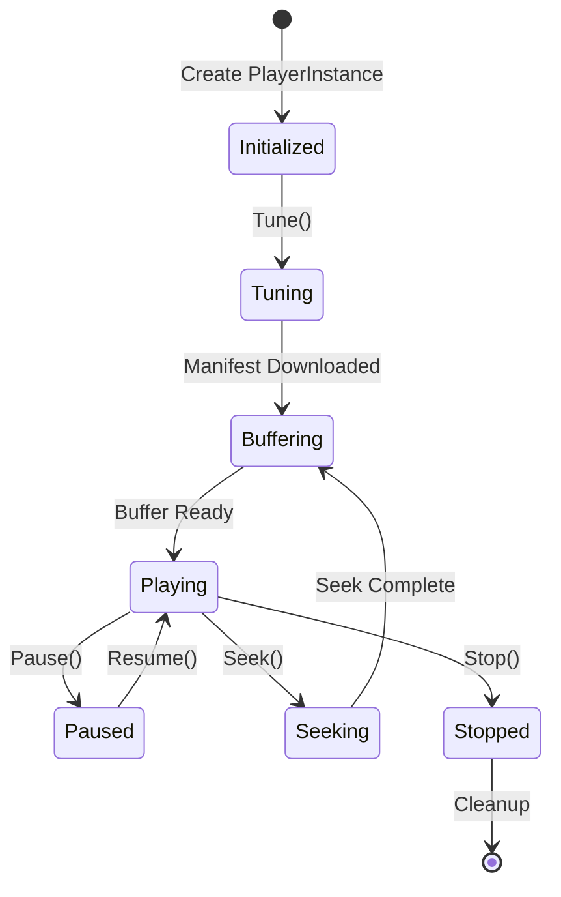
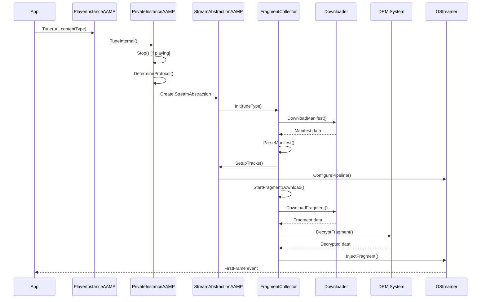
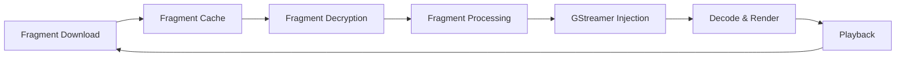
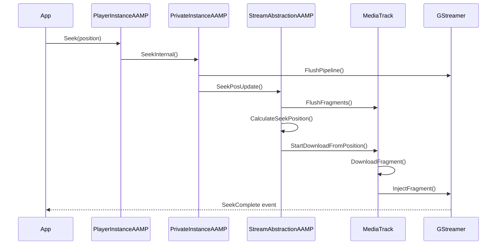
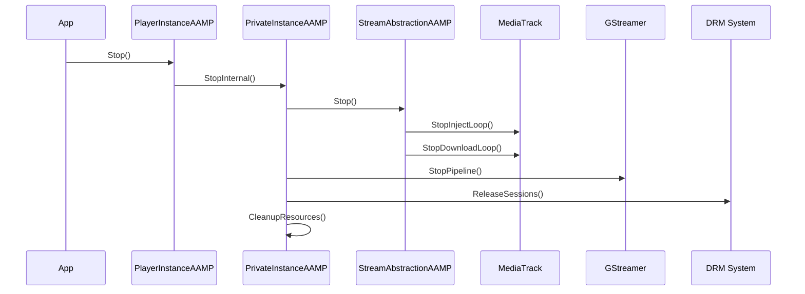

# Workflows & Execution Flow

## Table of Contents
1. [Lifecycle Overview](#lifecycle-overview)
2. [Initialization Sequence](#initialization-sequence)
3. [Tune Workflow](#tune-workflow)
4. [Playback Flow](#playback-flow)
5. [Seek Workflow](#seek-workflow)
6. [Error Handling](#error-handling)
7. [Shutdown Sequence](#shutdown-sequence)

## Lifecycle Overview



## Initialization Sequence

### 1. Player Instance Creation

**Entry Point**: `PlayerInstanceAAMP::PlayerInstanceAAMP()`

```cpp
PlayerInstanceAAMP::PlayerInstanceAAMP(
    StreamSink* streamSink,
    std::function<void(...)> exportFrames,
    bool powerEvt)
{
    // 1. Initialize global configuration (first instance only)
    if (gpGlobalConfig == NULL) {
        curl_global_init(CURL_GLOBAL_DEFAULT);
        gpGlobalConfig = new AampConfig();
        gpGlobalConfig->Initialize();
        gpGlobalConfig->ReadAampCfgTxtFile();
        gpGlobalConfig->ReadOperatorConfiguration();
    }

    // 2. Copy configuration to instance
    mConfig = *gpGlobalConfig;

    // 3. Create private instance
    sp_aamp = std::make_shared<PrivateInstanceAAMP>(&mConfig);
    aamp = sp_aamp.get();

    // 4. Start scheduler
    mScheduler.StartScheduler(aamp->mPlayerId);

    // 5. Setup stream sink
    if (streamSink == NULL) {
        AampStreamSinkManager::GetInstance()
            .CreateStreamSink(aamp, id3_handler, exportFrames);
    }
}
```

### 2. Private Instance Initialization

**Entry Point**: `PrivateInstanceAAMP::PrivateInstanceAAMP()`

```cpp
PrivateInstanceAAMP::PrivateInstanceAAMP(AampConfig* config)
{
    // 1. Initialize configuration
    mConfig = config;

    // 2. Initialize event manager
    mEventManager = new AampEventManager(mPlayerId);

    // 3. Initialize ABR manager
    mhAbrManager = ABRManager();

    // 4. Initialize GStreamer player
    mGstPlayer = new AAMPGstPlayer(this);

    // 5. Initialize downloader
    mCurlStore = new AampCurlStore();

    // 6. Initialize TSB (if enabled)
    if (TSB enabled) {
        mTSBSessionManager = new AampTSBSessionManager(this);
    }
}
```

### 3. Configuration Loading

**Priority Order** (lowest to highest):

1. **Code Defaults**: Hard-coded default values
2. **Operator Settings**: RFC/Environment variables
3. **Stream Settings**: Settings from manifest
4. **Application Settings**: Runtime API calls
5. **Developer Config**: `/opt/aamp.cfg` or `/opt/aampcfg.json`

## Tune Workflow

### Sequence Diagram



### Detailed Steps

#### Step 1: Tune Request

The tune workflow begins when an application calls `PlayerInstanceAAMP::Tune()`:

```cpp
void PlayerInstanceAAMP::Tune(
    const char* mainManifestUrl,
    bool autoPlay,
    const char* contentType)
{
    // Validate input
    // Determine if async tune
    if (asyncTuneEnabled) {
        // Schedule async tune
        mScheduler.ScheduleTask([this, url]() {
            TuneInternal(...);
        });
    } else {
        TuneInternal(...);
    }
}
```

**Tune Request Processing**:
- **Input Validation**: The method validates the manifest URL (non-null, non-empty), checks player state (ensures player is in a valid state for tuning), and validates optional parameters (contentType, autoplay flag). Invalid inputs trigger error events and return without proceeding.

- **Async Tune Support**: If `asyncTuneEnabled` configuration is true, the tune operation is scheduled asynchronously via `AampScheduler`. Async tune enables non-blocking API behavior, allowing applications to continue execution while tune proceeds in background. Async tune is particularly useful for JavaScript applications where blocking operations degrade user experience.

- **State Management**: Before tuning, the method checks if player is already playing content. If so, it calls `Stop()` to clean up current playback before starting new tune. This ensures clean state transitions and prevents resource leaks from overlapping playback sessions.

- **Internal Tune Invocation**: The method calls `PrivateInstanceAAMP::TuneInternal()` with validated parameters. `TuneInternal()` performs the actual tune work, including protocol detection, manifest download, and stream setup. The public `Tune()` method provides parameter validation and async scheduling, while `TuneInternal()` contains core tune logic.

#### Step 2: Protocol Detection

Protocol detection determines the streaming format (HLS, DASH, or Progressive) from URL or content type:

```cpp
void PrivateInstanceAAMP::TuneInternal(...)
{
    // Detect protocol from URL or contentType
    if (url ends with .m3u8) {
        protocol = HLS;
    } else if (url ends with .mpd) {
        protocol = DASH;
    } else if (contentType == "video/mp4") {
        protocol = Progressive;
    }

    // Create appropriate collector
    switch (protocol) {
        case HLS:
            mStreamAbstraction = new StreamAbstractionAAMP_HLS(this);
            break;
        case DASH:
            mStreamAbstraction = new StreamAbstractionAAMP_MPD(this);
            break;
        // ...
    }
}
```

**Protocol Detection Logic**:
- **URL-Based Detection**: The system examines the manifest URL extension to determine protocol. URLs ending with `.m3u8` indicate HLS (HTTP Live Streaming), while URLs ending with `.mpd` indicate DASH (Dynamic Adaptive Streaming over HTTP). URL-based detection is the primary method as it's reliable and doesn't require additional HTTP requests.

- **Content Type Detection**: If URL-based detection is inconclusive, the system uses `contentType` parameter provided by the application. Content types like `application/vnd.apple.mpegurl` indicate HLS, while `application/dash+xml` indicates DASH. Content type detection provides fallback when URL extensions are missing or ambiguous.

- **Progressive Detection**: For progressive MP4 playback, detection uses content type `video/mp4` or URL patterns indicating progressive download. Progressive detection enables simple MP4 file playback without manifest parsing, suitable for non-adaptive content.

- **Stream Abstraction Creation**: Based on detected protocol, the system creates the appropriate `StreamAbstractionAAMP` implementation:
  - **`StreamAbstractionAAMP_HLS`**: Handles HLS-specific logic (playlist parsing, fragment sequencing, EXT-X-KEY handling)
  - **`StreamAbstractionAAMP_MPD`**: Handles DASH-specific logic (MPD parsing, period management, segment templates)
  - **`StreamAbstractionAAMP_Progressive`**: Handles progressive download (HTTP range requests, simple playback)

The created stream abstraction instance is stored in `mStreamAbstraction` and used for all subsequent stream operations.

#### Step 3: Manifest Download

Manifest download retrieves and parses the streaming manifest:

```cpp
bool FragmentCollector::DownloadManifest()
{
    // Download manifest
    AampCurlDownloader downloader;
    int httpError = downloader.GetFile(manifestUrl, &buffer);

    if (httpError == 200) {
        // Parse manifest
        ProcessManifest(buffer);
        return true;
    }

    // Handle errors
    return false;
}
```

**Manifest Download Process**:
- **Downloader Initialization**: The fragment collector creates an `AampCurlDownloader` instance configured with appropriate timeouts (`manifestTimeout`), retry logic, and custom headers. The downloader uses libcurl to perform HTTP/HTTPS GET request for the manifest URL.

- **HTTP Request Execution**: The downloader executes HTTP request, handling redirects, SSL certificate validation, and connection management. Download progress is monitored, and timeout detection prevents hanging on slow or unresponsive servers. The downloader collects comprehensive metrics (download time, connection time, bandwidth) for performance monitoring.

- **Response Processing**: Upon successful download (HTTP 200), the manifest data is stored in a buffer (`AampGrowableBuffer`) for parsing. The buffer provides dynamic memory allocation, handling manifests of varying sizes. Download failures (HTTP errors, timeouts, connection failures) trigger retry logic or error reporting.

- **Manifest Parsing**: The downloaded manifest is parsed by protocol-specific parsers:
  - **HLS**: `ProcessMasterPlaylist()` and `ProcessVariantPlaylist()` parse M3U8 format, extracting stream variants, media tracks, fragment URLs, and DRM information (`#EXT-X-KEY` tags).
  - **DASH**: MPD parsing uses libdash library to parse XML manifest, extracting periods, adaptation sets, representations, and segment templates. PSSH boxes are extracted for DRM initialization.

- **Error Handling**: Download failures trigger retry logic with exponential backoff. After maximum retries, the system reports tune failure via `AAMP_EVENT_TUNE_FAILED` event. Parse errors (invalid manifest format, missing required tags) also trigger tune failure events with specific error codes.

#### Step 4: Track Setup

Track setup creates `MediaTrack` instances for each media type and initializes download/injection threads:

```cpp
void StreamAbstractionAAMP::SetupTracks()
{
    // Create video track
    videoTrack = new MediaTrack(eTRACK_VIDEO, this, "video");

    // Create audio track
    audioTrack = new MediaTrack(eTRACK_AUDIO, this, "audio");

    // Create subtitle track (if available)
    if (hasSubtitles) {
        subtitleTrack = new MediaTrack(eTRACK_SUBTITLE, this, "subtitle");
    }

    // Start download threads
    videoTrack->StartInjectLoop();
    audioTrack->StartInjectLoop();
}
```

**Track Setup Process**:
- **Track Creation**: For each media type present in the manifest (video, audio, subtitle), the system creates a `MediaTrack` instance. Each track maintains its own fragment cache, download state, injection state, and buffer management. Tracks are created with media type identifiers (`eTRACK_VIDEO`, `eTRACK_AUDIO`, `eTRACK_SUBTITLE`) and track names for identification.

- **Track Configuration**: Tracks are configured with stream-specific information extracted from manifest:
  - **Video Track**: Resolution, bitrate, codec, frame rate from manifest stream information
  - **Audio Track**: Language, channels, sample rate, codec from manifest audio group information
  - **Subtitle Track**: Language, format (WebVTT, TTML), accessibility information from manifest subtitle information

- **Thread Initialization**: Each track starts two worker threads:
  - **Download Thread** (`FragmentDownloader()`): Continuously downloads fragments ahead of playback position, maintaining fragment cache
  - **Injection Thread** (`RunInjectLoop()`): Continuously injects cached fragments into GStreamer pipeline at appropriate times

- **Track Synchronization**: Tracks coordinate through `StreamAbstractionAAMP` to maintain synchronization. Video and audio tracks synchronize PTS timestamps to ensure lip-sync, while subtitle tracks align with video playback position. Synchronization handles clock drift, discontinuities, and track switching.

#### Step 5: Pipeline Configuration

GStreamer pipeline configuration creates and configures the media processing pipeline:

```cpp
void AAMPGstPlayer::Configure(
    StreamOutputFormat format,
    StreamOutputFormat audioFormat,
    ...)
{
    // Create GStreamer pipeline
    pipeline = gst_pipeline_new("aamp-pipeline");

    // Add elements based on format
    if (format == FORMAT_ISO_BMFF) {
        // Add qtdemux
    } else if (format == FORMAT_MPEG_TS) {
        // Add tsdemux
    }

    // Add decoders
    // Add sinks
    // Link elements

    // Set pipeline to READY state
    gst_element_set_state(pipeline, GST_STATE_READY);
}
```

**Pipeline Configuration Process**:
- **Pipeline Creation**: `gst_pipeline_new()` creates a GStreamer pipeline container that manages element lifecycle and message bus. The pipeline serves as the root element containing all other elements.

- **Element Addition**: Based on detected format and platform capabilities, appropriate elements are added:
  - **Source**: `appsrc` elements for each track (video, audio, subtitle) that receive fragments from AAMP
  - **Parser**: Format-specific parsers (`qtdemux` for ISO BMFF, `tsdemux` for MPEG-TS) that extract elementary streams
  - **Decoder**: Codec-specific decoders (hardware decoders on RDK platforms, software decoders as fallback) that decode compressed media
  - **Sink**: Platform-specific sinks (`westerossink`, `rialtosink`, `autovideosink`) that render decoded media

- **Element Linking**: Elements are linked in sequence (`appsrc → parser → decoder → sink`) using `gst_element_link()`. Linking establishes data flow paths and enables GStreamer's automatic format negotiation. Failed links trigger error handling and pipeline reconstruction.

- **Property Configuration**: Elements are configured with properties via `gst_element_set_property()`:
  - **appsrc**: `caps` (media capabilities), `format` (time format), `is-live` (live stream flag)
  - **Decoders**: Hardware acceleration flags, output format settings
  - **Sinks**: Display properties (video rectangle, zoom), audio properties (volume)

- **State Transition**: Pipeline is set to `GST_STATE_READY` after configuration, preparing it for data injection. Transition to `GST_STATE_PLAYING` occurs after initial buffering, when sufficient fragments are cached and ready for playback.

#### Step 6: Fragment Download Loop

The fragment download loop continuously downloads fragments ahead of playback position:

```cpp
void MediaTrack::FragmentDownloader()
{
    while (!abort) {
        // Get next fragment URL
        std::string url = GetNextFragmentUrl();

        // Get cache buffer
        CachedFragment* fragment = GetFetchBuffer(true);

        // Download fragment
        bool success = DownloadFragment(url, fragment);

        if (success) {
            // Decrypt if needed
            if (hasDRM) {
                DecryptFragment(fragment);
            }

            // Signal fragment available
            fragmentFetched.notify_one();
        }
    }
}
```

**Fragment Download Process**:
- **Fragment URL Generation**: `GetNextFragmentUrl()` generates the URL for the next fragment to download based on current playback position, fragment sequence numbers, and manifest information. For HLS, URLs are constructed from playlist entries. For DASH, URLs are generated from segment templates using current time or sequence number.

- **Cache Buffer Allocation**: `GetFetchBuffer()` allocates a `CachedFragment` buffer from the fragment cache. If cache is full, the method waits until space becomes available (via condition variable), preventing unbounded memory growth. Buffer allocation ensures fragments are stored in order, maintaining playback sequence.

- **Fragment Download**: `DownloadFragment()` uses `AampCurlDownloader` to download fragment data via HTTP/HTTPS. Download includes retry logic for transient failures, timeout handling, and bandwidth measurement. Download metrics (time, size, bandwidth) are stored in fragment metadata for ABR decisions.

- **DRM Decryption**: If fragment is encrypted (detected via manifest DRM information or fragment metadata), `DecryptFragment()` retrieves decryption keys from DRM session and decrypts fragment data. Decryption may occur in hardware (via platform DRM middleware) or software (via AAMP's native AES implementation). Decrypted fragments are ready for pipeline injection.

- **Fragment Availability Signaling**: After successful download and decryption, `fragmentFetched.notify_one()` signals the injection thread that a fragment is available. The injection thread waits on this condition variable and wakes when fragments become available, enabling efficient thread coordination.

**Download Loop Coordination**: The download loop coordinates with ABR system to download fragments at appropriate quality levels. When ABR decides to switch profiles, the download loop switches to downloading fragments from the new profile, ensuring smooth quality transitions.

#### Step 7: Fragment Injection Loop

The fragment injection loop continuously injects cached fragments into the GStreamer pipeline:

```cpp
void MediaTrack::RunInjectLoop()
{
    while (!abortInject) {
        // Wait for cached fragment
        if (WaitForCachedFragmentAvailable()) {
            // Process fragment
            ProcessAndInjectFragment(cachedFragment);

            // Update indices
            fragmentIdxToInject = (fragmentIdxToInject + 1) % maxCachedFragments;
        }
    }
}
```

**Fragment Injection Process**:
- **Fragment Availability Wait**: `WaitForCachedFragmentAvailable()` waits on condition variable until a fragment is available in cache. The wait prevents busy-waiting and ensures efficient CPU usage. Timeout handling detects stalls and triggers error recovery if fragments don't become available within expected time.

- **Fragment Processing**: `ProcessAndInjectFragment()` processes fragment before injection:
  - **Format Processing**: Fragments may require format-specific processing (ISO BMFF box parsing, TS packet extraction) to extract elementary stream data
  - **PTS/DTS Extraction**: Presentation and decode timestamps are extracted from fragment metadata for accurate timing
  - **Discontinuity Detection**: PTS discontinuities are detected and marked for GStreamer pipeline handling

- **GStreamer Injection**: Processed fragment data is injected into GStreamer via `AAMPGstPlayer::SendTransfer()`. Injection creates `GstBuffer` objects containing fragment data, sets PTS/DTS timestamps, and pushes buffers to `appsrc` element. GStreamer handles buffer queuing and feeds buffers to downstream pipeline elements.

- **Buffer Management**: After injection, fragment cache indices are updated (`fragmentIdxToInject` increments modulo cache size), marking fragments as consumed. Consumed fragments remain in cache until overwritten by new fragments, enabling potential reuse for seek operations.

**Injection Timing**: Injection timing is coordinated with playback position to maintain proper buffering. Fragments are injected ahead of playback position to maintain buffer cushion, while avoiding excessive buffering that increases latency. Flow control via `appsrc` signals (`need-data`, `enough-data`) regulates injection rate based on pipeline consumption.

## Playback Flow

### Normal Playback

During normal playback, fragments flow through a continuous pipeline from download to rendering:



**Playback Pipeline Stages**:
- **Fragment Download**: Download threads continuously fetch fragments from CDN, maintaining a cache of fragments ahead of playback position. Downloads are prioritized based on buffer levels and playback position, ensuring fragments are available when needed.

- **Fragment Cache**: Downloaded fragments are stored in per-track fragment caches (`MediaTrack::mCachedFragment[]`). Cache operates as a circular buffer, with new fragments replacing oldest fragments when cache is full. Cache provides buffering cushion that absorbs network variability.

- **Fragment Decryption**: Encrypted fragments are decrypted using keys from DRM sessions. Decryption occurs before processing to ensure decrypted data is available for format parsing. Decryption may leverage hardware acceleration for performance.

- **Fragment Processing**: Fragments undergo format-specific processing to extract elementary stream data. ISO BMFF fragments are parsed to extract NAL units (video) or audio samples. MPEG-TS fragments are demuxed to extract elementary streams. Processing extracts PTS/DTS timestamps and prepares data for pipeline injection.

- **GStreamer Injection**: Processed fragments are injected into GStreamer pipeline via `appsrc` elements. Injection includes PTS/DTS timestamps for accurate timing and discontinuity flags for stream transitions. GStreamer queues buffers internally and feeds them to downstream elements.

- **Decode & Render**: GStreamer pipeline decodes compressed media (H.264, H.265, AAC) and renders decoded frames. Decoding may occur in hardware (on RDK platforms) or software (fallback). Rendering uses platform-specific sinks (Westeros, Rialto) for optimal performance.

- **Playback Continuation**: As playback progresses, the cycle continues with new fragments downloaded, cached, decrypted, processed, and injected. The continuous pipeline maintains smooth playback while adapting to network conditions and quality requirements.

### Buffer Management

Buffer health monitoring continuously tracks buffer levels and triggers actions to maintain optimal buffering:

```cpp
void MediaTrack::MonitorBufferHealth()
{
    while (bufferMonitorRunning) {
        // Calculate buffer level
        double bufferLevel = GetBufferedDuration();

        // Update buffer status
        if (bufferLevel < minBuffer) {
            bufferStatus = BUFFER_STATUS_RED;
            // Trigger rampdown
        } else if (bufferLevel < warningBuffer) {
            bufferStatus = BUFFER_STATUS_YELLOW;
        } else {
            bufferStatus = BUFFER_STATUS_GREEN;
        }

        // Wait for next check
        sleep(bufferCheckInterval);
    }
}
```

**Buffer Monitoring Process**:
- **Buffer Level Calculation**: `GetBufferedDuration()` queries `AampTimeBasedBufferManager` for current buffered time in seconds. Buffer duration represents the amount of content available for playback, calculated as the sum of fragment durations in cache minus consumed playback time.

- **Status Classification**: Buffer levels are classified into three states:
  - **RED Status**: Buffer below `minBuffer` threshold (default: 10 seconds) indicates critical buffer depletion. RED status triggers immediate ABR ramp-down to prevent rebuffering, regardless of network bandwidth measurements.
  - **YELLOW Status**: Buffer between `minBuffer` and `warningBuffer` (default: 15 seconds) indicates moderate buffer levels requiring monitoring. YELLOW status maintains current quality or considers conservative ramp-down if network degrades.
  - **GREEN Status**: Buffer above `warningBuffer` indicates healthy buffering with adequate cushion. GREEN status allows ABR ramp-up when network bandwidth permits, maximizing quality.

- **Action Triggers**: Buffer status changes trigger ABR evaluation via `StreamAbstractionAAMP::GetDesiredProfileOnBuffer()`. Status changes also generate `AAMP_EVENT_BUFFERING_CHANGED` events, allowing applications to display buffering indicators to users.

- **Monitoring Interval**: Buffer checks occur periodically (`bufferHealthMonitorInterval`, default: 1 second) to balance responsiveness with CPU efficiency. Monitoring starts after initial buffering delay (`bufferHealthMonitorDelay`) to avoid premature checks during stream startup.

### ABR Profile Switching

Adaptive bitrate profile switching adjusts quality based on network conditions and buffer levels:

```cpp
void StreamAbstractionAAMP::CheckForProfileChange()
{
    // Get current network bandwidth
    BitsPerSecond currentBW = GetCurrentBandwidth();

    // Query ABR manager
    int desiredProfile = mhAbrManager.getProfileIndexByBitrateRampUpOrDown(
        currentProfileIndex, currentBandwidth, currentBW);

    if (desiredProfile != currentProfileIndex) {
        // Switch profile
        currentProfileIndex = desiredProfile;

        // Update track
        videoTrack->ABRProfileChanged();

        // Notify event
        NotifyBitRateUpdate(desiredProfile, ...);
    }
}
```

**Profile Switching Process**:
- **Bandwidth Measurement**: `GetCurrentBandwidth()` retrieves current network bandwidth estimate from `NetworkBandwidthEstimator`. Bandwidth estimate combines fast EWMA, slow EWMA, and harmonic mean calculations to provide robust throughput measurement that guides ABR decisions.

- **ABR Decision**: `ABRManager::getProfileIndexByBitrateRampUpOrDown()` evaluates network bandwidth against current profile bandwidth and buffer levels to determine desired profile. The decision considers consistency checks (`abrNwConsistency`) to prevent oscillation and buffer thresholds (`minABRBufferRampdown`, `maxABRBufferRampup`) for safety.

- **Profile Switch Execution**: When desired profile differs from current profile, the system switches to the new profile:
  - **Profile Index Update**: `currentProfileIndex` is updated to the new profile index
  - **Track Notification**: `videoTrack->ABRProfileChanged()` notifies the video track of profile change, triggering fragment URL regeneration for new profile
  - **Download Switch**: Download threads begin fetching fragments from the new profile, while existing cached fragments from old profile are consumed or flushed

- **Event Notification**: `NotifyBitRateUpdate()` generates `AAMP_EVENT_BITRATE_CHANGED` event with new profile information (bitrate, resolution, profile index). Applications receive notifications of quality changes, enabling UI updates and analytics tracking.

**Smooth Transitions**: Profile switches are coordinated to occur at fragment boundaries, ensuring smooth quality transitions without visual artifacts. The system may wait for current fragment completion before switching, or switch immediately if buffer conditions require urgent quality reduction.

## Seek Workflow

### Seek Sequence



### Seek Implementation

```cpp
void PrivateInstanceAAMP::SeekInternal(
    double secondsRelativeToTuneTime, bool keepPaused)
{
    // 1. Flush pipeline
    mGstPlayer->Flush();

    // 2. Flush fragment caches
    if (mStreamAbstraction) {
        mStreamAbstraction->FlushFragments();
    }

    // 3. Calculate seek position
    double seekPosition = CalculateSeekPosition(secondsRelativeToTuneTime);

    // 4. Update stream abstraction
    mStreamAbstraction->SeekPosUpdate(seekPosition);

    // 5. Resume playback (if not keepPaused)
    if (!keepPaused) {
        mGstPlayer->Play();
    }
}
```

## Error Handling

AAMP implements comprehensive error handling that detects, classifies, and recovers from various error conditions to ensure reliable playback.

### Error Types

The system handles multiple error categories, each with specific recovery strategies:

1. **Network Errors**: HTTP errors (4xx client errors, 5xx server errors), timeouts (connection, download, stall), and connection failures (DNS resolution, TCP connection, SSL handshake). Network errors are the most common and trigger retry logic with exponential backoff. Repeated network failures may trigger ABR ramp-down to reduce fragment sizes and improve success rates.

2. **DRM Errors**: License acquisition failures (network errors, server errors, authentication failures), decryption errors (invalid keys, key rotation failures, session expiration), and DRM system errors (platform DRM failures, CDM errors). DRM errors may trigger license retry, session recreation, or fallback to alternative DRM systems if available.

3. **Pipeline Errors**: GStreamer errors (pipeline state errors, element errors, format negotiation failures), decode failures (corrupted data, unsupported codecs, hardware decoder failures), and rendering errors (sink errors, display errors). Pipeline errors may trigger pipeline reconstruction, decoder fallback (hardware to software), or error reporting to applications.

4. **Manifest Errors**: Parse errors (invalid manifest format, missing required tags, malformed XML/M3U8), invalid manifests (missing stream information, invalid URLs, unsupported features), and manifest refresh failures (network errors during live playlist refresh). Manifest errors typically trigger tune failure events, as playback cannot proceed without valid manifest.

5. **Buffer Errors**: Underflows (buffer depletion causing playback stalls), stalls (no progress for extended periods), and buffer corruption (invalid fragment data, timing errors). Buffer errors trigger emergency ABR ramp-down, buffer health recovery, or internal retune if recovery fails.

### Error Recovery

Error recovery implements multi-level strategies to handle failures gracefully:

```cpp
void MediaTrack::HandleDownloadFailure(int httpError)
{
    // Check error type
    if (httpError == 404) {
        // Fragment not found - ramp down
        RampDownProfile();
    } else if (httpError == 503) {
        // Service unavailable - retry
        RetryDownload();
    } else if (httpError == timeout) {
        // Timeout - ramp down and retry
        RampDownProfile();
        RetryDownload();
    }

    // Check retry limit
    if (retryCount >= maxRetries) {
        // Report error
        aamp->SendErrorEvent(errorCode);
    }
}
```

**Error Recovery Strategies**:
- **HTTP 404 (Not Found)**: Fragment URL is invalid or fragment no longer available (common in live streams where old fragments are removed). Recovery ramps down to lower quality profile that may have different fragment URLs, or triggers internal retune to refresh manifest and obtain current fragment URLs.

- **HTTP 503 (Service Unavailable)**: Server is temporarily unavailable, indicating transient server-side issues. Recovery retries download with exponential backoff, allowing server to recover. Multiple 503 errors may trigger profile ramp-down to reduce server load.

- **Timeout Errors**: Download exceeds timeout threshold (`networkTimeout`, `downloadStallTimeout`), indicating slow network or server unresponsiveness. Recovery ramps down profile (reducing fragment sizes) and retries download. Timeout errors are particularly common on slow or unstable networks.

- **Retry Logic**: All recoverable errors trigger retry logic with configurable retry counts (`fragmentRetryLimit`, `initFragmentRetryCount`). Retries use exponential backoff to prevent overwhelming servers during outages. Retry counts are tracked per fragment to prevent infinite retry loops.

- **Error Reporting**: After maximum retries, the system reports errors via `AAMP_EVENT_TUNE_FAILED` or `AAMP_EVENT_ERROR` events. Error events include error codes, error messages, and context information (URL, fragment index, retry count) for debugging and user notification.

**Error Classification**: Errors are classified by severity and recoverability:
- **Recoverable Errors**: Transient failures (timeouts, 5xx errors) that may succeed on retry
- **Non-Recoverable Errors**: Permanent failures (404, invalid manifest) that require different recovery (ramp-down, retune)
- **Critical Errors**: Failures that prevent playback continuation (DRM failures, pipeline errors) requiring user intervention or application-level recovery

### Retune Logic

Internal retune provides recovery mechanism for persistent errors:

```cpp
void PrivateInstanceAAMP::InternalRetune()
{
    // Save current state
    double currentPosition = GetPlaybackPosition();

    // Stop current playback
    Stop();

    // Retune with same URL
    TuneInternal(mManifestUrl, true, mContentType, ...);

    // Seek to previous position
    SeekInternal(currentPosition, false);
}
```

**Internal Retune Process**:
- **State Preservation**: Before retuning, current playback position is saved to enable resume at the same position after retune. State preservation ensures users don't lose playback progress during error recovery.

- **Playback Stop**: Current playback is stopped via `Stop()`, which flushes pipelines, releases resources, and cleans up current stream state. Stop ensures clean state before retune, preventing resource leaks and state conflicts.

- **Retune Execution**: `TuneInternal()` is called with the same manifest URL and content type, effectively restarting playback from the beginning. Retune re-downloads manifest (potentially getting updated fragment URLs), re-initializes tracks, and re-establishes playback pipeline.

- **Position Restoration**: After successful retune, `SeekInternal()` seeks to the previously saved position, restoring playback to the point where retune was triggered. Position restoration provides seamless recovery that's transparent to users.

**Retune Triggers**: Internal retune is triggered by:
- **Persistent Download Failures**: Multiple fragment download failures indicating stream issues
- **Buffer Underflows**: Repeated buffer underflows that cannot be resolved by ABR ramp-down
- **Manifest Refresh Failures**: Inability to refresh live playlists, indicating stream unavailability
- **GStreamer Errors**: Pipeline errors that cannot be recovered without restart

**Retune Configuration**: Internal retune is controlled by `internalRetune` configuration (default: true). When enabled, retune provides automatic recovery for persistent errors. When disabled, errors are reported to applications for manual handling.

## Shutdown Sequence

The shutdown sequence ensures clean resource cleanup and proper state transitions when playback stops.

### Stop Workflow

The stop workflow coordinates shutdown across all subsystems:



**Stop Workflow Steps**:
- **Application Stop Request**: Application calls `PlayerInstanceAAMP::Stop()`, which validates player state and forwards stop request to `PrivateInstanceAAMP::StopInternal()`. Stop can be called from any player state (playing, paused, buffering) and triggers immediate shutdown.

- **Stream Abstraction Stop**: `StreamAbstractionAAMP::Stop()` stops fragment collection and track operations. Stop sets abort flags for download and injection threads, signals threads to exit, and waits for thread completion. Stream abstraction cleanup flushes fragment caches and releases manifest resources.

- **Thread Termination**: Download and injection threads (`MediaTrack::FragmentDownloader()`, `MediaTrack::RunInjectLoop()`) check abort flags and exit their loops. Thread termination is coordinated via condition variables, ensuring threads exit cleanly without resource leaks. Thread join operations wait for thread completion before proceeding.

- **Pipeline Stop**: `AAMPGstPlayer::Stop()` stops GStreamer pipeline by setting pipeline state to `GST_STATE_NULL`. Pipeline stop flushes buffered data, releases pipeline resources, and cleans up GStreamer elements. Pipeline stop may take time if pipeline contains buffered data, so stop operations are asynchronous with completion callbacks.

- **DRM Session Release**: DRM sessions are released via `ReleaseAllDRMSessions()`, which closes platform DRM sessions and releases keys. Session release ensures secure cleanup of DRM resources and prevents key leakage. Session cleanup may be deferred (`forceCleanup=false`) to support quick restart scenarios.

- **Resource Cleanup**: Final cleanup releases all allocated resources (fragment caches, downloaders, event listeners) and resets player state to IDLE. Cleanup ensures no resource leaks and prepares player for subsequent tune operations.

### Cleanup Implementation

The cleanup implementation ensures thorough resource release:

```cpp
void PrivateInstanceAAMP::StopInternal(
    bool sendStateChangeEvent, bool forceCleanup)
{
    // 1. Set abort flags
    abort = true;

    // 2. Stop stream abstraction
    if (mStreamAbstraction) {
        mStreamAbstraction->Stop(clearChannelData);
    }

    // 3. Stop GStreamer pipeline
    if (mGstPlayer) {
        mGstPlayer->Stop();
    }

    // 4. Release DRM sessions
    if (forceCleanup) {
        ReleaseAllDRMSessions();
    }

    // 5. Flush caches
    FlushAllCaches();

    // 6. Send state change event
    if (sendStateChangeEvent) {
        SendStateChangeEvent(eSTATE_STOPPED);
    }
}
```

**Cleanup Process Details**:
- **Abort Flag Setting**: `abort = true` sets global abort flag that all threads check to determine if shutdown is in progress. Abort flags prevent threads from starting new operations during shutdown and enable graceful thread termination.

- **Stream Abstraction Stop**: `StreamAbstractionAAMP::Stop()` performs comprehensive cleanup:
  - **Thread Termination**: Signals download and injection threads to exit and waits for completion
  - **Cache Flushing**: Flushes fragment caches, releasing memory and clearing playback state
  - **Manifest Cleanup**: Releases manifest parsing resources and clears stream information
  - **Track Cleanup**: Destroys `MediaTrack` instances and releases track-specific resources

- **GStreamer Pipeline Stop**: `AAMPGstPlayer::Stop()` stops pipeline gracefully:
  - **State Transition**: Transitions pipeline from current state (PLAYING, PAUSED) to NULL state
  - **Buffer Flushing**: Flushes all buffered data in pipeline, ensuring no stale data remains
  - **Element Cleanup**: Releases GStreamer elements and pipeline resources
  - **Callback Cleanup**: Unregisters GStreamer callbacks to prevent callback execution after stop

- **DRM Session Release**: `ReleaseAllDRMSessions()` releases DRM resources:
  - **Session Closure**: Closes all active DRM sessions via platform DRM APIs
  - **Key Release**: Releases decryption keys from secure storage
  - **License Cleanup**: Clears cached licenses if `setLicenseCaching` is disabled or `forceCleanup` is true
  - **Resource Release**: Releases platform DRM resources (OCDM sessions, SecClient handles)

- **Cache Flushing**: `FlushAllCaches()` releases all cached data:
  - **Fragment Cache**: Clears fragment caches for all tracks, releasing memory
  - **Manifest Cache**: Clears cached manifest data
  - **TSB Cleanup**: If TSB is enabled, flushes TSB storage or marks for cleanup

- **State Change Event**: `SendStateChangeEvent(eSTATE_STOPPED)` notifies applications of state transition. State change events enable applications to update UI, release resources, and handle stop completion. Events are sent asynchronously to avoid blocking shutdown.

**Cleanup Ordering**: Cleanup follows specific ordering to prevent issues:
1. **Thread Termination**: Stop threads first to prevent new operations during cleanup
2. **Pipeline Stop**: Stop pipeline before releasing resources to prevent pipeline errors
3. **DRM Release**: Release DRM sessions before cache cleanup to ensure secure key release
4. **Cache Flush**: Flush caches last to release all data after operations stop
5. **Event Notification**: Send events after cleanup completes to ensure accurate state reporting

## Summary

The AAMP execution flow follows well-defined patterns that ensure reliable, efficient playback:

1. **Initialization**: Configuration loading (defaults → operator → stream → application → dev config) → Player instance creation → Resource initialization (event manager, ABR manager, GStreamer player, downloader, TSB). Initialization establishes player foundation and prepares for playback operations.

2. **Tune**: Protocol detection (URL/content type analysis) → Manifest download (HTTP GET with retry logic) → Manifest parsing (HLS M3U8 or DASH MPD parsing) → Track setup (MediaTrack creation and thread initialization) → Pipeline configuration (GStreamer element creation and linking) → Fragment download initiation (download thread startup). Tune establishes playback session and prepares media pipeline.

3. **Playback**: Fragment download (continuous download ahead of playback) → Fragment caching (circular buffer management) → Fragment decryption (DRM key retrieval and decryption) → Fragment processing (format parsing and PTS/DTS extraction) → GStreamer injection (buffer creation and appsrc push) → Decode and render (hardware/software decoding and platform rendering). Playback maintains continuous media flow from CDN to display.

4. **Seek**: Pipeline flush (clear buffered data) → Position calculation (time-to-fragment mapping) → Cache flush (clear fragments beyond seek position) → Fragment download from position (resume download from seek point) → Pipeline resume (inject fragments and resume playback). Seek enables non-linear navigation through content.

5. **Error Handling**: Error detection (network, DRM, pipeline, manifest, buffer errors) → Error classification (recoverable vs. non-recoverable) → Recovery strategies (retry with backoff, ABR ramp-down, internal retune) → Retry logic (exponential backoff, retry limits) → Error reporting (event generation with error codes and context). Error handling ensures playback resilience and user experience.

6. **Shutdown**: Stop request (application-initiated or error-triggered) → Thread termination (download and injection thread exit) → Pipeline stop (GStreamer state transition) → DRM release (session closure and key release) → Resource cleanup (cache flush, memory release) → State notification (event generation). Shutdown ensures clean resource release and proper state transitions.

This workflow ensures reliable, efficient playback while handling errors gracefully and maintaining optimal performance through adaptive quality selection and intelligent buffering strategies.
