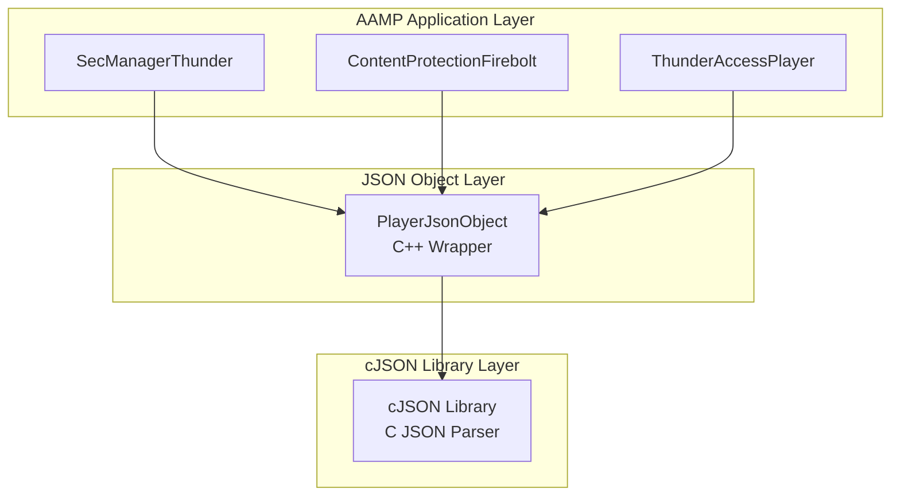
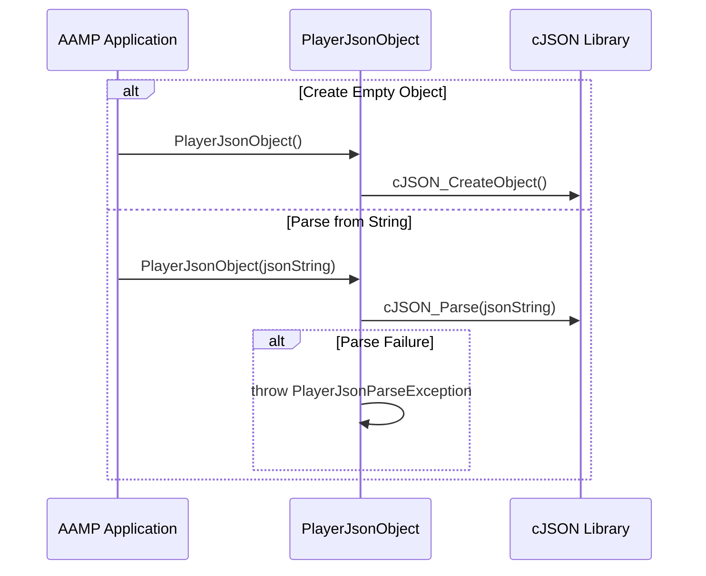
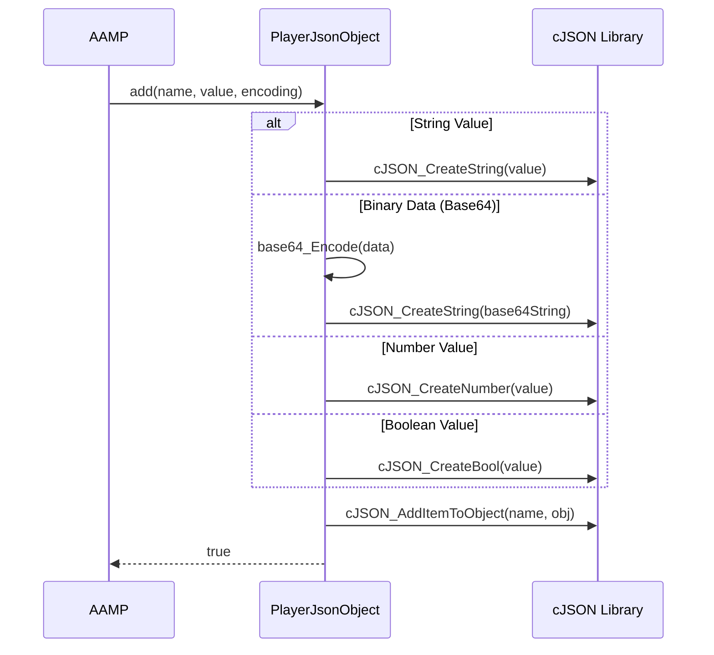

# Player JSON Object Architecture & Implementation

Comprehensive documentation of AAMP middleware playerJsonObject: architecture, codeflow, APIs, classes, and implementation details

[← Back to Index](README.md)

## 1. Executive Summary

The Player JSON Object subsystem provides a C++ wrapper around the cJSON library for easy JSON construction, parsing, and manipulation in AAMP. This document provides detailed analysis of:

- High-level architecture and component organization
- Code organization and folder structure
- Complete execution flows (JSON creation → data addition → serialization)
- Important APIs and classes with detailed documentation
- Implementation details for JSON operations
- Encoding support (string, base64, base64url)
- Integration with AAMP for Thunder plugin communication and configuration

## 2. High-Level Architecture

### 2.1 Architecture Overview

The Player JSON Object provides a simplified interface over cJSON:



### 2.2 Key Design Patterns

- **Wrapper Pattern:** PlayerJsonObject wraps cJSON C library in C++ interface
- **RAII Pattern:** Automatic memory management via destructor
- **Builder Pattern:** Fluent interface for constructing JSON objects
- **Strategy Pattern:** Different encoding strategies (string, base64, base64url)

## 3. Code Organization

### 3.1 Folder Structure

```
middleware/playerJsonObject/
├── PlayerJsonObject.h/cpp    # JSON object wrapper class
└── CMakeLists.txt
```

### 3.2 File Responsibilities

| File | Responsibility |
|------|----------------|
| `PlayerJsonObject.h/cpp` | C++ wrapper class for cJSON library. Provides methods for adding/getting JSON values, encoding support (base64, base64url), array handling, nested object support, and JSON serialization. |

## 4. Code Flow

### 4.1 JSON Object Creation Flow



### 4.2 JSON Data Addition Flow



## 5. Important APIs and Classes

### 5.1 PlayerJsonObject

```cpp
class PlayerJsonObject {
public:
    // Constructors
    PlayerJsonObject();
    PlayerJsonObject(const std::string& jsonStr);
    PlayerJsonObject(const char* jsonStr);
    ~PlayerJsonObject();
    
    // Encoding types
    enum ENCODING {
        ENCODING_STRING,     // Bytes as string
        ENCODING_BASE64,     // Base64 encoded
        ENCODING_BASE64_URL  // Base64URL encoded
    };
    
    // Add methods
    bool add(const std::string& name, const std::string& value, 
             const ENCODING encoding = ENCODING_STRING);
    bool add(const std::string& name, const std::vector<uint8_t>& values, 
             const ENCODING encoding = ENCODING_STRING);
    bool add(const std::string& name, bool value);
    bool add(const std::string& name, int value);
    bool add(const std::string& name, double value);
    bool add(const std::string& name, PlayerJsonObject& value);
    
    // Get methods
    bool get(const std::string& name, std::string& value);
    bool get(const std::string& name, int& value);
    bool get(const std::string& name, double& value);
    bool get(const std::string& name, std::vector<uint8_t>& values, 
             const ENCODING encoding = ENCODING_STRING);
    bool get(const std::string& name, PlayerJsonObject &value);
    
    // Type checking
    bool isArray(const std::string& name);
    bool isString(const std::string& name);
    bool isNumber(const std::string& name);
    bool isObject(const std::string& name);
    
    // Serialization
    std::string print();
    std::string print_UnFormatted();
};
```

### 5.2 PlayerJsonParseException

```cpp
class PlayerJsonParseException : public std::exception {
public:
    virtual const char* what() const throw() override {
        return "Failed to parse JSON string";
    }
};
```

## 6. Implementation Details

### 6.1 Memory Management

PlayerJsonObject uses RAII for memory management:
- **Root Object:** Destructor calls `cJSON_Delete(mJsonObj)` if `mParent` is NULL
- **Nested Object:** If `mParent` is set, parent owns the cJSON object
- **String Allocation:** cJSON manages string memory, freed via `cJSON_free()`
- **Move Semantics:** Move constructor transfers ownership

### 6.2 Encoding Support

PlayerJsonObject supports three encoding types:
- **ENCODING_STRING:** Binary data stored as-is
- **ENCODING_BASE64:** Binary data encoded using standard Base64
- **ENCODING_BASE64_URL:** Binary data encoded using Base64URL (URL-safe)

### 6.3 Base64URL Encoding

Base64URL encoding differs from Base64:
- **Character Mapping:** '+' → '-', '/' → '_'
- **Padding:** '=' padding may be omitted
- **Usage:** Used for URL-safe encoding in JSON-RPC calls

### 6.4 Nested Object Handling

Nested objects are handled via parent-child relationship:
- When adding nested PlayerJsonObject, parent is set
- Parent owns the cJSON object
- Child destructor doesn't delete cJSON if parent is set
- Prevents double-free errors

## 7. Integration with AAMP

### 7.1 Thunder Plugin Communication

SecManagerThunder uses PlayerJsonObject for JSON-RPC:

```cpp
// From SecManagerThunder.cpp
PlayerJsonObject param;
PlayerJsonObject response;

// Build request parameters
param.add("clientId", clientId);
param.add("appId", appId);

// Create nested object
PlayerJsonObject sessionConfig;
sessionConfig.add("distributedTraceType", "money");
param.add("sessionConfig", sessionConfig);

// Invoke JSON-RPC
bool result = mSecManagerObj.InvokeJSONRPC("openDrmSession", 
                                           param.print_UnFormatted(), 
                                           response);

// Parse response
std::string sessionId;
response.get("sessionId", sessionId);
```

### 7.2 Firebolt SDK Integration

ContentProtectionFirebolt uses PlayerJsonObject:
- Building JSON requests for Firebolt SDK
- Parsing JSON responses from Firebolt SDK
- Encoding binary data (license requests/responses) in base64

## 8. Encoding Details

### 8.1 Base64 Encoding

Standard Base64 encoding:
- 64-character alphabet: A-Z, a-z, 0-9, +, /
- Padding with '=' characters
- Used for encoding binary data in JSON strings

### 8.2 Base64URL Encoding

URL-safe Base64 encoding:
- Character mapping: '+' → '-', '/' → '_'
- Padding '=' may be omitted
- Safe for use in URLs and JSON strings

## 9. Error Handling

### 9.1 Parse Errors

JSON parsing errors:
- Throws `PlayerJsonParseException` if parsing fails
- Caller must catch exception or handle parse failure
- Invalid JSON strings result in exception

### 9.2 Add/Get Failures

Add and get operations return boolean:
- **false:** Operation failed (invalid name, type mismatch, memory error)
- **true:** Operation succeeded
- Caller should check return value

## 10. Code Analysis and Improvements

### 10.1 Strengths

- Clean C++ wrapper over C library
- RAII memory management
- Support for multiple encoding types
- Type-safe get/add methods
- Support for nested objects and arrays
- Move semantics for efficient object transfer

### 10.2 Potential Improvements

- **Error Handling:** Could use exceptions more consistently
- **Type Safety:** Could add more compile-time type checking
- **Validation:** Could add JSON schema validation
- **Performance:** Could cache parsed values for repeated access
- **Modern C++:** Could use std::optional for optional values

---

[← Back to Index](README.md)

