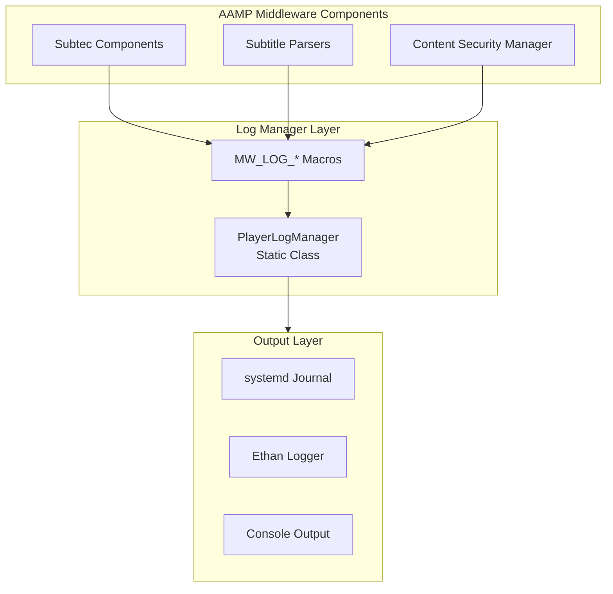
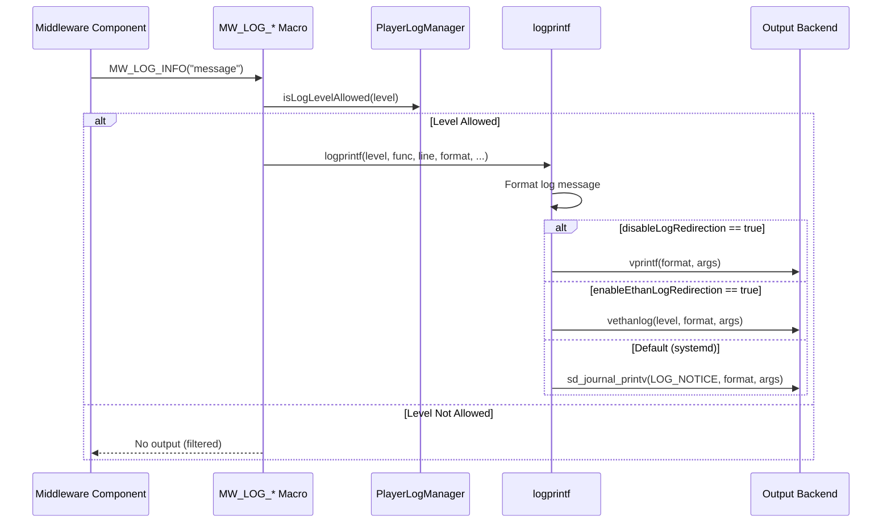
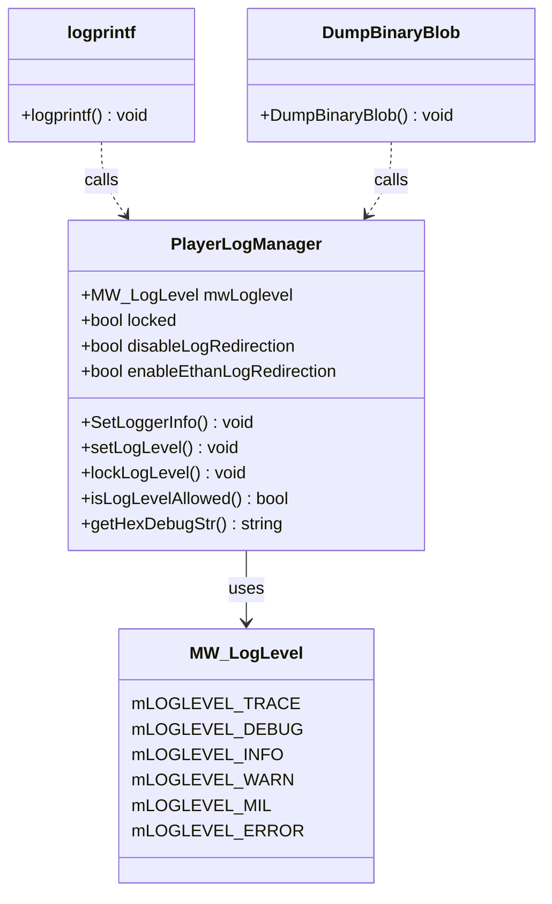

# Player Log Manager Architecture & Implementation

Comprehensive documentation of AAMP middleware playerLogManager: architecture, codeflow, APIs, classes, and implementation details

[← Back to Index](README.md)

## 1. Executive Summary

The Player Log Manager subsystem provides centralized logging functionality for AAMP middleware components. This document provides detailed analysis of:

- High-level architecture and component organization
- Code organization and folder structure
- Complete execution flows (log request → level check → output routing)
- Important APIs and classes with detailed documentation
- Implementation details for logging operations
- Log level management and filtering
- Integration with systemd journal, Ethan logger, and console output

## 2. High-Level Architecture

### 2.1 Architecture Overview

The Player Log Manager provides a unified logging interface:



### 2.2 Key Design Patterns

- **Singleton Pattern:** Static class with static members
- **Facade Pattern:** Unified interface for multiple logging backends
- **Strategy Pattern:** Different output strategies (journal, Ethan, console)
- **Macro Pattern:** Compile-time log level filtering via macros

## 3. Code Organization

### 3.1 Folder Structure

```
middleware/playerLogManager/
├── PlayerLogManager.h/cpp    # Log manager class and implementation
└── CMakeLists.txt
```

### 3.2 File Responsibilities

| File | Responsibility |
|------|----------------|
| `PlayerLogManager.h/cpp` | Static log manager class, log level management, log output routing (systemd journal, Ethan logger, console), log formatting, binary blob dumping, thread-safe log counter. |

## 4. Code Flow

### 4.1 Log Output Flow



## 5. Important APIs and Classes

### 5.1 PlayerLogManager

```cpp
/**
 * @class PlayerLogManager
 * @brief Static class for middleware logging
 */
class PlayerLogManager {
public:
    // Static configuration members
    static MW_LogLevel mwLoglevel;
    static bool locked;
    static bool disableLogRedirection;
    static bool enableEthanLogRedirection;
    
    // Configuration
    static void SetLoggerInfo(bool logRedirectStatus, bool ethanLogStatus, 
                             int level, bool lock);
    static void setLogLevel(MW_LogLevel newLevel);
    static void lockLogLevel(bool lock);
    static bool isLogLevelAllowed(MW_LogLevel chkLevel);
    
    // Utility
    static std::string getHexDebugStr(const std::vector<uint8_t>& data);
};

/**
 * @enum MW_LogLevel
 * @brief Log levels for middleware
 */
enum MW_LogLevel {
    mLOGLEVEL_TRACE,    // Trace level
    mLOGLEVEL_DEBUG,    // Debug level
    mLOGLEVEL_INFO,     // Info level
    mLOGLEVEL_WARN,     // Warn level
    mLOGLEVEL_MIL,      // Milestone level
    mLOGLEVEL_ERROR,    // Error level
};

/**
 * @fn logprintf
 * @brief Print logs to console / log file
 */
void logprintf(MW_LogLevel logLevelIndex, const char* func, int line, 
               const char *format, ...);

/**
 * @fn DumpBinaryBlob
 * @brief Compactly log blobs of binary data
 */
void DumpBinaryBlob(const unsigned char *ptr, size_t len);
```

### 5.2 Log Macros

```cpp
// Log level check macro
#define MW_LOG( LEVEL, FORMAT, ... ) \
do{\
if( (LEVEL) >= PlayerLogManager::mwLoglevel ) \
{ \
 logprintf( LEVEL, __FUNCTION__, __LINE__, FORMAT, ##__VA_ARGS__); \
}\
}while(0)

// Specific log level macros
#define MW_LOG_TRACE(FORMAT, ...) MW_LOG(mLOGLEVEL_TRACE, FORMAT, ##__VA_ARGS__)
#define MW_LOG_DEBUG(FORMAT, ...) MW_LOG(mLOGLEVEL_DEBUG, FORMAT, ##__VA_ARGS__)
#define MW_LOG_INFO(FORMAT, ...)  MW_LOG(mLOGLEVEL_INFO, FORMAT, ##__VA_ARGS__)
#define MW_LOG_WARN(FORMAT, ...)  MW_LOG(mLOGLEVEL_WARN, FORMAT, ##__VA_ARGS__)
#define MW_LOG_MIL(FORMAT, ...)   MW_LOG(mLOGLEVEL_MIL, FORMAT, ##__VA_ARGS__)
#define MW_LOG_ERR(FORMAT, ...)   MW_LOG(mLOGLEVEL_ERROR, FORMAT, ##__VA_ARGS__)
```

## 6. Implementation Details

### 6.1 Log Level Hierarchy

Log levels are ordered from most verbose to least verbose:
1. **mLOGLEVEL_TRACE:** Most verbose, detailed execution flow
2. **mLOGLEVEL_DEBUG:** Debug information
3. **mLOGLEVEL_INFO:** General information
4. **mLOGLEVEL_WARN:** Warning messages
5. **mLOGLEVEL_MIL:** Milestone events
6. **mLOGLEVEL_ERROR:** Error messages

When a level is set, all logs at that level and above are output.

### 6.2 Log Format

Log messages are formatted as:
```
[PLAYER_IF][SEQ][LEVEL][THREAD_ID][FUNCTION][LINE]message
```

- **PLAYER_IF:** Identifier for player interface logs
- **SEQ:** Sequential log counter (0-999, wraps)
- **LEVEL:** Log level (TRACE, DEBUG, INFO, WARN, MIL, ERROR)
- **THREAD_ID:** Thread identifier (hashed thread ID)
- **FUNCTION:** Function name where log was called
- **LINE:** Line number where log was called
- **message:** Formatted log message

### 6.3 Output Backend Selection

Output backend is selected based on flags:
1. **disableLogRedirection == true:** Use `vprintf()` (console)
2. **enableEthanLogRedirection == true:** Use `vethanlog()` (Ethan logger)
3. **Default:** Use `sd_journal_printv()` (systemd journal)

### 6.4 Ethan Log Level Mapping

MW log levels are mapped to Ethan log levels:

| MW Level | Ethan Level | Notes |
|----------|-------------|-------|
| TRACE, DEBUG | ETHAN_LOG_DEBUG | Debug information |
| INFO, WARN, MIL | ETHAN_LOG_MILESTONE | Important events |
| ERROR | ETHAN_LOG_FATAL | Error conditions |

### 6.5 Binary Blob Dumping

`DumpBinaryBlob()` provides compact binary data logging:
- Prints printable ASCII characters directly
- Non-printable characters shown as `[XX]` (hex)
- 64 characters per line
- Uses `MW_LOG_WARN` for output
- Useful for debugging binary protocols

## 7. Integration with AAMP

### 7.1 Middleware Component Usage

Middleware components use logging macros:

```cpp
// From SubtecChannel.cpp
MW_LOG_INFO("SubtecChannel: Sending reset packet");
MW_LOG_DEBUG("Packet size: %zu", packetSize);
MW_LOG_WARN("Failed to send packet: %s", errorMsg);
MW_LOG_ERR("Critical error: %d", errorCode);

// Binary data dumping
DumpBinaryBlob(buffer, bufferLen);
```

### 7.2 Log Level Configuration

Log level is configured during initialization:

```cpp
// Set log level to INFO
PlayerLogManager::setLogLevel(mLOGLEVEL_INFO);

// Lock log level (prevent changes)
PlayerLogManager::lockLogLevel(true);

// Configure all logger settings
PlayerLogManager::SetLoggerInfo(
    false,  // disableLogRedirection (use systemd)
    true,   // enableEthanLogRedirection
    mLOGLEVEL_INFO,  // log level
    false   // lock status
);
```

## 8. Class Diagrams

### 8.1 PlayerLogManager Structure



## 9. Log Output Examples

### 9.1 Console Output

```
1234567890.123: [PLAYER_IF][001][INFO][a1b2c3d4][SubtecChannel::SendPacket][45]Sending reset packet
1234567890.456: [PLAYER_IF][002][DEBUG][a1b2c3d4][SubtecChannel::SendPacket][50]Packet size: 128
```

### 8.2 Binary Blob Output

```
[PLAYER_IF][004][WARN][a1b2c3d4][DumpBinaryBlob][176]Hello World[0A][00]Test[FF]Data
```

## 9. Error Handling

### 10.1 Format String Validation

`logprintf` uses GCC format attribute:
- Validates format string at compile time
- Warns about format string mismatches
- Prevents format string vulnerabilities

### 10.2 Thread Safety

Logging is thread-safe:
- Log counter uses `std::atomic`
- Thread ID calculation is thread-safe
- Output backends (systemd, Ethan) are thread-safe
- No locking required for log output

## 11. Code Analysis and Improvements

### 11.1 Strengths

- Unified logging interface for all middleware components
- Efficient compile-time and runtime filtering
- Support for multiple output backends
- Thread-safe log counter
- Compact binary blob dumping
- Log level locking for debugging scenarios

### 11.2 Potential Improvements

- **Structured Logging:** Could add structured logging support (key-value pairs)
- **Log Rotation:** Could add log file rotation for file-based logging
- **Log Filtering:** Could add component-based filtering
- **Performance:** Could add async logging to reduce blocking
- **Log Aggregation:** Could add support for remote log aggregation

---

[← Back to Index](README.md)

