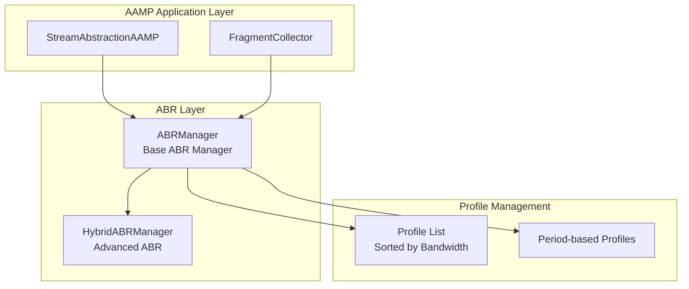
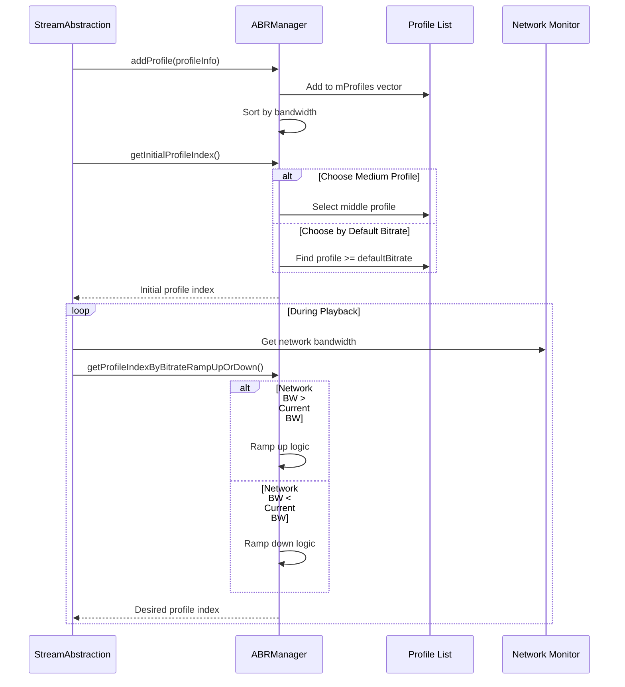

# AAMP ABR Architecture & Implementation

Comprehensive documentation of AAMP support aampabr: architecture, codeflow, APIs, classes, and implementation details

[← Back to Index](README.md)

## 1. Executive Summary

The AAMP ABR (Adaptive Bitrate) subsystem provides automatic bitrate switching capabilities for HLS and DASH streaming. This document provides detailed analysis of:

- High-level architecture and component organization
- Code organization and folder structure
- Complete execution flows (profile selection → bitrate ramping → network adaptation)
- Important APIs and classes with detailed documentation
- Implementation details for ABR algorithms
- Hybrid ABR Manager for advanced ABR strategies
- Integration with AAMP for dynamic bitrate selection during playback

## 2. High-Level Architecture

### 2.1 Architecture Overview

The ABR system provides intelligent bitrate selection based on network conditions:



### 2.2 Key Design Patterns

- **Strategy Pattern:** ABRManager provides base strategy, HybridABRManager extends with advanced strategies
- **Observer Pattern:** Network bandwidth changes trigger profile re-evaluation
- **Factory Pattern:** Profile creation and management
- **State Pattern:** Different ABR states (ramp up, ramp down, steady state)

## 3. Code Organization

### 3.1 Folder Structure

```
support/aampabr/
├── ABRManager.h/cpp          # Base ABR manager class
├── HybridABRManager.h/cpp     # Advanced hybrid ABR manager
├── CMakeLists.txt
└── README.md
```

### 3.2 File Responsibilities

| File | Responsibility |
|------|----------------|
| `ABRManager.h/cpp` | Base ABR manager class providing profile management, bitrate selection algorithms, ramp up/down logic, network consistency checking, period-based profile support (DASH), iframe track management. |
| `HybridABRManager.h/cpp` | Extended ABR manager with advanced features: bandwidth caching, threshold-based decisions, buffer-aware ABR, steady state handling, low latency DASH support, fragment failure handling. |

## 4. Code Flow

### 4.1 Profile Selection Flow



## 5. Important APIs and Classes

### 5.1 ABRManager

```cpp
class ABRManager {
public:
    struct ProfileInfo {
        bool isIframeTrack;
        long bandwidthBitsPerSecond;
        int width;
        int height;
        std::string periodId;
        int userData;
    };
    
    // Profile Management
    void addProfile(ProfileInfo profile);
    void clearProfiles();
    int getProfileCount();
    
    // Initial Profile Selection
    int getInitialProfileIndex(bool chooseMediumProfile, 
                               const std::string& periodId = std::string());
    
    // Profile Selection
    int getProfileIndexByBitrateRampUpOrDown(int currentProfileIndex, 
                                            long currentBandwidth, 
                                            long networkBandwidth, 
                                            int nwConsistencyCnt = 2,
                                            const std::string& periodId = std::string());
    
    // Ramp Up/Down
    int getRampedUpProfileIndex(int currentProfileIndex, 
                                const std::string& periodId = std::string());
    int getRampedDownProfileIndex(int currentProfileIndex, 
                                  const std::string& periodId = std::string());
    
    // Profile Queries
    long getBandwidthOfProfile(int profileIndex);
    bool isProfileIndexBitrateLowest(int currentProfileIndex, 
                                    const std::string& periodId = std::string());
    
    // Iframe Track Management
    void updateProfile();
    int getLowestIframeProfile() const;
    int getDesiredIframeProfile() const;
    
    // Configuration
    void setDefaultInitBitrate(long defaultInitBitrate);
    static void setPersistBandwidth(long bitrate);
    static long getPersistBandwidth();
};
```

### 5.2 HybridABRManager

```cpp
class HybridABRManager : public ABRManager {
public:
    struct AampAbrConfig {
        int abrCacheLife;
        int abrCacheLength;
        int abrNwConsistency;
        int abrMaxBuffer;
        int abrMinBuffer;
        int abrCacheOutlier;
    };
    
    // Bandwidth Calculation
    long CheckAbrThresholdSize(int bufferlen, int downloadTimeMs, 
                               long currentProfilebps, int fragmentDurationMs,
                               CurlAbortReason abortReason);
    
    // Bandwidth Cache Management
    void UpdateABRBitrateDataBasedOnCacheLength(
        std::vector<std::pair<long long,long>> &mAbrBitrateData,
        long downloadbps, bool LowLatencyMode);
    
    // Profile Change Decision
    bool CheckProfileChange(double totalFetchedDuration, 
                           int currProfileIndex, long availBW);
    
    // Buffer-Aware ABR
    void GetDesiredProfileOnBuffer(int currProfileIndex, int &newProfileIndex,
                                   double bufferValue, double minBufferNeeded);
    
    // Steady State Handling
    void CheckRampupFromSteadyState(int currProfileIndex, int &newProfileIndex,
                                   long nwBandwidth, double bufferValue,
                                   long newBandwidth, BitrateChangeReason &reason);
    void CheckRampdownFromSteadyState(int currProfileIndex, int &newProfileIndex,
                                     BitrateChangeReason &reason,
                                     int mABRLowBufferCounter);
    
    // Low Latency DASH Support
    bool GetLowLatencyStartABR();
    void SetLowLatencyStartABR(bool bStart);
    
    // Fragment Failure Handling
    long FragmentfailureRampdown(int currentBuffer, int currentProfileIndex);
};
```

## 6. Implementation Details

### 6.1 Profile Management

Profiles are stored in two data structures:
- **mProfiles:** Vector maintaining insertion order, used for direct index access
- **mSortedBWProfileList:** Map of periodId → sorted map of bandwidth → profile index, used for efficient bandwidth-based lookups

### 6.2 Network Consistency

Network consistency prevents rapid profile switching:
- **Consistency Count:** Number of consecutive measurements required before switching (default: 2)
- **Ramp Up Counter:** Tracks consecutive ramp-up requests
- **Ramp Down Counter:** Tracks consecutive ramp-down requests
- **One-Step Changes:** Single-step changes require consistency check
- **Multi-Step Changes:** Large bandwidth changes apply immediately

### 6.3 Period-Based Profiles (DASH)

DASH streams may have multiple periods with different profiles:
- Each period has its own sorted bandwidth list
- Period ID is used to select the correct profile list
- Empty periodId string represents default period

### 6.4 Iframe Track Management

Iframe tracks are managed separately for trick play:
- **Lowest Iframe Profile:** Lowest bitrate iframe track for all trick speeds
- **Desired Iframe Profile:** Preferred iframe track for normal playback
- **4K Handling:** Special logic for 4K streams

### 6.5 Hybrid ABR Features

HybridABRManager adds advanced features:
- **Bandwidth Caching:** Maintains history of bandwidth measurements
- **Cache Life:** Time-based expiration of cache entries
- **Outlier Detection:** Filters out outlier bandwidth measurements
- **Buffer-Aware:** Considers buffer level in profile selection
- **Steady State:** Special handling for stable network conditions

## 7. Integration with AAMP

### 7.1 Profile Registration

StreamAbstractionAAMP registers profiles during manifest parsing:

```cpp
ABRManager::ProfileInfo profileInfo;
profileInfo.bandwidthBitsPerSecond = bandwidth;
profileInfo.width = width;
profileInfo.height = height;
profileInfo.periodId = periodId;

aamp->mhAbrManager.addProfile(profileInfo);
```

### 7.2 Dynamic Profile Selection

Profile is re-evaluated during playback:

```cpp
long currentBandwidth = GetStreamInfo(currentProfileIndex)->bandwidthBitsPerSecond;
long networkBandwidth = aamp->GetCurrentlyAvailableBandwidth();

desiredProfileIndex = aamp->mhAbrManager.getProfileIndexByBitrateRampUpOrDown(
    currentProfileIndex, currentBandwidth, networkBandwidth, nwConsistencyCnt);
```

## 8. ABR Algorithms

### 8.1 Ramp Up Algorithm

When network bandwidth > current bandwidth:
1. Find highest profile supported by network bandwidth
2. If one-step change, check consistency counter
3. If consistency met, switch to higher profile
4. If multi-step change, switch immediately

### 8.2 Ramp Down Algorithm

When network bandwidth < current bandwidth:
1. Find highest profile supported by network bandwidth (reverse search)
2. If one-step change, check consistency counter
3. If consistency met, switch to lower profile
4. If network too low, switch to lowest profile

## 9. Error Handling

### 9.1 Invalid Profile Index

- Range checks clamp indices to valid range
- INVALID_PROFILE (-1) returned when no profiles available
- Logging for debugging invalid indices

### 9.2 Network Bandwidth Unavailable

When network bandwidth is -1 (unavailable):
- Profile remains unchanged
- Consistency counters are reset
- No ABR decision is made

## 10. Code Analysis and Improvements

### 10.1 Strengths

- Clean separation between base and hybrid ABR
- Thread-safe profile management
- Efficient sorted list for bandwidth lookups
- Support for DASH periods
- Network consistency prevents rapid switching

### 10.2 Potential Improvements

- **Algorithm Options:** Could support multiple ABR algorithms (BOLA, MPC, etc.)
- **QoE Metrics:** Could consider rebuffering, startup time in decisions
- **Predictive ABR:** Could use machine learning for better predictions
- **Bandwidth Estimation:** Could improve bandwidth estimation accuracy

---

[← Back to Index](README.md)

