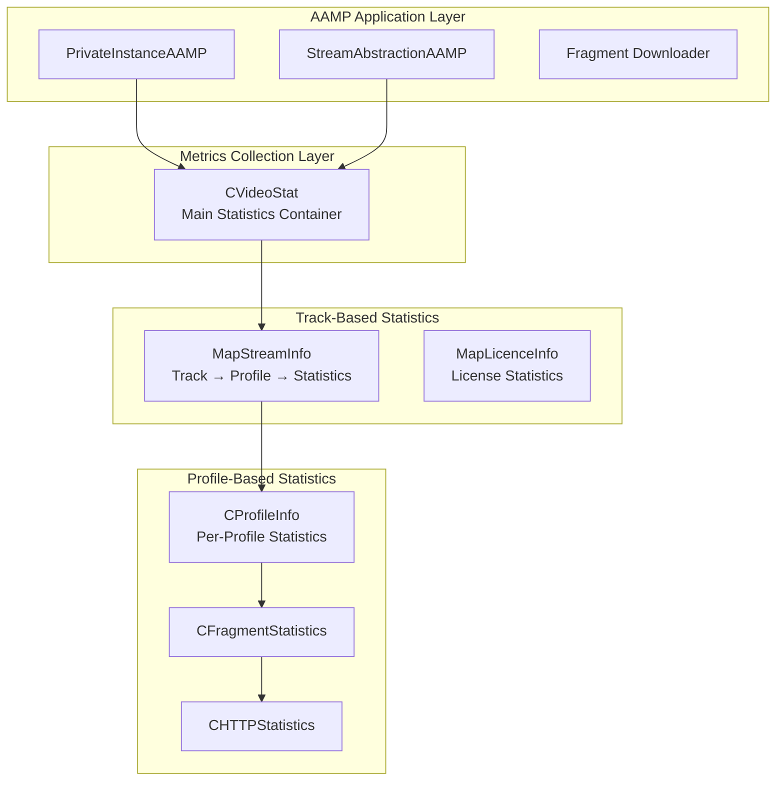
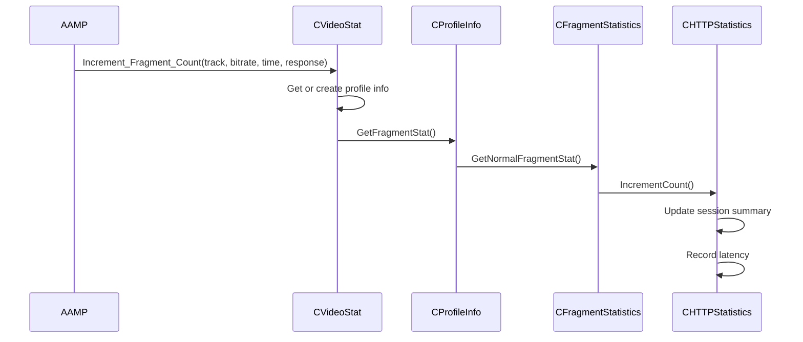
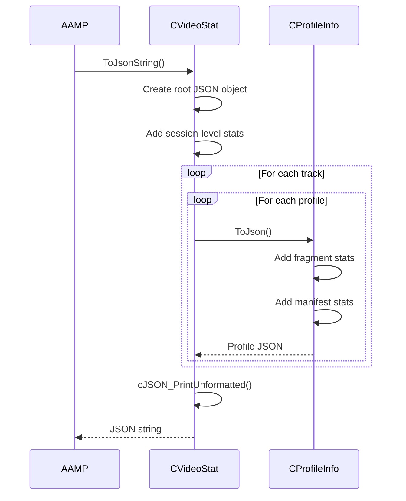

# AAMP Metrics Architecture & Implementation

Comprehensive documentation of AAMP support aampmetrics: architecture, codeflow, APIs, classes, and implementation details

[← Back to Index](README.md)

## 1. Executive Summary

The AAMP Metrics subsystem provides comprehensive session statistics generation and reporting in JSON format for AAMP playback sessions. This document provides detailed analysis of:

- High-level architecture and component organization
- Code organization and folder structure
- Complete execution flows (data collection → statistics aggregation → JSON generation)
- Important APIs and classes with detailed documentation
- Implementation details for metrics collection
- CMCD (Common Media Client Data) headers support
- Integration with AAMP for session statistics reporting

## 2. High-Level Architecture

### 2.1 Architecture Overview

The Metrics system provides hierarchical statistics collection:



### 2.2 Key Design Patterns

- **Composite Pattern:** CVideoStat contains nested statistics structures
- **Facade Pattern:** CVideoStat provides unified interface for all statistics
- **Strategy Pattern:** Different statistics types (fragment, manifest, license)
- **Builder Pattern:** JSON construction from statistics data

## 3. Code Organization

### 3.1 Folder Structure

```
support/aampmetrics/
├── IPVideoStat.h/cpp              # Main video statistics container
├── IPProfileInfo.h/cpp            # Per-profile statistics
├── IPFragmentStatistics.h/cpp     # Fragment statistics
├── IPHTTPStatistics.h/cpp         # HTTP statistics base
├── IPSessionSummary.h/cpp         # Session summary statistics
├── IPLatencyReport.h/cpp          # Latency reporting
├── IPLicnsStatistics.h/cpp        # License statistics
├── ManifestGenericStats.h/cpp     # Manifest statistics
├── CMCDHeaders.h/cpp              # Base CMCD headers
├── VideoCMCDHeaders.h/cpp         # Video CMCD headers
├── AudioCMCDHeaders.h/cpp         # Audio CMCD headers
├── SubtitleCMCDHeaders.h/cpp      # Subtitle CMCD headers
├── ManifestCMCDHeaders.h/cpp      # Manifest CMCD headers
├── StatsDefine.h                   # Statistics definitions
└── test/                           # Unit tests
```

### 3.2 File Responsibilities

| File | Responsibility |
|------|----------------|
| `IPVideoStat.h/cpp` | Main statistics container. Manages track-based statistics, profile information, license statistics, session summary, latency reports, and JSON serialization. |
| `IPProfileInfo.h/cpp` | Per-profile statistics container. Contains manifest statistics, fragment statistics (normal and init), and profile resolution information. |
| `IPFragmentStatistics.h/cpp` | Fragment-specific statistics. Separates normal fragment stats from init fragment stats, tracks last failed URL. |
| `IPHTTPStatistics.h/cpp` | Base HTTP statistics class. Contains session summary, latency report, and manifest generic stats. |
| `IPSessionSummary.h/cpp` | Session summary statistics. Tracks error counts by HTTP response code. |
| `IPLatencyReport.h/cpp` | Latency reporting. Groups download times into time windows (250ms buckets). |
| `IPLicnsStatistics.h/cpp` | License/encryption statistics. Tracks license rotations and encryption transitions. |
| `CMCDHeaders.h/cpp` | Base CMCD headers class. Provides CMCD header construction for HTTP requests. |

## 4. Code Flow

### 4.1 Statistics Collection Flow



### 4.2 JSON Generation Flow



## 5. Important APIs and Classes

### 5.1 CVideoStat

```cpp
class CVideoStat {
public:
    // Session-level Statistics
    void SetTimeToTopProfile(long long time);
    void SetTimeAtTopProfile(long long time);
    void SetTotalDuration(long long duration);
    void Increment_NetworkDropCount();
    void Increment_ErrorDropCount();
    
    // Fragment Statistics
    void Increment_Fragment_Count(Track track, long bitrate, 
                                  long downloadTimeMs, int response, 
                                  bool connectivity);
    void Increment_Init_Fragment_Count(Track track, long bitrate,
                                       long downloadTimeMs, int response,
                                       bool connectivity);
    
    // Manifest Statistics
    void Increment_Manifest_Count(Track track, long bitrate,
                                 long downloadTimeMs, int response,
                                 bool connectivity, 
                                 ManifestData * manifestData = NULL);
    
    // License Statistics
    void Record_License_EncryptionStat(VideoStatTrackType eType, 
                                       bool isEncrypted, 
                                       bool isKeyChanged, 
                                       int audioIndex = 1);
    
    // Profile Information
    void SetProfileResolution(VideoStatTrackType eType, long bitrate,
                             int width, int height, int audioIndex = 1);
    void SetDisplayResolution(int width, int height);
    
    // JSON Serialization
    char * ToJsonString(const char* additionalData = nullptr, 
                       bool forPA = false) const;
};
```

### 5.2 CProfileInfo

```cpp
class CProfileInfo {
public:
    CHTTPStatistics * GetManifestStat();
    CFragmentStatistics * GetFragmentStat();
    void SetSize(int width, int height);
    cJSON * ToJson() const;
};
```

### 5.3 CHTTPStatistics

```cpp
class CHTTPStatistics {
public:
    CLatencyReport * GetLatencyReport();
    CSessionSummary * GetSessionSummary();
    ManifestGenericStats * GetManGenStatsInstance();
    void IncrementCount(long downloadTimeMs, int responseCode, 
                       bool connectivity, 
                       ManifestData * manifestData = nullptr);
    cJSON * ToJson() const;
};
```

### 5.4 CMCDHeaders

```cpp
class CMCDHeaders {
public:
    void SetSessionId(const std::string &sid);
    void SetMediaType(const std::string &mediaTypeName);
    void SetBitrate(const int &Bandwidth);
    void SetBufferLength(const int &bufferlength);
    void SetNetworkMetrics(const int &startTransferTime,
                          const int &totalTime,
                          const int &dnsLookUpTime);
    void BuildCMCDCustomHeaders(
        std::unordered_map<std::string, std::vector<std::string>> &headers);
};
```

## 6. Implementation Details

### 6.1 Track-Based Organization

Statistics are organized by track type:
- **STAT_MAIN:** Main manifest (HLS master or DASH MPD)
- **STAT_VIDEO:** Video track
- **STAT_AUDIO:** Audio track (supports up to 5 audio tracks)
- **STAT_IFRAME:** I-frame track (for trick play)
- **STAT_SUBTITLE:** Subtitle track

### 6.2 Profile-Based Organization

Within each track, statistics are organized by profile bitrate:
- Map structure: Track → Bitrate → CProfileInfo
- Each profile has separate statistics for fragments, manifests, and licenses
- Profile resolution (width/height) is tracked

### 6.3 Lazy Initialization

Statistics objects are created on-demand:
- Profile info created when first fragment for that profile is downloaded
- Fragment statistics created when first fragment is recorded
- HTTP statistics created when first HTTP operation is recorded
- Reduces memory usage for unused profiles

### 6.4 Latency Time Windows

Latency is grouped into time windows:
- **Window Duration:** 250ms (LATENCY_WINDOW_BUCKET_DURATION)
- **Window Tags:** "T0" (0-250ms), "T1" (250-500ms), "T2" (500-750ms), etc.
- **Purpose:** Provides latency distribution analysis

### 6.5 CMCD Headers

CMCD (Common Media Client Data) headers provide:
- Session ID, Object Type, Bitrate, Top Bitrate
- Buffer Length, Buffer Starvation flag
- Network Metrics (DNS time, first byte time, total time)
- Next URL/Range for prefetching

## 7. Integration with AAMP

### 7.1 Statistics Collection

AAMP collects statistics during playback:

```cpp
// Fragment download complete
mVideoEnd->Increment_Fragment_Count(
    track, bitrate, downloadTimeMs, httpResponse, connectivity);

// Manifest download complete
mVideoEnd->Increment_Manifest_Count(
    track, bitrate, downloadTimeMs, httpResponse, connectivity, manifestData);

// License acquisition
mVideoEnd->Record_License_EncryptionStat(
    trackType, isEncrypted, isKeyChanged, audioIndex);
```

### 7.2 VideoEnd Event

Statistics are reported on video end:

```cpp
mVideoEnd->SetTimeToTopProfile(mTimeToTopProfile);
mVideoEnd->SetTimeAtTopProfile(mTimeAtTopProfile);
mVideoEnd->SetTotalDuration(mPlaybackDuration);

char *jsonString = mVideoEnd->ToJsonString();
MetricsDataEventPtr e = std::make_shared<MetricsDataEvent>(
    MetricsDataType::AAMP_DATA_VIDEO_END, 
    mTraceUUID, 
    jsonString, 
    GetSessionId());
SendEvent(e, AAMP_EVENT_ASYNC_MODE);
```

### 7.3 CMCD Integration

CMCD headers are added to HTTP requests:

```cpp
AampCMCDCollector::Initialize(enableCMCD, traceId);
mCMCDCollector->UpdateMetrics(mediaType, bitrate, bufferLevel);
mCMCDCollector->BuildCMCDHeaders(headers);
// Add headers to HTTP request
```

## 8. Statistics Data Structure

### 8.1 Track Types

| Track Type | Description | Usage |
|------------|-------------|-------|
| `STAT_MAIN` | Main Manifest | HLS master playlist or DASH MPD |
| `STAT_VIDEO` | Video Track | Video fragments and manifests |
| `STAT_AUDIO` | Audio Track | Audio fragments (supports up to 5 tracks) |
| `STAT_IFRAME` | I-frame Track | I-frame fragments for trick play |
| `STAT_SUBTITLE` | Subtitle Track | Subtitle fragments |

### 8.2 Data Types

| Data Type | Description |
|-----------|-------------|
| `VE_DATA_MANIFEST` | Manifest download statistics |
| `VE_DATA_FRAGMENT` | Normal fragment download statistics |
| `VE_DATA_INIT_FRAGMENT` | Initialization fragment statistics |
| `VE_DATA_LICENSE` | License acquisition statistics |

## 9. JSON Output Structure

Example JSON output:

```json
{
  "vr": "2.0",
  "tt": 1234,
  "ta": 5678,
  "d": 90000,
  "dn": 2,
  "de": 1,
  "w": 1920,
  "h": 1080,
  "v": {
    "1000000": {
      "n": {
        "ms": {...},
        "fs": {...}
      },
      "i": {...}
    }
  },
  "a1": {...},
  "ls": {
    "v": {
      "r": 3,
      "e": 1,
      "c": 2
    }
  },
  "S": {
    "200": 100,
    "404": 2
  }
}
```

## 10. Error Handling

### 10.1 Memory Management

- Objects created with `new`, cleaned up in destructors
- Copy constructors and assignment operators handle deep copying
- Lazy initialization reduces memory usage

### 10.2 JSON Generation Errors

- cJSON functions return NULL on errors
- NULL checks before using JSON objects
- Memory cleanup on failure

## 11. Code Analysis and Improvements

### 11.1 Strengths

- Comprehensive statistics collection
- Hierarchical organization (track → profile → statistics)
- Lazy initialization for memory efficiency
- Support for multiple tracks and profiles
- CMCD headers for CDN optimization
- Detailed latency reporting

### 11.2 Potential Improvements

- **Memory Management:** Could use smart pointers for automatic cleanup
- **Thread Safety:** Could add thread safety if needed
- **Performance:** Could optimize JSON generation for large datasets
- **Streaming:** Could support streaming JSON output for large reports

---

[← Back to Index](README.md)

