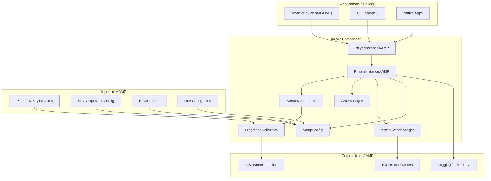

# RDK Integration and Usage

## Table of Contents

1. [Overview](#overview)
2. [RDK-E Integration (High-Level View)](#91-rdk-e-integration-high-level-view)
3. [How the AAMP Component Can Be Used](#92-how-the-aamp-component-can-be-used)
4. [High-Level Architecture: Other Components Interacting with AAMP](#93-high-level-architecture-other-components-interacting-with-aamp)
5. [Related Documentation](#related-documentation)

---

## Overview

This document describes how the AAMP (Advanced Adaptive Media Player) subsystem integrates with RDK and RDK-E (Reference Design Kit for Embedded), how it can be used by applications and other components, and the high-level architecture of component interactions. All content is based on the actual codebase and existing design documents in this repository.

**Note:** For a more detailed high-level design and RDK-E usage narrative, see [AAMP_High_Level_Design_and_RDK-E_Usage.md](AAMP_High_Level_Design_and_RDK-E_Usage.md).

---

## 9.1 RDK-E Integration (High-Level View)

### Why AAMP Exists in RDK

AAMP is the **native video engine** used in RDK/ENT (and RDK-E) stacks to play adaptive streaming content (HLS, DASH, progressive) with DRM support. It sits between applications (e.g. Web/JS, native apps, CLI) and platform services (GStreamer, DRM middleware, network, display).

### Integration Points in the Stack

- **Application layer**: JavaScript/WebKit (UVE API via `jsbindings/`), native C++ apps, and CLI (`aampcli`) call into AAMP through **PlayerInstanceAAMP** (`main_aamp.h/cpp`).
- **Middleware / platform**: AAMP uses or integrates with:
  - **GStreamer** for decode/render (see [11-gstreamer-integration.md](11-gstreamer-integration.md)).
  - **DRM middleware** (e.g. OCDM, SecClient, SecManager) for license and decryption (see [07-drm-system.md](07-drm-system.md)).
  - **RFC / operator configuration** and environment variables for configuration (see [13-configuration-system.md](13-configuration-system.md)).
  - **Middleware** in `middleware/` (e.g. closed captions, logging, platform-specific plugins).
- **Network**: HTTP/HTTPS via libcurl (see [08-downloader-network.md](08-downloader-network.md)).
- **Optional RDK-E–specific layers**: Where present, RDK-E media framework or SOC-specific interfaces (e.g. hardware decoders, Westeros) are used by or configured through AAMP; exact interfaces depend on the RDK-E build and are not fully enumerated in this repo.

### What AAMP Does and Does Not Do in RDK

- **AAMP does**: Manifest download/parse, fragment collection, ABR, DRM license/key handling coordination, buffer management, event reporting, and feeding decrypted media into GStreamer.
- **AAMP does not**: Implement the RDK-E media framework itself, manage system-wide resource scheduling, or provide UI; it is a headless player engine consumed by higher-level components.

---

## 9.2 How the AAMP Component Can Be Used

### Entry Point: PlayerInstanceAAMP

All playback goes through **PlayerInstanceAAMP** (public API in `main_aamp.h`). Typical usage:

1. **Create a player**: `new PlayerInstanceAAMP(streamSink, exportFrames, powerEvt)` (or with default parameters).
2. **Optional**: Register event listeners (`AddEventListener`, `RegisterEvent`, etc.) and set configuration (e.g. `SetLicenseServerURL`, `SetPreferredDRM`, bitrate/timeouts via `mConfig` or API).
3. **Tune**: `Tune(url, contentType, ...)` to start playback (HLS/DASH/progressive is detected from URL or content type).
4. **Control**: `Seek`, `SetRate`, `SetRateAndSeek`, `SeekToLive`, `SetLanguage`, `SetVideoRectangle`, `SetVideoZoom`, `SetAudioVolume`, etc.
5. **Stop**: `Stop(sendStateChangeEvent, forceCleanup)`.
6. **Destroy**: Delete the `PlayerInstanceAAMP` instance (internal cleanup via `PrivateInstanceAAMP` and shared_ptr).

### Usage Contexts in RDK

- **Web/JS (UVE)**: The JavaScript bindings (`jsbindings/`, e.g. `jsmediaplayer.cpp`) expose a media player API to WebKit; the app uses that API, which forwards to `PlayerInstanceAAMP`. This is the typical “UVE” integration in RDK set-tops.
- **Native apps**: Native code links against libaamp and uses `PlayerInstanceAAMP` directly (same C++ API).
- **CLI / test**: `aampcli` (see README “AAMP-CLI Commands”) provides an interactive or batch CLI that tunes, seeks, and controls the player for testing and demos.

### Configuration and Environment

- Configuration can be supplied by: code defaults, operator (RFC/env), stream, application API, and dev config files (`/opt/aamp.cfg`, `/opt/aampcfg.json`). See [13-configuration-system.md](13-configuration-system.md).
- RDK-E–specific behavior (e.g. Westeros sink) can be toggled via environment (e.g. `AAMP_ENABLE_WESTEROS_SINK=true` as noted in the root README).

---

## 9.3 High-Level Architecture: Other Components Interacting with AAMP

The following diagram and list describe how **other** components (readers, writers, config, IPC, etc.) interact with AAMP, based on the codebase and [01-architecture-overview.md](01-architecture-overview.md).

### Conceptual Diagram

### Who Calls AAMP (Readers / IPC)

- **Applications**: Web (via JS bindings), native apps, and CLI call `PlayerInstanceAAMP` (Tune, Stop, Seek, SetRate, etc.).
- **Configuration**: RFC, environment variables, and dev config files are read by `AampConfig`; application and stream settings also feed into the same config hierarchy.
- **Manifest/segment URLs**: Provided by the application (e.g. via `Tune(url)`); AAMP then fetches manifests and segments over HTTP/HTTPS (downloader) and parses them (fragment collectors).

### What AAMP Writes To (Writers / Outputs)

- **GStreamer**: Decrypted media is injected into the GStreamer pipeline (e.g. via `StreamSink` / `AAMPGstPlayer`); GStreamer handles decode and render (or passes to platform sinks such as Westeros).
- **Event listeners**: `AampEventManager` dispatches events (state, progress, bitrate, DRM, errors, timed metadata, etc.) to registered listeners (e.g. JS callbacks or native listeners).
- **Logging / telemetry**: AAMP uses the project’s logging and, where integrated, RDK-E telemetry (implementation details are in the codebase; not all sinks are enumerated in this doc).

### Persistence and Optional Services

- **Fragment cache**: In-memory only; no persistent fragment store is mandated by the core design.
- **TSB (Time Shift Buffer)**: Optional local or remote TSB for time-shifted playback; see [10-time-shift-buffer.md](10-time-shift-buffer.md).
- **DRM**: License/key state is managed by DRM middleware (e.g. OCDM, SecClient); AAMP coordinates session creation and key usage.

---

## Related Documentation

- [01-architecture-overview.md](01-architecture-overview.md) – Role in RDK, internal architecture, component interactions.
- [03-core-classes-interfaces.md](03-core-classes-interfaces.md) – PlayerInstanceAAMP, PrivateInstanceAAMP, StreamAbstraction, etc.
- [15-workflows-execution.md](15-workflows-execution.md) – Lifecycle, tune, read/write flows.
- [16-javascript-bindings.md](16-javascript-bindings.md) – UVE/JS API and WebKit integration.
- [12-middleware-platform.md](12-middleware-platform.md) – Middleware and platform integration.
- [AAMP_High_Level_Design_and_RDK-E_Usage.md](AAMP_High_Level_Design_and_RDK-E_Usage.md) – Detailed RDK-E design, usage, data flows, and deployment.
