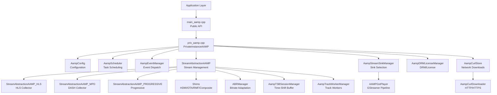
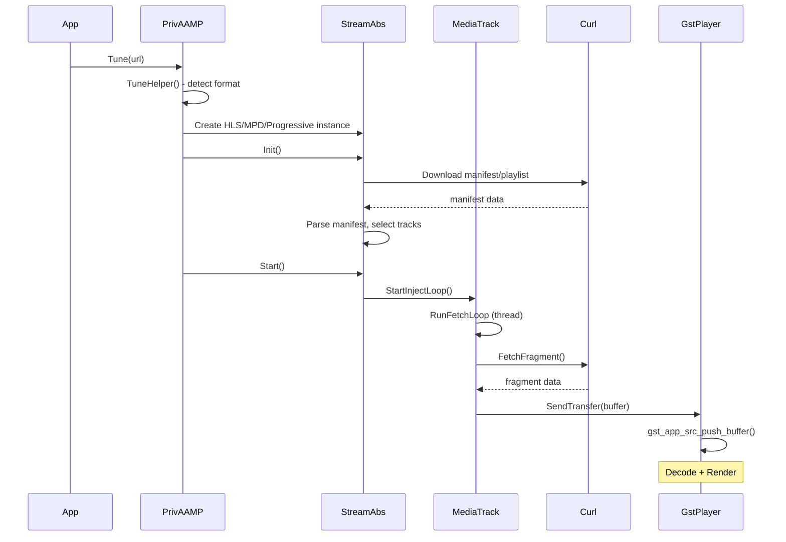

# AAMP Core End-to-End Architecture

## Overview

AAMP (Advanced Adaptive Media Player) is a C/C++ media player engine for adaptive streaming. It supports DASH, HLS, and progressive playback with DRM, ABR, TSB, and GStreamer-based rendering.

## High-Level Component Architecture

## Module Summary

| Module | Key Classes | Sequence Diagram |
|--------|-------------|-----------------|
| Tune/Playback Lifecycle | PrivateInstanceAAMP, Tune(), TuneHelper(), TeardownStream() | [01-tune-playback-lifecycle.md](aamp-core-sequence-diagrams/01-tune-playback-lifecycle.md) |
| GStreamer Pipeline | AAMPGstPlayer, pipeline setup, buffer injection, EOS | [02-gstreamer-pipeline.md](aamp-core-sequence-diagrams/02-gstreamer-pipeline.md) |
| Stream Abstraction | StreamAbstractionAAMP, MediaTrack, RunFetchLoop, InjectLoop | [03-stream-abstraction.md](aamp-core-sequence-diagrams/03-stream-abstraction.md) |
| HLS Fragment Collection | StreamAbstractionAAMP_HLS, TrackState, IndexPlaylist, FetchFragment | [04-fragment-collector-hls.md](aamp-core-sequence-diagrams/04-fragment-collector-hls.md) |
| MPD/DASH Collection | StreamAbstractionAAMP_MPD, FetchFragment, PeriodTransition | [05-fragment-collector-mpd.md](aamp-core-sequence-diagrams/05-fragment-collector-mpd.md) |
| DRM License Management | AampDRMLicenseManager, DrmInterface, AampLicensePreFetcher | [06-drm-session-manager.md](aamp-core-sequence-diagrams/06-drm-session-manager.md) |
| Event System | AampEventManager, AAMPEventObject, listeners | [07-event-manager.md](aamp-core-sequence-diagrams/07-event-manager.md) |
| Config & Scheduler | AampConfig, AampScheduler, async tasks | [08-config-scheduler.md](aamp-core-sequence-diagrams/08-config-scheduler.md) |
| Network/Curl | AampCurlStore, AampCurlDownloader, retry/timeout | [09-curl-network.md](aamp-core-sequence-diagrams/09-curl-network.md) |
| Time-Shift Buffer | AampTsbDataManager, AampTSBSessionManager, AampTsbReader | [10-tsb-timeshift-buffer.md](aamp-core-sequence-diagrams/10-tsb-timeshift-buffer.md) |
| ABR | ABRManager, ramp-up/ramp-down, network estimation | [11-abr-adaptive-bitrate.md](aamp-core-sequence-diagrams/11-abr-adaptive-bitrate.md) |
| MPD Utilities | AampMPDDownloader, AampMPDParseHelper, AampMPDUtils | [12-mpd-utils.md](aamp-core-sequence-diagrams/12-mpd-utils.md) |
| Stream Sink Manager | AampStreamSinkManager, active/inactive sink switching | [13-stream-sink-manager.md](aamp-core-sequence-diagrams/13-stream-sink-manager.md) |
| Track Workers | AampTrackWorker, AampTrackWorkerManager | [14-track-workers.md](aamp-core-sequence-diagrams/14-track-workers.md) |
| Shims | hdmiin_shim, ota_shim, rmf_shim, compositein_shim | [15-shims.md](aamp-core-sequence-diagrams/15-shims.md) |

## Data Flow

## Key Design Decisions

1. **Format Abstraction**: StreamAbstractionAAMP provides uniform interface for HLS/DASH/Progressive
2. **Thread-per-Track**: Each MediaTrack runs its own fetch + inject loop
3. **Plugin Architecture**: GStreamer pipeline constructed dynamically based on codec
4. **Dual Sink**: AampStreamSinkManager supports active/inactive sinks for seamless transitions
5. **License Pre-fetching**: AampLicensePreFetcher queues DRM requests ahead of playback
6. **ABR**: Network-based estimation with configurable ramp profiles
7. **TSB**: Disk-backed time-shift buffer with segment eviction

## Source References

All diagrams generated from verified source file reads. See individual diagram files for per-method line references.
