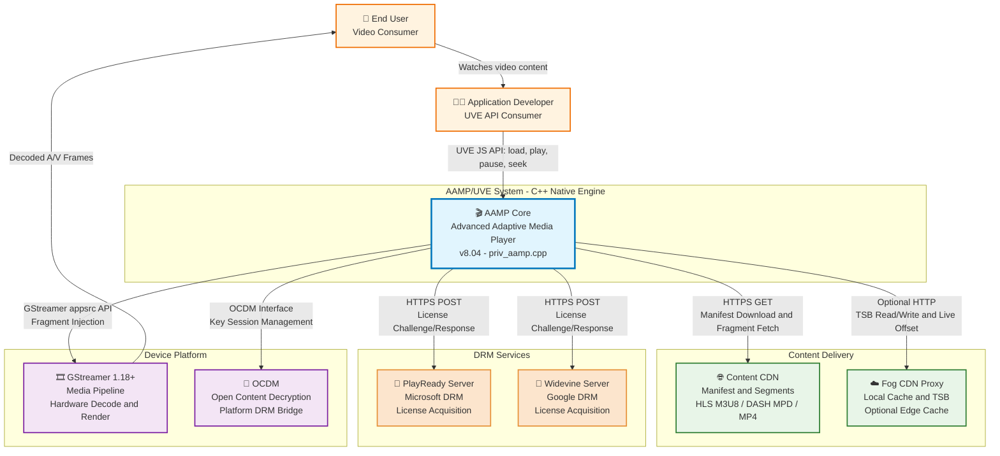
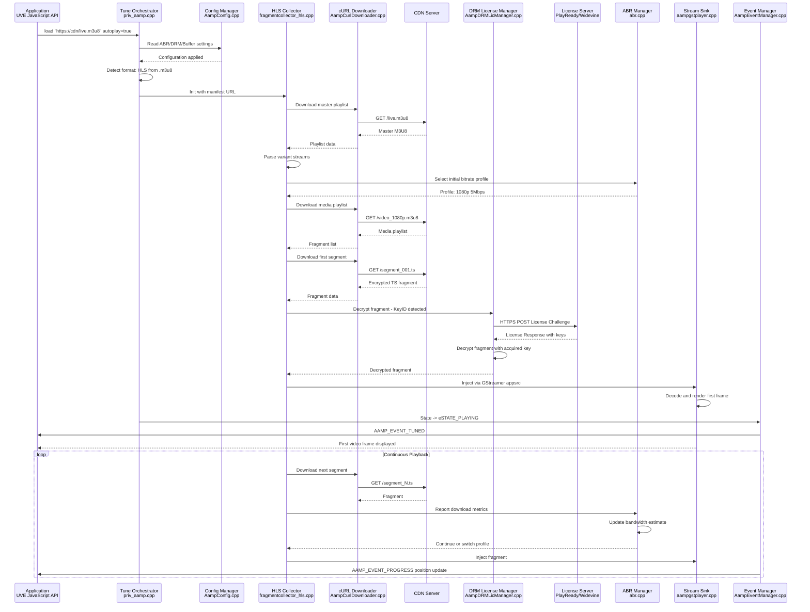
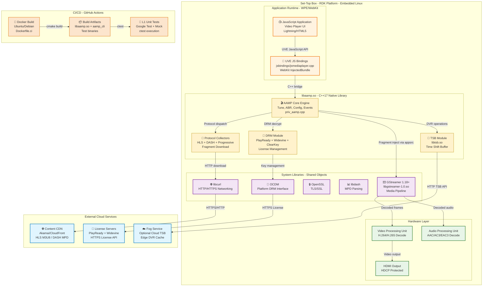

# AAMP Architecture Brief

## Table of Contents

- [Overview](#overview)
- [Problem Definitions & Business Context](#problem-definitions--business-context)
  - [Problem Statement](#problem-statement)
  - [Business Context](#business-context)
- [C4 System Context Diagram](#c4-system-context-diagram)
- [System Overview](#system-overview)
  - [C4 Container Diagram](#c4-container-diagram)
  - [C4 Container Diagram Explanation](#c4-container-diagram-explanation)
  - [Request Flow Sequence](#request-flow-sequence)
  - [Technology Stack](#technology-stack)
- [System Data Models](#system-data-models)
  - [Data Model ER Diagram](#data-model-er-diagram)
- [API Endpoints](#api-endpoints)
  - [Core API Routes](#core-api-routes)
- [Deployment Architecture](#deployment-architecture)

---

## Overview

AAMP (Advanced Adaptive Media Player) / Universal Video Engine (UVE) is a native C++17 video playback engine built on top of GStreamer, optimized for performance, memory efficiency, and code size on embedded RDK-based devices. It provides adaptive streaming for HLS, MPEG-DASH, and progressive MP4 content with integrated DRM support (PlayReady, Widevine, ClearKey), adaptive bitrate (ABR) control, time-shift buffer (TSB/DVR) capabilities, and event-driven playback management.

**Version:** 8.04

**Primary Users:**
- Application developers integrating video playback via the UVE JavaScript API
- Platform/firmware engineers deploying AAMP on RDK set-top boxes
- QA engineers validating streaming, DRM, and playback behavior

**Primary Use Cases:**
- Live TV streaming with low-latency adaptive bitrate
- VOD (Video on Demand) playback with multi-DRM protection
- DVR/time-shift buffer playback for pause/rewind on live content
- Multi-protocol support across HLS, DASH, and progressive MP4

---

## Problem Definitions & Business Context

### Problem Statement

RDK-based set-top boxes and embedded devices require a high-performance, memory-efficient video playback engine that can:

1. **Handle Multiple Streaming Protocols**: Support HLS, MPEG-DASH, and progressive MP4 with protocol-specific optimizations for live, VOD, and CDVR content.
2. **Manage Complex DRM Requirements**: Integrate PlayReady, Widevine, ClearKey, and AES-128 DRM systems with license pre-fetching, rotation, and HDCP output protection.
3. **Optimize for Embedded Constraints**: Operate within < 512MB RAM for the player stack while maintaining real-time playback performance on resource-constrained hardware.
4. **Provide Adaptive Streaming**: Dynamically adjust bitrate based on network conditions, buffer health, and configurable thresholds using harmonic EWMA and rolling median estimators.
5. **Enable DVR Functionality**: Support time-shift buffer (TSB) via local storage or cloud-based Fog service for pause, rewind, and resume on live content.

### Business Context

- **Primary Users**: Application developers using UVE JavaScript API, platform engineers integrating into RDK firmware, QA teams validating streaming behavior
- **Use Cases**:
  1. Live sports streaming with low-latency DASH (< 2s tune time target)
  2. Premium VOD content with multi-DRM protection (PlayReady + Widevine)
  3. Time-shifted viewing with local or cloud-based TSB (Fog)
  4. Multi-language audio/subtitle track selection and closed captioning (CEA-608/708, WebVTT)
- **Non-Functional Requirements**:
  - **Availability**: 99.9% uptime for core playback engine
  - **Performance**: < 2s tune time for channel changes, < 5s initial playback start
  - **Security**: DRM compliance with HDCP output protection, license rotation support
  - **Scalability**: Concurrent playback support, adaptive to bandwidth constraints
  - **Memory**: < 512MB total player stack footprint on embedded devices
- **Integration Points**: Content CDN (manifest/segment delivery), DRM License Servers (PlayReady/Widevine), GStreamer pipeline, Fog TSB service, and application layer (UVE JavaScript API)

---

## C4 System Context Diagram



---

## System Overview

### C4 Container Diagram

```mermaid
graph TD
    AppLayer["👤 Application Layer<br/>JavaScript / UVE API<br/>jsmediaplayer.cpp"]

    subgraph AAMPCore ["AAMP Core Engine - C++17 / libaamp.so"]
        TuneOrch["Tune Orchestrator<br/>priv_aamp.cpp<br/>State Machine and Coordination"]

        subgraph Collectors ["Protocol Collectors"]
            HLS["HLS Collector<br/>fragmentcollector_hls.cpp<br/>M3U8 Parse and Fragment Fetch"]
            DASH["DASH Collector<br/>fragmentcollector_mpd.cpp<br/>MPD Parse and Segment Fetch"]
            Progressive["Progressive Collector<br/>fragmentcollector_progressive.cpp<br/>MP4 Range Requests"]
        end

        subgraph BufferABR ["Buffer and ABR"]
            ABR["ABR Manager<br/>abr/abr.cpp<br/>HarmonicEwma + RollingMedian"]
            BufferCtrl["Buffer Control<br/>AampBufferControl.cpp<br/>Health Monitoring"]
            LatencyMon["Latency Monitor<br/>AampLatencyMonitor.cpp<br/>Low Latency DASH"]
        end

        subgraph DRMStack ["DRM Stack"]
            DRMLic["DRM License Manager<br/>drm/AampDRMLicManager.cpp<br/>PlayReady and Widevine"]
            DRMPre["License Prefetcher<br/>AampDRMLicPreFetcher.cpp<br/>Parallel Pre-acquisition"]
        end

        subgraph TSBStack ["TSB / DVR Stack"]
            TSBMgr["TSB Session Manager<br/>AampTSBSessionManager.cpp"]
            TSBReader["TSB Reader<br/>AampTsbReader.cpp"]
            TSBData["TSB Data Manager<br/>AampTsbDataManager.cpp"]
        end

        EventMgr["Event Manager<br/>AampEventManager.cpp<br/>Async and Sync Dispatch"]
        ConfigMgr["Config Manager<br/>AampConfig.cpp<br/>Layered Configuration"]
        Scheduler["Async Scheduler<br/>AampScheduler.cpp<br/>Worker Thread Pool"]
        Profiler["Profiler<br/>AampProfiler.cpp<br/>Tune Time Metrics"]
        CMCD["CMCD Collector<br/>AampCMCDCollector.cpp<br/>Common Media Client Data"]
    end

    subgraph GstLayer ["GStreamer Integration"]
        SinkMgr["Stream Sink Manager<br/>AampStreamSinkManager.cpp<br/>Pipeline Lifecycle"]
        GstPlayer["GStreamer Player<br/>aampgstplayer.cpp<br/>appsrc Injection"]
    end

    subgraph Networking ["Network Layer"]
        CurlDown["cURL Downloader<br/>downloader/AampCurlDownloader.cpp<br/>HTTP/HTTPS Requests"]
        CurlStore["Connection Store<br/>downloader/AampCurlStore.cpp<br/>Connection Reuse"]
    end

    subgraph ExternalDeps ["External Services"]
        CDN[("CDN Servers<br/>HLS/DASH/MP4<br/>Manifests and Segments")]
        LicSrv[("License Servers<br/>PlayReady and Widevine<br/>Key Acquisition")]
        FogTSB[("Fog TSB Service<br/>Cloud DVR<br/>Time Shift Buffer")]
    end

    AppLayer -->|"load url autoplay"| TuneOrch
    TuneOrch -->|"Protocol Selection"| Collectors
    TuneOrch -->|"State Events"| EventMgr
    EventMgr -->|"TUNED PROGRESS FAILED"| AppLayer

    HLS -->|"Download Request"| CurlDown
    DASH -->|"Download Request"| CurlDown
    Progressive -->|"Download Request"| CurlDown
    CurlDown -->|"HTTPS/HTTP"| CDN

    Collectors -->|"Encrypted Fragment"| DRMStack
    DRMLic -->|"HTTPS POST Challenge"| LicSrv
    DRMPre -->|"Pre-fetch License"| LicSrv

    Collectors -->|"Decrypted Fragment"| SinkMgr
    SinkMgr -->|"GStreamer appsrc push"| GstPlayer

    ConfigMgr -->|"ABR Thresholds"| ABR
    ABR -->|"Profile Decision"| Collectors
    BufferCtrl -->|"Buffer Health"| ABR

    TuneOrch -->|"TSB Enable"| TSBStack
    TSBMgr -->|"Cloud TSB R/W"| FogTSB

    CMCD -->|"CMCD Headers"| CurlDown
    Profiler -->|"Metrics"| EventMgr

    classDef core fill:#fff2cc,stroke:#d6b656,stroke-width:2px
    classDef protocol fill:#cfe2f3,stroke:#3c78d8,stroke-width:2px
    classDef drm fill:#fce5cd,stroke:#e69138,stroke-width:2px
    classDef tsb fill:#d0e0e3,stroke:#45818e,stroke-width:2px
    classDef external fill:#d9ead3,stroke:#6aa84f,stroke-width:2px
    classDef gst fill:#ead1dc,stroke:#a64d79,stroke-width:2px
    classDef net fill:#d9d2e9,stroke:#674ea7,stroke-width:2px

    class TuneOrch,EventMgr,ConfigMgr,Scheduler,Profiler,CMCD core
    class HLS,DASH,Progressive protocol
    class ABR,BufferCtrl,LatencyMon protocol
    class DRMLic,DRMPre drm
    class TSBMgr,TSBReader,TSBData tsb
    class CDN,LicSrv,FogTSB external
    class SinkMgr,GstPlayer gst
    class CurlDown,CurlStore net
```



### C4 Container Diagram Explanation

#### Core Components

**1. Tune Orchestrator (`priv_aamp.cpp`)**
- Central entry point for all playback operations
- Implements `Tune()` and `TuneHelper()` methods that orchestrate the full playback lifecycle
- Manages the playback state machine: `eSTATE_IDLE` -> `eSTATE_INITIALIZING` -> `eSTATE_PREPARED` -> `eSTATE_PLAYING` -> `eSTATE_PAUSED`
- Selects protocol collector based on manifest URL extension (`.m3u8` = HLS, `.mpd` = DASH)

**2. Protocol Collectors**
- **HLS Collector (`fragmentcollector_hls.cpp`)**: Parses M3U8 master/media playlists, handles AES-128 and SAMPLE-AES encryption, variant stream selection, and live playlist refresh
- **DASH Collector (`fragmentcollector_mpd.cpp`)**: Parses MPD manifests, supports multi-period, SegmentTimeline, SegmentTemplate, and Low Latency DASH (LLDASH)
- **Progressive Collector (`fragmentcollector_progressive.cpp`)**: Direct MP4 playback with HTTP byte-range requests
- All collectors extend the `StreamAbstractionAAMP` abstract base class

**3. ABR Manager (`abr/abr.cpp`)**
- Uses Harmonic EWMA estimator (`HarmonicEwmaEstimator.cpp`) for bandwidth estimation
- Rolling Median Outlier estimator (`RollingMedianOutlierEstimator.cpp`) filters anomalous samples
- Configurable ramp-up/ramp-down thresholds and network consistency checks
- Cache-based smoothing with configurable life (5000ms default) and outlier threshold (5MB)

**4. DRM Stack**
- **License Manager (`drm/AampDRMLicManager.cpp`)**: Handles PlayReady, Widevine, and ClearKey license acquisition via challenge/response over HTTPS
- **License Prefetcher (`AampDRMLicPreFetcher.cpp`)**: Optimizes tune time by pre-acquiring licenses in parallel with manifest download
- Integrates with OCDM (Open Content Decryption Module) on RDK platforms

**5. TSB/DVR Stack**
- **TSB Session Manager (`AampTSBSessionManager.cpp`)**: Manages DVR recording sessions
- **TSB Reader (`AampTsbReader.cpp`)**: Reads back time-shifted content
- **TSB Data Manager (`AampTsbDataManager.cpp`)**: Manages metadata (ad reservations, placements, period boundaries)
- Supports local storage and cloud-based Fog TSB

**6. Event Manager (`AampEventManager.cpp`)**
- Dispatches events (TUNED, TUNE_FAILED, PROGRESS, BITRATE_CHANGED, etc.) to JavaScript listeners
- Supports both synchronous and asynchronous delivery modes
- Delivers typed event objects (via `AampEvent.h` class hierarchy)

**7. Configuration Manager (`AampConfig.cpp`)**
- Layered priority: Code defaults < Operator/RFC < Stream < Application < Developer (`/opt/aamp.cfg`)
- Controls ABR, DRM, buffering, logging, and network behavior
- JSON format support via `/opt/aampcfg.json`

**8. Network Layer (`downloader/`)**
- **cURL Downloader (`AampCurlDownloader.cpp`)**: HTTP/HTTPS download engine using libcurl
- **Connection Store (`AampCurlStore.cpp`)**: Reuses connections for performance
- Supports CMCD headers for CDN-side analytics

#### GStreamer Integration

- **Stream Sink Manager (`AampStreamSinkManager.cpp`)**: Manages GStreamer pipeline lifecycle and fragment injection
- **GStreamer Player (`aampgstplayer.cpp`)**: Wraps GStreamer pipeline; injects decrypted fragments via `appsrc` element; configures decoders and sinks (Westeros for RDK)

---

#### **Request Flow Sequence:**

**Critical Use Case: Live HLS Playback with DRM**



**Flow Summary:**
1. Application calls `player.load(url, autoplay: true)` via UVE JavaScript API
2. Tune Orchestrator reads configuration and detects HLS format from URL extension
3. HLS Collector downloads master playlist, selects initial profile via ABR Manager
4. First encrypted fragment is downloaded and passed to DRM License Manager
5. License is acquired from server via HTTPS POST challenge/response
6. Decrypted fragment is injected into GStreamer pipeline via appsrc
7. `AAMP_EVENT_TUNED` is dispatched when first frame renders
8. Continuous loop: download, decrypt, inject, report metrics to ABR

---

### Technology Stack

**Runtime & Languages:**
- C++ 17 (core engine, `-std=c++17` enforced via CMake)
- CMake 3.5+ (build system with Xcode/GCC/Clang support)
- JavaScript (UVE API bindings via WebKit InjectedBundle)
- Bash (build scripts: `buildinfo.sh`, `install-aamp.sh`)

**Media Framework:**
- GStreamer 1.18.0+ (media pipeline, appsrc, video/audio decoders)
- gstreamer-app 1.0 (application source/sink elements)
- libdash (ISO/IEC 23009-1 DASH manifest parsing)
- ISOBMFF parser (internal `isobmff/` - fragmented MP4 processing)

**Networking:**
- libcurl 7.81+ (HTTP/HTTPS, macOS requires 8.5+)
- OpenSSL (TLS/SSL encryption for HTTPS)
- CMCD support (Common Media Client Data headers)

**Data Parsing:**
- libxml2 (XML parsing for DASH MPD)
- cJSON (JSON parsing for configuration and events)
- UUID library (session/trace identifier generation)

**DRM Services:**
- PlayReady (Microsoft DRM - license acquisition)
- Widevine (Google DRM - license acquisition)
- ClearKey (W3C standard - in-band key delivery)
- AES-128 (HLS segment encryption)
- OCDM (Open Content Decryption Module - RDK platform bridge)

**Infrastructure:**
- Docker (CI containerization)
- GitHub Actions (CI/CD pipeline)
- Yocto/BitBake (RDK firmware integration)
- Westeros Compositor (RDK video rendering)

**Monitoring & Diagnostics:**
- AampLogManager (multi-target logging: stdout, systemd journal, EthanLog)
- AampTelemetry2 (structured telemetry collection)
- AampProfiler (tune time measurement, download metrics)
- AampCMCDCollector (CDN-side analytics via CMCD headers)

**Testing:**
- Google Test 1.10+ (unit test framework)
- Google Mock (mocking for L1 tests)
- ctest (test execution)
- GitHub Actions CI (automated test on push/PR)

---

## System Data Models

### Data Model ER Diagram

```mermaid
erDiagram
    AAMP_SESSION ||--o{ PLAYBACK_EVENT : generates
    AAMP_SESSION ||--|| CONFIG_SETTINGS : uses
    AAMP_SESSION ||--o{ FRAGMENT_DOWNLOAD : manages
    AAMP_SESSION ||--o| TSB_RECORDING : may_have
    AAMP_SESSION ||--|| DRM_SESSION : requires
    AAMP_SESSION ||--|| ABR_STATE : tracks

    FRAGMENT_DOWNLOAD ||--o| DRM_LICENSE : may_require
    TSB_RECORDING ||--o{ TSB_METADATA : contains

    AAMP_SESSION {
        string sessionId PK "UUID trace identifier"
        string manifestUrl "Content manifest URL"
        enum mediaFormat "HLS DASH PROGRESSIVE"
        enum playerState "IDLE INITIALIZING PREPARED PLAYING PAUSED SEEKING COMPLETE ERROR"
        double seekPosition "Current playback position seconds"
        int currentBitrate "Active ABR profile bps"
        timestamp tuneStartTime "Tune initiation time"
        double tuneTimeMs "Total tune duration ms"
        string traceUUID "Distributed trace ID"
    }

    CONFIG_SETTINGS {
        int configId PK "Configuration instance"
        bool enableABR "ABR logic enabled"
        bool enableFog "Fog TSB enabled"
        int initialBitrate "Startup bitrate bps"
        int abrCacheLength "ABR samples to consider"
        int abrCacheLife "Cache lifetime ms"
        int bufferHealthMonitorDelay "Health check delay s"
        string networkProxy "Optional HTTP proxy"
        string licenseServerUrl "DRM server endpoint"
        enum preferredDRM "PlayReady Widevine ClearKey"
        int liveOffset "Live edge offset seconds"
    }

    PLAYBACK_EVENT {
        int eventId PK "Auto-increment"
        string sessionId FK "Parent session"
        enum eventType "TUNED TUNE_FAILED PROGRESS BITRATE_CHANGED DRM_METADATA BUFFER_UNDERFLOW EOS SPEED_CHANGED"
        timestamp eventTime "Event occurrence time"
        string eventData "JSON payload with details"
    }

    FRAGMENT_DOWNLOAD {
        int downloadId PK "Auto-increment"
        string sessionId FK "Parent session"
        enum mediaType "VIDEO AUDIO SUBTITLE IFRAME"
        string fragmentUrl "Segment URL"
        int fragmentSizeBytes "Downloaded bytes"
        double downloadTimeMs "Download duration ms"
        int bitrateBps "Fragment bitrate"
        bool encrypted "DRM protected"
        int httpResponseCode "HTTP status"
    }

    DRM_SESSION {
        string drmSessionId PK "DRM context ID"
        string sessionId FK "Parent session"
        enum drmType "PlayReady Widevine ClearKey AES128"
        string keySystemId "Key system UUID"
        timestamp licenseAcquiredTime "License fetch time"
        double licenseLatencyMs "License RTT ms"
    }

    DRM_LICENSE {
        string licenseId PK "License identifier"
        int downloadId FK "Associated fragment"
        string keyId "Content key ID"
        timestamp expiryTime "License expiration"
        bool rotationRequired "Key rotation needed"
    }

    ABR_STATE {
        int stateId PK "State instance"
        string sessionId FK "Parent session"
        int currentProfile "Active profile index"
        long estimatedBandwidthBps "EWMA bandwidth estimate"
        int bufferHealthMs "Current buffer level ms"
        int profileSwitchCount "Total switches in session"
    }

    TSB_RECORDING {
        string recordingId PK "Recording session ID"
        string sessionId FK "Parent playback session"
        string manifestUrl "Source manifest"
        double recordingDurationSec "Total recorded duration"
        timestamp startTime "Recording start"
        bool isFogTSB "Cloud vs local mode"
        string storagePath "Local file path or Fog URL"
    }

    TSB_METADATA {
        int metadataId PK "Auto-increment"
        string recordingId FK "Parent recording"
        enum metadataType "AdReservation AdPlacement PeriodInfo SCTE35"
        double presentationTime "PTS in timeline"
        string payload "Metadata JSON content"
    }
```



**Data Model Explanation:**

- **AAMP_SESSION**: Represents a single playback lifecycle from `load()` to `stop()`. Tracks state transitions, tune time metrics, and links to all child entities.

- **CONFIG_SETTINGS**: Layered configuration applied to a session. Priority order: code defaults < operator/RFC < stream < application < developer file. Controls ABR thresholds, DRM preferences, buffer timing, and network proxies.

- **PLAYBACK_EVENT**: All events dispatched by `AampEventManager` to JavaScript listeners. JSON payload varies by event type (error codes for TUNE_FAILED, bitrate values for BITRATE_CHANGED, position for PROGRESS).

- **FRAGMENT_DOWNLOAD**: Per-segment download record used by ABR for bandwidth estimation. Download time and size feed into the Harmonic EWMA and Rolling Median estimators.

- **DRM_SESSION / DRM_LICENSE**: DRM context per playback session with per-fragment license tracking. Supports license pre-fetching and key rotation scenarios.

- **ABR_STATE**: Real-time adaptive bitrate state including bandwidth estimate from network sampling, buffer health level, and profile switch history.

- **TSB_RECORDING / TSB_METADATA**: Time-shift buffer recording with associated ad insertion metadata (SCTE-35 markers, ad reservations/placements, period boundaries) enabling accurate seek within DVR content.

---

## API Endpoints

### Core API Routes

**Note:** AAMP does not expose HTTP REST endpoints. It provides a JavaScript API (UVE) via WebKit InjectedBundle on RDK platforms. The following documents the public UVE API as the primary interface.

---

**Public UVE API Methods (Application-Facing):**

| Method | Parameters | Description |
|--------|-----------|-------------|
| `load(url, autoplay, tuneParams)` | url: string, autoplay: bool | Load manifest and begin playback |
| `play()` | - | Resume from paused state |
| `pause()` | - | Pause playback |
| `stop()` | - | Stop and release resources |
| `seek(position)` | position: double (seconds) | Seek to absolute position |
| `setRate(rate)` | rate: float | Set trick-play speed (0.5, 1, 2, 4, ...) |
| `setDRMConfig(config)` | config: JSON object | Configure DRM license server URLs |
| `initConfig(config)` | config: JSON object | Set all player configuration |
| `addEventListener(event, handler)` | event: string, handler: function | Register event callback |
| `removeEventListener(event, handler)` | event: string, handler: function | Remove event callback |
| `getAvailableAudioTracks()` | - | Get list of available audio tracks |
| `getAvailableTextTracks()` | - | Get list of subtitle/CC tracks |
| `setAudioTrack(index)` | index: int | Switch audio track |
| `setTextTrack(index)` | index: int | Switch subtitle track |
| `setClosedCaptionStatus(enabled)` | enabled: bool | Enable/disable closed captions |
| `getThumbnails(startPos, endPos)` | start/end: double | Get thumbnail tile info for scrub bar |
| `getPlaybackStatistics()` | - | Get session metrics (VideoEnd event data) |
| `getCurrentState()` | - | Get current player state enum |
| `getDurationSec()` | - | Get content duration |
| `getCurrentPosition()` | - | Get current playback position |

**Configuration Properties (via `initConfig`):**

| Property | Type | Default | Description |
|----------|------|---------|-------------|
| `abr` | bool | true | Enable adaptive bitrate |
| `initialBitrate` | int | 2500000 | Startup bitrate in bps |
| `abrCacheLength` | int | 3 | ABR bandwidth samples |
| `liveOffset` | int | 15 | Live edge offset seconds |
| `networkTimeout` | int | 10 | Network timeout seconds |
| `preferredDRM` | string | - | Preferred DRM system |
| `stereoOnly` | bool | false | Force stereo audio |
| `bulkTimedMetadata` | bool | false | Batch timed metadata events |

**Event Types (Callback-Based):**

| Event | Description |
|-------|-------------|
| `playbackStarted` / `AAMP_EVENT_TUNED` | Playback successfully initiated |
| `playbackFailed` / `AAMP_EVENT_TUNE_FAILED` | Tune failed with error code |
| `playbackProgressUpdate` / `AAMP_EVENT_PROGRESS` | Periodic position/duration update |
| `bitrateChanged` / `AAMP_EVENT_BITRATE_CHANGED` | ABR profile switch occurred |
| `drmMetadata` / `AAMP_EVENT_DRM_METADATA` | DRM license status update |
| `bufferingChanged` / `AAMP_EVENT_BUFFER_UNDERFLOW` | Rebuffering started/stopped |
| `playbackSpeedChanged` / `AAMP_EVENT_SPEED_CHANGED` | Trick-play rate change |
| `playbackCompleted` / `AAMP_EVENT_EOS` | End of content reached |
| `id3Metadata` / `AAMP_EVENT_ID3_METADATA` | ID3 tag received in stream |
| `timedMetadata` | SCTE-35 or timed metadata marker |

**Internal C++ API (Component-Level):**

| Method | File | Description |
|--------|------|-------------|
| `PrivateInstanceAAMP::Tune()` | priv_aamp.cpp | Core tune orchestration |
| `PrivateInstanceAAMP::TuneHelper()` | priv_aamp.cpp | Tune execution with retry logic |
| `StreamAbstractionAAMP::Init()` | StreamAbstractionAAMP.h | Protocol-specific init (abstract) |
| `StreamAbstractionAAMP::FetchFragment()` | fragmentcollector_*.cpp | Download next segment |
| `AampEventManager::SendEvent()` | AampEventManager.cpp | Dispatch event to listeners |
| `ABRManager::GetDesiredProfile()` | abr/abr.cpp | Compute optimal bitrate profile |
| `AampDRMLicManager::AcquireLicense()` | drm/AampDRMLicManager.cpp | DRM license acquisition |
| `AampScheduler::ScheduleTask()` | AampScheduler.cpp | Queue async worker task |

---

## Deployment Architecture

AAMP is deployed as a native shared library (`libaamp.so`) integrated into RDK-based set-top box firmware. It does not run as a standalone server.



**Deployment Characteristics:**

| Aspect | Details |
|--------|---------|
| **Artifact** | `libaamp.so` shared library + `aamp_cli` test binary |
| **Target Platform** | RDK-based set-top boxes (ARM/x86), macOS/Ubuntu (simulator) |
| **Build System** | CMake 3.5+ with GCC/Clang, cross-compilation via Yocto/BitBake |
| **C++ Standard** | C++17 (`-std=c++17`, `-Werror=format`) |
| **CI Pipeline** | GitHub Actions -> Docker build -> ctest -> JUnit XML results |
| **Runtime Dependencies** | GStreamer 1.18+, libcurl, OpenSSL, libxml2, libdash, cJSON, UUID |
| **DRM Integration** | OCDM (RDK), SecClient, platform-specific DRM HAL |
| **Logging** | AampLogManager -> stdout / systemd journal / EthanLog |
| **Telemetry** | AampTelemetry2 -> structured metrics collection |
| **Configuration** | `/opt/aamp.cfg` (text) or `/opt/aampcfg.json` (JSON) |

**Build Commands:**
```bash
# Standard build (Ubuntu/macOS simulator)
mkdir build && cd build
cmake .. -DCMAKE_PLATFORM_UBUNTU=1
make -j$(nproc)

# RDK cross-compilation (via Yocto recipe)
bitbake aamp

# Run unit tests
cd build && ctest --output-on-failure
```

---

**Copyright 2026 RDK Management**

Licensed under the Apache License, Version 2.0.
