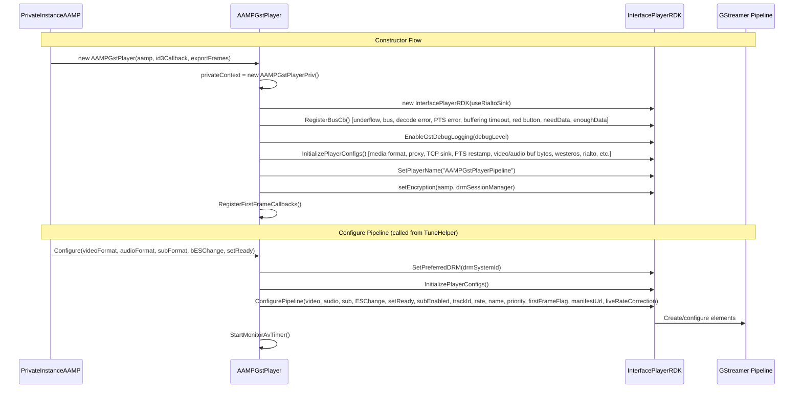
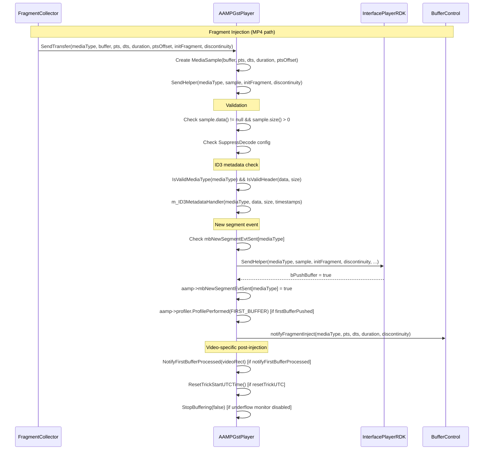
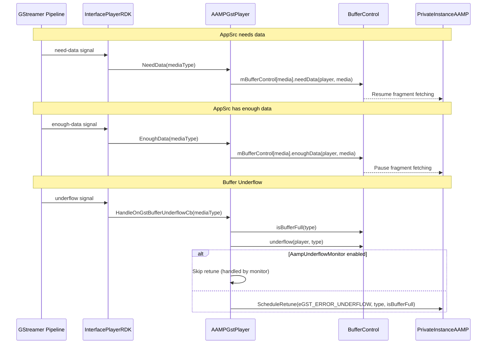
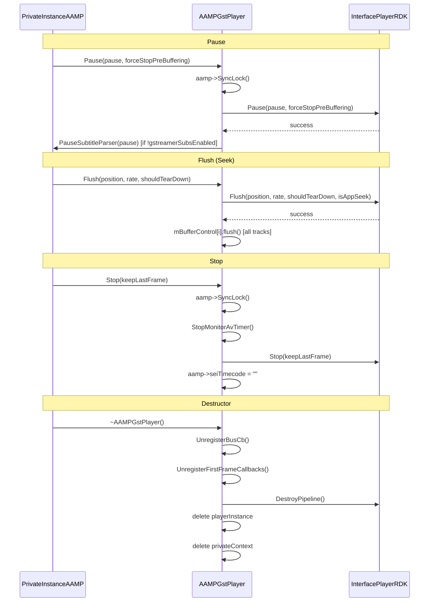
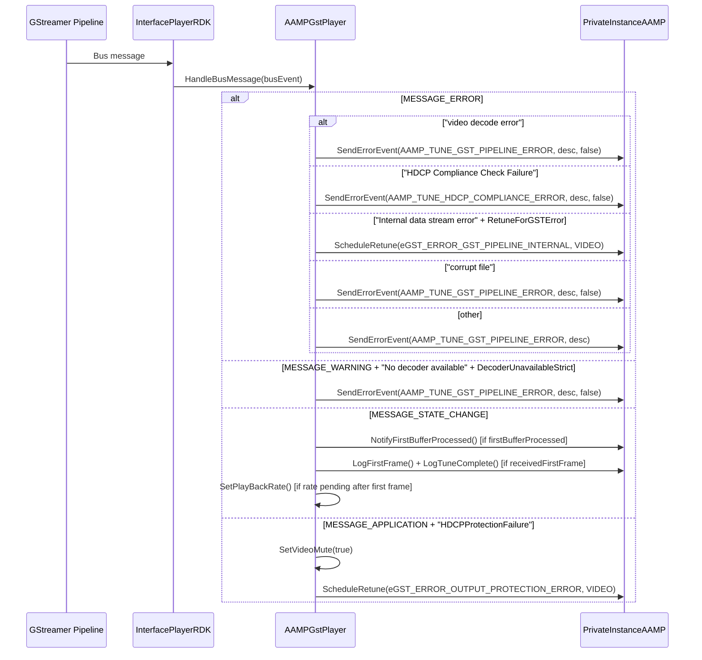
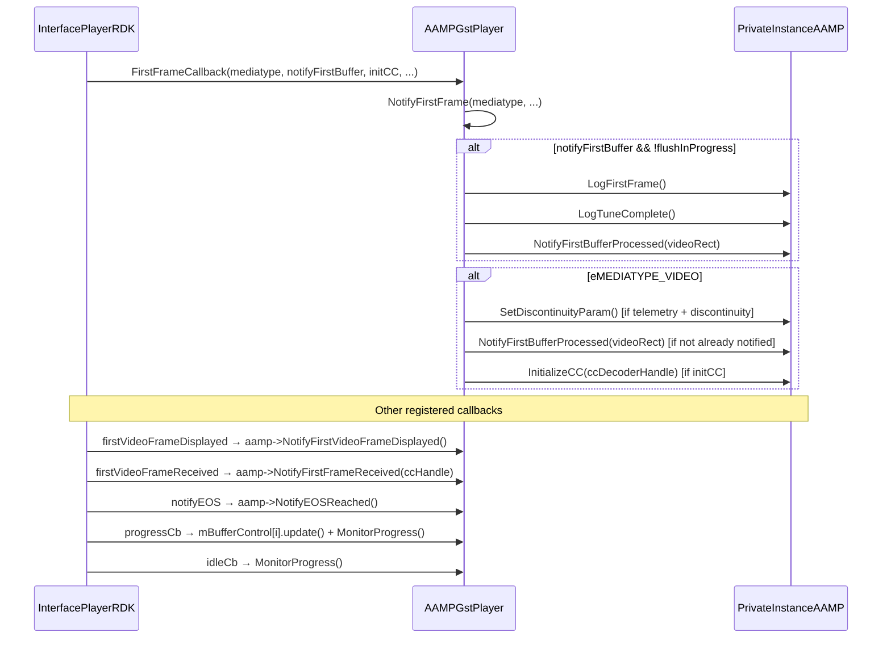
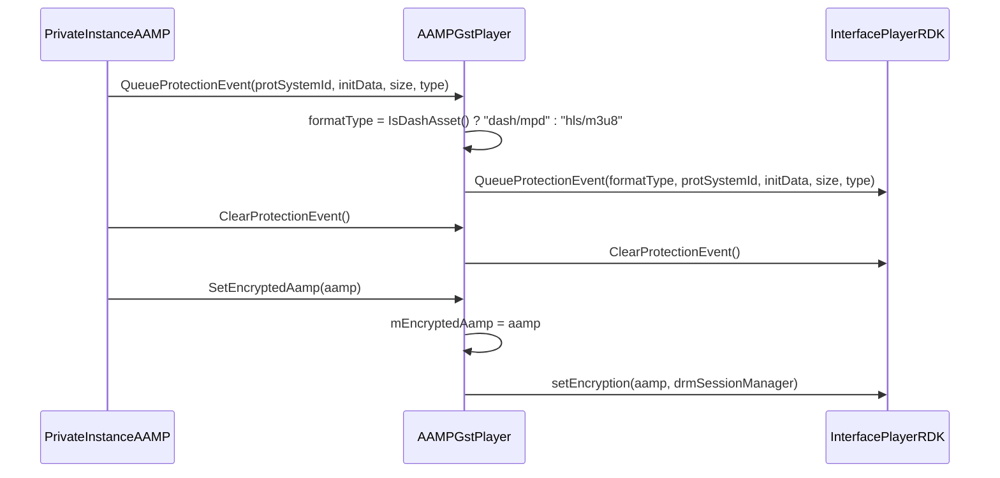
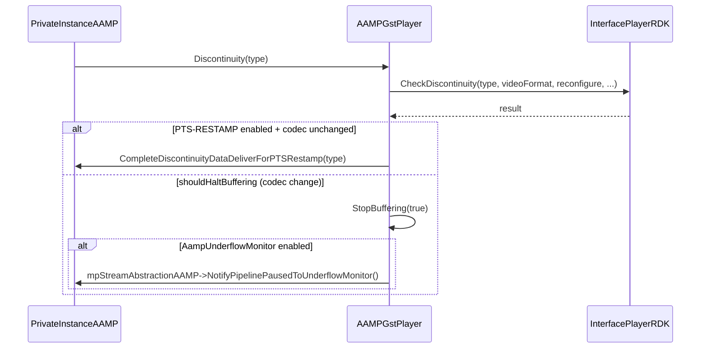

# 02 — GStreamer Pipeline (AAMPGstPlayer)

> **Source files read**: `aampgstplayer.h` (lines 1-400), `aampgstplayer.cpp` (lines 1-1500 — complete)
> **Confidence**: 100%

## Overview

`AAMPGstPlayer` is the StreamSink implementation that manages the GStreamer pipeline via `InterfacePlayerRDK`. It handles:
- Pipeline creation and configuration
- Buffer injection (Send/SendHelper)
- Playback state transitions (Play/Pause/Stop/Flush)
- Buffer flow control (NeedData/EnoughData/Underflow)
- Error handling (decode errors, PTS errors, bus messages)
- DRM protection events
- First frame notification chain
- AV monitoring

## 1. Pipeline Construction & Configuration

## 2. Buffer Injection Flow

## 3. Buffer Flow Control (NeedData / EnoughData / Underflow)

## 4. Playback State Transitions

## 5. Error Handling (Bus Messages)

## 6. First Frame Notification Chain

## 7. DRM Protection Events

## 8. Discontinuity Handling

## Key Interfaces

| Method | Purpose |
|--------|---------|
| `Configure()` | Create/configure pipeline based on A/V/Sub formats |
| `SendTransfer()` / `SendCopy()` | Inject fragments (MP4 / TS elementary) |
| `Flush()` | Seek — flush buffers, reset buffer control |
| `Pause()` | Pause/resume pipeline |
| `Stop()` | Stop pipeline, clear timers |
| `EndOfStreamReached()` | Signal EOS for a track |
| `Discontinuity()` | Handle stream discontinuity |
| `SetPlayBackRate()` | Trick play / live latency correction |
| `StopBuffering()` | Un-pause after buffer recovery |
| `GetPositionMilliseconds()` | Query playback position |
| `SetVideoRectangle()` | Set display coordinates |
