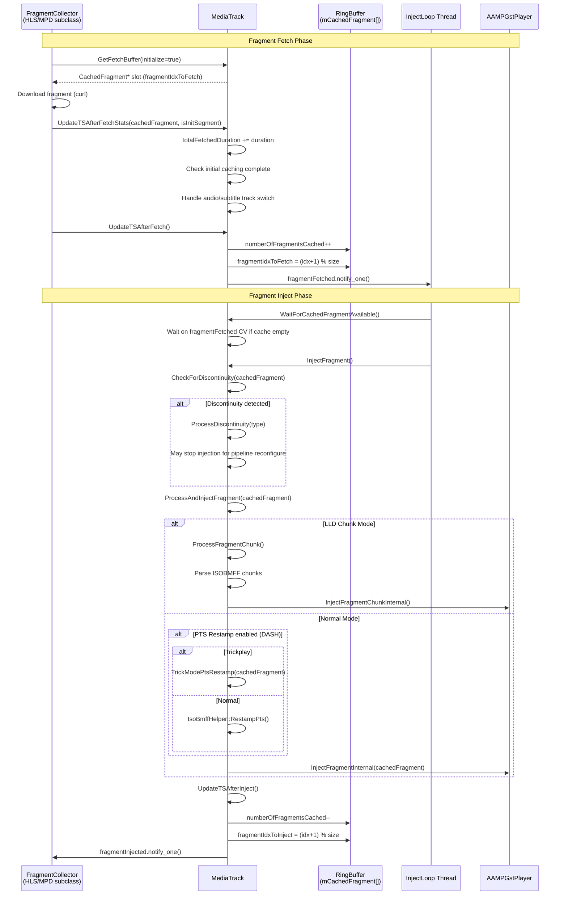
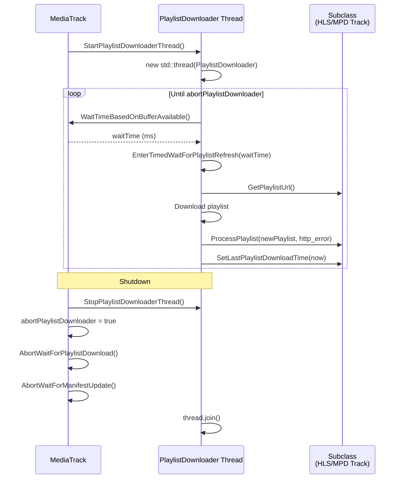
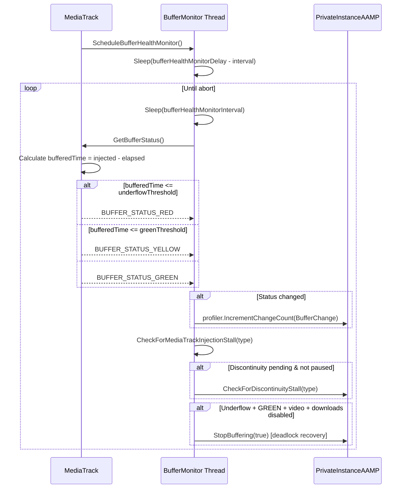
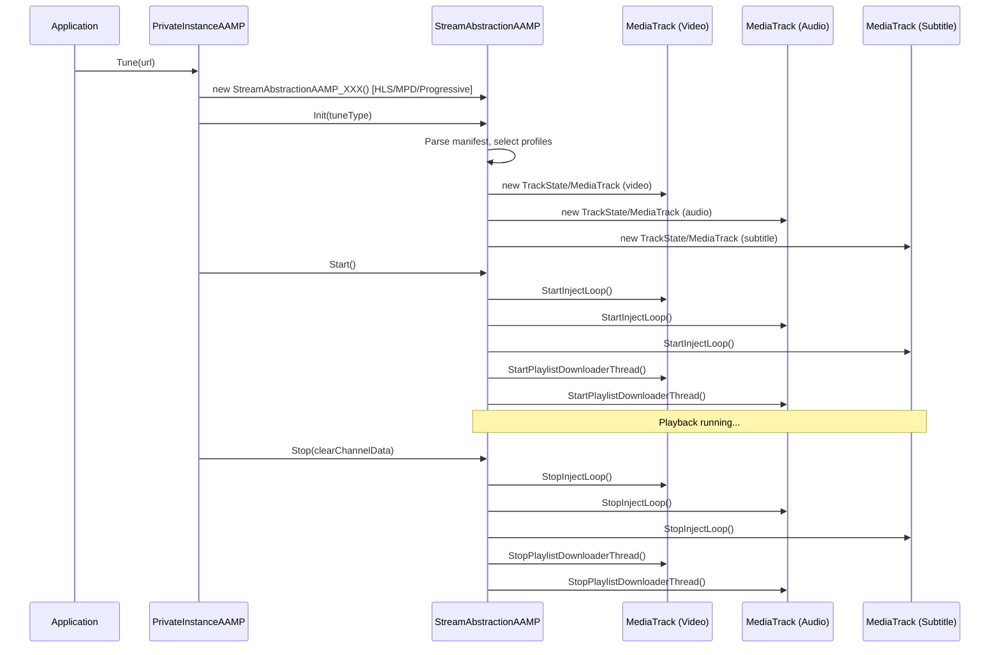
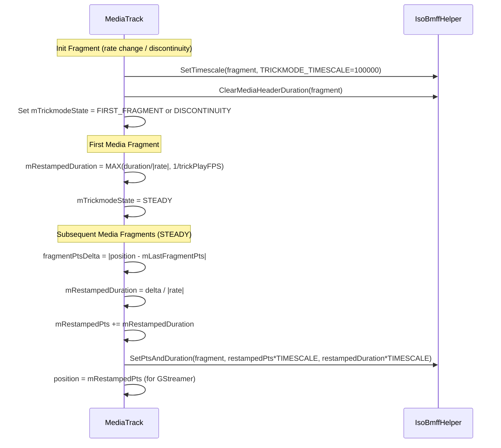
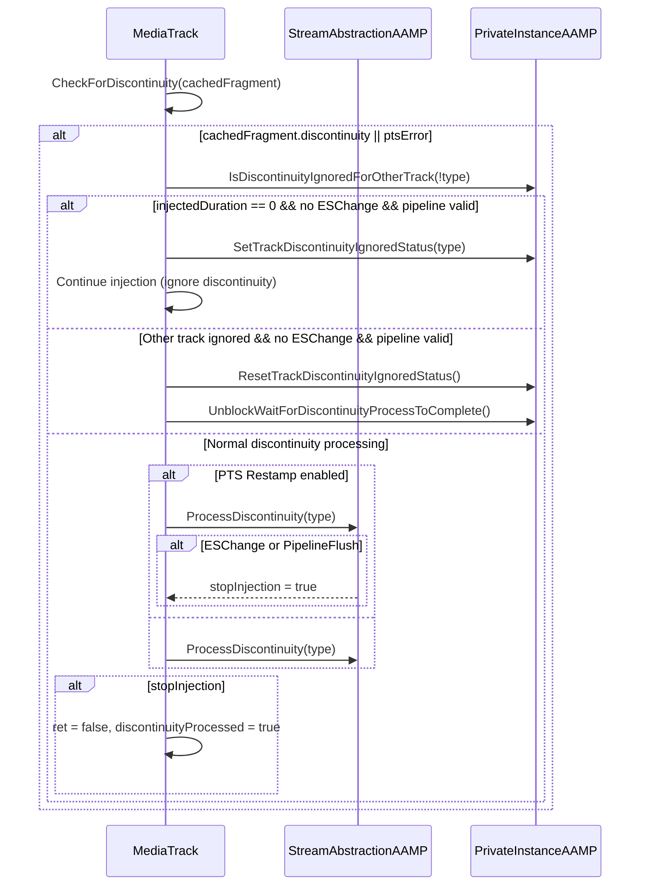

# 03 — Stream Abstraction & MediaTrack Lifecycle

## Overview

`StreamAbstractionAAMP` is the base class for all stream collectors (HLS, DASH, Progressive, shims). `MediaTrack` is the per-track (Video/Audio/Subtitle) base class managing a ring-buffer cache, fragment fetch/inject loops, buffer health monitoring, and playlist downloading.

**Source files read:**
- `StreamAbstractionAAMP.h` (lines 1–1400) — complete
- `streamabstraction.cpp` (lines 1–1400) — partial (covers MediaTrack core methods)

**Confidence: 90%** (remaining: streamabstraction.cpp lines 1400+ not yet read — contains RunInjectLoop, StreamAbstractionAAMP methods)

---

## 1. MediaTrack Fragment Fetch → Cache → Inject Loop

---

## 2. MediaTrack Playlist Downloader Thread

---

## 3. Buffer Health Monitoring

---

## 4. StreamAbstractionAAMP Class Hierarchy

---

## 5. Trick Mode PTS Restamping (DASH)

---

## 6. Discontinuity Processing

---

## Key Data Structures (from source)

| Structure | Purpose |
|-----------|---------|
| `MediaTrack::mCachedFragment[]` | Ring buffer of `MAX_CACHED_FRAGMENTS_PER_TRACK` slots |
| `fragmentIdxToFetch` / `fragmentIdxToInject` | Ring buffer read/write cursors |
| `numberOfFragmentsCached` | Current fill level |
| `fragmentFetched` (CV) | Signals inject thread when fragment available |
| `fragmentInjected` (CV) | Signals fetch thread when slot freed |
| `mutex` | Protects ring buffer state |
| `mTrackParamsMutex` | Leaf-level; protects duration counters |
| `totalFetchedDuration` / `totalInjectedDuration` | Accumulated durations for buffer math |
| `bufferStatus` | GREEN/YELLOW/RED health indicator |

---

## Lock Ordering (from source comment)

1. `mutex` — protects ring buffer
2. `mTrackParamsMutex` — protects lifetime counters (leaf-level, never hold another lock while holding this)

Holding `mutex` then taking `mTrackParamsMutex` is permitted.
