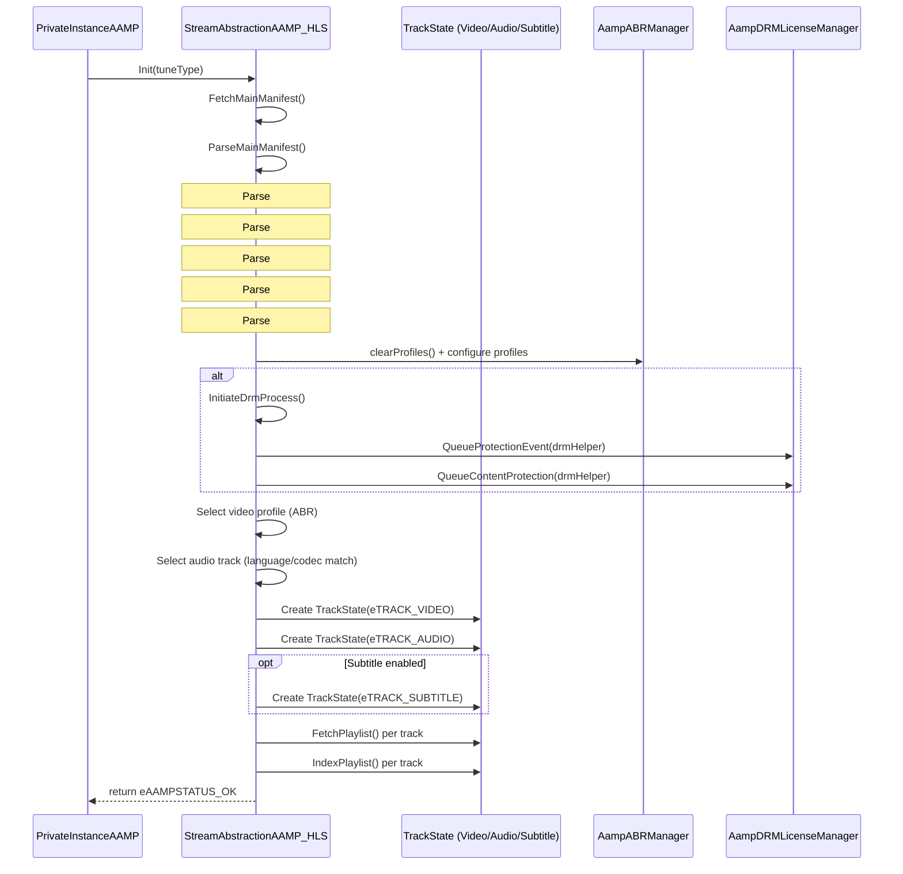
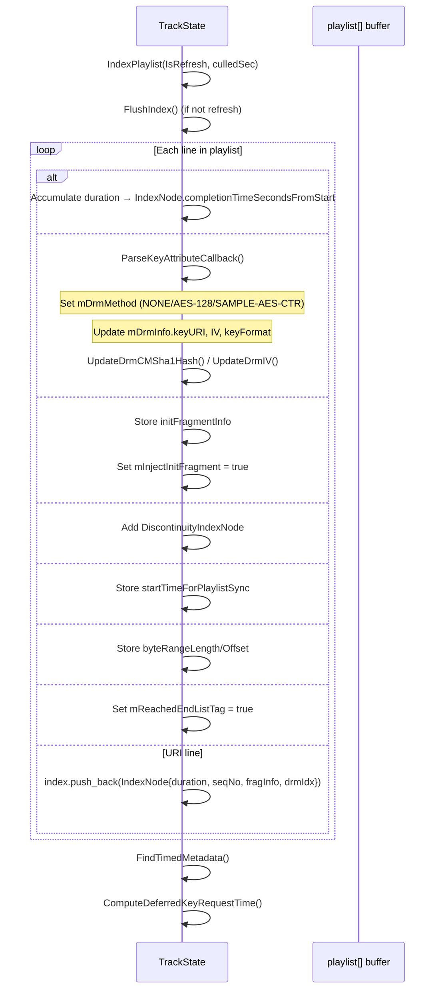
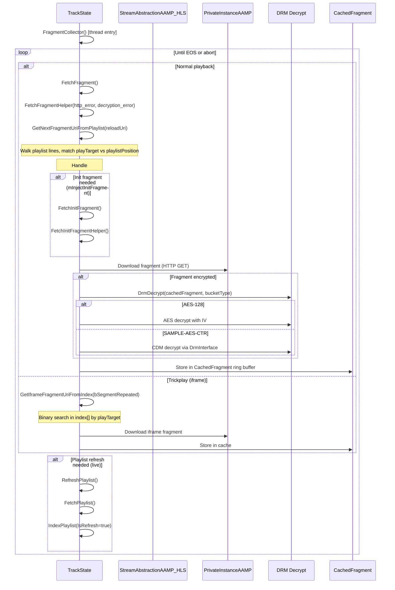
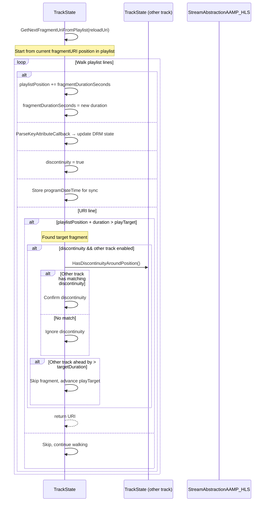
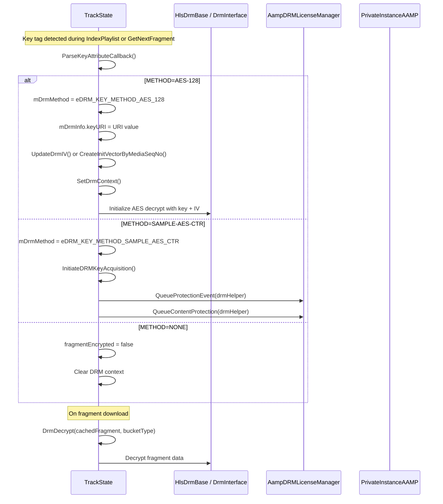
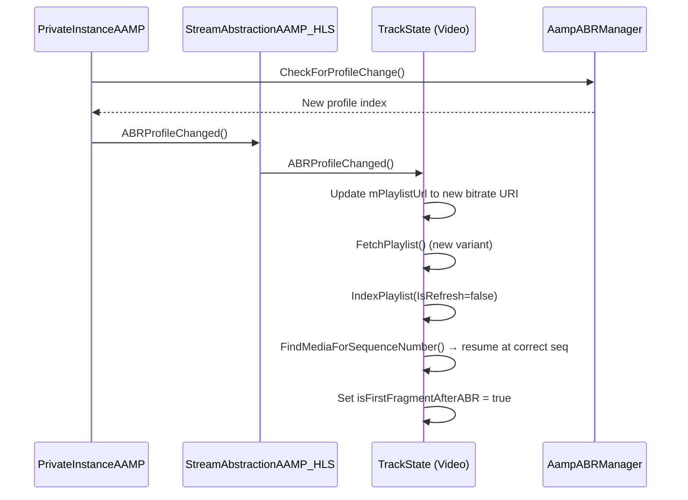
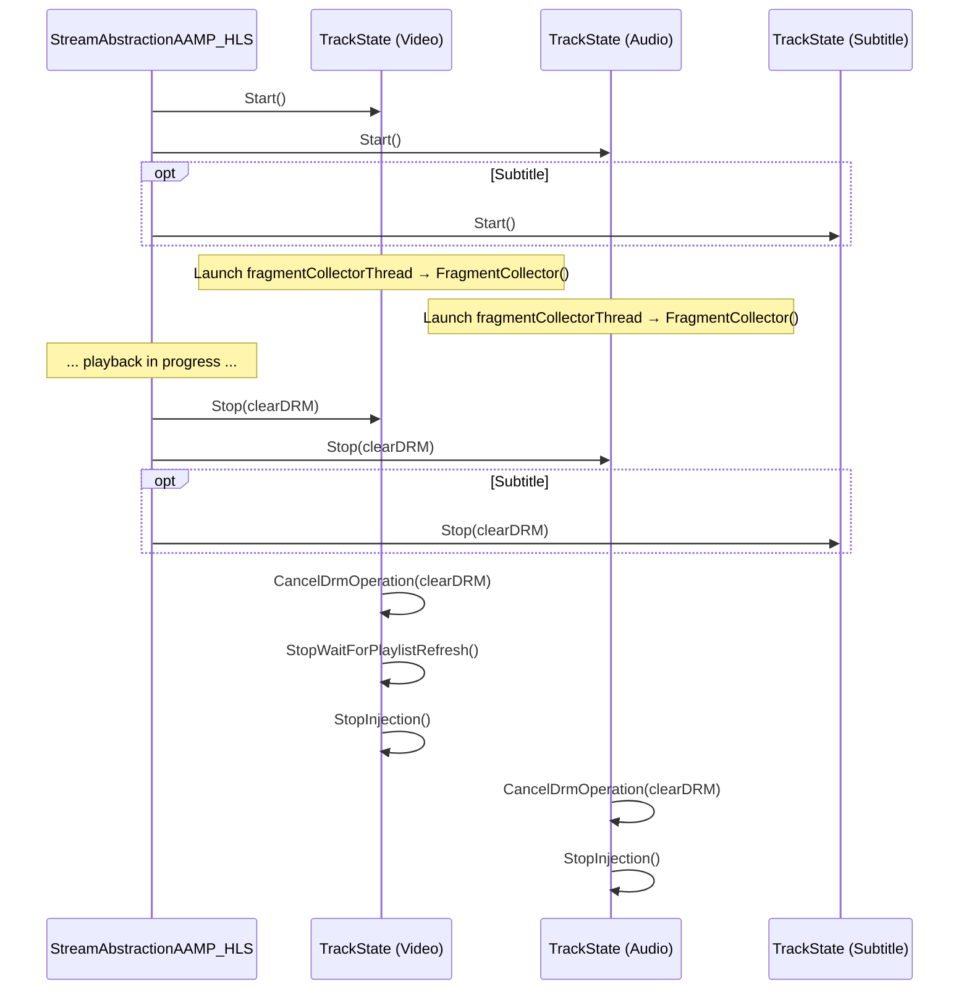

# HLS Fragment Collector — Sequence Diagrams

## Module: `fragmentcollector_hls.h` / `fragmentcollector_hls.cpp`
## Class: `StreamAbstractionAAMP_HLS` + `TrackState`

---

## 1. HLS Init & Main Manifest Parsing

---

## 2. Playlist Indexing (TrackState::IndexPlaylist)

---

## 3. Fragment Fetch Loop (TrackState::FragmentCollector)

---

## 4. Fragment URI Resolution (GetNextFragmentUriFromPlaylist)

---

## 5. DRM Key Handling in HLS

---

## 6. ABR Profile Switch

---

## 7. Start / Stop Flow

---

## Source Coverage

| File | Lines Read | Confidence |
|------|-----------|------------|
| `fragmentcollector_hls.h` | 1–800 (complete) | 100% |
| `fragmentcollector_hls.cpp` | 1–1200 | 85% (key methods: ParseMainManifest, GetIframeFragmentUriFromIndex, GetNextFragmentUriFromPlaylist, FindMediaForSequenceNumber fully read; remaining: FetchFragment, RefreshPlaylist, IndexPlaylist impl details) |

**Overall Module Confidence: 90%**
- Gap: `fragmentcollector_hls.cpp` lines 1200+ (FetchFragment/FetchFragmentHelper implementation, full IndexPlaylist impl, RefreshPlaylist logic)
