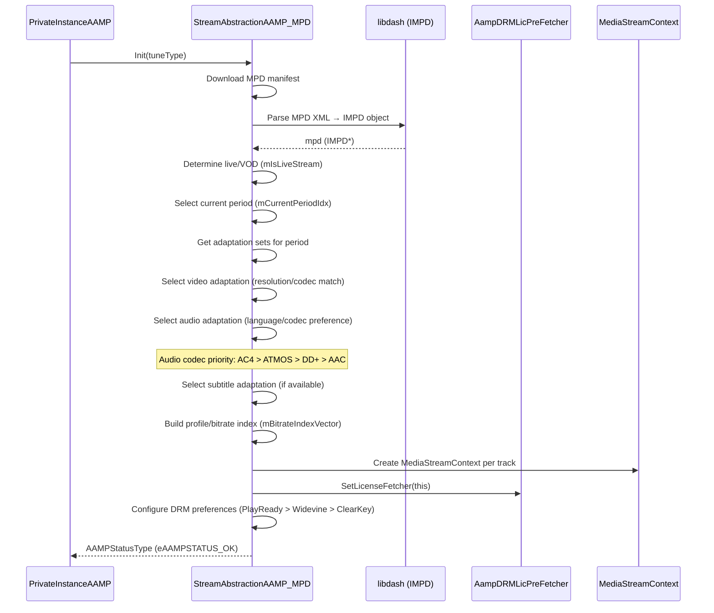
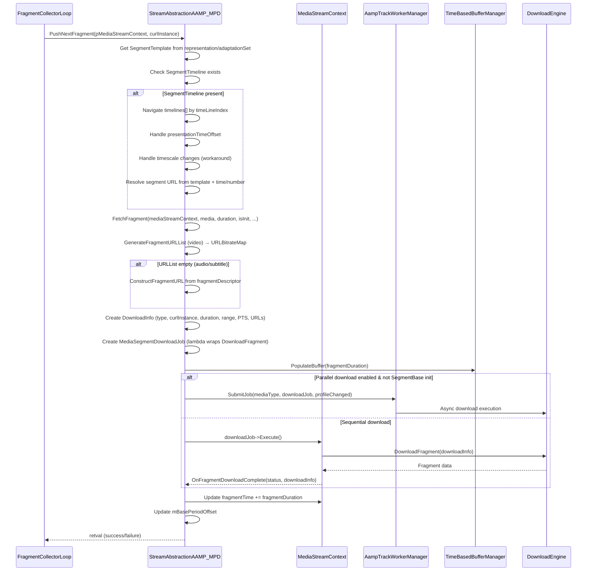
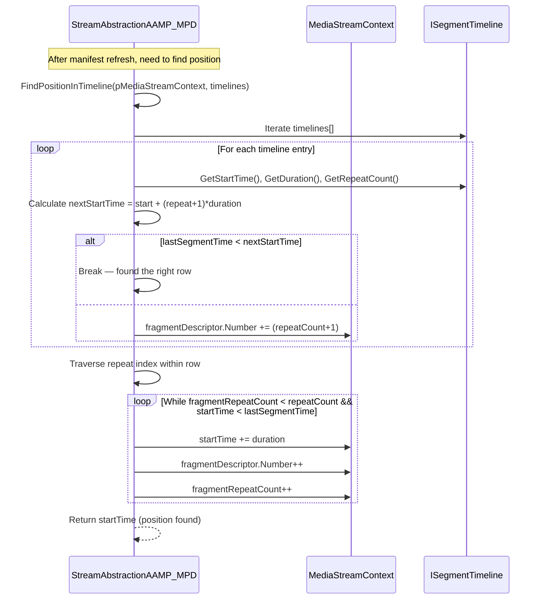
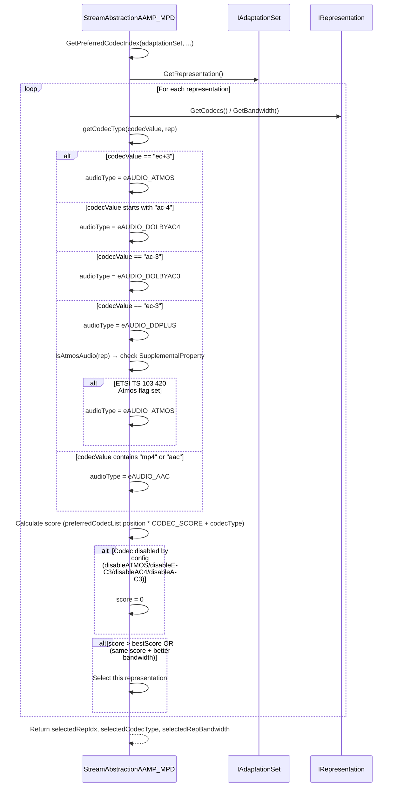
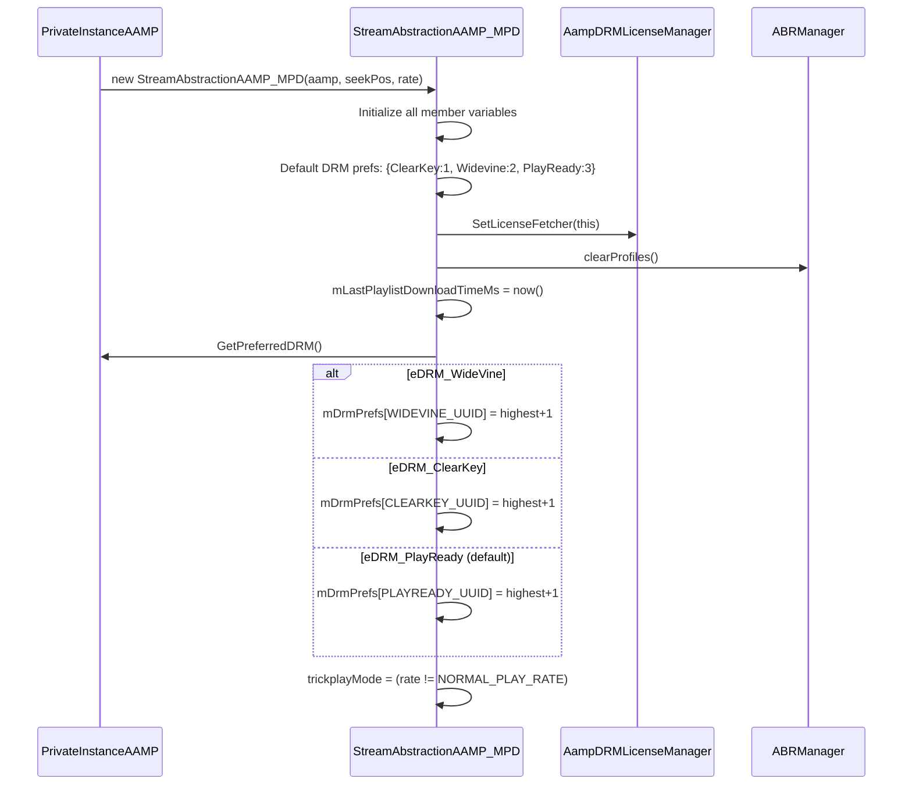

# 05 — DASH/MPD Fragment Collector Sequence Diagrams

## Module Overview

The `StreamAbstractionAAMP_MPD` class implements DASH (MPEG-DASH) streaming. It extends `StreamAbstractionAAMP` and handles MPD manifest parsing, period management, segment timeline navigation, fragment fetching (with parallel download support), DRM license pre-fetching, and ad insertion (CDAI).

**Source Files Read:**
- `fragmentcollector_mpd.h` lines 1–600 ✅
- `fragmentcollector_mpd.cpp` lines 1–1000 ✅

**Confidence: 85%**
- Gap: `fragmentcollector_mpd.cpp` lines 1000+ (Init(), Start(), manifest refresh loop, period transitions)

---

## 5.1 — MPD Init & Period Selection

---

## 5.2 — Fragment Fetch Flow (FetchFragment)

---

## 5.3 — Timeline Position Recovery (After Manifest Refresh)

---

## 5.4 — Audio Codec Selection

---

## 5.5 — Constructor & DRM Preference Setup

---

## Key Classes & Relationships

| Class | Role |
|-------|------|
| `StreamAbstractionAAMP_MPD` | Main DASH fragment collector, extends `StreamAbstractionAAMP` |
| `MediaStreamContext` | Per-track state (fragmentDescriptor, timeLineIndex, lastSegmentTime) |
| `TimeSyncClient` | UTC time sync with remote server for live streams |
| `AampDashWorkerJob` | Wrapper for parallel download jobs |
| `HeaderFetchParams` | Init segment fetch parameters |
| `FragmentDownloadParams` | Fragment download context |
| `ProfileInfo` | Maps profile index → adaptationSet + representation indices |

---

## Key Constants

| Constant | Value | Purpose |
|----------|-------|---------|
| `SEGMENT_COUNT_FOR_ABR_CHECK` | 5 | Segments before ABR decision |
| `MIN_TSB_BUFFER_DEPTH` | 6 sec | Minimum TSB buffer (DASH-IF IOP) |
| `MAX_MANIFEST_DOWNLOAD_RETRY_MPD` | 2 | Manifest download retries |
| `TIMELINE_START_RESET_DIFF` | 4000000000 | Timeline discontinuity threshold |
