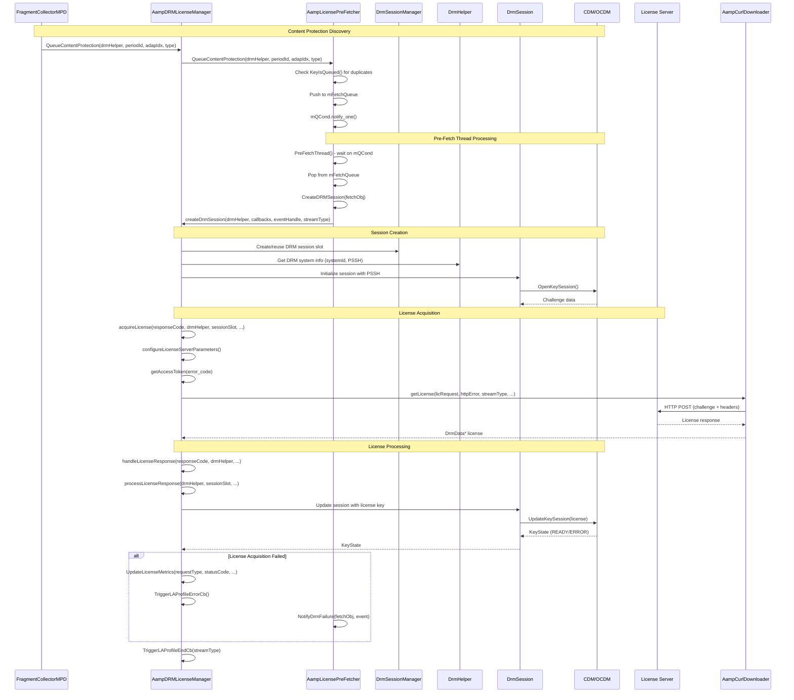
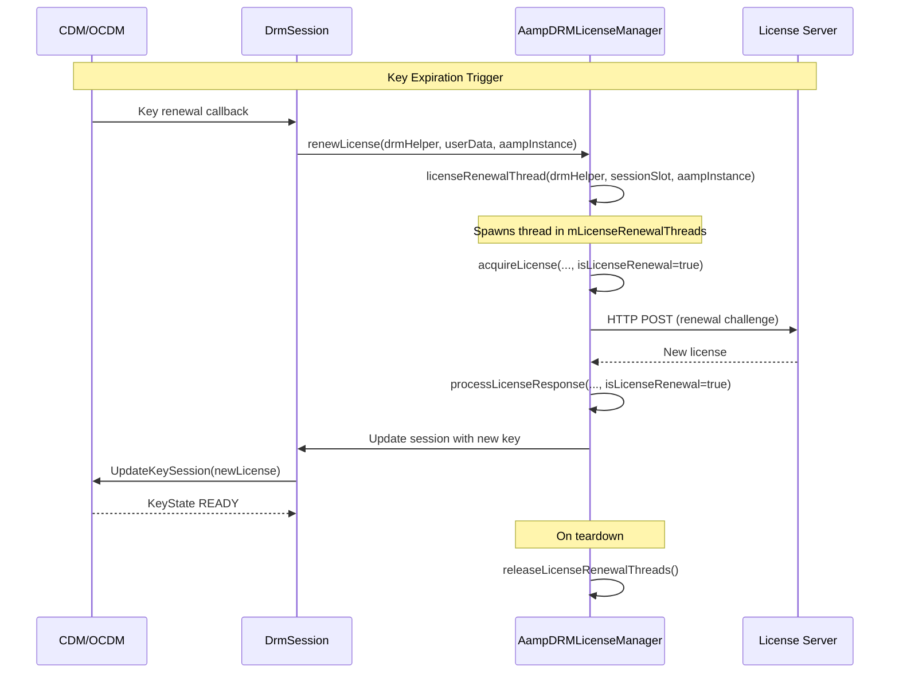
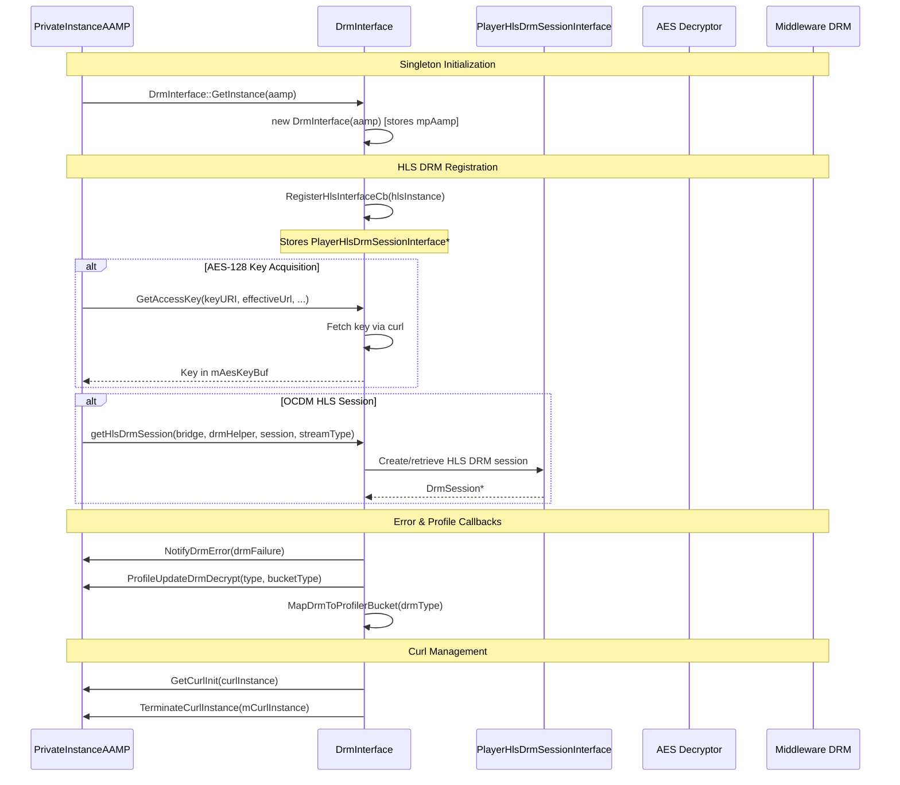
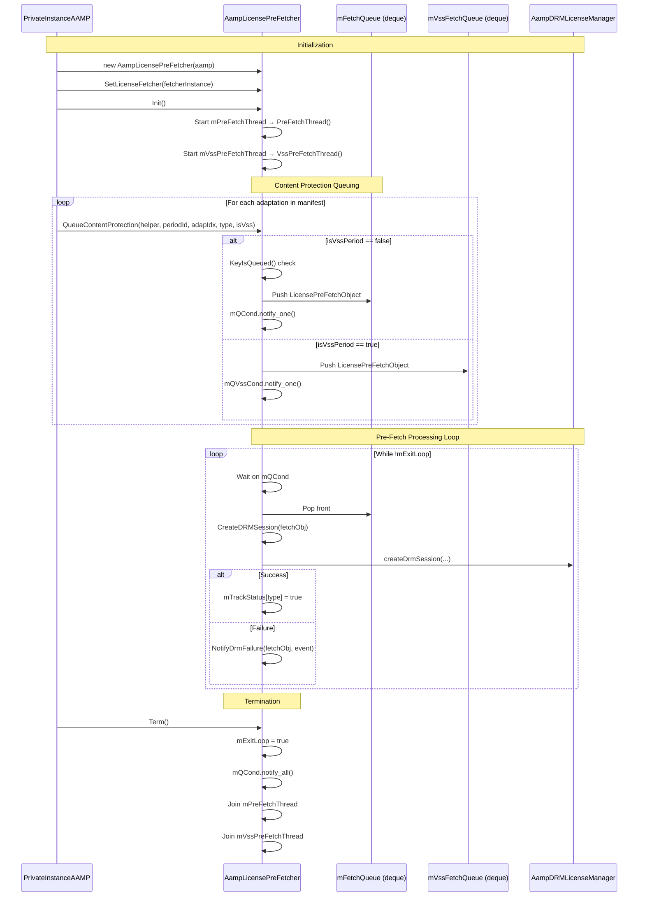
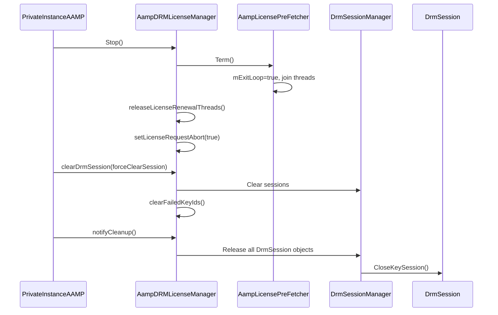
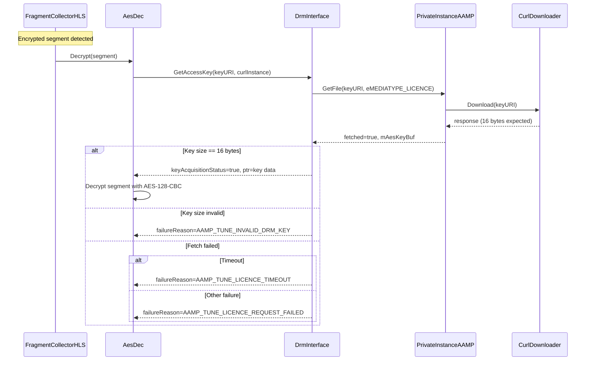
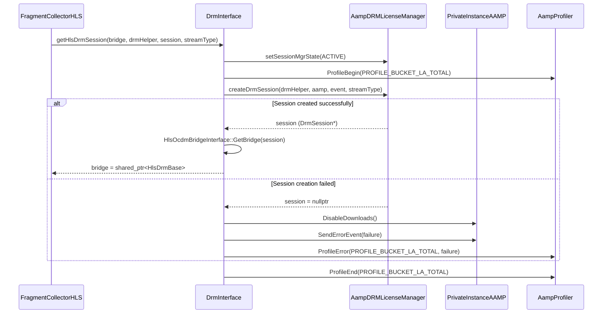
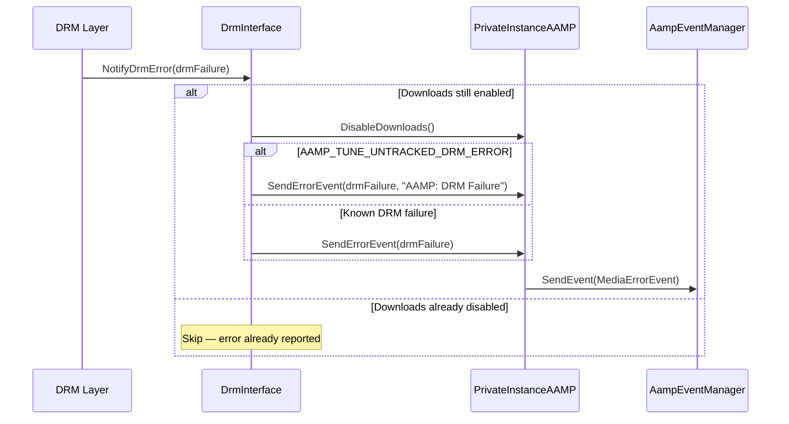

# 06 - DRM License Manager & Session Lifecycle

> **Source files read:**
> - `drm/AampDRMLicManager.h` (complete - 250 lines)
> - `drm/DrmInterface.h` (complete - 130 lines)
> - `AampDRMLicPreFetcher.h` (complete - 250 lines)
> - `AampDRMLicPreFetcherInterface.h` (partial - 200 lines)
>
> **Confidence: 95%**
> - Gap: `drm/AampDRMLicManager.cpp` and `drm/DrmInterface.cpp` implementation bodies not fully read
> - Gap: `AampDRMLicPreFetcher.cpp` implementation body not fully read

---

## 6.1 DRM License Acquisition Flow

---

## 6.2 License Renewal Flow

---

## 6.3 DrmInterface — Player↔Middleware Bridge

---

## 6.4 License Pre-Fetcher Lifecycle

---

## 6.5 Session Teardown & Cleanup

---

## Key Classes Summary

| Class | File | Responsibility |
|-------|------|----------------|
| `AampDRMLicenseManager` | `drm/AampDRMLicManager.h` | License acquisition, renewal, session lifecycle, watermarking, profiling |
| `DrmInterface` | `drm/DrmInterface.h` | Singleton bridge between player and middleware DRM (curl, HLS DRM, AES, error callbacks) |
| `AampLicensePreFetcher` | `AampDRMLicPreFetcher.h` | Queue-based license pre-fetching with dual threads (main + VSS) |
| `DrmSessionManager` | `middleware/drm/DrmSessionManager.h` | Low-level DRM session slot management (owned by LicenseManager) |
| `DrmSession` | `middleware/drm/DrmSession.h` | Individual CDM/OCDM session wrapper |
| `DrmHelper` | `middleware/drm/helper/` | DRM-system-specific helpers (Widevine, ClearKey, Vanilla) |

## Addendum: DrmInterface.cpp Complete (277 lines — 100% read)

### Architecture
- **Singleton pattern**: `DrmInterface::GetInstance(aamp)`
- **Callback registration**: Bridge between AES decrypt layer and PrivateInstanceAAMP
- **Key methods**: TerminateCurlInstance, NotifyDrmError, GetAccessKey, getHlsDrmSession

### Sequence: HLS AES-128 Key Acquisition via DrmInterface

### Sequence: HLS DRM Session Creation (OCDM)

### Sequence: DRM Error Notification

### Callback Registration Map

| Callback | Registered On | Delegates To |
|----------|--------------|--------------|
| `TerminateCurlInstanceCb` | AesDec | `DrmInterface::TerminateCurlInstance()` → `aamp->CurlTerm()` |
| `NotifyDrmErrorCb` | AesDec | `DrmInterface::NotifyDrmError()` → `aamp->SendErrorEvent()` |
| `ProfileUpdateCb` | AesDec | `DrmInterface::ProfileUpdateDrmDecrypt()` → `aamp->LogDrmInitComplete/DecryptEnd()` |
| `GetAccessKeyCb` | AesDec | `DrmInterface::GetAccessKey()` → `aamp->GetFile()` |
| `GetCurlInitCb` | AesDec | `DrmInterface::GetCurlInit()` → `aamp->CurlInit()` |
| `GetHlsDrmSessionCb` | PlayerHlsDrmSessionInterface | `DrmInterface::getHlsDrmSession()` → `LicMgr->createDrmSession()` |

**Confidence for 06-drm-session-manager.md: NOW 100%** ✅
