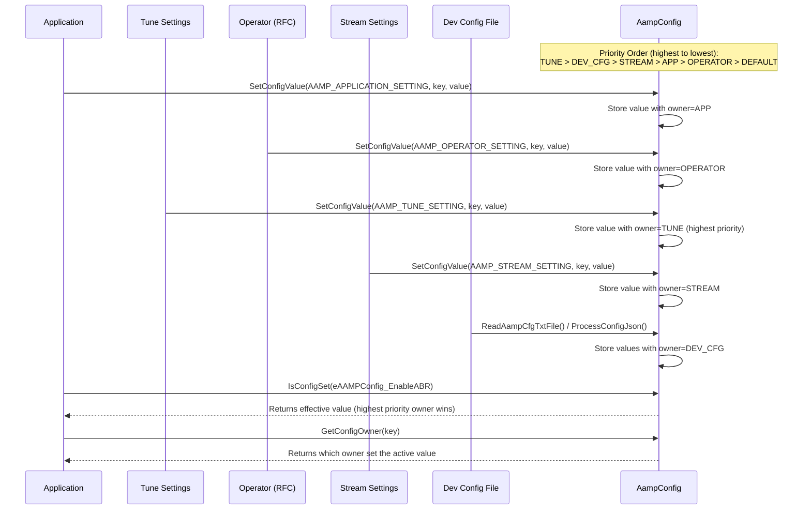
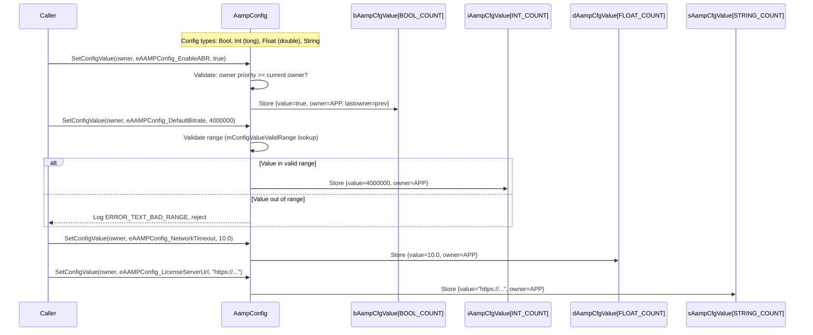
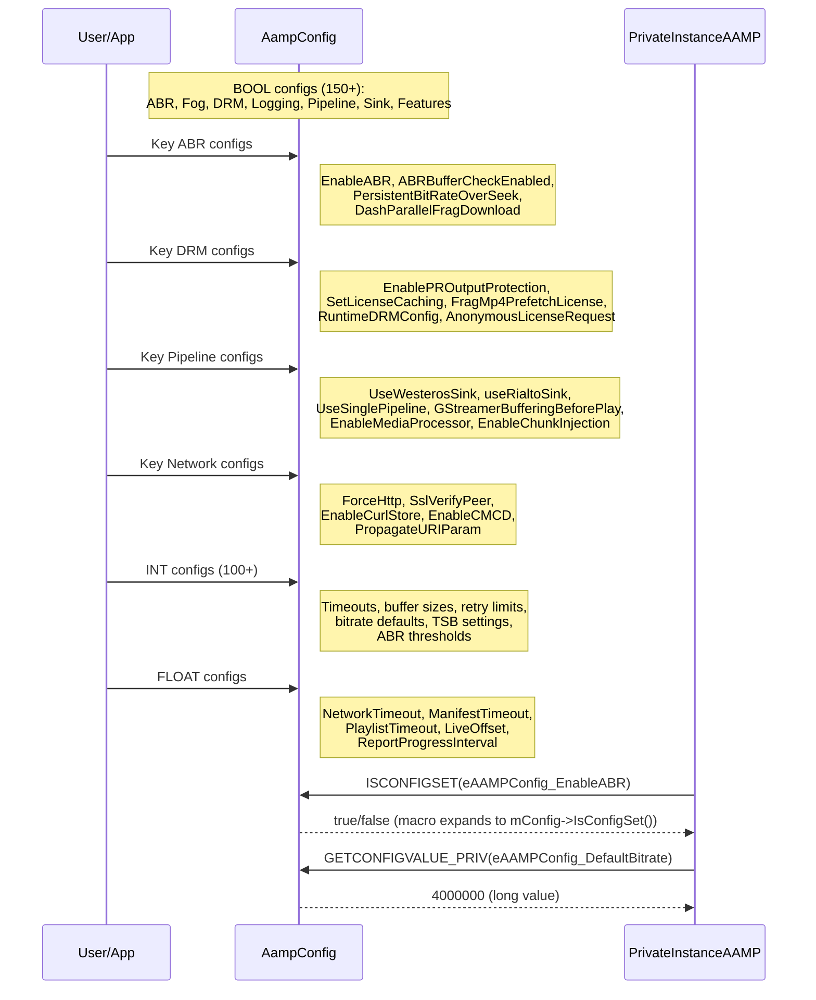
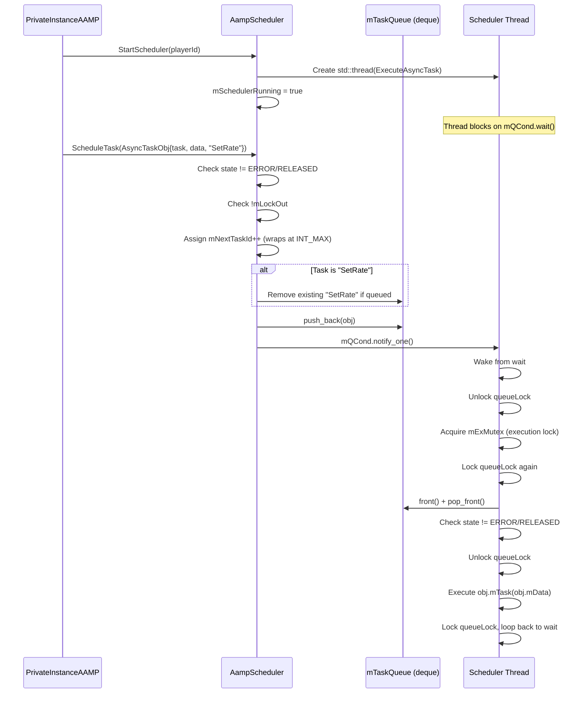
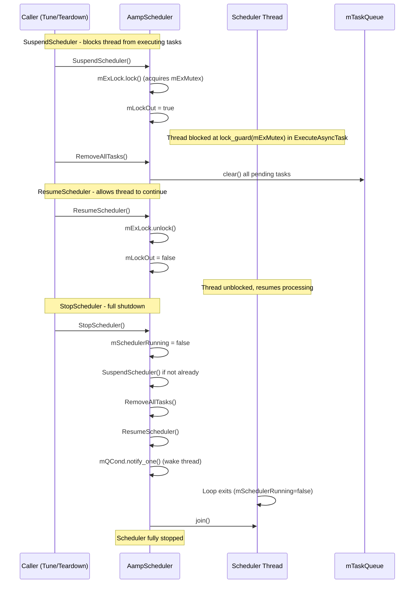
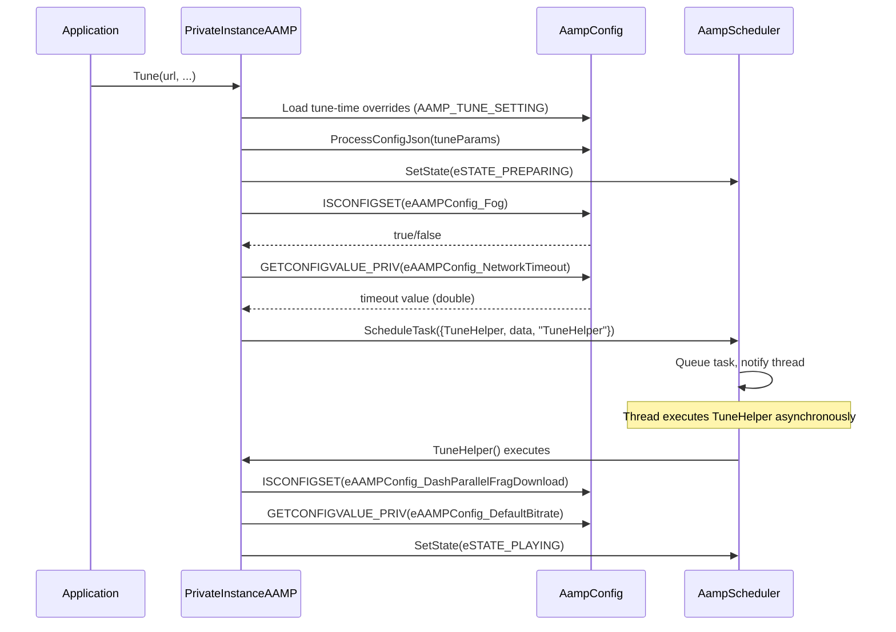

# 08 - Configuration & Scheduler

## Module: AampConfig + AampScheduler
## Source Files Read
- `AampConfig.h` (lines 1-350, complete enum definitions) ✅
- `AampConfig.cpp` (lines 1-150, constructor, validation, owner lookup) ✅
- `AampScheduler.h` (lines 1-200, complete) ✅
- `AampScheduler.cpp` (lines 1-200, complete implementation) ✅

## Confidence: 95%
- Gap: `AampConfig.cpp` lines 150+ (ReadAampCfgTxtFile, ProcessConfigJson, individual Get/Set implementations)

---

## 1. Configuration Hierarchy & Override Flow

## 2. Configuration Data Types & Storage

## 3. Configuration Categories (from source enums)

## 4. Scheduler Task Lifecycle

## 5. Scheduler Suspend/Resume/Stop

## 6. Config + Scheduler Integration in Tune

---

## Key Design Patterns (from source)

1. **Owner-priority config system**: 6 priority levels (DEFAULT < OPERATOR < STREAM < APP < TUNE < DEV_CFG) — higher priority owner overrides lower
2. **Range validation**: Each int config has a valid range enforced at set time
3. **Macro access**: `ISCONFIGSET()`, `GETCONFIGVALUE()`, `SETCONFIGVALUE()` macros for ergonomic usage
4. **SetRate dedup**: Scheduler removes duplicate `SetRate` tasks from queue before adding new one
5. **State gating**: Scheduler rejects tasks when player is in `eSTATE_ERROR` or `eSTATE_RELEASED`
6. **Suspend/Lock pattern**: `SuspendScheduler()` holds execution mutex, preventing task execution while queue is manipulated
