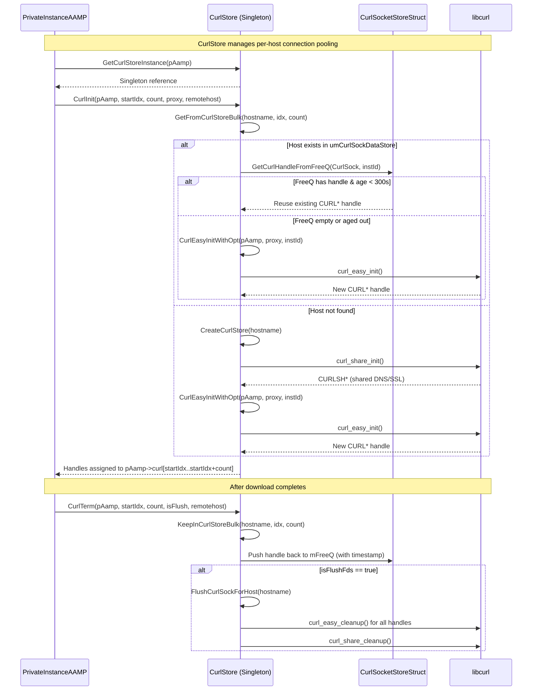
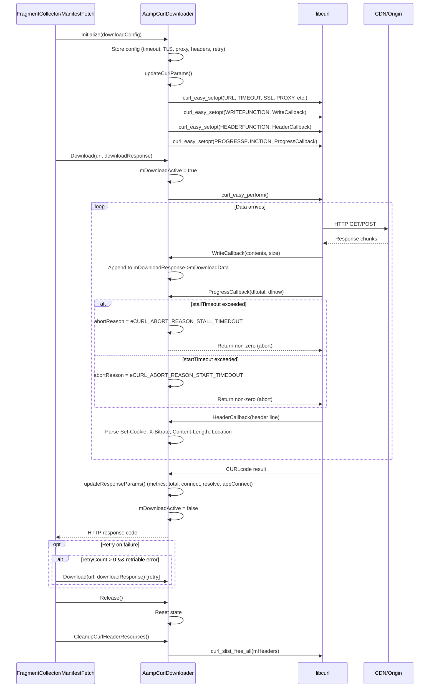
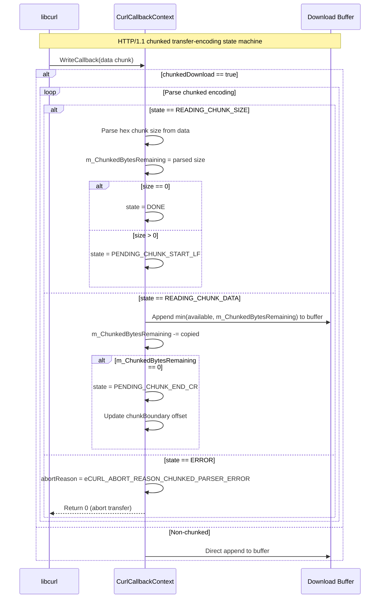
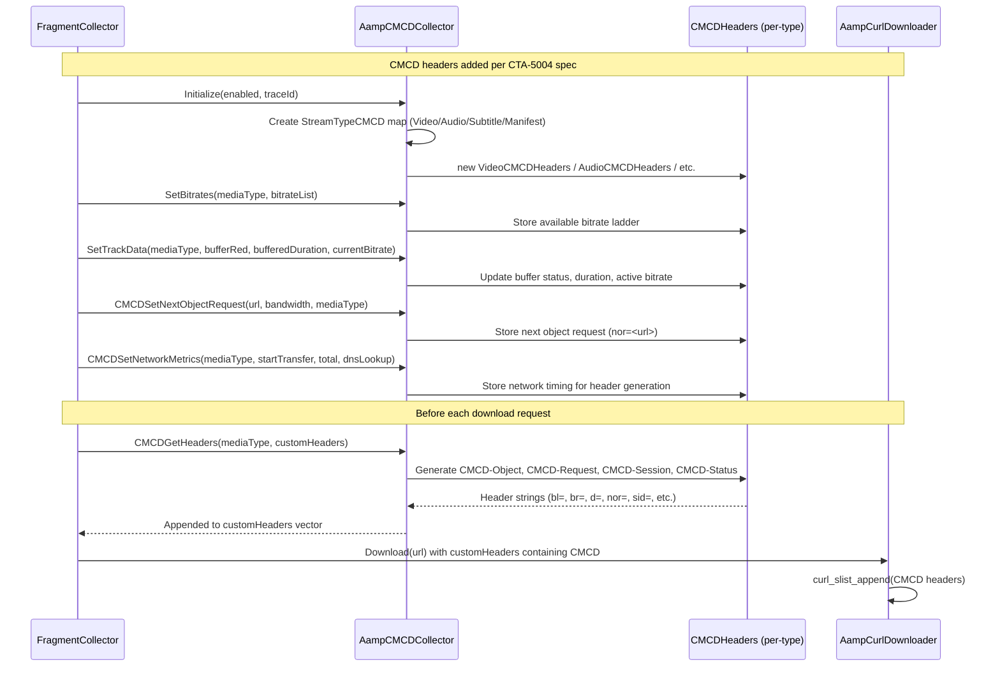
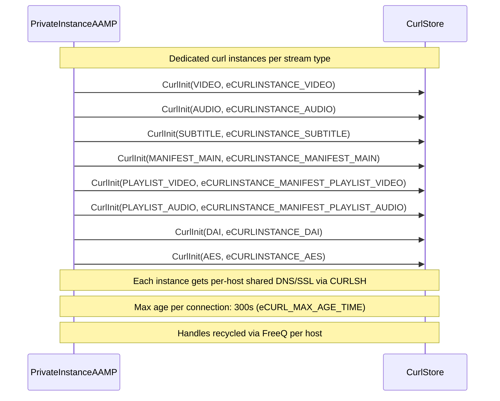

# 09 - Curl Network & Download Subsystem

## Module: `downloader/` + `AampCMCDCollector`

**Source Files Read:**
- `downloader/AampCurlStore.h` (complete - 280 lines)
- `downloader/AampCurlDownloader.h` (complete - 250 lines)
- `downloader/AampCurlDefine.h` (complete - 140 lines)
- `AampCMCDCollector.h` (complete - 130 lines)

**Confidence: 90%**
- Gap: `AampCurlStore.cpp` and `AampCurlDownloader.cpp` implementation bodies not read

---

## 9.1 Curl Handle Lifecycle (CurlStore Singleton)

---

## 9.2 Download Flow (AampCurlDownloader)

---

## 9.3 CurlCallbackContext — Chunked Transfer Handling

---

## 9.4 CMCD (Common Media Client Data) Header Injection

---

## 9.5 Curl Instance Assignment (Per Media Type)

---

## Key Classes

| Class | File | Role |
|-------|------|------|
| `CurlStore` | `downloader/AampCurlStore.h` | Singleton, per-host connection pool, shared DNS/SSL |
| `CurlSocketStoreStruct` | `downloader/AampCurlStore.h` | Per-host storage (FreeQ + CURLSH + locks) |
| `CurlCallbackContext` | `downloader/AampCurlStore.h` | Per-download state (chunked parsing, buffer, abort) |
| `CurlProgressCbContext` | `downloader/AampCurlStore.h` | Progress tracking (stall/start timeout detection) |
| `AampCurlDownloader` | `downloader/AampCurlDownloader.h` | Download executor (init, download, retry, metrics) |
| `DownloadConfig` | `downloader/AampCurlDownloader.h` | Download parameters (timeout, TLS, proxy, headers) |
| `DownloadResponse` | `downloader/AampCurlDownloader.h` | Response container (data, metrics, headers) |
| `AampCMCDCollector` | `AampCMCDCollector.h` | CMCD header generation per CTA-5004 |

## Enums

| Enum | Values |
|------|--------|
| `AampCurlInstance` | VIDEO, AUDIO, SUBTITLE, MANIFEST_MAIN, PLAYLIST_VIDEO/AUDIO/SUBTITLE, DAI, AES, PRECACHE (10 total) |
| `CurlAbortReason` | NONE, STALL_TIMEDOUT, START_TIMEDOUT, LOW_BANDWIDTH_TIMEDOUT, CHUNKED_PARSER_ERROR, FIRST_CHUNK_SLOW, INVALID_CHUNK_BOUNDARY, BUFFER_ALLOC_FAILURE |
| `AampCurlStoreErrorCode` | HOST_NOT_AVAILABLE, SOCK_NOT_AVAILABLE, HOST_SOCK_AVAILABLE |
| `CurlRequest` | GET, POST, DELETE |
