# Root-Level Middleware — Sequence Diagrams

> **Source files read**: InterfacePlayerRDK.cpp (~4600 lines), InterfacePlayerRDK.h, InterfacePlayerPriv.h, GstUtils.h/cpp, GstHandlerControl.h/cpp, PlayerScheduler.h/cpp, PlayerUtils.h/cpp, ProcessHandler.h/cpp, SocUtils.h/cpp, MediaSample.h, DemuxDataTypes.h, PlayerMetadata.hpp, gstplayertaskpool.h  
> **Confidence**: 95% (remaining ~200 lines of InterfacePlayerRDK.cpp not yet read: SetVolumeOrMuteUnMute tail, bus_sync_handler, DumpDiagnostics, SetVideoZoom/Mute, SetTextStyle, NotifyEOS/FragmentCaching, EndOfStreamReached, SetStreamCaps, DecorateGstBufferWithDrmMetadata)

---

## 1. Pipeline Construction & Configuration

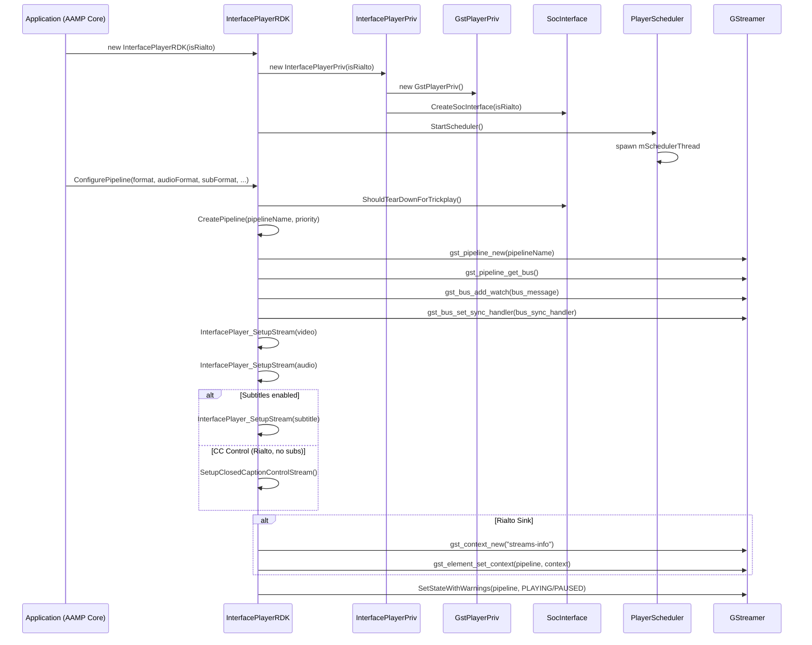

---

## 2. Stream Setup (SetupStream / InterfacePlayer_SetupStream)

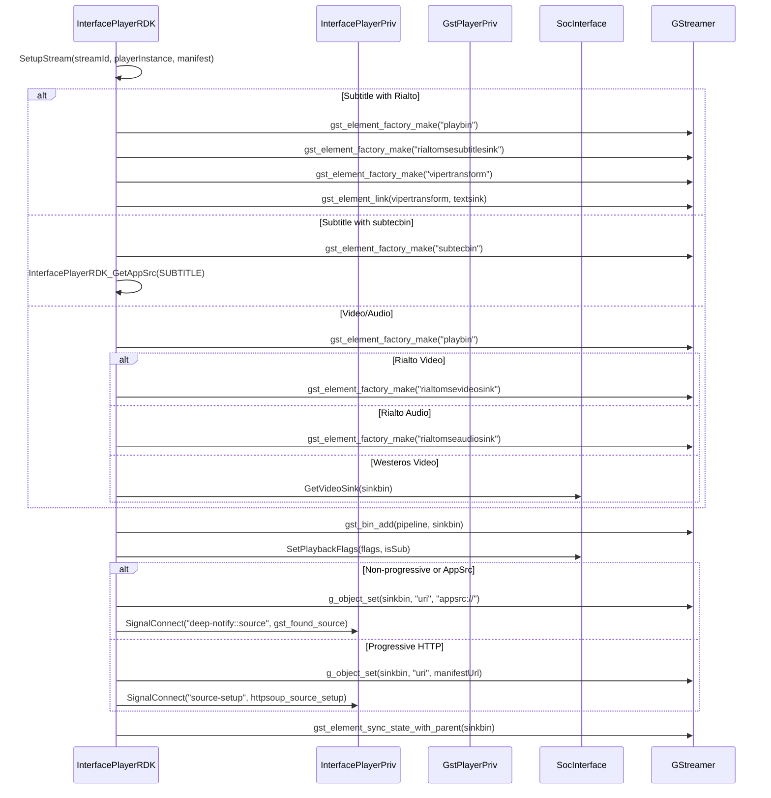

---

## 3. Buffer Injection (SendHelper)

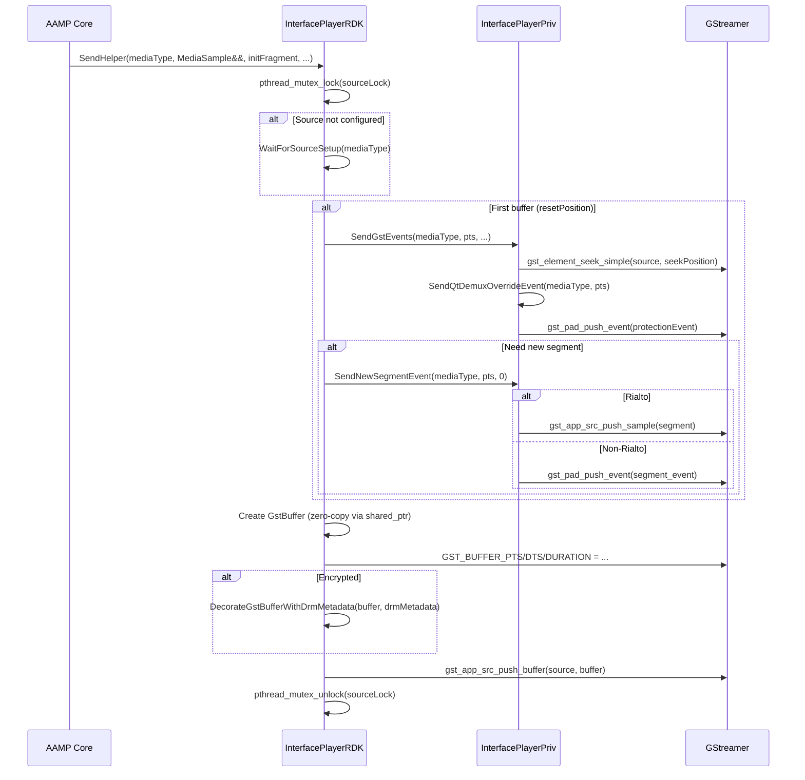

---

## 4. Pipeline Stop & Teardown

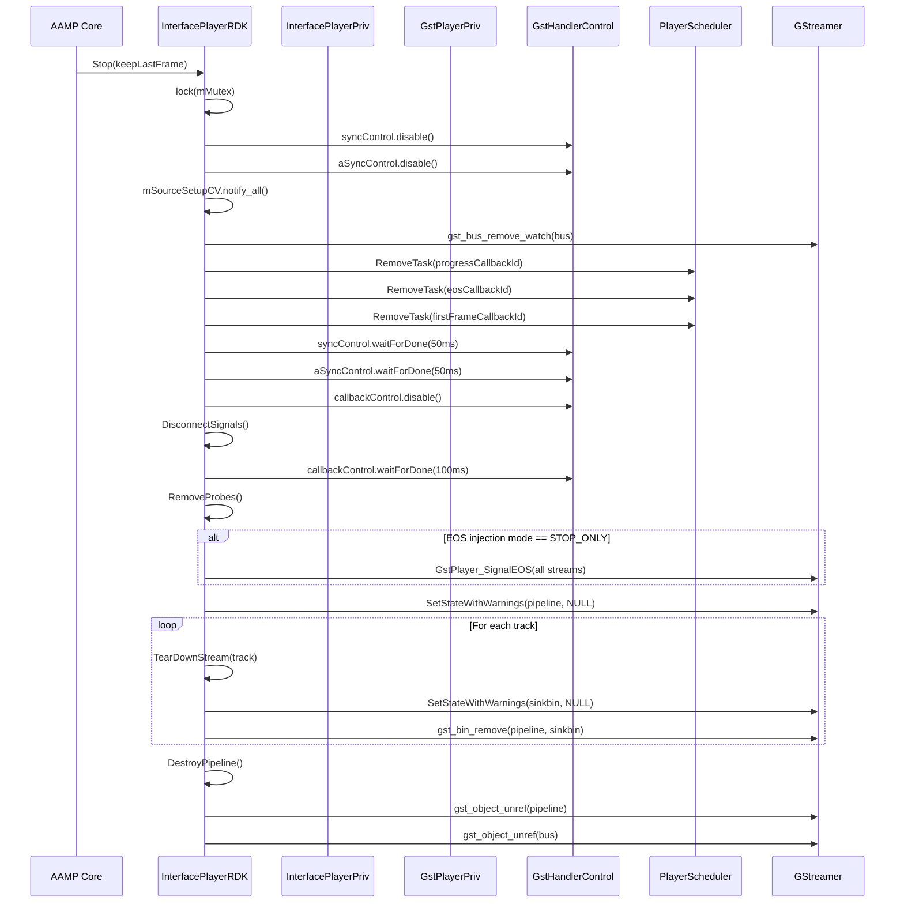

---

## 5. Flush / Seek

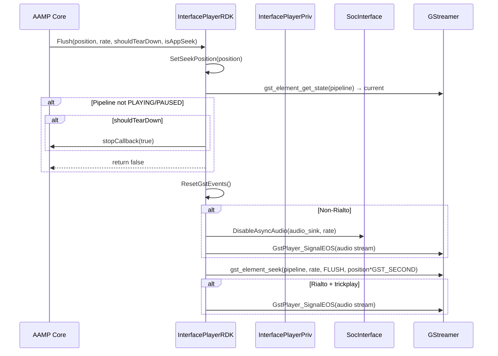

---

## 6. First Frame Notification Flow

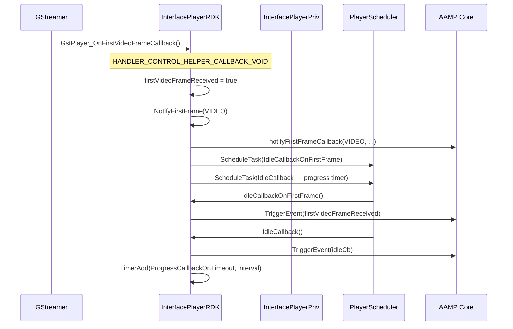

---

## 7. Bus Message Handling

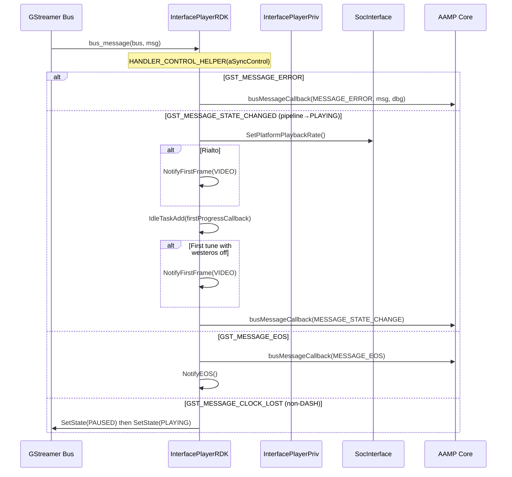

---

## 8. EOS / Underflow Handling

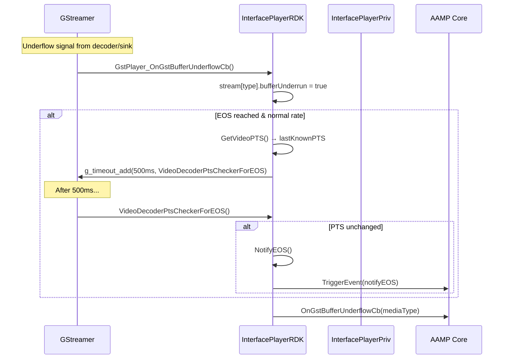

---

## 9. Pause / Resume

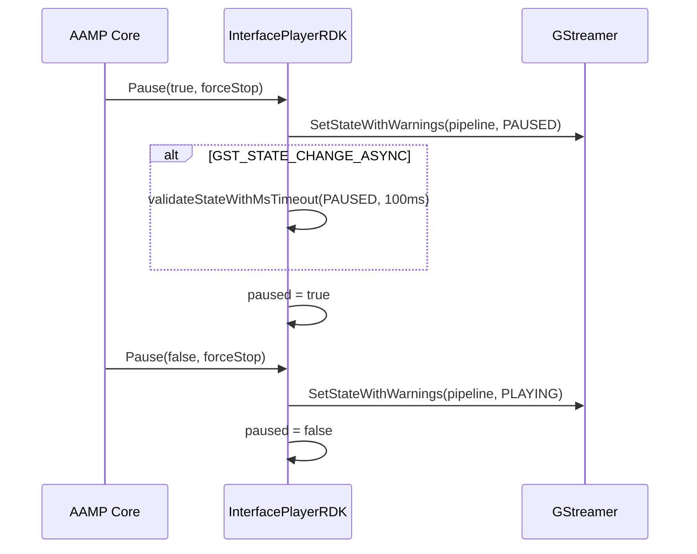

---

## 10. GstHandlerControl Pattern

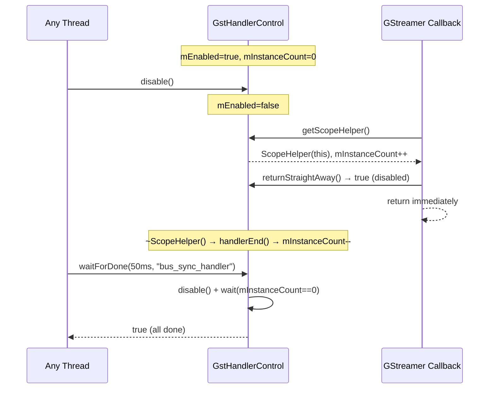

---

## 11. PlayerScheduler Task Lifecycle

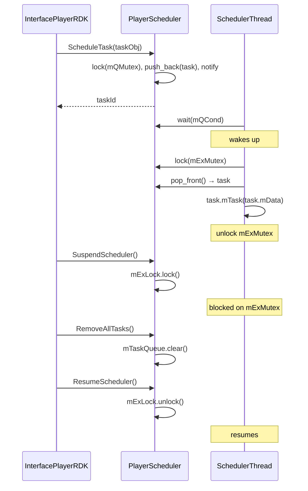

---

## 12. Protection Event / DRM Queue

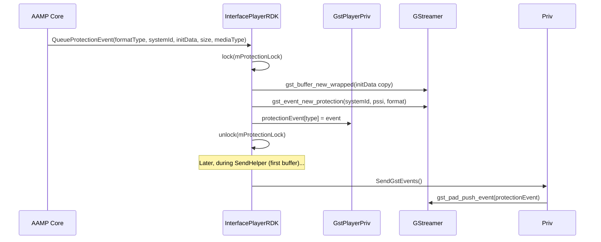

---

## Module Dependency Summary

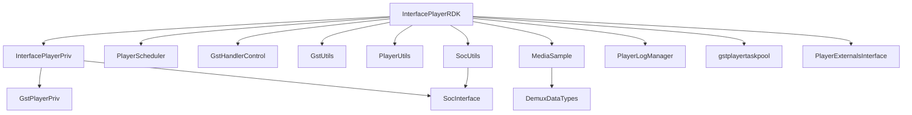
