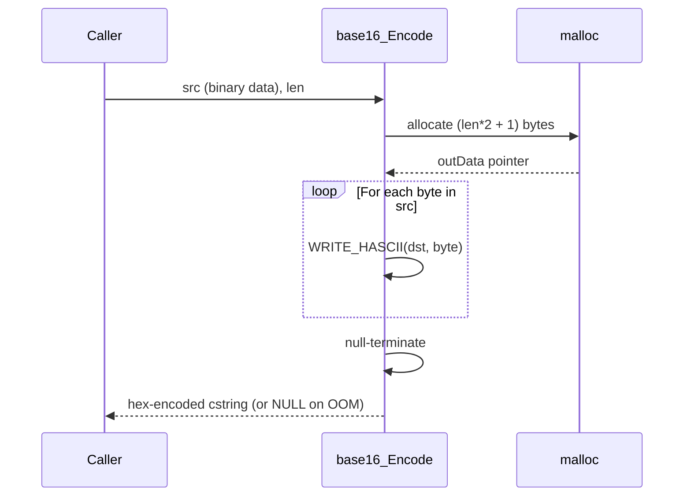
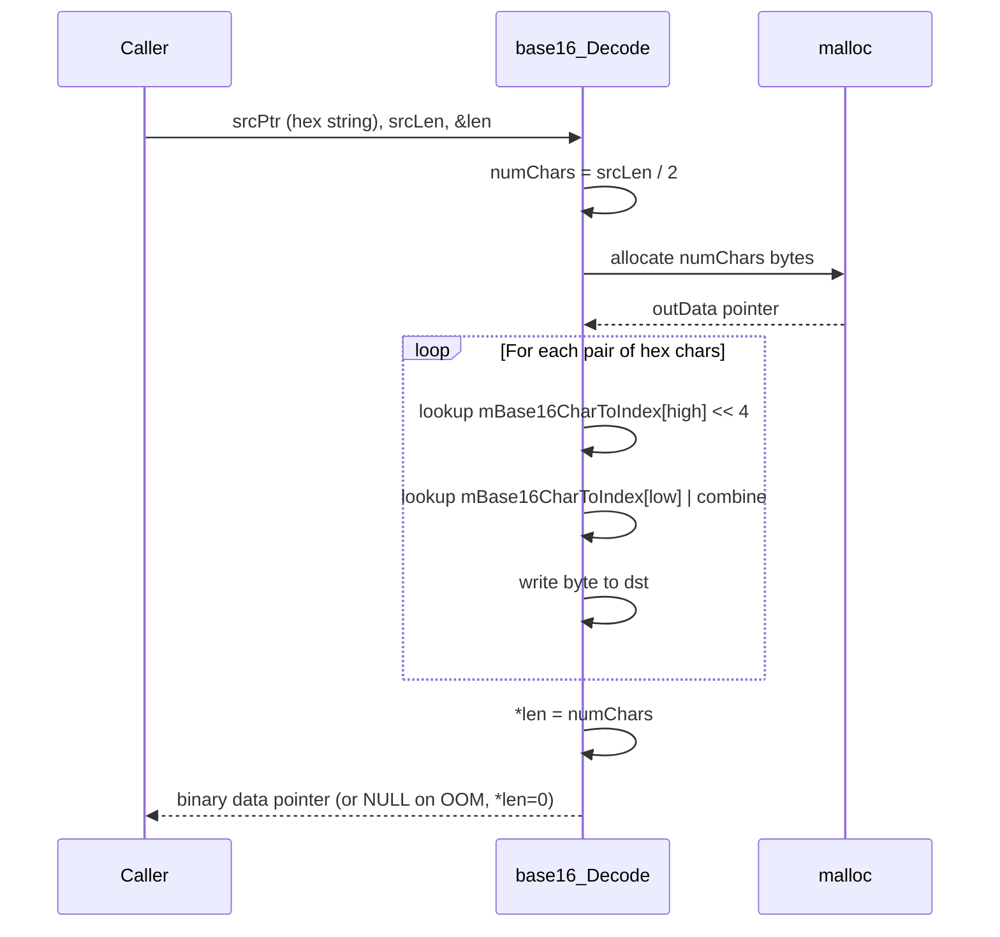
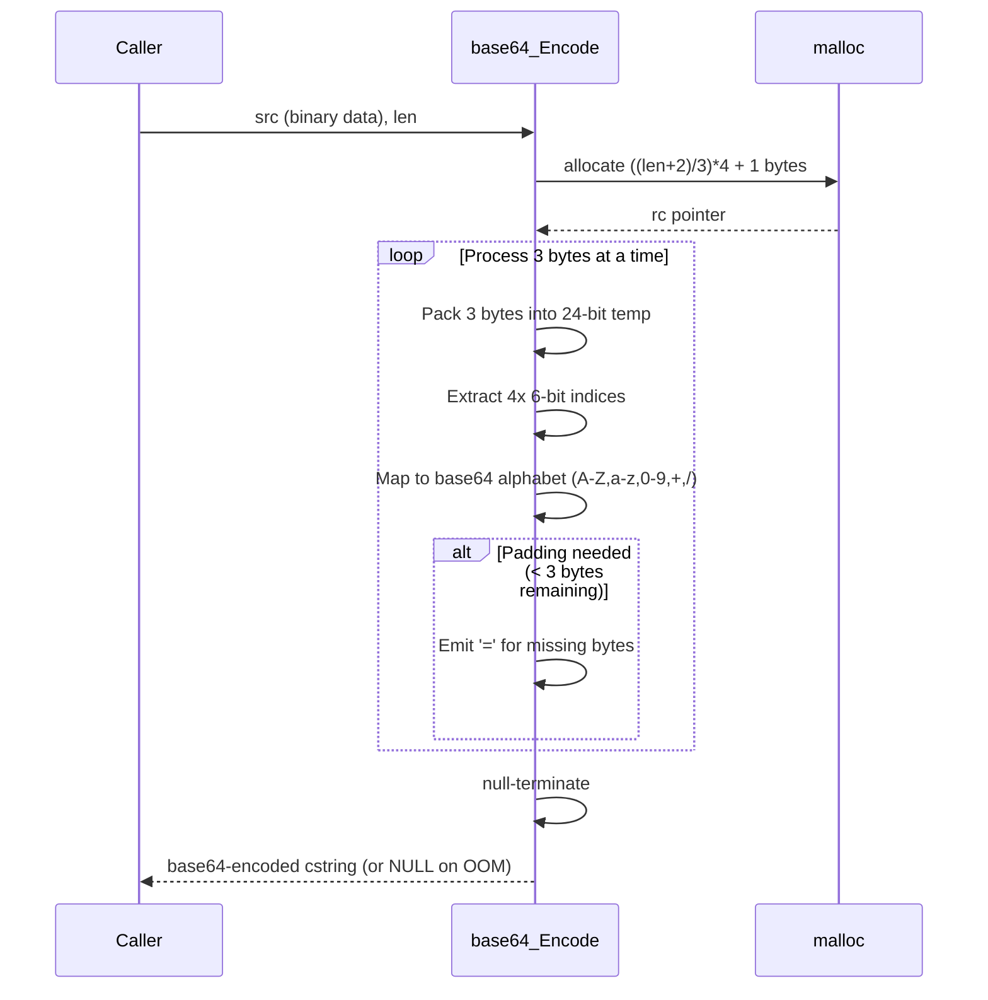
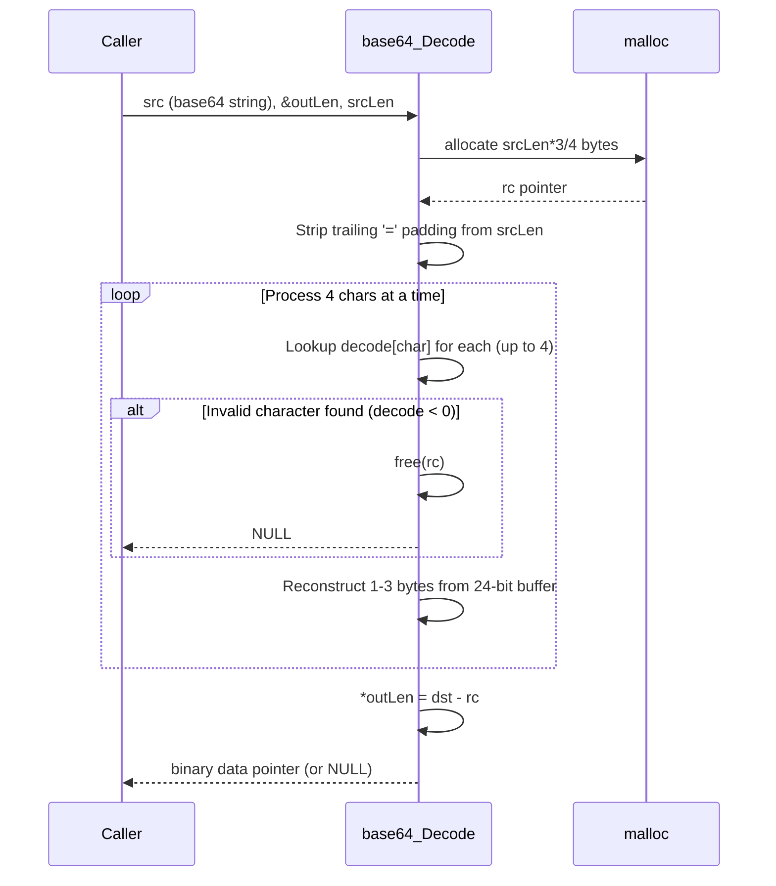

# baseConversion — Sequence Diagrams

> **Source files read**: `base16.h`, `base16.cpp`, `_base64.h`, `_base64.cpp`
> **Confidence**: 100% — all files read in full

---

## Module Overview

Provides low-level encoding/decoding utilities:
- **base16** (hex): `base16_Encode()`, `base16_Decode()`
- **base64**: `base64_Encode()`, `base64_Decode()`

Both modules are stateless, pure C-style functions using `malloc` for output buffers (caller must `free`).

---

## 1. Base16 Encode

---

## 2. Base16 Decode

---

## 3. Base64 Encode

---

## 4. Base64 Decode

---

## Dependencies

| Function | Depends On |
|----------|-----------|
| `base16_Encode` | `PlayerUtils.h` (WRITE_HASCII macro), `stdlib.h` |
| `base16_Decode` | `stdlib.h` |
| `base64_Encode` | `stdlib.h` |
| `base64_Decode` | `stdlib.h` |
