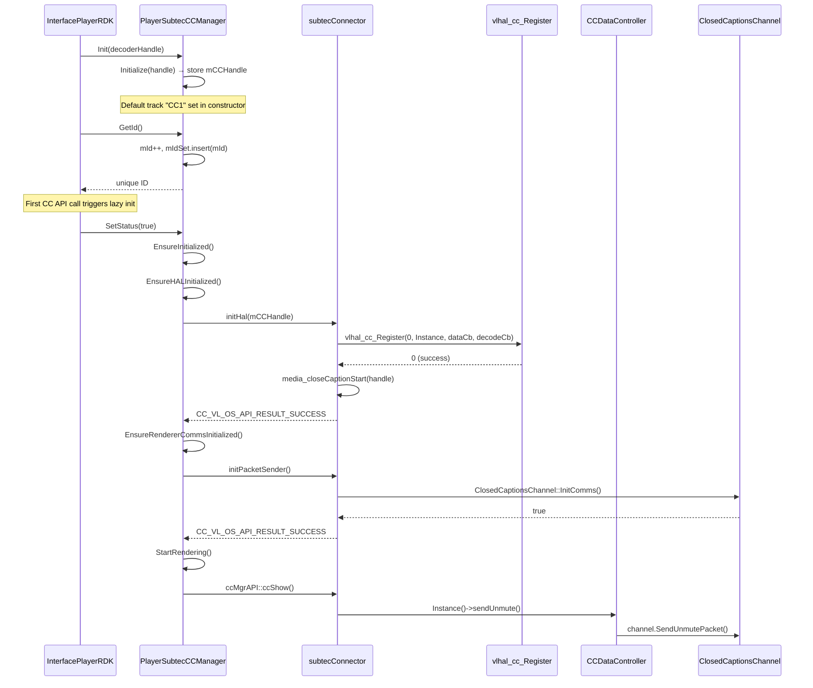
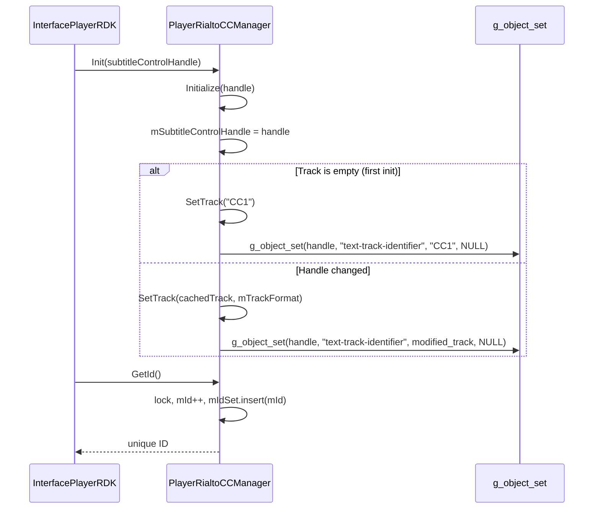
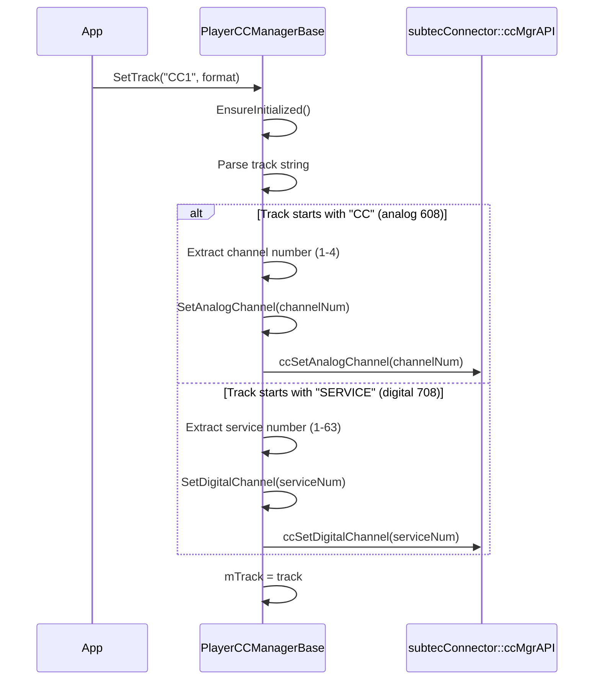
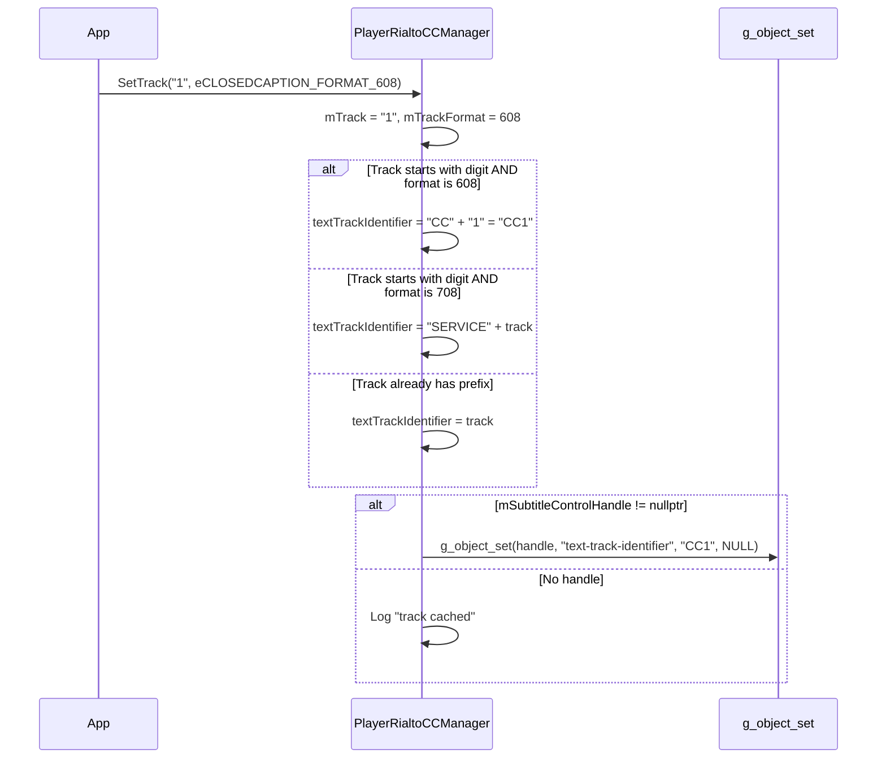
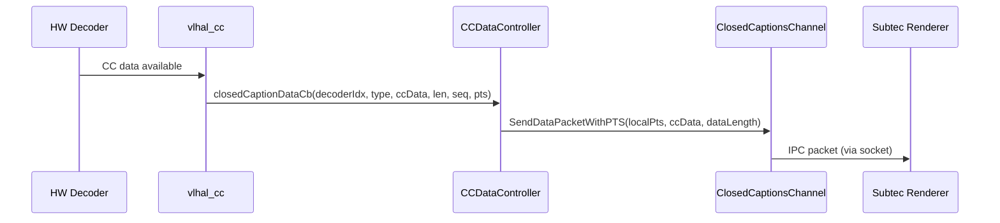
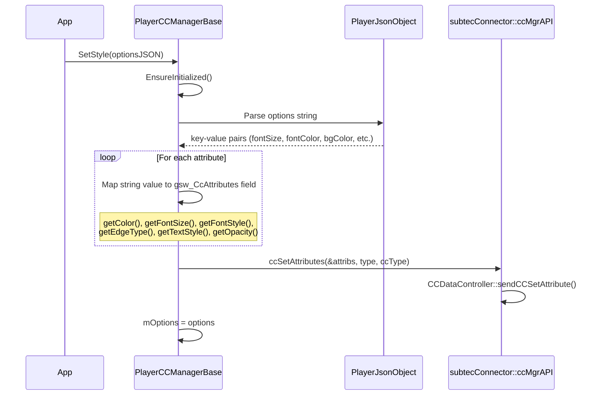
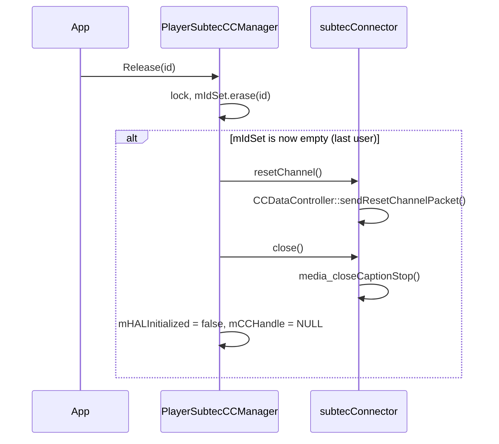
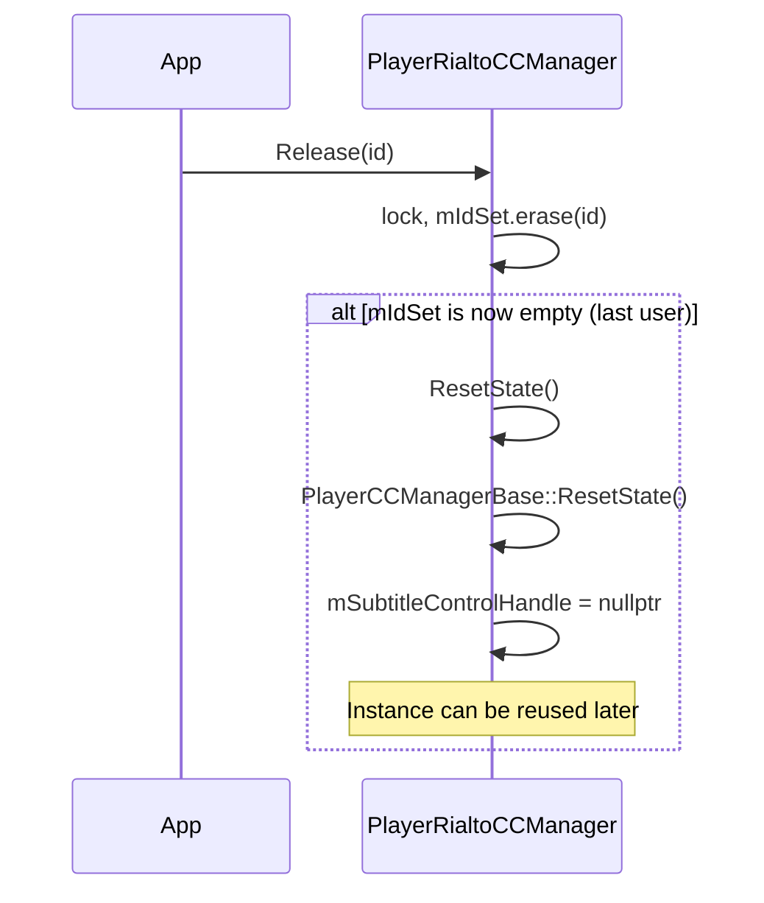
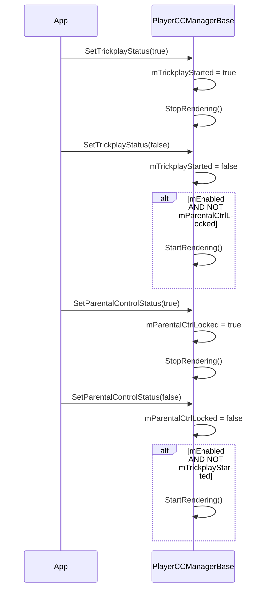
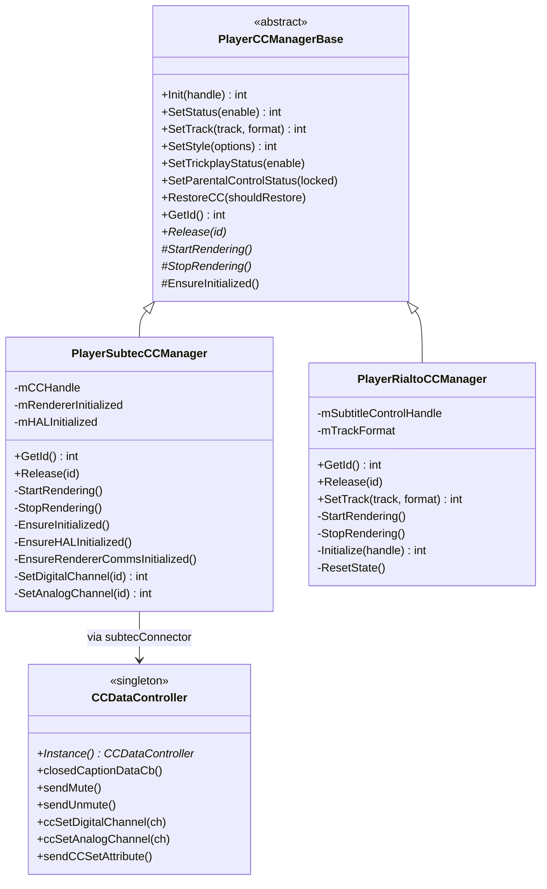

# closedcaptions — Sequence Diagrams

> **Source files read**: `CCTrackInfo.h`, `PlayerCCManager.h`, `PlayerCCManager.cpp` (300 lines), `PlayerRialtoCCManager.h`, `PlayerRialtoCCManager.cpp`, `CCDataController.h`, `CCDataController.cpp`, `PlayerSubtecCCManager.h`, `PlayerSubtecCCManager.cpp`, `SubtecConnector.h`, `SubtecConnector.cpp`
> **Confidence**: 95% — `PlayerCCManager.cpp` is large; lines 301+ (style parsing helpers: getFontSize, getOpacity, SetStyle, SetTrack base impl) were not fully read. Core architecture and all subclass implementations are fully covered.

---

## Module Overview

The Closed Captions subsystem follows a **Strategy pattern**:

- **`PlayerCCManagerBase`** — Abstract base class defining CC lifecycle (Init, SetStatus, SetTrack, SetStyle, trickplay/parental control)
- **`PlayerSubtecCCManager`** — Subtec-based implementation (HAL + PacketSender IPC)
- **`PlayerRialtoCCManager`** — Rialto-based implementation (GObject property control)
- **`CCDataController`** — Singleton controller for subtec CC data packets
- **`SubtecConnector`** — Namespace providing HAL init, packet sender init, and ccMgrAPI functions

---

## 1. CC Manager Initialization (Subtec Path)

---

## 2. CC Manager Initialization (Rialto Path)

---

## 3. SetTrack Flow (Subtec — Base Class)

---

## 4. SetTrack Flow (Rialto — Override)

---

## 5. CC Data Flow (Subtec — Runtime)

---

## 6. SetStyle Flow

---

## 7. Release / Teardown (Subtec)

---

## 8. Release / Teardown (Rialto)

---

## 9. Trickplay / Parental Control

---

## Class Hierarchy

---

## Dependencies

| Component | Depends On |
|-----------|-----------|
| PlayerCCManager.cpp | PlayerLogManager, PlayerJsonObject, PlayerUtils, PlayerSubtecCCManager, PlayerRialtoCCManager |
| PlayerSubtecCCManager | SubtecConnector, PlayerLogManager |
| PlayerRialtoCCManager | glib-object (g_object_set), PlayerLogManager |
| CCDataController | ClosedCaptionsPacket.hpp, ccDataReader.h, SubtecConnector.h |
| SubtecConnector | CCDataController, ccDataReader, ClosedCaptionsChannel |
