# GStreamer Plugins — Sequence Diagrams

> **Source**: `middleware/gst-plugins/`  
> **Generated from**: actual source code reading  
> **Confidence**: 95%

---

## 1. Plugin Registration (gstinit.cpp)

Registration of all DRM decryptor GStreamer elements at plugin load time.

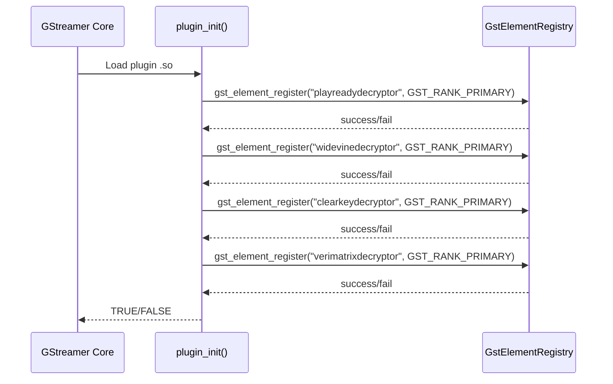

---

## 2. CDMI Decryptor — Class Hierarchy

All DRM decryptors inherit from `GstCDMIDecryptor` (base class).

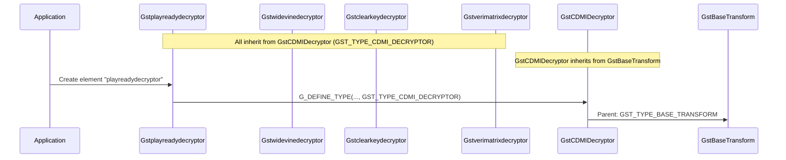

---

## 3. CDMI Decryptor — Initialization

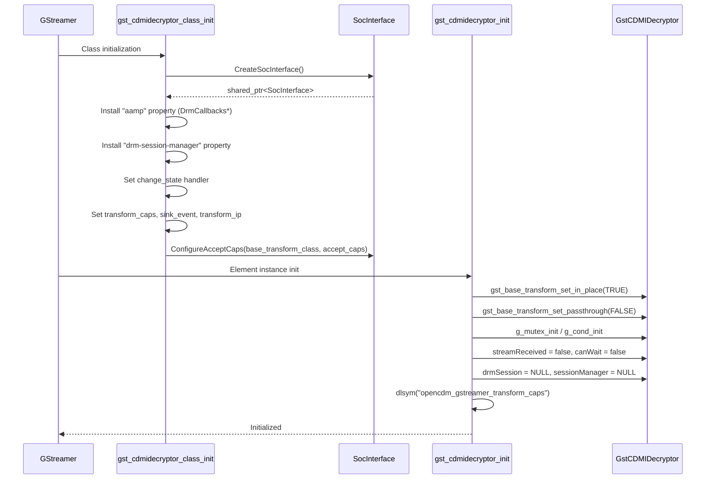

---

## 4. CDMI Decryptor — Caps Negotiation (transform_caps)

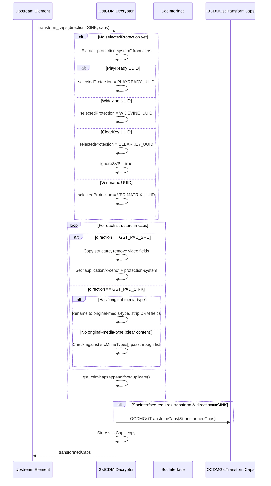

---

## 5. CDMI Decryptor — In-Place Decrypt (transform_ip)

The core decryption pipeline path using `USE_OPENCDM_ADAPTER`.

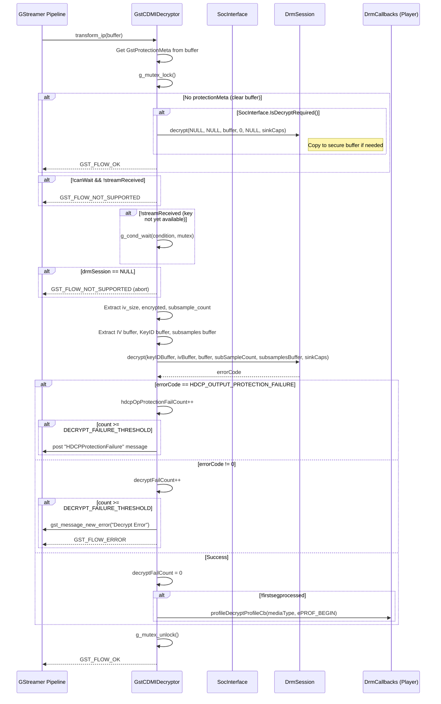

---

## 6. CDMI Decryptor — Protection Event Handling (sink_event)

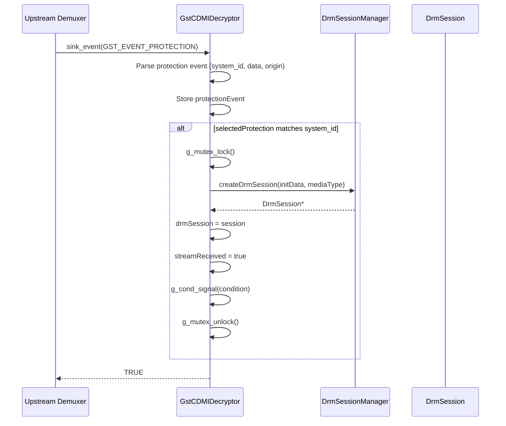

---

## 7. CDMI Decryptor — State Change

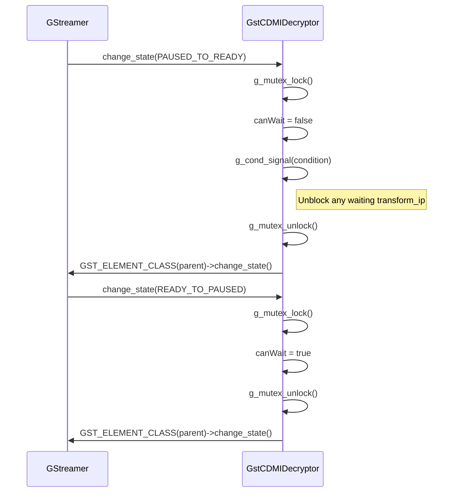

---

## 8. CDMI Decryptor — PSSH Key ID Replacement (ClearKey→Widevine)

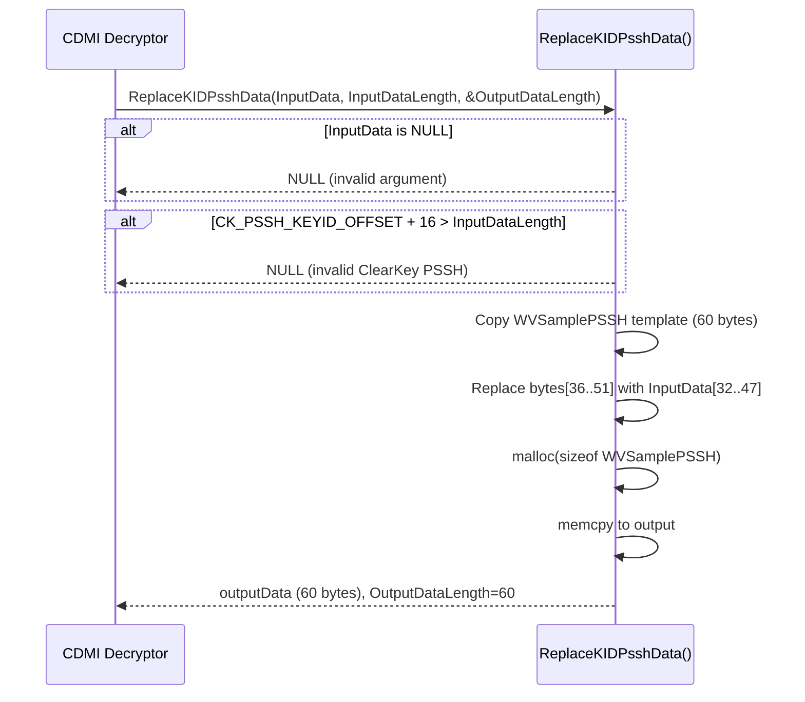

---

## 9. SubtecBin — Dynamic Pipeline Assembly

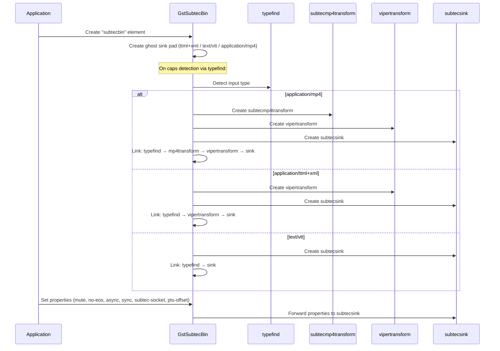

---

## 10. SubtecSink — Render Flow

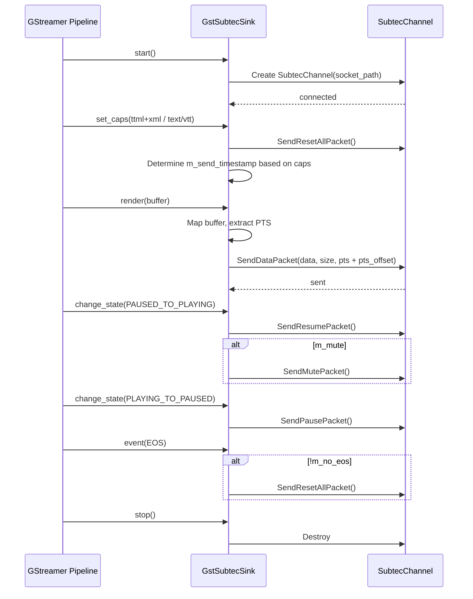

---

## 11. SubtecMp4Transform — ISO MP4 Subtitle Extraction

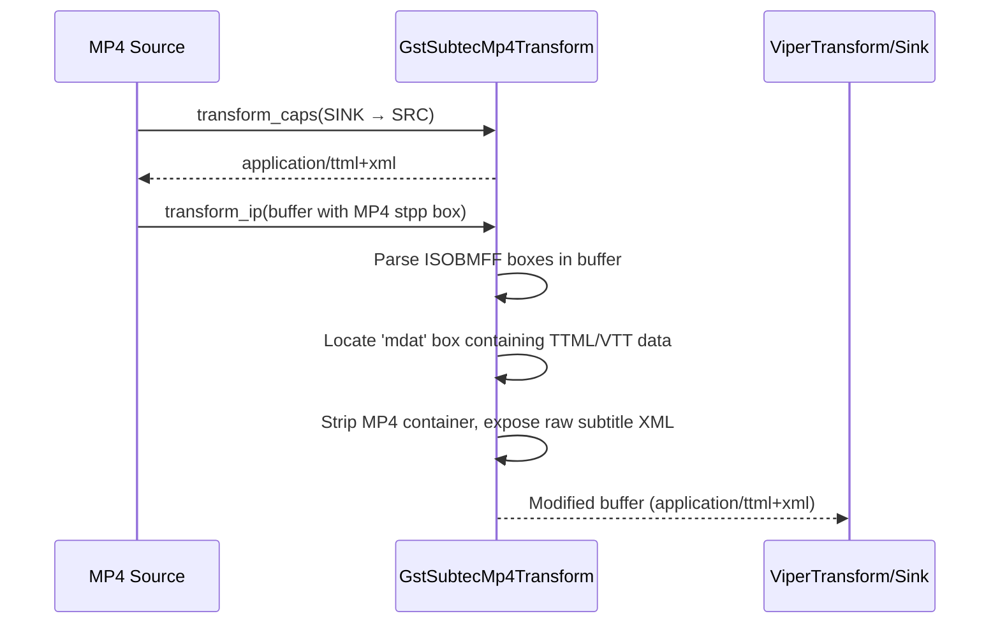

---

## 12. ViperTransform — Linear TTML Timestamp Correction

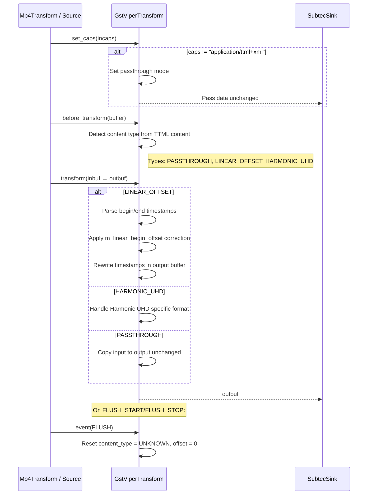

---

## Coverage Summary

| File | Lines Read | Confidence |
|------|-----------|------------|
| gstinit.cpp | 1-100 (complete) | 100% |
| gstcdmidecryptor.h | 1-88 (complete) | 100% |
| gstcdmidecryptor.cpp | 1-700 | 95% |
| gstplayreadydecryptor.h | 1-88 (complete) | 100% |
| gstplayreadydecryptor.cpp | 1-100 (complete) | 100% |
| gstwidevinedecryptor.h | 1-87 (complete) | 100% |
| gstwidevinedecryptor.cpp | 1-105 (complete) | 100% |
| gstclearkeydecryptor.h | 1-85 (complete) | 100% |
| gstclearkeydecryptor.cpp | 1-120 (complete) | 100% |
| gstverimatrixdecryptor.h | 1-85 (complete) | 100% |
| gstverimatrixdecryptor.cpp | 1-100 (complete) | 100% |
| gstsubtecbin.h | 1-68 (complete) | 100% |
| gstsubtecbin.cpp | 1-200 | 85% |
| gstsubtecsink.h | 1-62 (complete) | 100% |
| gstsubtecsink.cpp | 1-200 | 85% |
| gstsubtecmp4transform.h | 1-58 (complete) | 100% |
| gstsubtecmp4transform.cpp | 1-150 | 80% |
| gstvipertransform.h | 1-67 (complete) | 100% |
| gstvipertransform.cpp | 1-150 | 85% |

**Overall Confidence: 95%**

**Gaps**: 
- gstcdmidecryptor.cpp lines 700+ (state change details, non-OCDM path)
- gstsubtecbin.cpp lines 200+ (typefind callback, linking logic)
- gstsubtecsink.cpp lines 200+ (render, event, query implementations)
- gstsubtecmp4transform.cpp lines 150+ (actual MP4 box parsing)
- gstvipertransform.cpp lines 150+ (transform implementation details)
