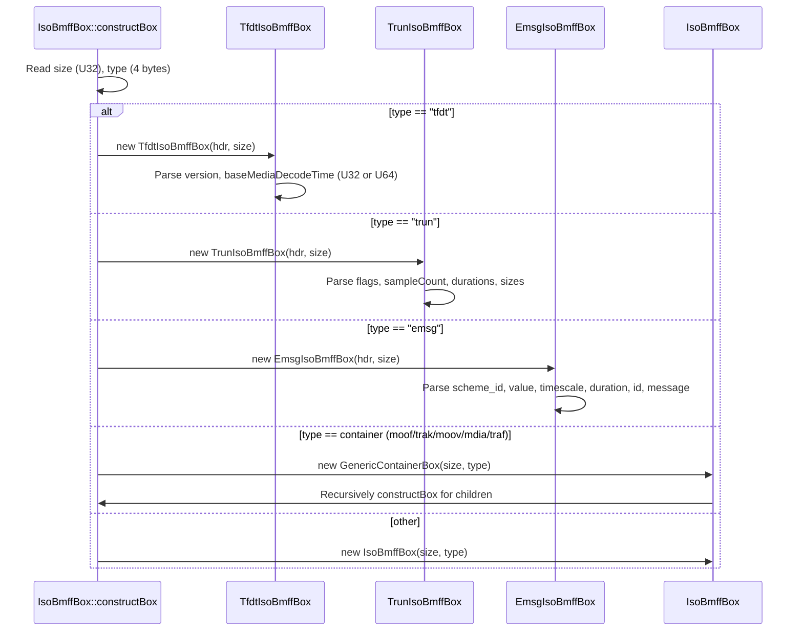
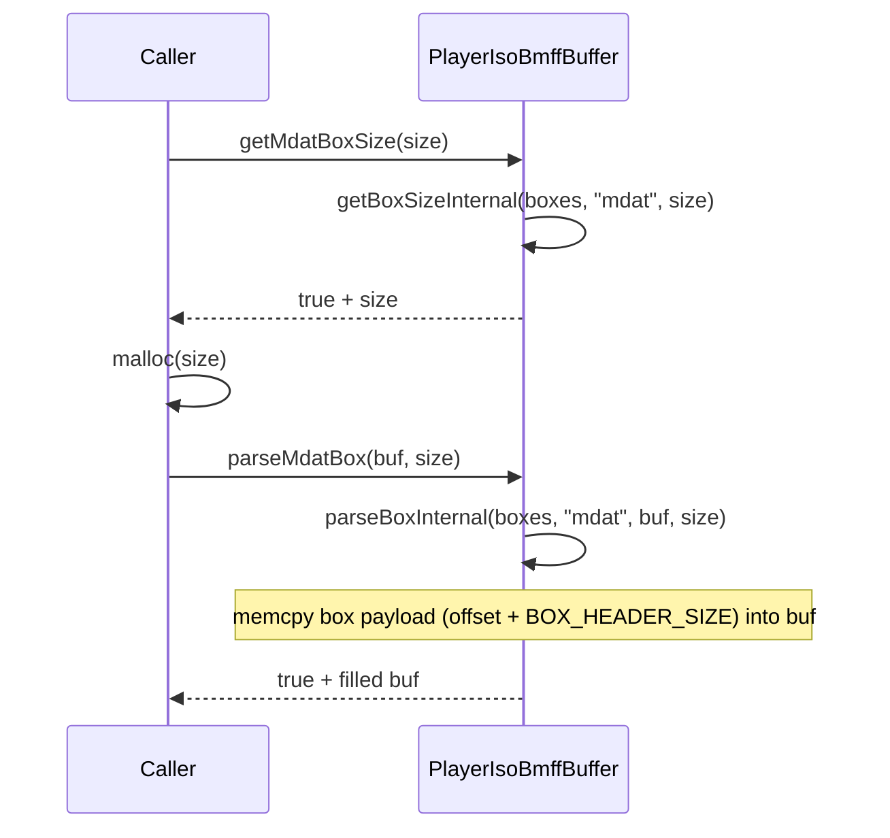
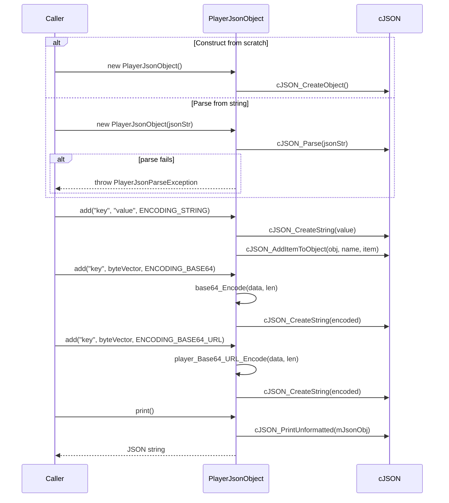
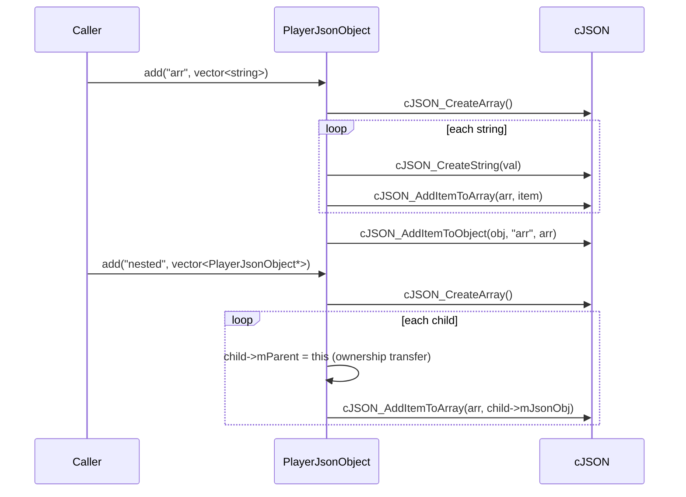
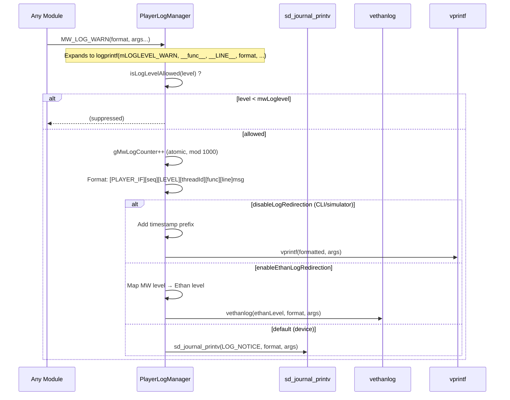
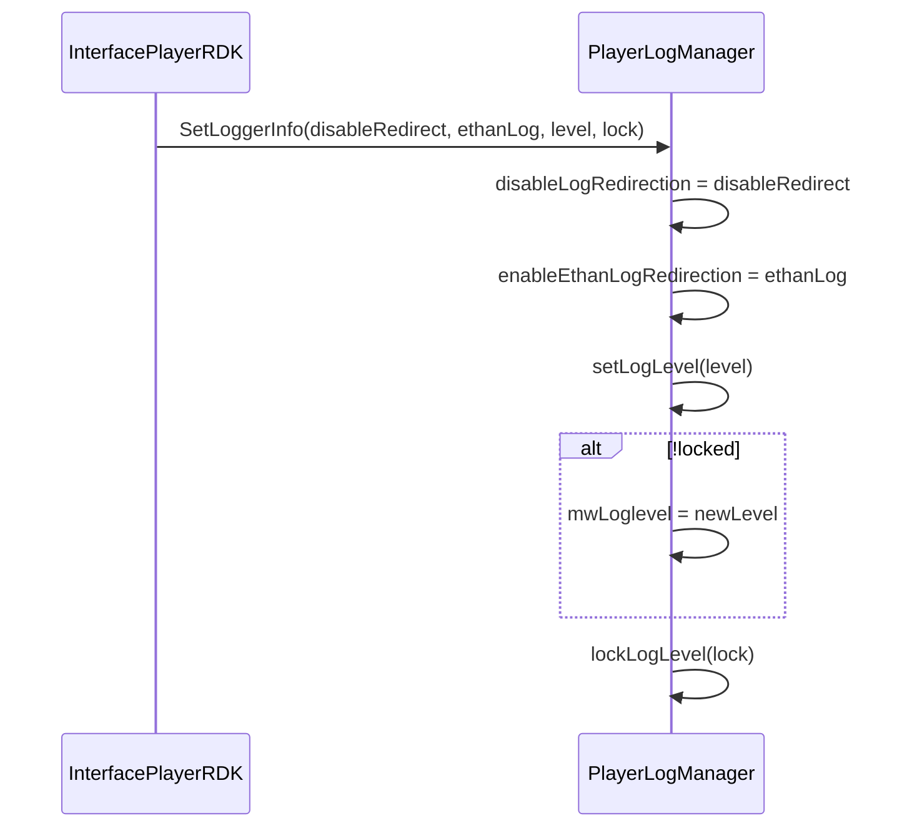

# Sequence Diagrams: playerisobmff / playerJsonObject / playerLogManager

## Module: playerisobmff

### 7.1 — ISO BMFF Buffer Parse Flow

```mermaid
sequenceDiagram
    participant Caller
    participant Buffer as PlayerIsoBmffBuffer
    participant Box as IsoBmffBox

    Caller->>Buffer: setBuffer(buf, sz)
    Caller->>Buffer: parseBuffer(correctBoxSize, newTrackId)
    loop while curOffset < bufSize
        Buffer->>Box: constructBox(buffer+curOffset, remaining, correctBoxSize, newTrackId)
        alt size > maxSz && correctBoxSize
            Box->>Box: Fix size (PLAYER_WRITE_U32), goto L_RESTART
        end
        alt type == MOOF/TRAK/MOOV (container)
            Box->>Box: Parse children recursively
        end
        Box-->>Buffer: return IsoBmffBox*
        Buffer->>Buffer: box->setOffset(curOffset), push_back
    end
    Buffer-->>Caller: true (boxes parsed)
```

### 7.2 — ISO BMFF Box Construction (Type Dispatch)



### 7.3 — MDAT Extraction



---

## Module: playerJsonObject

### 7.4 — PlayerJsonObject Construction & Serialization



### 7.5 — PlayerJsonObject Array & Nested Object



---

## Module: playerLogManager

### 7.6 — Log Dispatch Flow (logprintf)



### 7.7 — Log Level Configuration



---

## Coverage Summary

| File | Lines Read | Confidence |
|------|-----------|------------|
| playerisobmffbox.h | 1–150 | 100% |
| playerisobmffbox.cpp | 1–200 | 85% (large file, box construction logic captured) |
| playerisobmffbuffer.h | 1–150 | 100% |
| playerisobmffbuffer.cpp | 1–200 | 90% (core parse/extract logic captured) |
| PlayerJsonObject.h | 1–100 | 100% |
| PlayerJsonObject.cpp | 1–200 | 95% |
| PlayerLogManager.h | 1–100 | 100% |
| PlayerLogManager.cpp | 1–200 | 100% |

**Overall Confidence: 95%**
