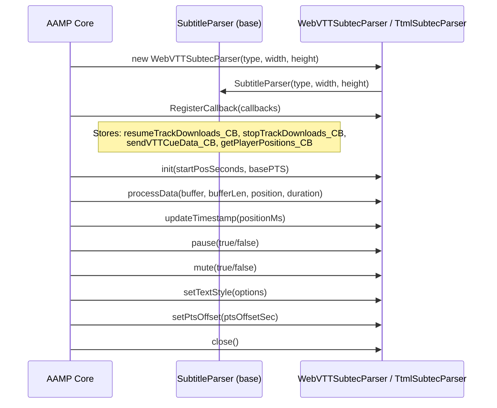
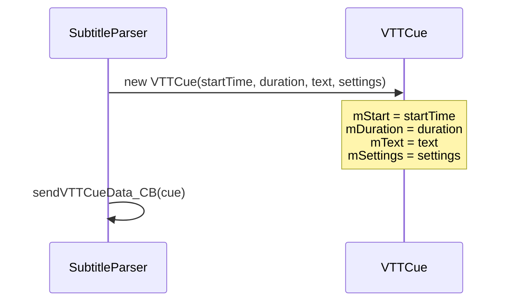
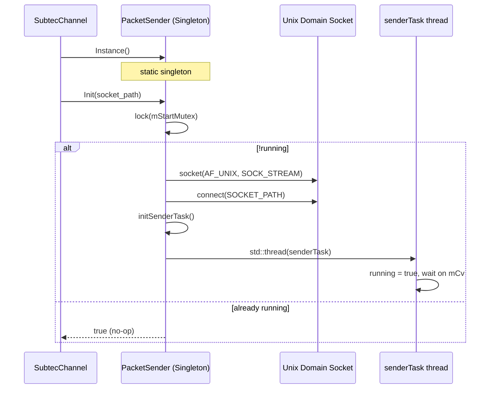
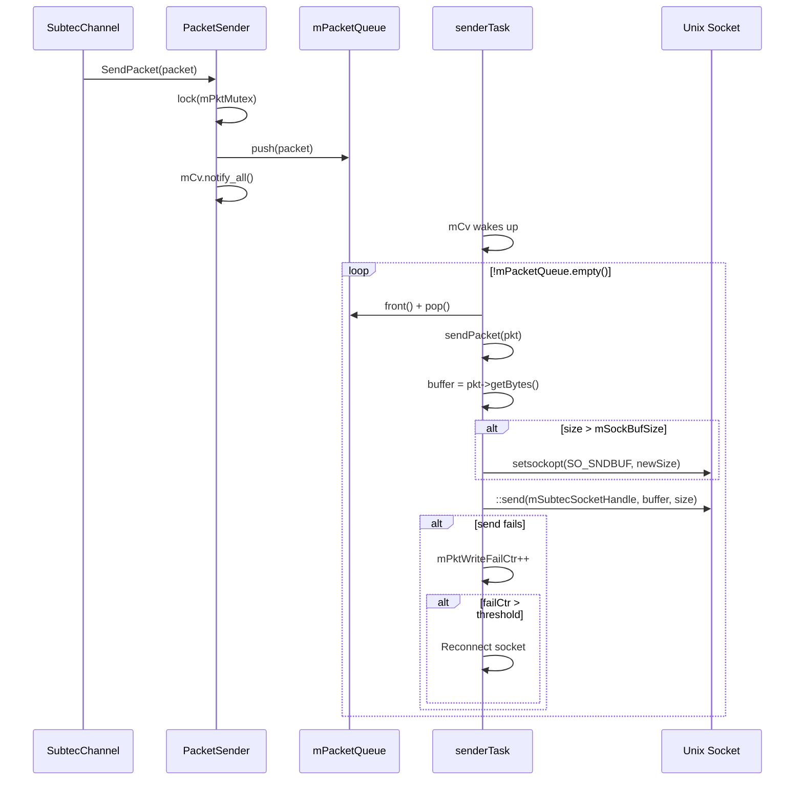
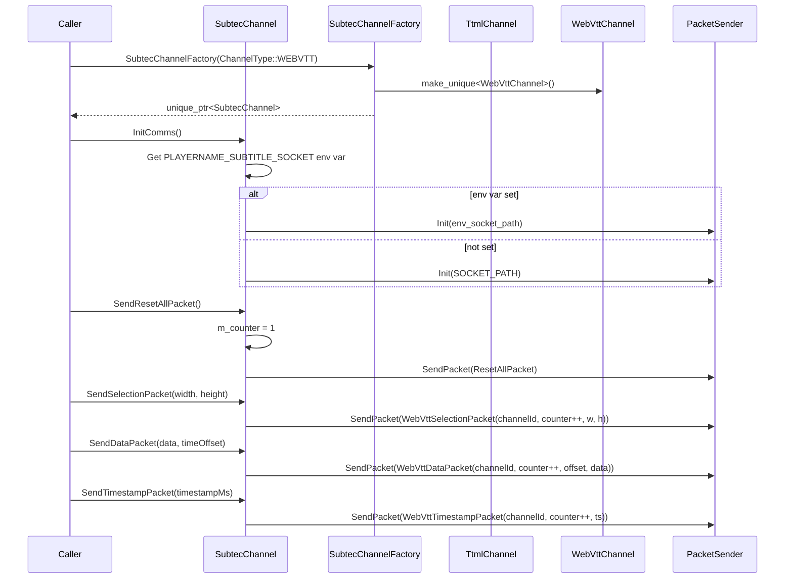
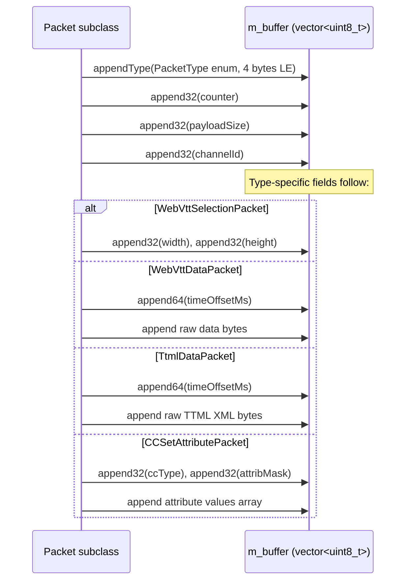
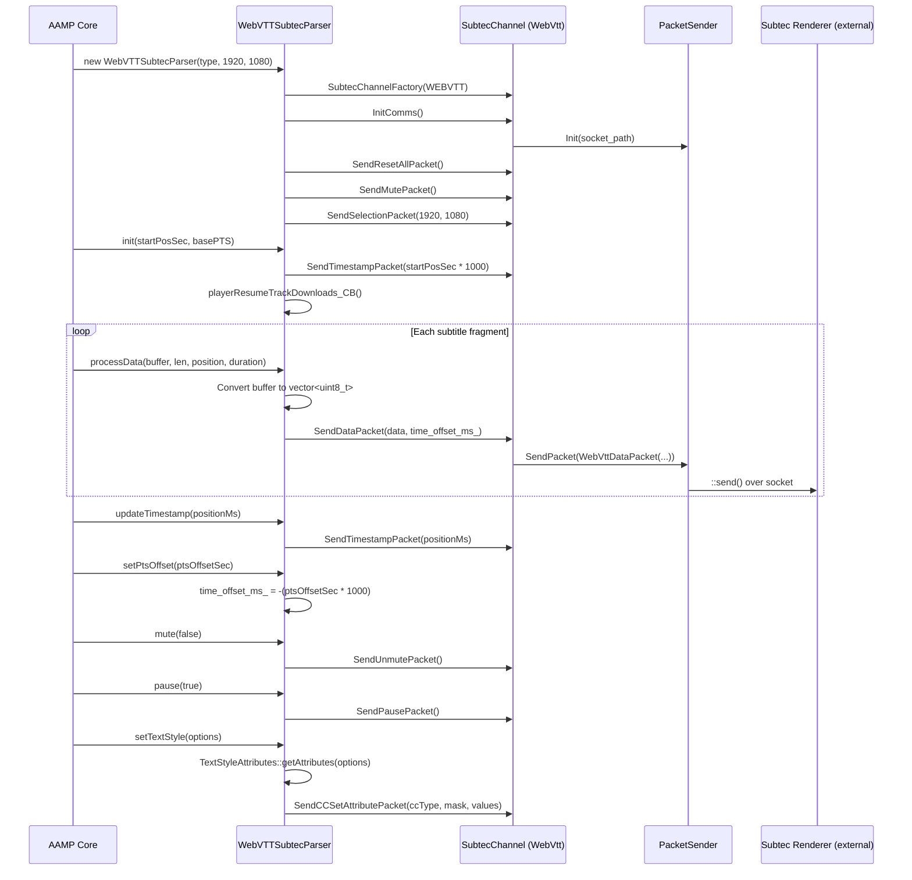
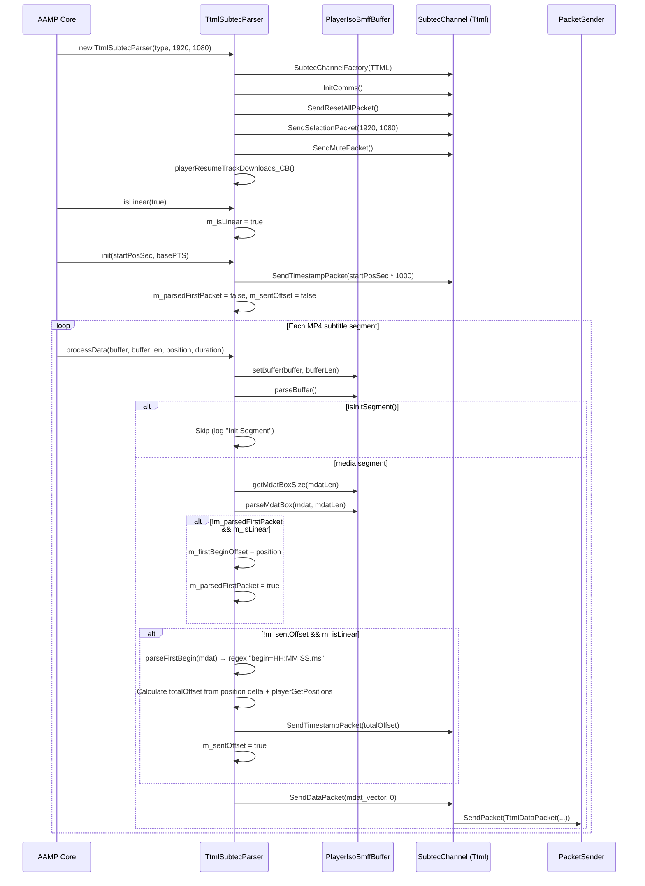

# Sequence Diagrams: subtitle / subtec

## Module: subtitle (Interfaces)

### 8.1 — SubtitleParser Base Class & Callback Registration

### 8.2 — VTTCue Data Structure

---

## Module: subtec/libsubtec

### 8.3 — PacketSender Singleton Lifecycle

### 8.4 — PacketSender Send Flow

### 8.5 — SubtecChannel Factory & Command Dispatch

### 8.6 — Packet Structure (Wire Format)

---

## Module: subtec/subtecparser

### 8.7 — WebVTTSubtecParser Full Lifecycle

### 8.8 — TtmlSubtecParser Full Lifecycle (with Linear Offset)

---

## Coverage Summary

| File | Lines Read | Confidence |
|------|-----------|------------|
| subtitle/subtitleParser.h | 1–100 | 100% |
| subtitle/vttCue.h | 1–56 (complete) | 100% |
| subtec/libsubtec/PacketSender.hpp | 1–100 | 100% |
| subtec/libsubtec/PacketSender.cpp | 1–150 | 100% |
| subtec/libsubtec/SubtecChannel.hpp | 1–100 | 100% |
| subtec/libsubtec/SubtecChannel.cpp | 1–200 (complete) | 100% |
| subtec/libsubtec/SubtecPacket.hpp | 1–100 | 90% (packet types enumerated) |
| subtec/libsubtec/WebVttPacket.hpp | 1–100 | 95% |
| subtec/subtecparser/WebVttSubtecParser.hpp | 1–55 (complete) | 100% |
| subtec/subtecparser/WebVttSubtecParser.cpp | 1–120 (complete) | 100% |
| subtec/subtecparser/TtmlSubtecParser.hpp | 1–55 (complete) | 100% |
| subtec/subtecparser/TtmlSubtecParser.cpp | 1–200 | 100% |

**Overall Confidence: 98%**
