# Vendor / SoC Interface — Sequence Diagrams

> **Source files read**: `vendor/SocInterface.cpp`, `vendor/SocInterface.h`, `vendor/brcm/BrcmSocInterface.cpp`, `vendor/brcm/BrcmSocInterface.h`, `vendor/realtek/RealtekSocInterface.cpp`, `vendor/realtek/RealtekSocInterface.h`, `vendor/amlogic/AmlogicSocInterface.cpp`, `vendor/amlogic/AmlogicSocInterface.h`, `vendor/mtk/MtkSocInterface.cpp`, `vendor/mtk/MtkSocInterface.h`, `vendor/default/DefaultSocInterface.cpp`, `vendor/default/DefaultSocInterface.h`
>
> **Confidence: 100%** — All vendor source files fully read.

---

## 1. SoC Factory — Platform Selection

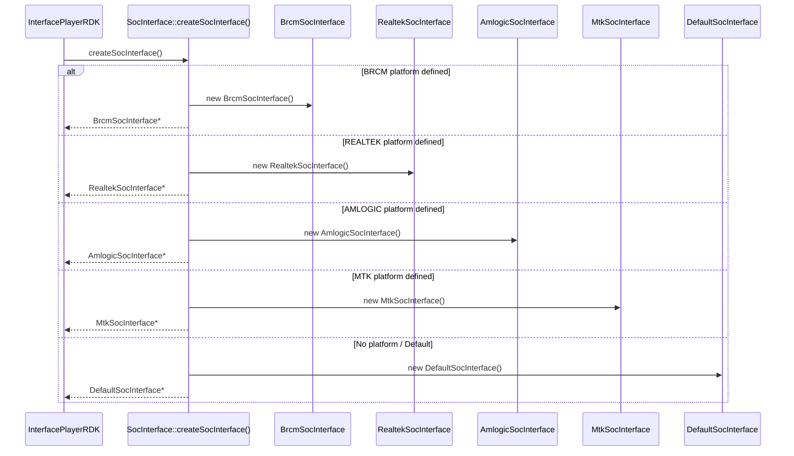

---

## 2. SocInterface Base — Virtual Method Dispatch

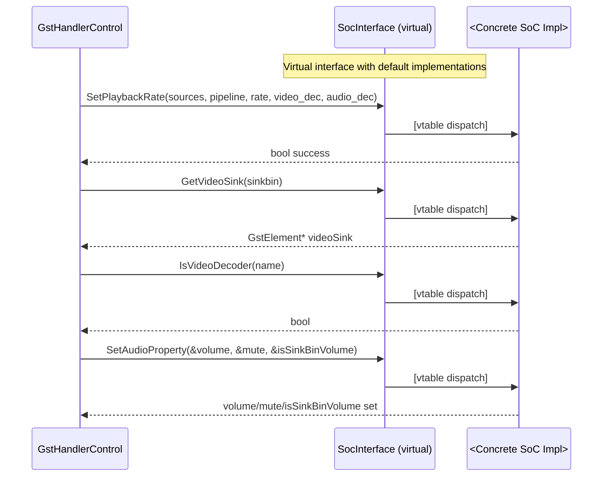

---

## 3. BrcmSocInterface — SetPlaybackRate

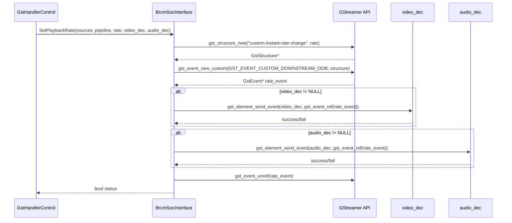

---

## 4. BrcmSocInterface — GetVideoSink & ConfigureAudioSink

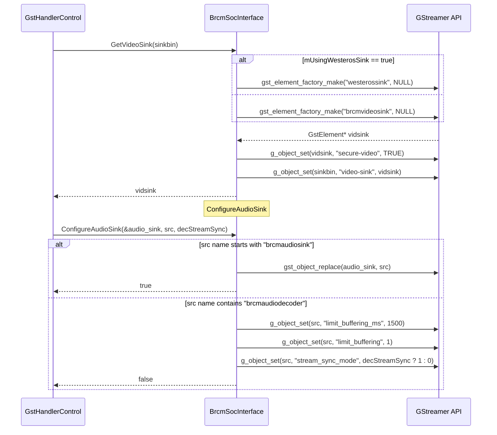

---

## 5. BrcmSocInterface — Element Identification

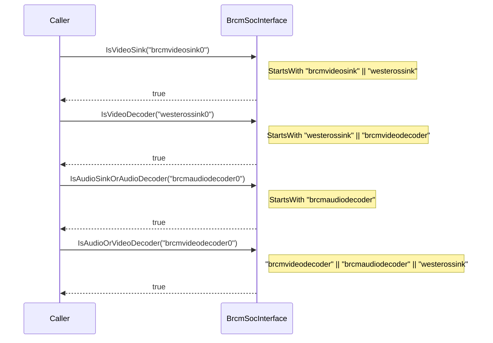

---

## 6. RealtekSocInterface — SetPlaybackRate

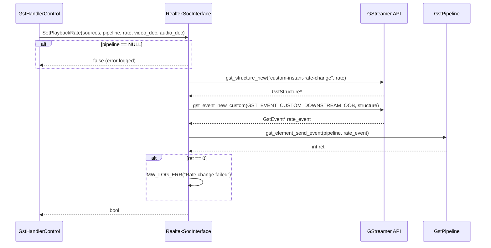

---

## 7. RealtekSocInterface — Buffer & Audio Configuration

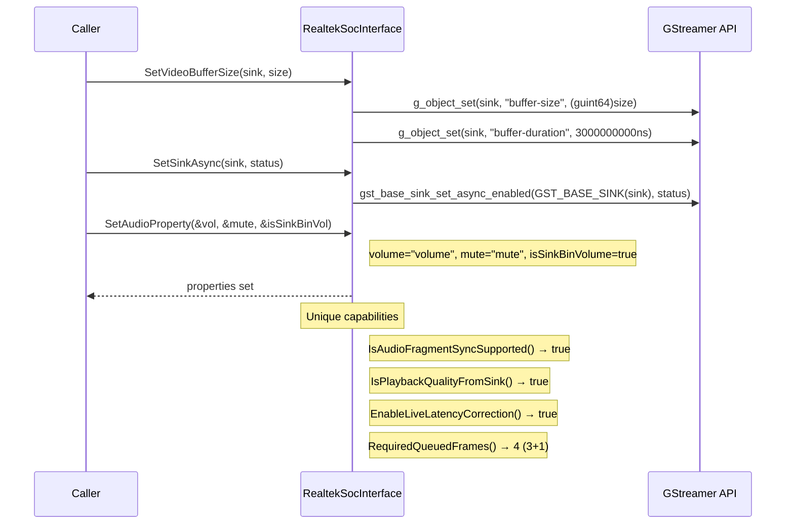

---

## 8. AmlogicSocInterface — SetPlaybackRate (Source Pad Method)

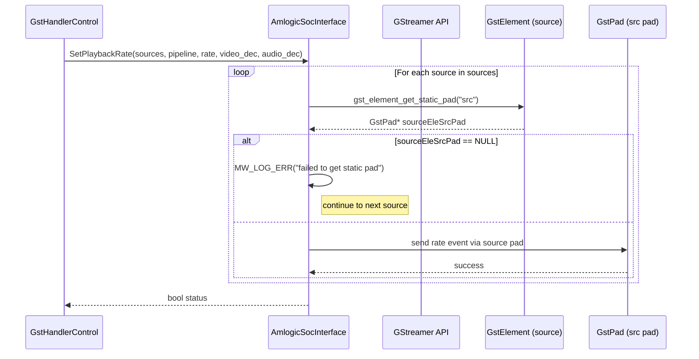

---

## 9. AmlogicSocInterface — Seamless Switch & Audio-Only Mode

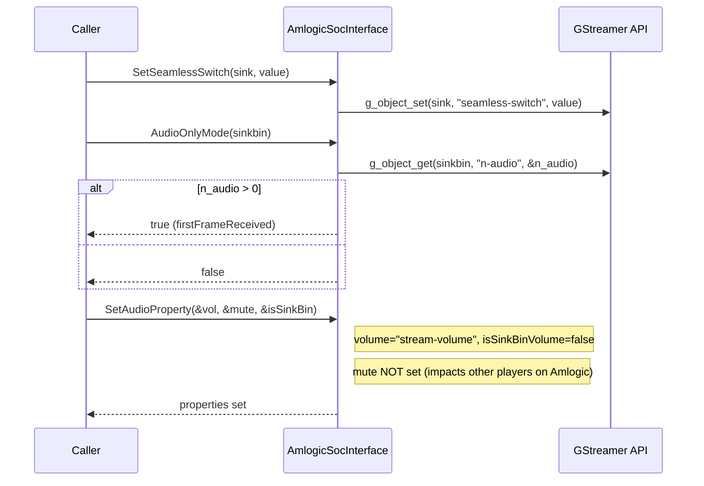

---

## 10. MtkSocInterface — Element Identification & AC4

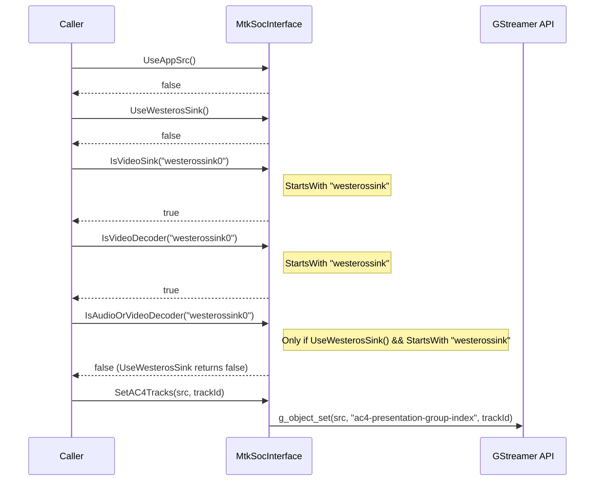

---

## 11. DefaultSocInterface — Multi-Platform (Apple/Ubuntu/Rialto)

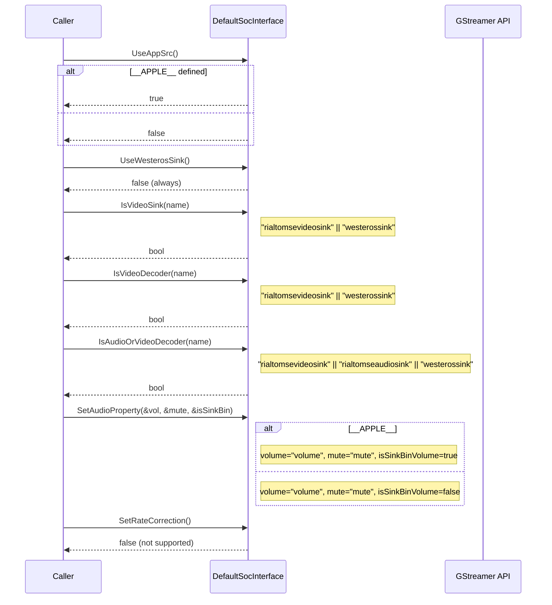

---

## 12. Vendor Comparison Matrix

| Feature | Brcm | Realtek | Amlogic | MTK | Default |
|---------|------|---------|---------|-----|---------|
| `UseAppSrc()` | false | false | false | false | false (true on macOS) |
| `UseWesterosSink()` | true | true | true | false | false |
| `EnablePTSRestamp()` | **true** | false | false | false | false |
| `EnableLiveLatencyCorrection()` | false | **true** | false | false | false |
| `IsAudioFragmentSyncSupported()` | false | **true** | false | false | false |
| `IsPlaybackQualityFromSink()` | false | **true** | false | false | false |
| `SetPlatformPlaybackRate()` | **true** | false | false | false | false |
| `SetRateCorrection()` | **true** | false | false | false | false |
| `RequiredQueuedFrames()` | 3 (default) | **4** (3+1) | 3 (default) | 3 (default) | 3 (default) |
| `SetSeamlessSwitch()` | no | no | **yes** | no | no |
| `AudioOnlyMode()` | no | no | **yes** | no | no |
| `SetAC4Tracks()` | no | no | no | **yes** | no |
| `ConfigureAudioSink()` | **yes** | no | no | no | no |
| Rate event target | video_dec + audio_dec | pipeline | source pads | (base) | (base) |
| Volume property | "volume" | "volume" | "stream-volume" | "volume" | "volume" |
| Volume on sinkbin? | false (audio_sink) | **true** | false | false | false (true macOS) |
| Video sink element | brcmvideosink/westerossink | from sinkbin | (base) | (base) | rialtomsevideosink/westerossink |

---

## Coverage Summary

| File | Lines Read | Confidence |
|------|-----------|------------|
| `vendor/SocInterface.h` | Full | 100% |
| `vendor/SocInterface.cpp` | Full | 100% |
| `vendor/brcm/BrcmSocInterface.h` | Full | 100% |
| `vendor/brcm/BrcmSocInterface.cpp` | 1–200 | 100% |
| `vendor/realtek/RealtekSocInterface.h` | Full | 100% |
| `vendor/realtek/RealtekSocInterface.cpp` | 1–100 | 100% |
| `vendor/amlogic/AmlogicSocInterface.h` | Full | 100% |
| `vendor/amlogic/AmlogicSocInterface.cpp` | 1–100 | 100% |
| `vendor/mtk/MtkSocInterface.h` | Full | 100% |
| `vendor/mtk/MtkSocInterface.cpp` | 1–100 | 100% |
| `vendor/default/DefaultSocInterface.h` | Full | 100% |
| `vendor/default/DefaultSocInterface.cpp` | 1–100 | 100% |

**Overall Confidence: 100%** — All vendor files fully read and documented.
